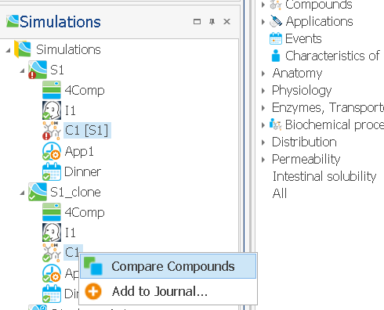

# Open Systems Pharmacology Suite - Fact Sheet

## Main modeling and simulation features:

  - PBPK modeling of small molecules and biologics

  - Species Extrapolation / First in Human dose prediction

  - Parent-Metabolite Studies / Drug-Drug-Interaction

  - Pediatric Study Design – PIP/PDP support

  - Special Populations: Hepatic/Renal impairment / Obese / Elderly /
    (Pre)term neonates / Children / Pregnant women / more

  - Formulations / Meal effects

  - PBPK/PD, QSP as well as pathway, network and disease modeling

## Model building blocks

### Organisms

* Pre-parameterized whole-body PBPK models including detailed integrated GI tract for
  * Human
  * Monkey
  * Dog (beagle and mongrale)
  * Minipig
  * Rat
  * Mouse
  * Rabbit
* Allowing for full flexibility for parameterization of (anthropo)metrics, anatomical and physiological properties, protein expression levels ETC.
* Most important organs included. For each organ optional processes can be added:
  * Metabolizing pathways
  * Different active transporter types(influx, efflux, Pgp-like, bi-directional)
  * Protein binding partners
* Biliary tract included, enables enterohepatic cycling
* Scaling of Individuals
  Scaling can be used to change the biometrics of an existing individual, i.e. an adult model may be scaled to an infant model while maintaining/scaling all specific modifications
  
### Populations

* Database for population simulations with distributions of anatomical and physiological parameters for
  * European Caucasians (ICRP, 2002)
  * US Caucasian (NHANES, 1997)
  * US Asians (NHANES, 1997)
  * US Africans (NHANES, 1997)
  * Asian (Tanaka, 1996)
  * Japanese (2015)
  * Preterms (2015)
  * Pregnant (Dallmann et al. 2017)

### Protein Expression

The PK-Sim® library includes large-scale gene-expression data from publicly available sources which were downloaded, processed, stored and customized such that they can be directly utilized in PBPK model building. Public database which were imported are
* Whole genome expression arrays from ArrayExpress (European Informatics Institute, 2010, http://www.ebi.ac.uk/microarray-as/ae/)
* RT-PCR derived gene expression (Nishimura et al., 2003; Nishimura and Naito, 2005, 2006)
* Expressed sequence tags (EST) from UniGene (National Center for Biotechnology Information, 2010, https://ftp.ncbi.nlm.nih.gov/repository/UniGene/).

### Compounds

* Full ADME characterization of drugs including
  * Molecular weight
  * Lipophilicity
  * Protein binding
  * Acid/base pKa
  * Solubility
  * Intestinal permeability
  * Specific protein binding kinetics
  * Enzyme specific metabolization kinetics
  * Transporter specific transport kinetics
  * Inhibition and induction parameters
  * and for large therapeutic molecules (e.g. antibodies)
    * Solute radius (calculated for molecular weight as per default)
    * Dissociation constant for binding to FcRn
* Including a set of pre-parameterized standard compounds

#### Partition Coefficients

Prediction models for tissue partition coefficients
* PK-Sim 2003
*  Rodgers & Rowland
* Schmitt
* Poulin & Theil
* Berezhkovsky

#### Permeability

Prediction models for cellular permeabilities and intestinal permeability

### Formulations

* Dissolved
* Particle distribution
* Weibull
* Lint80
* Table
* 1st order
* Zero order

### Administration protocols

* Administration routes:
  * IV (Bolus and Infusion)
  * Oral
  * User defined (free choice of target organ/compartment)
* Administration Schemes:
  * Single
  * once daily, bi-daily, …
  * complex (multi-)periodic schemes

### Events

* Meals
* Gallbladder emptying

### Observers

## Modeling tools

### Parameter identification (PI)

A fully integrated PI Toolbox provides a straightforward means to adjust key model parameters automatically within user-defined ranges. It is possible to optimize multiple simulations, for example with different dose levels, and multiple observed data sets, simultaneously. A clear visualization of the optimization process and of the optimization results gives you full control and direct feedback whether the identification process was successful.

* Simultaneous optimization of multiple simulations
* Simultaneous optimization of multiple observed data sets
* LLOQ (Lower Limit of Quantification) values are taken into account
* Linking of multiple simulation parameters to one identification parameter (as absolute value or as a factor)
* Lin/Log scaling of identification parameters
* Lin/Log scaling of residuals
* Multiple optimizations with randomized start values
* Combining parameter identification with optimization for best suited partition coefficients/permeability methods
* Available optimization algorithms:
  * Nelder-Mead
  * Levenberg-Marquardt
  * Monte-Carlo
* Visual feedback during optimization
  * Time profile
  * Predicted vs. Observed
  * Error history: Total error vs number of evaluations
  * Total error: current/best value
  * Identification parameters: current/best value
  * Export of parameters history to MS-Excel
* Visualization of optimization results
  * Time profile
  * Predicted vs. Observed
  * Residuals vs. Time
  * Histogram of Residuals
  * Total error
  * Number of evaluations
  * Identification parameters: min/max/start/best value
  * Warning if best values are "close to" boundaries
* Easy cloning of PI configuration within a project
* Replacing simulations in PI configuration without losing the settings
* Update simulations with optimized parameter values
* Calculation of time profile confidence intervals
    * **Confidence Interval**: Corresponds to the model error, which is based on the uncertainty of estimated parameters. This uncertainty is based on an estimation of the difference between the mean value of used observed data compared with the mean value of the (unknown) total data.
  
    * **Visual Predictive Check Interval**: Corresponds to the uncertainty based on the data error. The data error is the standard deviation of the distribution of the used observed data.
      
    * **Prediction Interval**: Corresponds to the combination of the model error and the data error. It shows how much future measured data are expected to differ from the model predictions.
      

### Sensitivity Analysis

#### Sensitivity of PK-Parameters (AUC, CMax, …) vs. simulation parameters.

Because PBPK models can be complex and contain numerous input parameters, it would be useful to know which input parameters have the most impact on the output curves. The Sensitivity Analysis tool provides an answer to this question.
For a chosen simulation, the relative impact of selected - or all - input parameters on the PK parameters of the output curves is calculated and displayed. In addition, the input parameters can be ranked by their impact on a certain PK parameter of an output. Results of Sensitivity Analysis can be shown as:

* Sensitivity table:

* Ranking of most sensitive simulation parameters. Most sensitive parameters comprise all parameters that contribute to 90% of total sensitivity.

### Lab Journal ("Working Journal")

* Automated documentation of modeling work in model history working journal documenting including labeling and commenting function
* Built-in working journal for manual annotation of models and simulations
* Roll-back / undo functionality

### Model Editor

Full transparency and full edit access to all structural model properties

## Simulation Tools

* Simulation creation by simple combining of previously defined building blocks

* Simulation of individuals and populations

  If a human individual or population is selected the growth of the human individual(s) during the simulation time will be taken into account when choosing this option.

  Based on the human growth and maturation functions available for most parameters in PK-Sim® (e.g. organ volumes, blood flow rates, organ composition, etc.) the parameters are updated along the time scale of the simulation. This is important for multiple drug administration to e.g. preterm and term neonates, for which the rapid changes in anatomical and physiological properties can influence the pharmacokinetics during the simulated study circle.

* Calculation of drug time courses in the most important organs for every subcompartment (Plasma, Endosome, Interstitial, Intracellular, Blood Cells)

* Calculation of the fraction of dose metabolized/excreted

* Plotting of all calculated time courses

  * Plot settings (axes, styles, etc.)
  * Individual simulations:
    * Time profile plots

  * Population simulations
    * Time profile plots

    * Box-Whisker plots

    * Range plots

    * Scatter plots

* Multiple plots per simulation

* Export of plotted/simulated results to Excel/CSV/PDF/Image

* Calculation of the most important PK-Parameters

  * In all simulations
    * AUC_tEnd
    * AUC_inf
    * %AUC(tlast-inf)
    * AUC_tEnd_norm
    * AUC_inf_norm
    * AUC Ratio (AUCR)
    * C_max
    * C_max_norm
    * C_max Ratio (Cmax_R)
    * C_tEnd
    * t_max
    * Half-Life
    * MRT
  * In simulations with intravenous administration
    * VSS(plasma)
    * Vd(plasma)
    * Vss(phys-chem)
    * Total plasma clearance CL
    * Total body clearance
  * In simulations with oral administration
    * Vss(plasma)/F
    * Vd(plasma)/F
    * Total plasma clearance/F
    * Fraction absorbed
    * Bioavailability
  * In simulations with multiple administrations
    * AUC_inf_tD1
    * AUC_inf_tD1_n
    * ...tDi-tDj
    * ...tDlast-tDEnd
    * ...tDlast-1- tDlast
    * C_trough_dDi
    * C_trough_dlast
  * In simulations with drug drug interactions
    * AUC Ratio
    * C_max Ratio 
  
* Comparisons of calculated simulation results over multiple simulations (both individual and population simulations)

* Cloning of simulations

* Replacing of Building Blocks in already created simulations

* Synchronization between a building block used to create a simulation and the simulation

* Comparison between simulations

* Comparison between building blocks and simulations

* Comparison of building blocks can also be done between two simulations on the same kind of building block

## Data

* Import of experimental (observed) data from:
  * MS Excel
  * CSV
  * Nonmem
* Import of SBML models

## MoBi

* Editing
  * Editing of PK-Sim simulations to the detail of all parameters, structural elements, transports, reactions, events, and more.
  * Adding features to PK-Sim models, like tumors, complex molecular interactions, or non-standard drug applications
  * Display and editing of a simulation as tree or diagram
* Comparing:
  * Result comparison charts
  * Simulation and building block comparison, exportable list of differences
* Merging of building blocks from different simulations
* Parameter identification and sensitivity analysis
* Re-sending simulations back to PK-Sim for population simulation
* Documentation:
  * Integrated working journal, sharable with PK-Sim, for documentation
  * Automatic tracking of changes made in a history log file
* Export
  * Export of simulated results as Excel file
  * Various formats of model exports and listings, like XML, Excel
* Import
  * Import of model parameters from Excel files
  * Import of model files in SBML format for QSP model building
* Building models from scratch, like reaction pathways into a user-built spatial structure or for compartmental modeling
* Option to select frequently accessed parameters as favorites
