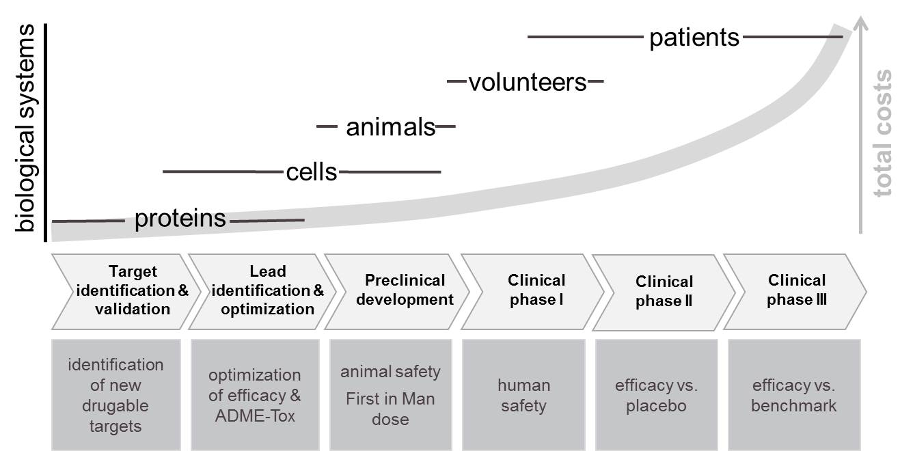

# PBPK Modeling - Systems Biology

Systems biology is a multidisciplinary field of research. It is about understanding and investigating biology from a systems perspective. That is to say, the focus is not on isolated parts or processes, but on their interaction by which certain behavior is generated, or a certain task is fulfilled.

In modern science and engineering, systems are often studied using mathematical models. Mathematical models can be used to aggregate and integrate existing knowledge with an aim to systematically analyse systems behaviour, test and generate hypotheses and plan experimental next steps. The idea of using mathematical models to investigate biology is not new. What is relatively new is the increasing recognition and appreciation that mathematical models can be an efficient way of learning and can form the basis for decision-making.

Molecular complexity forms the basis of life, and it is clear that system boundaries and certain levels of detail within a model may be limited. While experiments are and will remain an essential part of biological (and systems biological) research, in line with many "systems biologists", we consider mathematical models as the core discipline of systems biology. Consequently, in this manual, if we speak simply of models we mean mathematical models, and we will indicate if another form of model is used.

The content of this manual naturally is selective and biased. Systems biology includes many levels of biological diversity, but we will focus on organisms and topics of broader relevance in pharmaceutical research and development, i.e. systems pharmacology. Many facets of the software can however be used beyond systems pharmacology.

While the very early phases of drug development do not normally involve work on whole organisms (animals or humans), the late preclinical phase includes animal experimentation mainly in mammals such as mice, rats, dogs, or monkeys before entering the clinical phase where the focus is on human participant research as outlined below. Various modeling approaches have been developed to support investigations on different scales \[[39](../references.md#39)\]. As outlined above, we will focus on systems pharmacology, which can be viewed as a mechanistic approach to the study of pharmacodynamics and pharmacokinetics.

