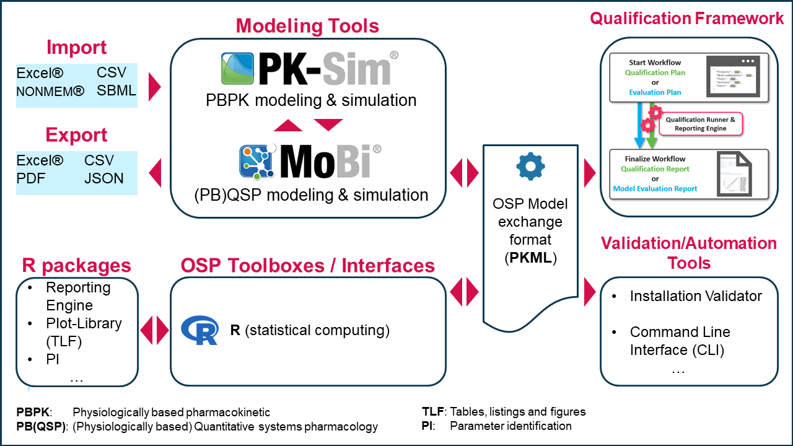

# Modules, Philosophy and Building Blocks

## Introduction

The Open Systems Pharmacology Suite contains different software tools and has been designed using a modular concept to allow efficient multi-scale modeling and simulation. The overall platform with its various software tools is implemented in a modular way explained in the [Modular Structure](#modular-structure) section. The central software tools PK-Sim® and MoBi® make use of building blocks as introduced in [PK-Sim® and its building blocks](#pk-sim) and [MoBi® and its building blocks](#mobi).

PK-Sim® is based on a whole-body concept, the focus of its counterpart, MoBi®, is at the molecular level. However, both tools extend to additional physiological scales as illustrated below.

![Multiscale modeling and simulation (taken from [18])](../assets/images/part-2/Eissing_et_al_Frontiers_2011_Figure1.jpg)

## PK-Sim®

PK-Sim® is a comprehensive software tool for whole-body physiologically based pharmacokinetic modeling \[[92](../references.md#92)\]. It enables rapid access to all relevant anatomical and physiological parameters for humans and common laboratory animals (mouse, rat, minipig, dog, monkey and rabbit) contained in the integrated database. Users are able to access to different PBPK calculation methods to allow for fast and efficient model building and parameterization. Relevant generic passive processes, such as distribution through blood flow as well as specific active processes such as metabolization by a certain enzyme are automatically taken into account by PK-Sim®. Like most PBPK modeling tools, PK-Sim® is designed for use by non-modeling experts and only allows for minor structural model modifications. Unlike most PBPK modeling tools though, PK-Sim® offers different model structures to choose from, e.g. to account for important differences between small and large molecules (see [Model settings](../part-3/pk-sim-simulations.md#model-settings)). More importantly, PK-Sim® is fully compatible with the expert modeling software tool MoBi®, thereby allowing full access to all model details including the option for extensive model modifications and extensions. This way customized systems pharmacology models may be set up to deal with the challenges of modern drug research and development.

PK-Sim® uses building blocks that are grouped into Individuals, Populations, Compounds, Formulations, Administration Protocols, Events, Observers and Observed Data. The different building blocks are described in detail in “Working with PK-Sim®”. Building blocks from these groups are combined to produce a model. The advantage of building blocks is that they can be reused. For example, after having established a model for a drug after single dose intravenous administration to an animal species, just substitute the individual by a suitably parameterized virtual human population and obtain a first in man simulation model. Further substitute the formulation, to obtain a controlled-release per oral simulation model, substitute the protocol to a obtain a multiple dose simulation model, or substitute the compound to obtain a simulation model for another drug.

PK-Sim® will be described in detail in [Working with PK-Sim®](../part-3/pk-sim-quick-guide‌.md).

## MoBi®

MoBi® is a systems biology software tool for multiscale physiological modeling and simulation. Within the restrictions of ordinary differential equations, almost any kind of (biological) model can be imported or set up from scratch. Examples include biochemical reaction networks, compartmental disease progression models, or PBPK models. However, de novo development of a PBPK model, for example, is very cumbersome such that the preferred procedure is to import them from PK-Sim®. Importantly, MoBi® also allows for the combination of the described examples and thereby is a very powerful tool for modeling and simulation of multi-scale physiological systems covering molecular details  and whole-body architecture.

De novo model establishment and simulation is supported by graphical tools and building blocks to support expert users. MoBi® uses building blocks that are grouped into Molecules, Reactions, Spatial Structures, Passive Transports, Observers, Events, Molecule Start Values, Parameter Start Values, and Observed Data. The different building blocks are described in detail in [Working with MoBi®](../part-4/first-steps.md). Building blocks out of the above-mentioned groups can be combined to generate models. The advantage of building blocks is that they can be reused. Examples:

- a different set of starting values may define a new scenario, situation, or individual. 
- refine a Reaction(s) network and update it in all tissues where it should be considered.

MoBi® will be described in detail in [Working with MoBi®](../part-4/first-steps.md).

## Modular Structure‌

The modular architecture of the software platform is outlined in screenshot below.

Apart from the two central, graphical user interface (GUI) based software tools PK-Sim® and MoBi®, the software platform includes a qualification framework, validation and automation tools, import and export options, as well as interfaces to general computing environments, as detailed below.

### Qualification framework

The qualification framework enables an automated validation of various scenarios (use-cases) supported by the OSP platform. This technical framework is used, for example, to release, in full confidence, a new version of the OSP Suite by verifying automatically that an ever-growing list of scenarios is performing as expected. Qualification framework will be described in detail in [Qualification‌](../part-5/qualification.md).

### Validation and automation tools

Validation and automation tools include for example:

* **Installation Validator**: enables "1-Click" validation of the OSP Suite installation on a target computer. The validation is performed by execution of the predefined set of simulation scenarios and comparison of the simulated results with the (validated) reference values.
* **Command Line Interface** (*CLI*): allows batch processing of multiple projects in PK-Sim and is described in [Command Line Interface - CLI](../part-3/pk-sim-command-line-interface.md).

### R-packages

The OSP software suite provides a set of packages for the R computing environment that allow scripted workflows with the models developed in PK-Sim® and MoBi®.

- [ospsuite](https://github.com/Open-Systems-Pharmacology/OSPSuite-R) package provides the functionality of loading, manipulating, and simulating the simulations created in PK-Sim® and MoBi®. It also offers extended workflows such as parameter sensitivity or PK-parameter calculation. The package is described in detail in [R documentation](../part-6/introduction-ospsuite.md).
- [TLF](https://github.com/Open-Systems-Pharmacology/TLF-Library) package offers a set of functions and methods for creating standardized reporting **T**ables, **L**ists, and **F**igures.
- [OSPSuite.ReportingEngine](https://github.com/Open-Systems-Pharmacology/OSPSuite.ReportingEngine) for automated generating of model reports.
- [OSPSuite.ParameterIdentification](https://github.com/Open-Systems-Pharmacology/OSPSuite.ParameterIdentification) provides the functionality of performing parameter identification (i.e., fitting the model to observed data) with simulations. The package is currently under development and everyone is encouraged to contribute. 


OSP Qualification Framework R packages are not included into the main OSP Suite setup and must be installed separately. Installation instructions are provided in the documentation of the tools or on the GitHub download site.


### OSP Model exchange format

Models created in PK-Sim® or MoBi® can be exported in *PK Modeling Language* (***.pkml**) format and shared between the OSP tools. Internally, PKML file format is nothing more than XML with a predefined structure.

### Import and Export‌

Apart from the communication and exchange via R, PK-Sim® and MoBi® have import and export functions for MS Excel®, CSV and NONMEM® that allow for the import of experimental data or the export of simulation results, for example.  MoBi® has SBML import functionalities. 

PK-Sim can also import and export *project snapshots* in [JSON format](https://en.wikipedia.org/wiki/JSON) (s. [Exporting Project to Snapshot](../part-3/importing-exporting-project-data-models.md#exporting-project-to-snapshot-loading-project-from-snapshot) for details).
