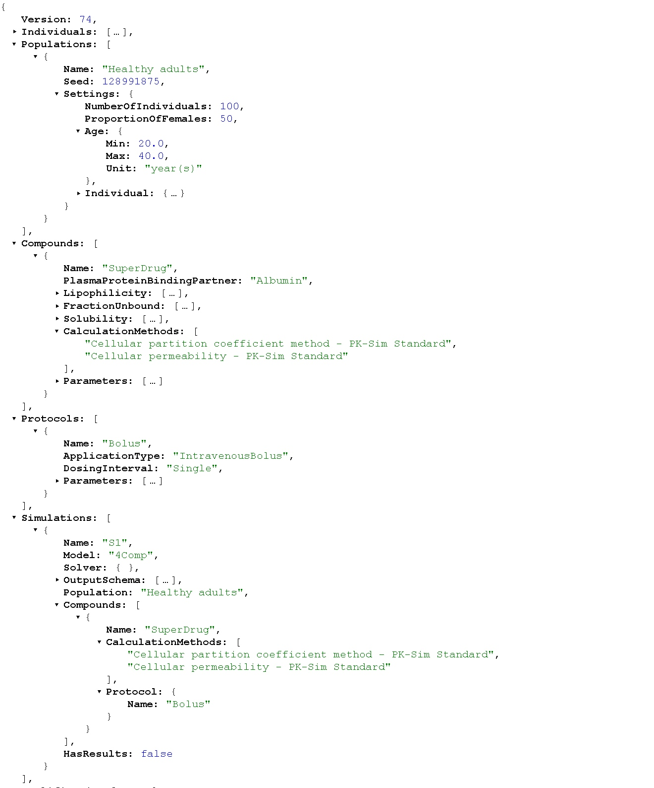
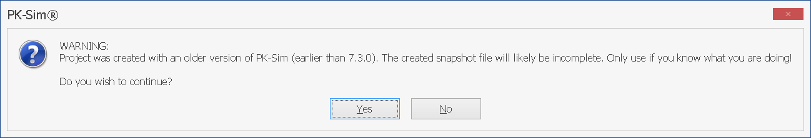

# PK-Sim® - Importing and Exporting Project Data and Models

## Importing Observed data‌

The Open Systems Pharmacology Suite offers a convenient handling of experimental data that you wish to compare with your simulations, e.g. observed data. The dialogues that cover this feature are called by clicking on the  **Observed Data** button in the **Import/Export** ribbon bar. The following steps are described in detail in Shared Tools - Import and edit of Observed _Data_.

## Importing Individual and Population Simulation‌

The **Import** function of individual and population simulations allows you to use simulations that have been modified outside of PK-Sim® - most likely using MoBi® - in the PK-Sim® environment. This has several advantages:

- Simulations are handled in the well-known PK-Sim® environment.

- An imported simulation can be handled for the most part like any other simulation built in PK-Sim®.

- All simulations can be saved in one project file.

- The user has access to all new parameters defined in MoBi®. This is especially useful when a simulation was enhanced for instance with a submodel that requires some parameterization.

In summary, the user will be able to simulate complicated scenarios like drug-drug-interactions, parent-metabolite interactions and pharmacokinetic/ pharmacodynamic scenarios in PK-Sim® after importing the respective models.

Loading an individual simulation

- Click on the **Import/Export** tab then click on the  **Individual Simulation** icon  and specify the file to be imported. The simulation will be imported into the project and will be available from the Simulation Explorer.

- Any imported simulation behaves exactly like any standard PK-Sim® simulation with the exception that its structure cannot be altered. That means that it is not possible to swap parts of the simulation using the building block concept described in [Modules, Philosophy, and Building Blocks](../part-2/modules-philsophy-building-blocks.md).

- If an imported simulation contains parameters that are unknown in PK-Sim®, they can be found in the simulation parameter tree under the node MoBi®.

Loading a population simulation

- Click on the **Import/Export** tab, then click on the **Population Simulation** icon . In the **Simulation** panel of the opening window, you have to select the file to be imported.

In the **Population**  panel, the population used to run the population simulation needs to be specified. There are **three** different ways of defining the aforementioned population:

- Use a population that is defined as building block in your current project. Available populations are itemized in the drop down menu of the **Population** field. In addition, you can define a new population by clicking on the **Add**   button or load a population from a template by clicking on the **Load from template**   button.

- Load a population from a .CSV file. This is a file that was previously generated from a population and saved in CSV format.  
    - Use this option if you want to manually modify the default distribution generated by PK-Sim® for a given parameter or if you wish to vary parameters that were created in MoBi® and that PK-Sim® is not aware of. 
The file is selected by specifying the population file path.

- Allocate the number of individuals. This is typically used when importing a simulation that was entirely created in MoBi® and is not based on a PK-Sim® model. In that case, all distributed parameters defined in the simulation will be randomly varied according to their distribution. Also all parameters marked with the flag “Can be varied in a population” in MoBi® can be varied manually after importing in the **User Defined Variability** tab of PK-Sim®.

## Export To Excel®‌

You can export the simulation results (concentration-time profiles within all included organs and compartments) to MS-Excel®.

- Right mouse click on the simulation name within the **Simulations Explorer** and select **Export results to Excel**

A window opens where you can enter the Excel® file name and the file type (\*.xls or \*.xlsx). Then Excel® is automatically started showing the exported data.

## Export To MoBi®‌

You can export a PK-Sim® simulation to MoBi® by one of the following steps:

- Right mouse click on the simulation name within the **Simulations Explorer** and select **Export To MoBi...** 

The program MoBi® will open with the exported simulation. You can then save the exported simulation within MoBi® in MoBi® format (\*.mbp3 file).


Please note that if the active window in PK-Sim® corresponds to a building block rather than a simulation, the **MoBi** icon  in the **Export** group of the **Modeling & Simulation** is deactivated.


## Export to \*.pkml file for MoBi®‌

The **Shared Modeling File (\*.pkml)** can be used to load single building blocks of a PK-Sim® simulation into a MoBi® project. You can also load a whole simulation from a \*.pkml file into a MoBi® project in order to couple two models. To export a PK-Sim® simulation to a \*.pkml file:

- Right mouse click on the simulation name in the **Simulations Explorer** .

and select **Save Simulation to MoBi pkml format ...**

A window opens where you can choose the directory and enter the \*.pkml file name. The file is saved an can be subsequently opened from MoBi®.

## Exporting Simulation Structures To File‌

You can export a PK-Sim® simulation to a text file that contains all model and simulation details: model structure, rate equations and parameter values. You can export the simulation by:

- Right mouse clicking on the simulation name within the **Simulations Explorer** and selecting **Export Simulation Structure To File...**

A window opens where you can choose the directory and enter the file name. The file is saved and can be  opened with a suitable text editor.

## Exporting the Project History To File‌

To export the project history that contains any user action to an Excel® file. In order to do so:

- Click on the **Create Report** icon  in the **Export Project** group of the **Import/Export** tab

A window opens where you can choose the directory and enter the \*.xls file name.

## Exporting Population data‌

To export the physiological parameters which are varied within a population to a table (\*.csv format) by

- Right mouse click on the population name within the **Building Blocks Explorer**

and select **Export To CSV...**

- If you have created a population simulation, you can also export the population data by right mouse click on the simulation name within the **Simulations Explorer** and select **Export To CSV...**

A window opens where you can choose the directory and enter the **.csv** file name.

## Exporting Project to Snapshot / Loading Project from Snapshot

PK-Sim includes various structural models together with relevant physiological and molecular databases for PBPK modeling of small and large molecules in different animal species and human populations. Relatively few inputs from the user are required to setup a complete PBPK model.

Model and/or data information stored in PK-Sim databases may change over time (e.g. in order to reflect the newest scientific findings) and be incorporated into newer PK-Sim versions. Please ensure you have the latest version installed.

If an old project is simply opened with a new PK-Sim version, it will contain **old** model information, **old** anatomical/physiological data etc. and will not make use of improvements in the new version. The most appropriate way to incorporate the new knowledge would be to **recreate, from scratch**, the existing project in the new PK-Sim version.

To simplify this task, a concept of **project snapshot** was introduced in PK-Sim 7.3.

A project snapshot contains the **minimal amount of information** required to recreate the project from scratch. This includes the information on primary substance specific input parameters (e.g. molecular properties like _molecular weight_, _lipophilicity_, etc.) and required inputs (e.g. demographic characteristics) for defining the system parameters. Further, any changes made in the existing model, such as a change in liver volume, that is not a default value, will be stored in the snapshot and included in the new model once recreated from the snapshot. 

Project snapshots are human-readable text files in [JSON format](https://en.wikipedia.org/wiki/JSON)

The following PK-Sim entities are currently supported by snapshots and will be recreated when a project is loaded from snapshot:
* All building block types (incl. observed data)
* Simulations
* Parameter Identifications
* Simulation comparisons

The following PK-Sim entities are not yet supported:
* Sensitivity Analyses

To export a project to snapshot, select **File** :arrow_right:  **Export to Snapshot**

 Snapshots for a project created with a version of PK-Sim <=7.2 might be incorrect. 
In this case PK-Sim will warn you. If exported anyway, the new project created from this snapshot may have some undesired deviations from the original projects, which must be corrected manually by the user.



To load a project from snapshot, select **File** -   **Load from Snapshot** 

