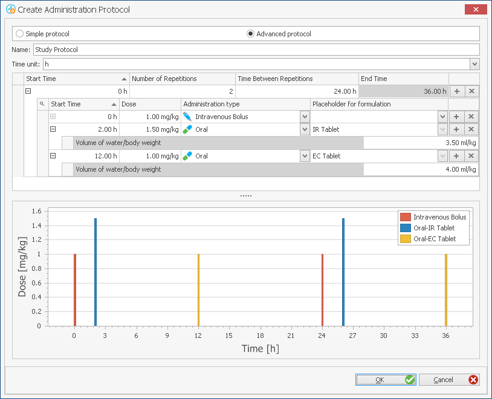

# Administration Protocols

An administration protocol is a set of data describing administration type, dose and dosing regimen. These properties can be specified within the building block **Administration Protocol**  . A number of administration protocols can be defined and saved as templates.These can be shared among other projects and users.

## Definition of new Administration Protocols in PK-Sim®‌

To create a new administration protocol, do one of the following:

* Click **Administration Protocol**  in the **Create New Building Blocks** Group of the **Modeling & Simulation** Tab
* Right mouse click on **Administration Protocols** in the **Building Block Explorer**

and select  **Add Administration Protocol...**

* Use the short cut **Ctrl+Alt+A**

A new window will open where you can define your administration protocol. You can choose between **Simple protocol** and **Advanced protocol**. To switch between these two views select the respective protocol type in the uppermost checkboxes of the window.


Note that when switching between simple and advanced protocol several of the already defined parameters will be **reset**. When switching from simple to advanced protocol, the dosing schedule will be transferred. This is not true for the opposite direction.


**Simple protocol**, drug administration via different routes can be defined by means of a single or predefined multiple dosing scheme.

**Advanced protocol**, multiple dosing regimens and treatment cycles of any scheme and combination can be defined.

The default is the **Simple Protocol** . In both options, the dose and dosing scheme are visualized in the lower panel of the window. Depending on the dose unit selected, the Y-axis description will change accordingly.

The administration protocol is initialized by providing it a **Name** in the respective input field. The name is used to identify the protocol when its parameters are saved in the project and/or as a template. Then, choose between **Simple protocol** and **Advanced protocol** and set the properties of the protocol.

### Simple Protocol‌

To create a **Simple Protocol** follow the the instructions in the table below.

Depending on the choice of administration protocol the required input parameters change.

| Administration Type                                                                        | Description                                                                                                                                                                                                                                                                                                                                                                                                                                                                                                                                                                                                                                                                                                                                                                                                                       |
| ------------------------------------------------------------------------------------------ | --------------------------------------------------------------------------------------------------------------------------------------------------------------------------------------------------------------------------------------------------------------------------------------------------------------------------------------------------------------------------------------------------------------------------------------------------------------------------------------------------------------------------------------------------------------------------------------------------------------------------------------------------------------------------------------------------------------------------------------------------------------------------------------------------------------------------------- |
|  Intravenous Bolus | 
1. Select the administration type <strong>Intravenous Bolus</strong> from the drop-down menu 2. Enter the dose and select the appropriate dose unit from the drop-down menu 3. Select the appropriate dosing interval from the drop-down menu 4. In case a multiple dosing regimen is selected, the protocol end time has to be defined. 5. Confirm and close window by clicking <strong>OK</strong> 
                                                                                                                                                                                                                                                                                                                                                |
|  Intravenous Infusion   | 
1. Select the administration type <strong>Intravenous Infusion</strong> from the drop-down menu 2. Enter the dose and select the appropriate dose unit from the drop-down menu 3. Select the appropriate dosing interval from the drop-down menu 4. In case a multiple dosing regimen is selected, the protocol end time has to be defined. 5. Enter the infusion time and select the appropriate time unit from the drop-down menu 6. Confirm and close window by clicking <strong>OK</strong> 
                                                                                                                                                                                                                                                  |
|                                                                                            |                                                                                                                                                                                                                                                                                                                                                                                                                                                                                                                                                                                                                                                                                                                                                                                                                                   |
|  Oral                          | 
1. Select the administration type <strong>Oral</strong> from the drop-down menu 2. Enter the dose and select the appropriate dose unit from the drop-down menu. 3. Select the appropriate dosing interval from the drop-down menu. 4. In case a multiple dosing regimen is selected, the protocol end time has to be defined. 5. Enter the volume of water co-administered. The default is 3.5 mL/kg body weight, which corresponds to a volume of 250 mL (8-9 fl. oz.) of water for an average human. This volume is also considered appropriate in animal dosing 103. However, if desired, the liquid volume can be adjusted according to the protocol of the (pre)clinical study. 6. Confirm and close window by clicking <strong>OK</strong> 
 |


Please note that if the administration type **Oral** is selected this will require the definition of a **Formulation** in the **Formulation** building block for the Simulation.


| Administration Type                                                             | Description                                                                                                                                                                                                                                                                                                                                                                                                                                                                                                                                                                                                                                                                                                                                                                                               |
| ------------------------------------------------------------------------------- | --------------------------------------------------------------------------------------------------------------------------------------------------------------------------------------------------------------------------------------------------------------------------------------------------------------------------------------------------------------------------------------------------------------------------------------------------------------------------------------------------------------------------------------------------------------------------------------------------------------------------------------------------------------------------------------------------------------------------------------------------------------------------------------------------------- |
|  User Defined | 
1. Select the administration type <strong>User Defined</strong> from the drop- down menu 2. Enter the dose and select the appropriate dose unit from the drop-down menu. 3. Select the appropriate dosing interval from the drop-down menu. 4. In case a multiple dosing regimen is selected, the protocol end time has to be defined. 5. Enter the target organ into which the drug is to be administered, e.g. <strong>Muscle</strong> in the case of intramuscular administration. 6. Enter the target compartment within the target organ into which the drug is to be administered, e.g. "Interstitial" in the case of intramuscular administration. 7. Confirm and close window by clicking <strong>OK</strong> 
 |


Please note that in case that the administration type **User Defined** is selected this will require the definition of a **Formulation** in the **Formulation** building block for the Simulation.


### Advanced Protocol‌

Activate **Advanced protocol** in the **Create Administration Protocol** window.

In the uppermost drop-down menu, the time unit for visualization of dose and dosing scheme in the lower panel of the window can be selected. Depending on the dose unit(s) selected, the Y-axis label(s) will change appropriately.

The table used to defined the advanced protocol consists of the following five columns:

1. The **Start Time** at which the protocol schema starts.
2. The **Number of Repetitions** defining the iterations of the protocol schema.
3. The **Time Between Repetitions** defining the time lag between the iterations of several protocol schemata.
4. The **End Time** defining the end time of the protocol schema. The end time is automatically calculated based on the input parameters.
5. In the last column, additional protocol schemata can be added by clicking  or deleted by clicking . Please note that at least one protocol schema needs to be defined. The various protocol schemata will automatically be re-sorted according to the protocol schema start time.

The secondary table, can be opened by clicking  in the column **Start Time**, a number of individual schema items can be defined for the given protocol schema. The following five columns can be found:

1. The **Start Time** of schema items in relation to the start time of the protocol schema. If the start time of the schema items is **0**, the administration time equals the start time of the protocol schema.
2. The **Dose** in units mg or mg/kg of the drug administered.
3. The **Administration type**. You can choose from the following administration types from the drop-down menu:
   *  Intravenous Bolus
   *  Intravenous Infusion: requires the input of the **Infusion time** in units min, h, or s
   *  Oral: requires the input of the **Volume of water/body weight** co- administered, which is 3.5 mL/kg BW per default (see PK- Sim® - _Formulations_) and, additionally, the definition of a **Placeholder for formulation** in column 4.
4. **Placeholder for Formulation**.\
   For an intravenous administration (Intravenous Bolus and Intravenous Infusion), the definition of a formulation placeholder is not necessary, because the drug is always assumed to be dissolved when given intravenously (see [PK-Sim® - Formulations](pk-sim-formulations.md)).

In case of oral and user defined administration, you should add a note on the type of formulation. Later, in the simulation, the formulation placeholder can be matched with the corresponding **Formulation** building block. This may sound trivial in the case of only one formulation given repeatedly at the given times. However, consider that you can set up sophisticated dosing schedules, in which various administration types and formulations are administered at various times. Then, the formulation type should already be signified in the administration protocol in order to be able to appropriately match the schedules with the various formulations. For further information please see [PK-Sim® - Simulations](pk-sim-simulations.md).

1. In the last column, additional dosing schedules can be added or deleted by clicking. Please note that at least one dosing schedule needs to be defined for each protocol scheme. The various schema items will automatically be re-sorted according to the schema item start time.

**Example**

In the following screenshot, an example of an advanced protocol is given. The protocol example consists of only one protocol scheme. However, the protocol schema is repeated after 24 hours. Within one repetition, the drug is administered three times: first, an intravenous bolus loading dose of 1 mg/kg is given; second, an immediate release (IR) tablet containing 50 mg of drug is given 2 hours later; third, an enteric coated (EC) tablet containing 50 mg of the drug is given 12 hours after the intravenous dose, i.e. 12 hours after the beginning of the protocol schema. The dissolution profiles of the two formulation types have to be defined in the **Formulation** building block. The formulations can be imported and linked to the corresponding administration time points during the generation of the simulation. Here, only a "placeholder" has to be defined that can be used during the generation of the simulation to identify the different tablet types and thus, to appropriately match the administration time points and the formulation types. Since the last dose within the protocol items is administered after 12 hours and the protocol schema is repeated two times with a time between the repetitions of 24 hours, the last dose is administered after 24 + 12 = 36 hours (**End Time** of the protocol schema). This is also shown in the lower panel of the window.


Please note that the combination of the Administration type **User defined** and the **Advanced protocol** is not available.


## Setting or Changing Administration Protocol Properties‌

To set or change the properties of an existing administration protocol:

1. Right mouse click on the respective administration protocol in the **Building Block Explorer**
2. Select  **Edit...**

or **Double click** on the administration protocol in the **Building Block Explorer**

A window with the current settings will open where properties can be set appropriately. The changes are saved by closing the window by clicking on .


Please note that when you switch between simple and advanced protocol, this action will reset several parameters already defined. However, when switching from simple to advanced protocol, the dosing schedule will be transferred. This does not apply to the opposite direction.


## Cloning Administration protocols‌

To clone a protocol in the project:

1. Right mouse click on the respective protocol in the **Building Block Explorer**
2. Select  **Clone...**
3. Set an alternative name for the protocol clone and, if desired, enter a description
4. Confirm and close the window by clicking **OK** 

## Saving an Administration Protocols as Templates‌

For each project, a number of administration protocols can be defined. They can be saved as a template and then be shared among several projects and users.

To save an existing administration protocol as template:

1. Right mouse click on the respective administration protocol in the **Building Block Explorer**
2. Select  **Save as Template...**. If a protocol with the same name already exists, a warning appears and you have the following options:

* **Override**: This action will override the existing template.
* **Save as**: You can save the protocol under a different name. In this case, you will be asked to **Rename** the new template.
* **Cancel**: This action will abort the saving process.

## Loading Existing Administration Protocols from Templates‌

To load an existing administration protocol from the template database:

1. Right mouse click on **Administration Protocols**  in the **Building Block Explorer**
2. Select  **Load From Template...**
3. Select the desired administration protocol from the user templates. In case a protocol with the same name already exists in the project, a warning appears and you will have to **Rename** the protocol that is to be loaded from template.
4. Click **OK** 

The selected administration protocol will appear in the **Building Block Explorer**.

Administration protocols can also be directly loaded from the template database within a simulation.

## Deleting Administration Protocols‌

To delete an administration protocol from the project:

1. Right mouse click on the respective administration protocol in the **Building Block Explorer**
2. Select  **Delete...**
3. Confirm by clicking **Yes**


Please note that a protocol that is used in any simulation of the project cannot be deleted.

