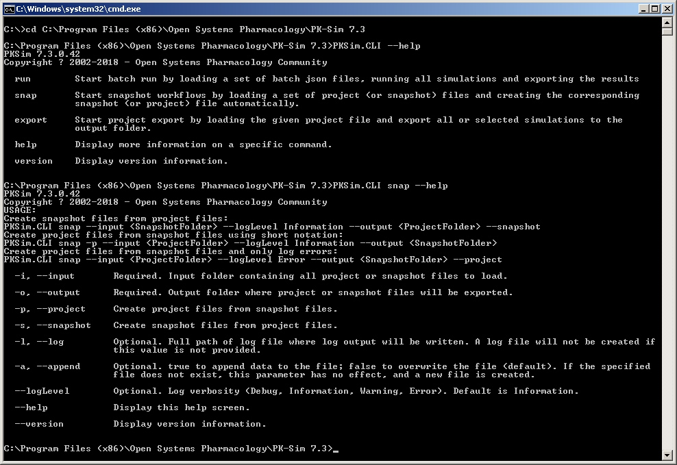

# Command line interface (CLI)
    
CLI allows batch processing of multiple projects in PK-Sim.
To start PK-Sim CLI: 
* Open windows command prompt (`cmd`) and switch to PK-Sim installation folder.
* Enter `PKSim.CLI --help` to show the list of available commands
* Enter `PKSim.CLI <COMMAND_NAME> --help` (e.g. `PKSim.CLI snap --help`) to show options for a command

