# PK-Sim® Compounds: Defining Inhibition/Induction Processes

Drugs may influence a broad variety of ADME processes that in turn will then affect the PK of the drug and possibly also other drugs. A specific and very common case of this very generic description of a drug-drug-interaction (DDI) is the inhibition of a metabolizing enzyme or a transporter. Most metabolizing enzymes are highly expressed in the liver and, therefore, drug clearance and the first pass metabolisms will be affected. Inhibition of a transporter may change the rate of absorption of a drug or the amount absorbed of a drug. If an inhibited transporter is expressed in the kidney or liver, drug excretion will be altered.

The interaction processes in PK-Sim® are defined in the **ADME** tab of a compound.

## Inhibition Processes‌

To set up an inhibition of a protein by a compound, do the following:

*   Right mouse click on *Inhibition* in the **ADME** tab of the compound that acts as an inhibitor and select *Add Inhibition Process*.

*   Select the affected enzyme/transporter and specify the source for assuming this inhibition.

*   Specify the type of inhibition from the Process type list (competitive, uncompetitive, non-competitive, mixed, irreversible/mechanism-based inactivation). The interaction types are described in the next sections.

Inhibition changes reaction rates and/or the kinetics of active transports or metabolization reactions by modifying the following reaction and/or transport parameters:

*   The Michaelis-Menten constant $$K_m$$ and the turnover number $$kcat$$ for Michaelis-Menten kinetics

*   The Specific Clearance for first order kinetics

In case of a *Michaelis-Menten* process, the reaction/transport rate **without inhibition** is given by:

$$v=\frac{V_{max}\times S}{K_M+S}$$

 with $$V_{max} = kcat \times E$$ is maximum velocity where $$kcat$$ is the rate constant and $$E$$ is the amount of enzyme/transporter, and $$S$$ = free substrate concentration.

In an inhibition scenario, both, the turnover number kcat and the Michaelis- Menten constant, are modified to new apparent values:

$$v=\frac{V_{max,app}\times S}{K_{M,app}+S}$$

with $$V_{max,app} = kcat,app \times E$$ apparent maximum velocity which is the product of apparent $$kcat$$ and $$E$$, the amount of enzyme/transporter, and $$S$$ = free substrate concentration.

PK-Sim® calculates the apparent $$kcat$$ and apparent Michaelis-Menten constant for the specified inhibition scenario. In case of a simple setting with just one inhibitor per process, the equations are listed in the next section.

If first order processes are inhibited, the specific clearances will be altered. The generic expression for a reversible linear, non saturable metabolism/transport process of first order is:

$$
{\huge \mathrm{CL}_{\mathrm{int,app}} = \mathrm{CL}_{\mathrm{int}} \left/ \left( 1 + \sum_{a=1}^{m} \frac{I_a}{K_{I,a}} + \sum_{c=1}^{o} \frac{I_c}{K_{I,c}} + \sum_{d=1}^{p} \frac{I_d}{K_{Ic,d}} \right) \right.}
$$

If an inhibition is set up for an enzyme or transporter, all processes with the same name will be linked and affected by the inhibition. An autoinhibition cannot be set-up because measured Ki values will already be altered due to autoinhibition.

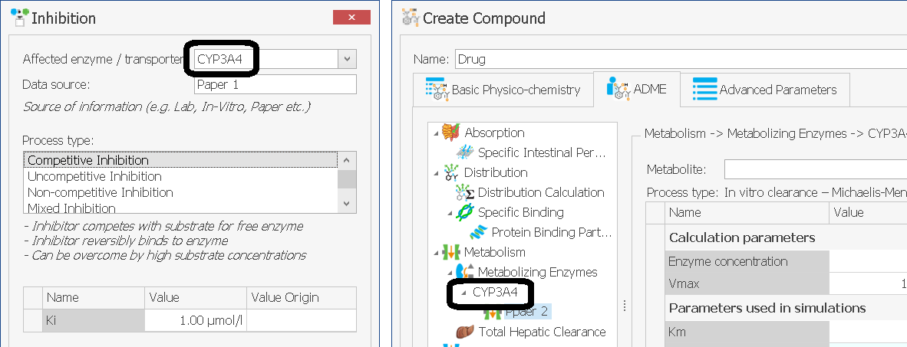

### Competitive inhibition - simple setting with one inhibitor‌

In a competitive enzyme inhibition, the inhibitor binds reversibly to the enzyme and competes with the substrate for free enzyme. In case of a reversible inhibition, high substrate concentrations can overcome this inhibition. The apparent Michaelis-Menten constant increases while the apparent maximum reaction velocity remains unchanged.

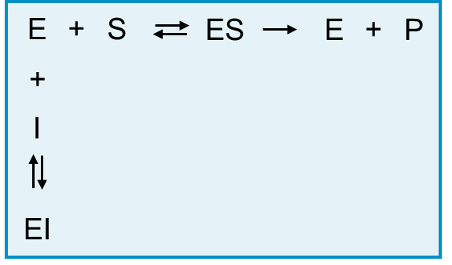

$$v=\frac{V_{max}\times S}{K_{M,app}+S}$$

with $$v$$ = reaction velocity, $$V_{max}$$ = maximum reaction velocity, $$K_{M,app}$$ = apparent Michaelis-Menten constant, and $$S$$ = free substrate concentration. $$K_{M,app}$$ is calculated as follows:

$$K_{M,app} = K_M \times (1+\frac{I}{K_I})$$

with the variables defined above and $$K_M$$ = Michaelis-Menten constant in absence of an inhibitor, $$I$$ = free inhibitor concentration, and $$K_I$$ = dissociation constant of the enzyme-inhibitor complex.

### Uncompetitive inhibition - simple setting with one inhibitor‌
    
In a uncompetitive enzyme inhibition, binding of the inhibitor to the enzyme requires prior binding of the substrate to the enzyme. Binding of the inhibitor to the enzyme-substrate complex is reversible. This kind of inhibition decreases the apparent Michaelis-Menten constant and the maximum reaction velocity.

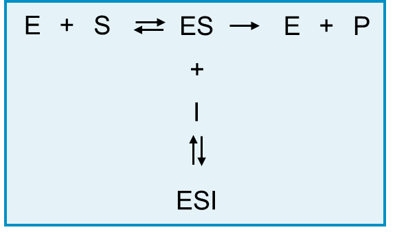

The reaction rate is described by the following equation:

$$v=\frac{V_{max,app}\times S}{K_{M,app}+S}$$

with $$V_{max,app}$$ = apparent maximum reaction velocity, $$K_{M,app}$$ = apparent Michaelis-Menten constant, and $$S$$ = free substrate concentration.

The apparent maximum reaction velocity is decreased depending on the concentration of the inhibitor, and its affinity to the enzyme-substrate complex.

$$V_{max,app} = \frac{V_{max}}{1+\frac{I}{K_I}}$$

with $$V_{max}$$ = maximum reaction velocity, $$I$$ = free inhibitor concentration, and $$K_I$$ = dissociation constant of the enzyme-substrate-inhibitor complex.

The apparent Michaelis-Menten constant is defined as follows:
$$K_{M,app} = \frac{K_M}{1+ \frac{I}{K_I}}$$

with the variables as defined above.

### Mixed Inhibition : Simple Setting with One Inhibitor‌
    
In a mixed inhibition, the inhibitor binds reversibly to the enzyme or the enzyme/substrate complex with different affinities (and different dissociation constants). The inhibitor binding site is different from the substrate binding site on the enzyme molecule. The apparent Michaelis-Menten constant is changed and the apparent maximum velocity is decreased.

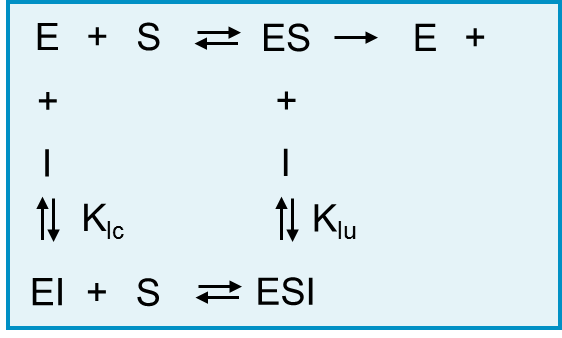

The reaction rate is described by the following equation:

$$v=\frac{V_{max,app}\times S}{K_{M,app}+S}$$

with $$V_{max,app}$$ = apparent maximum reaction velocity, $$K_{M}$$ = Michaelis-Menten constant in the absence of the inhibitor, and $$S$$ = free substrate concentration.

The apparent maximum velocity is calculated as follows:

$$V_{max,app} = \frac{V_{max}}{1+\frac{I}{K_{Iu}}}$$

with $$V_{max}$$ = maximum reaction velocity, $$I$$ = free inhibitor concentration, and $$K_{Iu}$$ = dissociation constant of the enzyme-substrate-inhibitor complex.

The apparent Michaelis-Menten constant is calculated as follows:

$$K_{M,app} = \frac{1+\frac{I}{K_{Ic}}}{1+\frac{I}{K_{Iu}}}$$

with $$K_{Ic}$$ = dissociation constant of the enzyme-inhibitor complex, $$K_{Iu}$$ = dissociation constant of the enzyme-substrate-inhibitor complex, and $$I$$ = free inhibitor concentration.

### Non-Competitive Inhibition : Simple Setting with One Inhibitor‌
    
The non-competitive inhibition is a special case of a mixed inhibition in which an inhibitor binds reversibly to the enzyme and/or to the enzyme/substrate complex with the same inhibition constant ($$K_I = K_{Iu}=K_{Ic}$$). The reaction velocity is described by the same equation as in a mixed inhibition and the apparent maximum velocity is described by the same equation as in an uncompetitive inhibition.

### Irreversible Inhibition / Mechanism-Based Inactivation
    
Principally, an irreversible inhibition is a time-dependent inhibition (TDI) in which recovery is only due to de novo protein, e.g. enzyme synthesis. Thus, the in vivo production and degradation of enzyme has to be taken into account by PK- Sim®. Turnover of any protein inherently is a function of both, protein synthesis (a zero-order process) and protein degradation (a first-order rate process). In view of the kinetic nature of these processes, the rate constant of degradation frequently is the sole determinant of the "steady-state" concentration of each protein as it oscillates between the basal and the induced/repressed state. The natural enzyme turnover in PK-Sim® is represented as shown below.

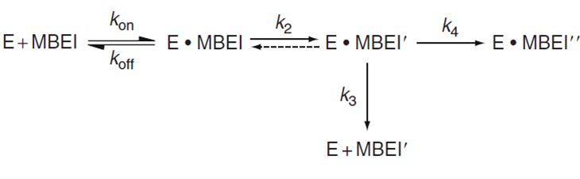

Initial enzyme concentration E0 and turnover rate constants kdeg are set to default values based on literature.

The rate of inactivation follows a hyperpolic kinetic pattern. Generally, TDI has a slow onset, but potentially its effects are more profound than those of reversible inhibitions. The most prominent example of a practically irreversible inhibition is the inactivation of CYP-mediated reactions in the presence of NADPH.

A common model for mechanism-based inactivation is illustrated below:

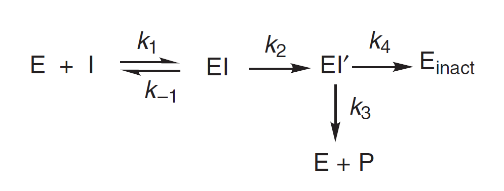

According to Silvermann et al. [[72](../references.md#72)], a mechanism-based enzyme inactivator (MBEI) requires a step to convert the compound to the inactivating species (k2). This step, which is generally responsible for the observed time dependence of the enzyme inactivation, usually is irreversible and forms a new complex (EI') which can have two distinctive fates:

*   The EI' is a reactive species and forms a covalent complex with the enzyme (Einact) (k4).
*   The species generated is released from the enzyme as a product/metabolite P of the inactivator and the enzyme is again available as active enzyme (k3).

The ratio of product release to inactivation is termed the partition ratio and represents the efficiency of the mechanism-based inactivator: the partition ratio is described by k3/k4.

The two principal kinetic constants that are useful in describing mechanism-based inactivation are **kinact** (the maximum rate of inactivation) and **Kkinact_half** (in literature also often referred to as KI, the concentration at which the inactivation rate is half-maximal). Based on the reaction scheme shown above and with the typical assumption of quasi steady-state, it can be shown that **kinact** is a complex mixture of k2, k3, and k4, while **Kkinact_half** is a complex mixture of k1, k-1, k2, k3, and k4:

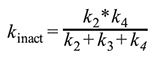

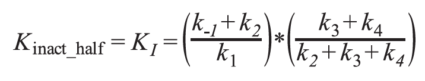

The implementation in PK-Sim® of one mechanism-based inactivator follows the equation shown below:

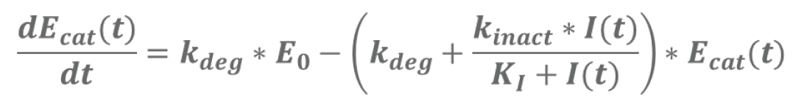

Note that irreversible inhibition in PK-Sim® also always includes reversible binding of the mechanism-based inactivator to the enzyme so that it also acts as a competitive inhibitor. This process is defined by its dissociation constant Ki. By default (assuming the mechanism-based model based on \[[72](../references.md#72)\]), Ki equals Kkinact_half. The user may choose a different value if applicable.

If more than one compound other than the mechanism-based inactivator competes for the binding at the enzyme, this can easily be implemented by specifying for the respective compound a reversible (e.g. competitive) inhibition process. This process automatically accounts for the so called **substrate protection of the enzyme**. An example where there is one substrate and one mechanism-based inactivator simultaneously competing for the binding site is illustrated below.

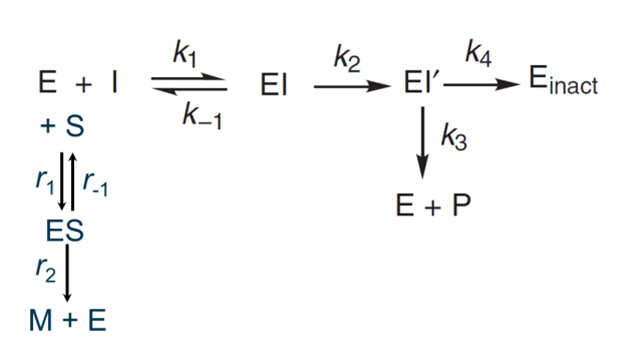

This model could be represented in PK-Sim® as follows

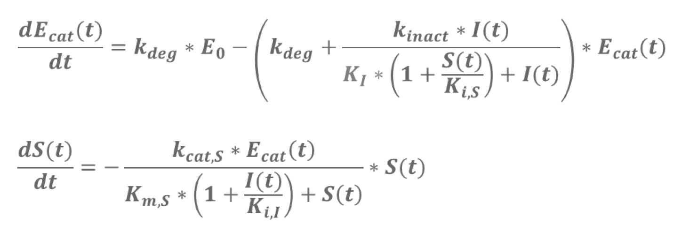

Note that substrate protection can only be modeled by specifying a reversible inhibition process for the substrate (enter a Ki value).


Given the variability and uncertainty associated with experimental determination of enzyme turnover rates, a sensitivity analysis for the enzyme half life should be considered in the modeling approach.



Please note that for the mechanism-based inactivator no clearance process is defined via the inactivation process by default. In theory, for every inactivated enzyme molecule, also one inactivator molecule is cleared; this must be separately defined by the user in form of additional metabolization/excretion processes for the inhibitor. See [Clearance of the mechanism-based inactivator](#clearance-of-the-mechanism-based-inactivator) below for guidance on when and how to define such a process.


#### Clearance of the mechanism-based inactivator

By default, PK-Sim® does not create a clearance process for the mechanism-based inactivator itself. The inactivation term reduces the amount of active enzyme, but it does not remove the inactivator from the system. In theory, for every enzyme molecule that is inactivated, one inactivator molecule is consumed as well. Whether this loss has to be defined explicitly depends on how the clearance of the inactivator was parameterized.

**Parameters describing the complete process**

Making the typical Michaelis-Menten assumptions, mechanism-based inactivation together with the "productive" metabolism of the inactivator is characterized by six parameters:

| Parameter                               | Meaning                                                                                                                                                |
| --------------------------------------- | ------------------------------------------------------------------------------------------------------------------------------------------------------ |
| kinact                                  | rate constant describing the maximum rate of inactive enzyme formation                                                                                 |
| Kkinact_half (often referred to as KI)  | inactivator concentration at which the inactivation rate is half-maximal                                                                                |
| kcat                                    | rate constant describing the maximum rate of metabolite formation, where the metabolite is released and the enzyme remains fully active                 |
| Km                                      | Michaelis-Menten constant of that metabolic reaction                                                                                                    |
| partition ratio                         | ratio of the metabolite formation rate to the inactive enzyme formation rate (k3/k4 in the scheme above); an index of the efficacy of the inactivator    |
| Ki                                      | dissociation constant of the reversible enzyme-inactivator complex; relevant only for the competitive inhibition of **other** substrates                 |

Assuming a single binding site at the enzyme and the simplified mechanism-based model used by default in PK-Sim® (see above), Kkinact_half = Km = Ki. The user may enter different values where these are available from measurements.

When the inactivator binds to the enzyme, two things can happen: the inactivator is metabolized to an (in general circulating) metabolite and the enzyme stays fully operating, or it forms a quasi-irreversible complex and the enzyme is lost. The smaller the partition ratio, the higher the probability of the second option, i.e. the more efficient the inactivator.

**Why this clearance is not added automatically**

The clearance of the inactivator is very often derived from a depletion experiment, e.g. with human liver microsomes. Such a measured depletion rate already contains the loss of compound associated with the inactivation, and the same holds for a clearance that was fitted to observed in vivo data of the inactivator. If PK-Sim® automatically added the inactivation-related clearance on top of the clearance defined by the user, this contribution would be counted twice and the user would have to subtract it from the depletion rate. PK-Sim® therefore only issues a warning and leaves the decision to the user.


Only define the additional process described below if the clearance of the inactivator was **not** derived from a depletion assay and was **not** fitted to observed data of the inactivator. In those cases the loss via inactivation is already included in the clearance, and defining it a second time would overestimate the elimination of the inactivator.


**How to define the additional clearance**

The loss of inactivator that accompanies the inactivation is set up like any other metabolization process of the inactivator, but via the enzyme that is inactivated:

*   In the **ADME** tab of the inactivator, add a metabolizing enzyme process for the **same** enzyme for which the irreversible inhibition was defined.

*   Choose the process type _In vitro clearance – Michaelis-Menten_ and enter Km = Kkinact_half. This process type takes a specific Vmax as input, from which PK-Sim® calculates kcat by normalizing to the enzyme concentration; choose the specific Vmax such that the resulting kcat equals kinact. With the default reference enzyme concentration of 1 µmol/l, this means entering kinact as the specific Vmax.

Because the process is defined via the affected enzyme, it is driven by the current amount of active enzyme. The resulting clearance therefore decreases over time while the enzyme is being inactivated, and recovers together with the enzyme. Since PK-Sim® does not apply reversible auto-inhibition, i.e. a compound that is substrate and reversible inhibitor of the same enzyme does not appear in the Km\_interaction\_factor of its own process (see _Multiple Inhibitors : Equations Used by PK-Sim®_ below), this additional process is not competitively inhibited by the inactivator itself.

If, in addition, the productive metabolism of the inactivator via the same enzyme shall be described and the partition ratio is known, the corresponding turnover number is given by kcat = partition ratio $$\times$$ kinact. It can be defined as a further process of the same type, again with Km = Kkinact_half and with the specific Vmax chosen to yield this kcat.

**How relevant is this contribution?**

Two simple checks help to decide whether the additional process is worth defining:

*   If a metabolization of the inactivator via the same enzyme is already described with a turnover number kcat, the inactivation adds a fraction of kinact/kcat = 1/partition ratio to the turnover via this enzyme. Measured partition ratios are often much larger than 1, i.e. many productive turnovers occur per inactivation event, in which case the additional loss is minor. A ratio close to 1 means that almost every turnover inactivates an enzyme molecule, so that the additional loss is of the same order as the productive metabolism and should be defined.

*   For inactivator concentrations well below Kkinact_half, the additional process behaves approximately like a first order process with the rate constant $$kinact \times E / K_{kinact\_half}$$, where $$E$$ is the concentration of active enzyme in the respective compartment. This value can be compared to the rate constants of the other elimination pathways of the inactivator.

If the contribution is small compared to the overall clearance of the inactivator, it can be neglected as a separate process and the clearance defined by the user can be used as it is. Note that the additional clearance by inactivation is not constant but changes over time, so where it is relevant it should be defined explicitly rather than lumped into a constant clearance.

## Protein Induction‌

Enzyme or transporter induction can occur as a result of either increased **de novo synthesis of protein** or (in very rare cases and currently not implemented in PK-Sim®) a decrease in degradation following protein stabilisation induction. Some examples of induction processes are:

*   CYPs 1A1, 1A2 and 1B1 induced by aryl hydrocarbon receptor (AHR) that is activated by binding of e.g. dioxin, benzoapyrene, omeprazole (in vitro), tobacco smoke

*   CYP3A induced primarily by pregnane X receptor (PXR) that is activated by binding of e.g. rifampicin, phenobarbital, nifedipine

*   Activation of the pregnane X receptor induces a number of Phase II enzymes involved in drug metabolism as well as numerous transporters

Implementation of induction in PK-Sim® uses the following parameters:

*   Emax: maximum in vivo induction effect (Dimension: dimensionless)

*   EC50: concentration of the inducer to reach half the maximal in vivo induction effect (Dimension: concentration)

In an induction, Emax ranges from 0 (= no induction) to infinity. A value of 1 means that the effect is twice the effect without induction. Modelling of suppressed de novo synthesis (suppression) (for example in some cytokines) is also possible with PKSim using the induction specification of a compound. In a suppression, Emax ranges from 0 (=no suppression) to -1 (full suppression, no synthesis anymore).

If the reaction of the enzyme Ex and the substrate Sj follows a Michaelis-Menten kinetics, the rate of the enzyme Ex degradation/production and the substrate Sj degradation are given by:

## Multiple Inhibitors : Equations Used by PK-Sim®‌

The enzyme turnover for Enzyme X in the presence of m competitive (CI), n uncompetitive (UI), o non-competitive (NI), p mixed-type inhibitors (MI), q mechanism-based enzyme inactivators/time dependent inactivators (TDI) and r inducers (IND) is given by:

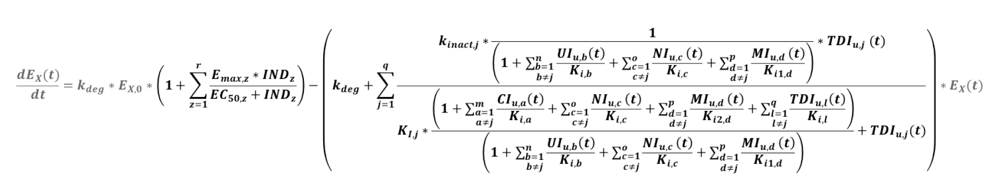

If the reaction of the enzyme Ex and the substrate Sj follows a Michaelis-Menten kinetics, the rate of the substrate Sj degradation is given by:

In the above equation, the substrate Sj may also be an inhibitor of all kind, e.g. CI, UI, NI, MI, TDI or IND.

Similarly, if the reaction of the enzyme Ex and the substrate Sj follows a first order kinetics, the rate of the enzyme Ex degradation/production and the substrate Sj degradation are given by:

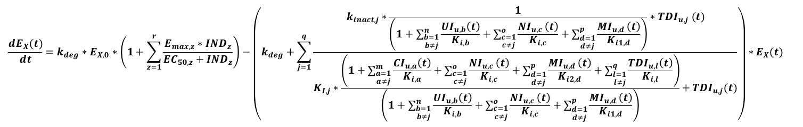

In the above equation, the substrate Sj may also be an inhibitor of all kind, e.g. CI, UI, NI, MI, TDI or IND.

Please note that

*   As for all other inhibition types, there is no reversible auto-inhibition (which means: if a compound is substrate and reversible inhibitor of the same enzyme, it does not appear in the Km\_interaction\_factor.) In the formula above it's done by excluding the substrate from the sum terms (a#j, b#j, etc.).

*   For mechanism-based inactivators auto-inhibition can be accounted for by specifying a specific clearance pathway via the affected enzyme (see [Clearance of the mechanism-based inactivator](#clearance-of-the-mechanism-based-inactivator)).

*   Free (unbound) concentrations of all inhibitors are used (e.g. TDI\_u,l(t) means: unbound concentration of TDI\_l).
