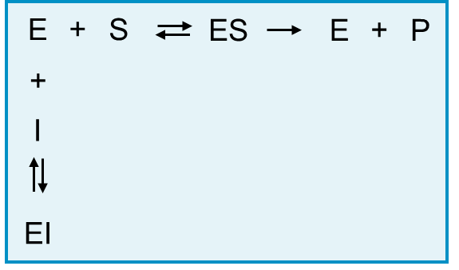
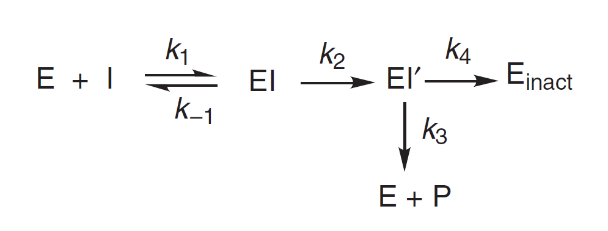
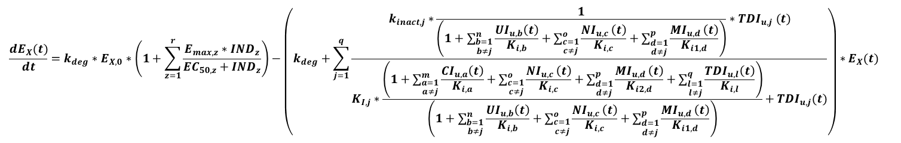

# PK-Sim® Compounds: Defining Inhibition/Induction Processes

Drugs may influence a broad variety of ADME processes that in turn will then affect the PK of the drug and possibly also other drugs. A specific and very common case of this very generic description of a drug-drug-interaction is the inhibition of a metabolizing enzyme or transporter by a drug. Most metabolizing enzyme are highly expressed in the liver and therefore drug clearance and the first pass metabolisms will be affected. Inhibition of a transporter may change the rate of absorption of a drug or the amount absorbed of a drug. If an inhibited transporter is expressed in the kidney or liver, drug excretion will be altered.

To set up an inhibition by a compound, do the following:

*   Right mouse click on _Inhibition_ in the **ADME** tab of the compound that acts as an inhibitor and select _Add Inhibition Process_.

*   Select the affected enzyme/transporter and specify the source for assuming this inhibition.

*   Specify the type of inhibition from the Process type list (competitive, uncompetitive, non-competitive, mixed).

Inhibition changes reaction rates and/or the kinteics of active transports by modifying reaction and/or transport parameters:

*   the Michaelis-Menten constant Km and the turnover number kcat for Michaelis-Menten kinetics

*   the Specific Clearance for first order kinetics

In a setting without inhibition, the reaction velocity is given by:

 with  = maximum velocity which is the product of kcat and E, the amount of enzyme/transporter, _S_ = free substrate concentration.

In an inhibition scenario, both, the turnover number kcat and the Michaelis- Menten constant are modified to new apparent values.

 with  = apparent maximum velocity which is the product of apparent kcat and E, the amount of enzyme/transporter, _S_ = free substrate concentration.

PK-Sim® calculates the apparent kcat and apparent Michaelis-Menten constant for the specified inhibition scenario. In case of a simple setting with just one inhibitor per process, the equations are listed in the next section.

If first order processes are inhibited, the specific clearances will be altered. The generic expression for a reversible linear, non saturable metabolism/transport process of first order is:

If an inhibition is set up for an enzyme or transporter, all processes with the same name will be linked and affected by the inhibition. An autoinhibition cannot be set-up because measured Ki values will already be altered due to autoinhibition.

## Competitive inhibition - simple setting with one inhibitor‌

In a competitive enzyme inhibition, the inhibitor binds reversibly to the enzyme and competes with the substrate for free enzyme. In case of a reversible inhibition, high substrate concentrations can overcome this inhibition. The apparent Michaelis-Menten constant increases while the apparent maximum reaction velocity remains unchanged.

with _v_ = reaction velocity,
    
 = maximum reaction velocity,

_S_ = free substrate concentration,

 = apparent Michaelis-Menten constant,

with the variables defined above and  = Michaelis-Menten constant in absence of an inhibitor, _I_ = free inhibitor concentration,

 = dissociation constant of the inhibitor-enzyme complex.

## Uncompetitive inhibition - simple setting with one inhibitor‌
    
In a uncompetitive enzyme inhibition, binding of the inhibitor to the enzyme requires prior binding of the substrate to the enzyme. Binding of the inhibitor to the enzyme-substrate complex is reversible. This kind of inhibition decreases the apparent Michaelis-Menten constant and the maximum reaction velocity.

with  = apparent maximum reaction velocity
    
_S_ = free substrate concentration,

 = apparent Michaelis-Menten constant,

The apparent maximum reaction velocity is decreased depending on the concentration of the inhibitor, and its affinity to the enzyme-substrate complex.

with  = free inhibitor concentration

_I_ = free inhibitor concentration

 = dissociation constant of the enzyme-substrate-inhibitor complex

with the variables as defined above.

## Mixed Inhibition : Simple Setting with One Inhibitor‌
    
In a mixed inhibition, the inhibitor binds reversibly to the enzyme or the enzyme/ substrate complex with different affinities (and different dissociation constants). The inhibitor binding site is different from the substrate binding site on the enzyme molecule. The apparent Michaelis-Menten constant is changed and the apparent maximum velocity is decreased.

with

 = apparent maximum reaction velocity

_S_ = free substrate concentration,

 = Michaelis-Menten constant in the absence of the inhibitor.

The apparent maximum velocity and the apparent Michaelis-Menten constant are calculated as follows:

with

 = maximum reaction velocity

_I_ = free inhibitor concentration,

 = dissociation constant of the (enzyme-substrate)-inhibitor complex.

with    
 = dissociation constant of the enzyme-inhibitor complex and the variables defined as above.

## Non-Competitive Inhibition : Simple Setting with One Inhibitor‌
    
The non-competitive inhibition is a special case of a mixed inhibition in which an inhibitor binds reversibly to the enzyme and/or to the enzyme/substrate complex with the same inhibition constant (KI=KIu=KIc). The reaction velocity is described by the same equation as in a mixed inhibition and the apparent maximum velocity is described by the same equation as in an uncompetitive inhibition.

## Irreversible Inhibition‌
    
Principally, an irreversible inhibition is a time-dependent inhibition (TDI) in which recovery is only due to de novo protein, e.g. enzyme synthesis. Thus, the in vivo production and degradation of enzyme has to be taken into account by PK- Sim®. Turnover of any protein inherently is a function of both, protein synthesis (a zero-order process) and protein degradation (a first-order rate process). In view of the kinetic nature of these processes, the rate constant of degradation frequently is the sole determinant of the "steady-state" concentration of each protein as it oscillates between the basal and the induced/repressed state. The natural enzyme turnover in PK-Sim® is represented as shown below.

Initial enzyme concentration E0 and turnover rate constants kdeg are set to default values based on literature.

The rate of inactivation follows a hyperpolic kinetic pattern. Generally, TDI has a slow onset, but potentially its effects are more profound than those of reversible inhibitions. The most prominent example of a practically irreversible inhibition is the inactivation of CYP-mediated reactions in the presence of NADPH.

A common model for mechanism-based inactivation is illustrated below:

According to Silvermann et al. \[[72](../references.md#72)\], a mechanism-based enzyme inactivator (MBEI) requires a step to convert the compound to the inactivating species (k2). This step, which is generally responsible for the observed time dependence of the enzyme inactivation, usually is irreversible and forms a new complex (EI') which can have two distinctive fates:

*   The EI' is a reactive species and forms a covalent complex with the enzyme (Einact) (k4).
*   The species generated is released from the enzyme as a product/metabolite P of the inactivator and the enzyme is again available as active enzyme (k3).

The ratio of product release to inactivation is termed the partition ratio and represents the efficiency of the mechanism-based inactivator: the partition ratio is described by k3/k4.

The two principal kinetic constants that are useful in describing mechanism-based inactivation are **kinact** (the maximum rate of inactivation) and **Kkinact_half** (in literature also often referred to as KI, the concentration at which the inactivation rate is half-maximal). Based on the reaction scheme shown above and with the typical assumption of quasi steady-state, it can be shown that **kinact** is a complex mixture of k2, k3, and k4, while **Kkinact_half** is a complex mixture of k1, k-1, k2, k3, and k4:

The implementation in PK-Sim® of one mechanism-based inactivator follows the equation shown below:

Note that irreversible inhibition in PK-Sim® also always includes reversible binding of the mechanism-based inactivator to the enzyme so that it also acts as a competitive inhibitor. This process is defined by its dissociation constant Ki. By default (assuming the mechanism-based model based on \[[72](../references.md#72)\]), Ki equals Kkinact_half. The user may choose a different value if applicable.

If more than one compound other than the mechanism-based inactivator competes for the binding at the enzyme, this can easily be implemented by specifying for the respective compound a reversible (e.g. competitive) inhibition process. This process automatically accounts for the so called **substrate protection of the enzyme**. An example where there is one substrate and one mechanism-based inactivator simultaneously competing for the binding site is illustrated below.

This model could be represented in PK-Sim® as follows

Note that substrate protection can only be modeled by specifying a reversible inhibition process for the substrate (enter a Ki value).


Given the variability and uncertainty associated with experimental determination of enzyme turnover rates, a sensitivity analysis for the enzyme half life should be considered in the modeling approach.



Please note that for the mechanism-based inactivator no clearance process is defined via the inactivation process by default. In theory, for every inactivated enzyme molecule, also one inactivator molecule is cleared; this must be separately defined by the user in form of additional metabolization/excretion processes for the inhibitor.


## Enzyme Induction‌

Enzyme induction can occur as a result of either increased **de novo synthesis of enzyme** or (in very rare cases and currently not implemented in PK-Sim®) a decrease in degradation following protein stabilisation induction. Some examples of induction processes are:

*   CYPs 1A1, 1A2 and 1B1 induced by aryl hydrocarbon receptor (AHR) that is activated by binding of e.g. dioxin, benzoapyrene, omeprazole (in vitro), tobacco smoke

*   CYP3A induced primarily by pregnane X receptor (PXR) that is activated by binding of e.g. rifampicin, phenobarbital, nifedipine

*   Activation of the pregnane X receptor induces a number of Phase II enzymes involved in drug metabolism as well as numerous transporters

Implementation of induction in PK-Sim® uses the following parameters:

*   EMax: maximum in vivo induction effect (Dimension: dimensionless)

*   EC50: concentration of the inducer to reach half the maximal in vivo induction effect (Dimension: concentration)

In an induction, EMax ranges from 0 (=no induction) to infinity. A value of 1 means that the effect is twice the effect without induction. Modelling of suppressed de novo synthesis (suppression) (for example in some cytokines) is also possible with PKSim using the induction specification of a compound. In a suppression, EMax ranges from 0 (=no suppression) to -1 (full suppression, no synthesis anymore).

If the reaction of the enzyme Ex and the substrate Sj follows a Michaelis-Menten kinetics, the rate of the enzyme Ex degradation/production and the substrate Sj degradation are given by:

## Multiple Inhibitors : Equations Used by PK-Sim®‌

The enzyme turnover for Enzyme X in the presence of m competitive (CI), n uncompetitive (UI), o non-competitive (NI), p mixed-type inhibitors (MI), q mechanism-based enzyme inactivators/time dependent inactivators (TDI) and r inducers (IND) is given by:

If the reaction of the enzyme Ex and the substrate Sj follows a Michaelis-Menten kinetics, the rate of the substrate Sj degradation is given by:

In the above equation, the substrate Sj may also be an inhibitor of all kind, e.g. CI, UI, NI, MI, TDI or IND.

Similarly, if the reaction of the enzyme Ex and the substrate Sj follows a first order kinetics, the rate of the enzyme Ex degradation/production and the substrate Sj degradation are given by:

In the above equation, the substrate Sj may also be an inhibitor of all kind, e.g. CI, UI, NI, MI, TDI or IND.

Please note that

*   As for all other inhibition types, there is no reversible auto-inhibition (which means: if a compound is substrate and reversible inhibitor of the same enzyme, it does not appear in the Km\_interaction\_factor.) In the formula above it's done by excluding the substrate from the sum terms (a#j, b#j, etc.).

*   For mechanism-based inactivators auto-inhibition can be accounted for by specifying a specific clearance pathway via the affected enzyme.

*   Free (unbound) concentrations of all inhibitors are used (e.g. TDI\_u,l(t) means: unbound concentration of TDI\_l).
