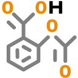

# PK-Sim Compounds: Definition and Work Flows

A **Compound** is a set of data that describes the properties of the substance whose behavior is to be simulated. These properties are defined within the building block **Compound**. For each project, several compounds may be defined. The compounds defined can be saved as a templates and then be shared among several projects and users.

## Definition of new Compounds in PK- Sim®‌

To create a new compound, do one of the following:

- Click on **Compound**  in the **Create New Building Blocks** Group of the Modeling & Simulation Tab

- Right mouse click on **Compounds** in the **Building Block Explorer** and select  **Add Compound...**

- Use the short cut **Ctrl+Alt+C**

A dialog will open, where the properties of the compound can be defined. The compound is initialized by giving it a **Name** in the respective input field. The name is used to identify the substance when its parameters are saved in the project and/or as a template. The properties of the compound can then be set or changed:

The **Create Compound** building block is subdivided into three tabs: Basic Physico-chemistry, ADME Properties, and Advanced Properties.

### Basic Physico-Chemistry‌

The first checkbox one can define the compound as being a small or a large molecule, such as a protein. If **Is small molecule** is de-selected, the permeability for passive diffusion into blood cells and into the intracellular space of the organs as well as the intestinal permeability will be set to zero. If the drug is a small molecule and is used in a **Model for proteins and large molecules**, the drug will not enter the endosomal space (see [Modeling of Proteins](../part-1/modeling-concepts-modeling-of-proteins.md)).

The basic physico-chemical properties have to be specified in the **Basic Physico-chemistry** tab. Drug properties in many cases, have numerous values, determined using various methods or assays, the following are available (logMA, logP, clogP for lipophilicity). You are able to specify several alternative values. Later, in the simulation, you can choose the most appropriate value from the list.

### To Enter an additional value:

1.  Click **Add**  at the end of a row.

2.  Enter the alternative name

3.  If desired, enter a short description in the respective input field

4.  Click **OK** 

### To delete a value:

1.  Click **Delete** 

2.  Click **Yes**

If several alternative values have been defined, you can select a default one by ticking the check box. When setting up the simulation, a value set as default will be ranked first. The alternative values can still be selected, if desired.


Please note that a value set as default cannot be deleted. In order to delete the value, define another default value.


**Lipophilicity**


As lipophilicity input, the partition coefficient between lipid membranes and water, i.e. the membrane affinity (logMA) is recommended. Alternatively, other lipophilicity values (e.g. logP, clogP) can be used, but in this case the quality of the simulation results might be affected. The type of lipophilicity measurement can be described in the first column (experiment).



Lipids in organ tissue are predominantly present in the form of phospholipid membranes. The best descriptor for lipophilicity is the partition coefficient between lipid membranes and water, as determined at physiological pH \[[43](../references.md#43)\]. This is called membrane affinity and the value to be entered is the logMA. It is recommended to use these membrane affinities as input parameters for PK-Sim®. With their use, it is very likely that specific organ and intestinal permeability coefficients are obtained that require no or only marginal adjustment.



If the membrane affinity is not available, other lipophilicity values can be used as surrogates. The membrane/water partition coefficient is predominantly affected by two contributions. A real lipophilicity, which describes the partitioning into the lipid core of a membrane, and the interaction between a molecule and the phospholipid head groups. Particularly for charged substances this can lead to large differences between membrane affinity and other lipophilicity descriptors. A common observation is that membrane affinity is much less pH dependent than e.g. logD \[[21](../references.md#21)\].

For this reason it is recommended to use a lipophilicity value for the neutral form, e.g. logP, as a replacement for membrane affinity if membrane affinity is not available. A reasonable variation around the logP value should be allowed since this parameter is not 1:1 correlated with membrane affinity.


**Fraction Unbound (plasma, reference value)**

The free fraction of drug in plasma (fu) is a mixed parameter depending on both the species and the drug. Thus, it might be necessary to define several values for one compound, namely one for each species to be simulated. The respective species can be selected in the **Species** column from the drop-down menu.

Later, during the create simulation process, the appropriate value can be selected from the alternatives defined here.

In the uppermost row of this field the user is asked to decide whether the drug is predominantly bound to either **albumin** or **alpha1-acid glycoprotein**. Depending on the predominant binding partner in plasma, the corresponding ontogeny function underlying PK-Sim® will be used for scaling the plasma protein binding in children. If this information is not available or needed, you can also select **unknown** and the reference value selected in the simulation will be used irrespective of the age of the individual.

In order to modify the fraction unbound as a function of disease please use the **Plasma protein scale factor** defined in the **Individual building block**. With the help of this factor, the fraction of drug bound to either protein can be scaled up or down. The resulting fraction unbound parameter used in the simulation can be found in the list of parameters of the **Simulation** under the header **Distribution**.


If the fraction unbound is known for one species, e.g. rat, but unknown for another one, e.g. the dog, it is technically possible to simulate pharmacokinetics in the dog using the fraction unbound defined for the rat. In other words, PK-Sim® does not judge the consistence of the combination of the species and the fraction unbound. However, in this case the value should only be considered as a best guess and a reasonable variation around the fu values should be allowed.

Similarly, for the scaling of pharmacokinetics from one species to another, make sure that not only the building block **Individual** is replaced but also mixed parameters such as fraction unbound in plasma and clearance pathways and/or expression data are changed appropriately.


**Molweight**

In the first line the molecular weight (MW) of the substance is specified. For substances containing halogen atoms the number of these atoms should chosen from the drop down menu that can be opened next to the **Has Halogens** field. This input is used to calculate an effective molecular weight, which is needed to estimate permeability values. It takes into account the small contribution of halogens to the molecular volume in relation to their weight. After the nature and number of halogens have been entered, the effective molecular weight is calculated automatically.


Even though the property determining the diffusion coefficient is the molecular volume rather than the weight, only the latter is commonly available and has therefore been chosen as easily accessible input parameter. However, in some cases this leads to inaccurate results, particularly since halogen atoms have a much smaller volume than what would be expected from their weight. Therefore, for substances containing such atoms “effective molecular weights” based on the following corrections are used (N = number of atoms, CF = correction factor):
**Effective Molecular Weight**

with CF = 17 for fluorine, CF = 22 for chloride, CF = 62 for bromine, and CF = 98 for iodine (see \[[93](../references.md#93)\]).


**Compound type / pka**

The type of compound: neutral, base, or acid. In case the compound is a base or an acid choose either **Base** or **Acid** from the drop-down menu. You will then be able to specify the respective pka(s). Up to three pka values can be specified.


pka values always refer to the pka value of the acidic form of the compound. The compound type defines whether the pka value refers to the uncharged acid "HA" (= type acid; the compound is charged when it dissociates to H+ and A-) or to the conjugated acid of a base "BH+" (= type base; the compound is uncharged when it dissociates to H+ und B). In other words, the compound type always refers to the uncharged form of the molecule.



The pka values are used for the calculation of pH-dependent changes in solubility in the gastrointestinal tract. Furthermore, when using the distribution model (see [Creating new simulations in PK-Sim®](pk-sim-simulations.md#creating-new-simulations-in-pk-sim)) of Rodgers and Rowland or the model of Schmitt the compound type is a basic parameter for calculating the partition coefficients. It is furthermore used by the two charge-dependent methods of Schmitt to calculate the permeability of the barrier between interstitial and cellular space.


**Solubility**

The solubility of the compound (in the intestine): The solubility can be specified together with the type of measurement or the medium used (first column, **Experiment**). The corresponding unit can be chosen from the drop-down menu in the second column (**Solubility at Ref-pH**). For charged compounds, the pH value at which the solubility of the compound was measured should be given in the third column (**Ref-pH**). In the fourth column, the **Solubility gain per charge** can be modified, which defines the factor by which the solubility increases with each ionization step. In order to calculate the charge of the molecule, the fraction of each microspecies is calculated according to the Henderson-Hasselbalch equation for a given pH. This is done across the entire pH-range such that the fractions are used to calculate the probability with which a molecule is in a certain ionization state. Based on this information, the **pH-dependent solubility** of molecules with one or more ionizable groups is calculated. By clicking on **Show Graph**, the pH-dependent solubility across the whole pH range calculated based on the experimental solubility at the defined pH is shown. For neutral compounds the input fields **Ref-pH** and **Solubility gain per charge** and the graph are irrelevant.


In the simulation, the intestinal solubility can be displayed for each segment based on the inputs made here and the pH values in the gastro-intestinal tract of the individual used in the simulation.



The solubility of the compound is only needed for the oral administration route. Additionally, it can be taken into account if e.g. a Noyes-Whitney dissolution is assumed for other routes of administration such as intramuscular or subcutaneous drug administration. However, for this purpose, the dissolution function has to be defined in MoBi®.



First estimates can be made using water solubility. However, especially for lipophilic compounds this value might underestimate the solubility in the intestine so that it is better to use a value obtained under bio-relevant conditions (e.g. in Fasted State Simulated Intestinal Fluid, FaSSIF). If different values are available for one compound (e.g. in FaSSIF and in Fed State Simulated Intestinal Fluid, FeSSIF), several alternative solubility values can specified and the appropriate value can then chosen in the **Simulation**.


#### Intestinal solubility as table function of pH
Intestinal solubility can also be defined as a linear interpolation of measured (pH, Solubility) data pairs.

 ==>  

### ADME Properties‌

After having defined the basic physico-chemical properties of the compound, processes known to be involved in its distribution and elimination can be specified in the **ADME** tab. The **ADME** tab is accessible either by clicking Next or by directly clicking on the respective tab in the **Create Compound** window.

Five kinds of processes can be defined in the ADME tab depending on the type of interaction between the compound and the biological entity influencing the pharmacokinetics of the drug in vivo:

- Absorption

- Distribution

- Metabolism

- Transport & Excretion

- Inhibition

- Induction

For each of these items one or more ADME processes can be defined in order to systematically collect all available information on absorption, degradation, transport and binding processes from e.g. _in vitro_ assays and use this information to obtain specific kinetic rates used in the simulation.

A general workflow for defining a specific process in _Protein Binding Partners_, _Metabolizing Enzymes_, _Total Hepatic Clearances_, _Transport Proteins_, _Renal Clearances_, _Biliary Clearances_ is as follows:

- Right click on the biological process you want to add to (e.g. **Metabolizing Enzymes** in the **Metabolism** branch, **Renal Clearances** in the **Transport & Excretion** branch, …).

- Click on the **Add …** command (e.g. **Add Metabolizing Enzyme …**).

- Enter a name for the biological process you want to add.

- Enter a name for the data source (e.g. in vitro assay, literature, laboratory results).

- Select the process type from the list.

- Enter the required input parameters (see tables below for an overview of the input parameters for each process type).

- If physiological parameters are based on in vivo measurements, e.g. the intrinsic clearance, the respective species used in the experiment has to be selected.

- Click **OK**.

After definition of the required parameters the specific clearance or kinetic rate constant used in the simulation is automatically calculated taking into account the parameters listed under **Calculation parameters**.


Specifying a value for **Specific clearance**, which is normally calculated automatically by PK-Sim®, will overwrite the original formula. This is indicated by the symbol . The formula can be reset by clicking on 


After having defined the biological properties of the compound, you will have to link specific processes to enzymatic, transport, and binding settings defined for the selected individual/species in the Simulation. This is described in [Select relevant biological processes](pk-sim-simulations.md#select-relevant-biological-processes).

In the following an overview of the process types is given that can be defined for the different biological properties including additional information on the required input parameters.

#### Absorption

##### Calculation of Specific Intestinal Permeabilities

Within the PK-Sim® standard package, transcellular specific permeability of the intestinal wall is deduced from physico-chemical properties.

In addition to the calculated specific intestinal permeability, experimentally determined permeabilities, e.g. from Caco-2-cell permeability assays can be used. However, due to the large inter-laboratory variability in Caco-2 permeations, a proper calibration of the measured in vitro values and the calculated in silico permeabilities for a defined set of compounds is necessary. If experimentally determined values for intestinal permeabilities are available and the customized calibration method has been implemented in PK-Sim®, this option is then available in the drop-down menu in the _Calculation methods_ window.

##### Specific Intestinal Permeability

Similarly, the specific intestinal permeability, i.e. the surface area-normalized transcellular permeability of the innermost layer of the intestinal wall, is calculated from the drugs´ lipophilicity and effective molecular weight. The paracellular pathway has been shown to have no impact on the accuracy of prediction of the fraction dose absorbed in humans \[[79](../references.md#79)\] and is therefore not accounted for, i.e. the value for the paracellular specific permeability is not automatically calculated. However, the paracellular pathway can be included in the simulation, if desired. You will find the parameter **Intestinal permeability (paracellular)** in the simulation within the parameter group **Permeability**.

For acids and bases, the transcellular intestinal permeability can be dynamically calculated throughout the intestinal tract based on the pH within the intestinal segments. Per default it is assumed that the pH-effect on the intestinal permeability is already reflected by the measured membrane affinity used as input and thus, the specific transcellular permeability is constant over the whole intestine. However, this parameter can be adjusted manually, if desired. You will find the parameter **Use pH- and pKa-dependent penalty factor for charged molecule fraction** in the simulation within the parameter group **Permeability**.

In case more than one lipophilicity value has been specified all corresponding permeability values calculated are displayed in the drop down list that opens if you click on **Show Values**. Later, in the **Simulation**, you can select which lipophilicity value is to be used for the calculation of the specific intestinal permeability or you can select the manually entered specific intestinal permeability. It is possible to use experimentally determined intestinal permeabilities, e.g. taken from Caco2- cell permeation experiments, as input instead of the calculated permeabilities.


In contrast to the procedure for permeability of organ membranes, the relation between intestinal permeability and the molecular properties of the compound was generated using experimental fraction of dose absorbed values. It was optimized to provide the best prediction of total fraction absorbed (for details see \[[79](../references.md#79)\]).



In the simulation parameters, the calculated specific intestinal permeability (transcellular) cannot be modified under the compound properties of the simulation. The appropriate simulation parameter can be found under the tree header "permeability". Please note that if the (calculated or manually entered) intestinal permeability (transcellular) is modified in the simulation, the permeability between the intracellular and interstitial space within the mucosa (`P (intracellular -> interstitial)`) will also automatically be scaled by the same factor. Otherwise, a disproportion between in the permeability of the apical and basolateral side of the enterocytes could be produced, leading to an accumulation of drug in the enterocytes. Likewise, a factor between the calculated intestinal permeability (transcellular) and an optional manual entry will be calculated to scale the permeability of the basolateral side of the enterocytes (`P (intracellular -> interstitial)`) appropriately.



If experimental values for intestinal permeability are available, e.g. from Caco2-cell permeability assays, a calibration of these _in vitro_ values has to be performed for a defined set of compounds before they can be used as input parameters. This is due to the high inter-laboratory variability in absolute permeability values. In this calibration the fractions of dose absorbed of the set of substances are correlated with the measured permeabilities. For new compounds, the corresponding intestinal permeability used in PK- Sim® is automatically calculated based on the Caco2 permeability value input. If you require an expert calibration of a defined set of experimentally determined permeabilities derived from _in vitro_ assays, please contact your PK-Sim® support (http://forum.open-systems-pharmacology.org/).


#### Distribution

##### Partition coefficient calculation methods‌

Two parameters determine the rate and extent of passive distribution in the body: steady state organ-plasma partition coefficients as well as permeability surface area (PxSA) products of each organ.

The partition coefficients are calculated from the physico-chemical data of the compound currently active in the simulation.

**How are model parameters predicted in PK-Sim®?**

PBPK modeling requires many substance-specific parameters, which are usually unknown and rarely accessible directly. These include the organ/plasma partition coefficients, the permeability surface area products and intrinsic clearances. The difficulty in gathering this type of data is one of the major reasons that prevented a more widespread use of PBPK-modeling in the past. PK-Sim® addresses and solves this issue by including several published and proprietary methods for parameter deduction from physico-chemical data, which are easily experimentally accessible and are, in most cases, frequently determined during the course of drug development.

**How are organ/plasma partition coefficients deduced from physico-chemical parameters?**

Organ/plasma partition coefficients are based on the concept of partition coefficients between drug binding tissue constituents and water. These include lipid/water and protein/water partition coefficients. Several similar concepts for utilizing such partition coefficients and the composition of organ tissue to calculate the organ/plasma partition coefficients have been published recently (see \[[53](../references.md#53)\],and \[[86](../references.md#86)\]b for examples, an overview is given in \[[32](../references.md#32)\]). Even though the idea is very similar in all cases, they deviate in the kind of parameters that they use. In PK-Sim® there are five ways to calculate the partition coefficients for the organs: The PK-Sim® standard model, which is described in more detail below, and the approaches developed by Rodgers & Rowland, Schmitt, Poulin & Theil, and Berezhkovskiy. The mechanistic equations for the different models are found in the respective literature (\[[53](../references.md#53)\], \[[59](../references.md#59)\], \[[62](../references.md#62)\], \[[60](../references.md#60)\], \[[61](../references.md#61)\], \[[68](../references.md#68)\], \[[54](../references.md#54)\], \[[55](../references.md#55)\], \[[52](../references.md#52)\], \[[5](../references.md#5)\]). In the PK-Sim® standard model the partition coefficients are calculated using the following equation:

with  = volume fraction of water, lipid and protein,
 = lipid/water partition coefficient,

 = protein/water partition coefficient,

 = free fraction in plasma.

Partition coefficients are derived from input data as follows:

 The value entered as Lipophilicity is directly used.

 Calculated from **Lipophilicity** using a correlation determined experimentally by measuring the unspecific binding to different tissue protein fraction of various organs for a large set of diverse compounds.

Drug partitioning between plasma and red blood cells is calculated in analogous manner to 

The only exceptions are the Schmitt model that additionally takes into account the amount of acidic and neutral phospholipids as well as neutral lipids, and the Rodgers & Rowland model, if experimental data for blood-to-plasma concentration ratios (B:P) are available.

The equation for the calculation of Krbc in the Schmitt partition model is:

If a value for B:P is used in the Rodgers & Rowland model, Krbc is calculated as follows:

where HCT is the hematocrit and BPratio is the blood-to-plasma concentration ratio.

Five different methods for the calculation of organ-plasma partition coefficients are available in PK-Sim®. No general rules have emerged to determine which distribution model is best suited based on knowledge about the substance properties. However, some trends are contained within the different model foundations and assumptions as outlined below:

| Partition coefficient calculation method | Description                                                                                                                                                                                                                                                                                                                                                                                                                                                                                                                                                                                                                                                                                                                                                                                                                                                                                                                                                 |
| ---------------------------------------- | ----------------------------------------------------------------------------------------------------------------------------------------------------------------------------------------------------------------------------------------------------------------------------------------------------------------------------------------------------------------------------------------------------------------------------------------------------------------------------------------------------------------------------------------------------------------------------------------------------------------------------------------------------------------------------------------------------------------------------------------------------------------------------------------------------------------------------------------------------------------------------------------------------------------------------------------------------------- |
| PK-Sim® Standard (default)               | The relevant compound parameters are lipophilicity and binding to plasma proteins. As lipophilicity measure, the membrane affinity (partition coefficient between water and an artificial membrane bilayer) is preferred in this model. The subcompartments of tissue and blood or plasma are assumed to consist of lipids, proteins, and water. Therefore the respective volume fractions as well as lipid/water (Klipid) and protein/ water (Kprotein) partition coefficients of the compound are considered.                                                                                                                                                                                                                                                                                                                                                                                                                                             |
| Rodgers & Rowland                        | In contrast to the previous models this approach explicitly considers electrostatic interactions between ionized compounds (e.g. moderate-to-strong bases) and anionic phospholipids at physiological pH. It also considers interactions with intracellular neutral phospholipids and neutral lipids. Two additional input parameters are therefore necessary for the calculation of partition coefficients: the blood to plasma concentration ratios BPratio, as a measure for electrostatic interactions of drugs with acidic phospholipids, and the vegetable oil-water partition coefficient (Dvo:w) which is a better surrogate than the octanol-water partition coefficient (Po:w) for neutral lipid \[[59](../references.md#59)\], \[[62](../references.md#62)\], \[[60](../references.md#60)\], \[[61](../references.md#61)\].                                                                                                                       |
| Schmitt                                  | This new approach offers a universally applicable method to calculate organ-plasma partition coefficients under explicit consideration of electrostatic interactions between charged molecules at physiological pH and acidic phospholipids. pH differences between different subcompartments are taken into account, which leads to different amounts of dissociated and undissociated weak acids and bases. In contrast to the Poulin & Theil model the lipid subcompartment is assumed to consist of neutral lipids, neutral phospholipids and acidic phospholipids in order to better describe partitioning into biological membranes – especially of charged drugs. For each of these membrane constituents fractional volumes based on experimental literature data were used 68.                                                                                                                                                                     |
| Poulin & Theil                           | The approach developed by Poulin and Theil considers the cell lipid subcompartment as mainly consisting of phospholipids with a lipophilicity-hydrophobicity behavior similar to a mixture of 30 % neutral lipids and 70 % water. Organ-plasma partition coefficients are then calculated using the volume fractions of the aqueous (Fw) and organic subcompartments (Fneutral lipid and Fphospholipid) of the respective organ and plasma for this distribution model (select the combobox "advanced" in Individual --> Anatomy & Physiology and go to Physiology --> Tissue and body fluid physiology --> Tissue composition). For adipose tissue vegetable oil-water partition coefficients (Dvo:w) are used as lipophilicity measures, whereas octanol- water partition coefficients (Po:w) are used for non-adipose tissue \[[53](../references.md#53)\], \[[54](../references.md#54)\], \[[55](../references.md#55)\], \[[52](../references.md#52)\]. |
| Berezhkovskiy                            | The assumptions made to describe drug partitioning into biological membranes as well as the input parameters correspond to those made in the Poulin & Theil model. However, peripheral drug elimination as well as drug exchange between compartments are considered, which leads to a modified version of the equation presented by Poulin and Theil \[[5](../references.md#5)\].                                                                                                                                                                                                                                                                                                                                                                                                                                                                                                                                                                          |

##### Cellular permeability calculation methods

The rates of permeation across the cell membranes (interstitial-cell barrier) depend on the permeability surface area (PxSA) products of each organ. The permeability values (the part of the PxSA-products that is substance-dependent) are proportional to the permeability of a phospholipid bilayer for the simulated substance. They are calculated from the physico-chemical data of the compound currently active in the simulation.

**How are permeability surface-area (PxSA) products predicted in PK-Sim®?**

As a first approximation it can be assumed that all mammalian lipid membranes have the same permeability for a given substance. Of course this it not strictly true, because permeability depends on the composition of a membrane; the types of phospholipids and the content of cholesterol influence the rates with which a substance passes through the membrane \[[24](../references.md#24)\] \[[9](../references.md#9)\]. However, within the accuracy with which it is possible to estimate permeability from compound properties, it is permissible to make this simplifying assumption. Under these presumptions the PxSA-products are composed out of a compound specific term (permeability) and a species or physiology specific term (surface area).

Because it is difficult to determine PxSA-products or their two components explicitly, the calculation method incorporated into PK-Sim® is based on the following procedure \[[36](../references.md#36)\]:

First, PxSA-products were previously determined by fitting simulations to experimental concentration-time curves for the different organs. Secondly, such pinned values are scaled by the organ volume to take the change of surface area, e.g. from species to species, into account. Furthermore, it is assumed that permeability is proportional to the partition coefficient and the diffusion coefficient, the latter of which depends on lipophilicity and molecular size for lipid membranes. This means, that permeability can be scaled with lipophilicity and molecular volume relative to given values. This is done in PK-Sim® using the values derived from the fit described above and dependencies which rely on published and proprietary knowledge.

There are three different methods available in PK-Sim® to calculate the permeability parameters for the barriers between interstitial space and intracellular space which can be chosen from the drop-down menu:

| Permeability parameters calculation method  | Description                                                                                                                                                                                                                                                                                                                                                                                                                                                                                                                                                                                                                                                                                                                                                                                                                                           |
| ------------------------------------------- | ----------------------------------------------------------------------------------------------------------------------------------------------------------------------------------------------------------------------------------------------------------------------------------------------------------------------------------------------------------------------------------------------------------------------------------------------------------------------------------------------------------------------------------------------------------------------------------------------------------------------------------------------------------------------------------------------------------------------------------------------------------------------------------------------------------------------------------------------------- |
| PK-Sim® Standard (default)                  | With the method PK-Sim® Standard, the permeability parameters are calculated from the physico-chemical properties given in the Compound Data Window. The degree of dissociation of acids and bases is not taken into account. It is assumed that this value is the same in all organs and species and that differences originate only from size-dependent surface areas.                                                                                                                                                                                                                                                                                                                                                                                                                                                                              |
| Charge dependent Schmitt                    | With this method, the degree of dissociation of acids and bases is taken into account assuming that the permeabilities for charged species are significantly smaller than for neutral species. The degree of dissociation is calculated from the pKa-values given for the **Compound** and the pH-values of the interstitial and intracellular spaces given. The permeabilities calculated with the method PK-Sim® Standard P0 are modified by a factor f(pKa- values, pH-value) accounting for the fractions of neutral/charged species:  Since the pH-values of the interstitial and intracellular space differ for some organs, the permeability in the direction interstitial space -> intracellular space can differ from the permeability in the direction intracellular -> interstitial space. |
| Charge dependent Schmitt normalized PK-Sim® | This method calculates the permeabilities in a similar way as dependent the method Charge Dependent Schmitt with the difference, that Schmitt the permeabilities are normalized to obtain the values calculated normalized to with the method PK-Sim® Standard:   Thus, the permeability in the direction interstitial -> intracellular is the same as calculated with the method PK-Sim® Standard while the ratio of the permeabilities in the two directions is the same as calculated with the method Charge Dependent Schmitt.                                                                                                                                                                                                                                                                    |

##### Specific organ permeability

The specific organ permeability, i.e. the organ permeability normalized to the surface area, represents the part of the permeability times surface area (PxSA)- products that is substance-dependent and they are proportional to the permeability of a phospholipid bilayer for the simulated substance. They are calculated from the physico-chemical data of the compound, namely the lipophilicity and the effective molecular weight. If different lipophilicity values have been specified several permeability values based on these alternative values are displayed in the drop down list that opens if you click on **Show Values**. If available, further permeability values can be entered manually. You can later chose the lipophilicity value that is to be used in the **Simulation** from the values specified here.


As a first approximation it can be assumed that all mammalian lipid membranes have the same permeability for a given substance. Of course, this is not exactly true because organ permeability depends on the composition of the membrane. The types of phospholipids and the content of cholesterol influence the rates with which a substance passes through the membrane \[[24](../references.md#24)\] \[[9](../references.md#)\]. However, within the accuracy with which it is possible to estimate the permeability from compound properties, it is permissible to make this simplifying assumption. Under these presumptions, the organ PxSA-products are composed out of a compound specific term (permeability) and a species or physiology specific term (surface area).



Because it is difficult to determine PxSA-products or their two components explicitly, the calculation method incorporated in PK- Sim® is based on the following procedure \[[36](../references.md#36)\]:

First, PxSA-products were previously determined by fitting simulations to experimental concentration-time curves for the different organs. Second, such pinned values are scaled by the organ volume to take the change of surface area, e.g. from species to species, into account. Furthermore, it is assumed that permeability is proportional to the partition and diffusion coefficient, the latter of which depends on the lipophilicity and molecular size for lipid membranes. This means that permeability can be scaled with lipophilicity and molecular volume relative to given values. This is done in PK-Sim® using the values derived from the fit described above and dependencies which rely on published and proprietary knowledge.


##### Specific Binding

Distribution of a compound is also influenced by specific binding to proteins either in plasma, interstitial or intracellular space. It is possible to define such specific protein binding processes in the **Specific Binding/Protein Binding**

Partners branch. When setting up a simulation the binding partner defined in the Compound Building Block has to be linked to the protein defined in the Individual Building Block as binding partner.

Protein Binding Partners

| Process Type     | Description                                                                                                                                     | Necessary Input Parameter                   |
| ---------------- | ----------------------------------------------------------------------------------------------------------------------------------------------- | ------------------------------------------- |
| Specific Binding | If experimental data on binding of the compound to specific protein binding partners are available, these values also suit as input parameters. |  |


Sometimes enzymes that catalyze a metabolic degradation process can also bind the compound at a binding site different to the catalytically active center. It is therefore possible to link an enzyme defined in the individual/species to both a metabolic and a binding process when setting up a simulation.


### Metabolism

Depending on the available experimental information you can either define process types in the **Metabolizing Enzymes** branch or the **Total Hepatic Clearance** branch. Please note that the calculation sheet offered for metabolizing enzymes refers to the liver in case of intrinsic clearance processes and in all other cases to the organ in which the respective enzyme is expressed. Using this calculation sheet, input values will be transferred to specific clearance values which are then used in the simulation. The sheet is only meant to help the user with the calculations. However, processes defined here may also be applied to other organs given that relevant expression levels are appropriately defined in the individual.

##### Metabolizing Enzymes

| Process Type                                                                           | Description                                                                                                                                                                                                                                                                                                                                                                                                                                                                                                                                                                                                                                                          | Required Input Parameters                                                                                                                                                                          |
| -------------------------------------------------------------------------------------- | -------------------------------------------------------------------------------------------------------------------------------------------------------------------------------------------------------------------------------------------------------------------------------------------------------------------------------------------------------------------------------------------------------------------------------------------------------------------------------------------------------------------------------------------------------------------------------------------------------------------------------------------------------------------- | -------------------------------------------------------------------------------------------------------------------------------------------------------------------------------------------------- |
| Intrinsic clearance – First order                                                      | A first order degradation process catalyzed by intracellular enzymesis defined in the liver. The input parameters are intrinsic clearance values which are either estimated orscaled from in vitro data. The specific clearance used in the simulation is obtained by scaling the intrinsic clearance value from liver cells to the whole organ using the following calculation parameters: • Volume (liver) • Fraction intracellular (liver)                                                                                                                                                                                                                   | Intrinsic clearance(measured with liver cells or fitted); Volume(liver); Fraction intracellular (liver)                                                                                            |
| Intrinsic clearance – Michaelis-Menten                                                 | It is also possible to define a Michaelis-Menten type saturable kinetics process for intrinsic clearance. The input parameters are Km and Vmax (referring to liver tissue, e.g. liver slices or perfused liver) which were either estimated or scaled from in vitro data.  The specific Vmax value used in the simulation (referring to the cellular volume) is scaled from the Vmax in liver tissue using the following calculation parameters: • Fraction interstitial (liver) • Fraction intracellular (liver) The default value for Km is 1 μmol/l. Itmay be changed manually.                                                                        | Km; Vmax(measured with liver tissue or fitted); Fraction interstitial (liver);Fraction intracellular (liver)                                                                                       |
| In vitro clearance – First order                                                       | By explicitly defining specific clearance values referring to the cellular volume (either estimated or scaled from in vitro data) and the corresponding enzyme concentration a specific clearance value normalized to the enzyme concentration is calculated automatically.  The default value for enzyme concentration is 1 μmol/l. It may be changed manually.                                                                                                                                                                                                                                                                                                     | Enzyme concentration; Specific clearance(measured with cellular in vitrosystem or fitted)                                                                                                          |
| In vitro clearance – Michaelis-Menten                                                  | You can also explicitly define specific Vmax values referring to the cellular volume (either estimated or scaled fromin vitro data) to implement a Michaelis-Menten type saturable kinetics process.This value is then used to calculate kcatby normalizing the specific Vmax value to the respective enzyme concentration.  The default value for Km and the enzyme concentration is 1 μmol/l. It may be changed manually.                                                                                                                                                                                                                                        | Vmax; Km(measured withcellular in vitrosystem or fitted)                                                                                                                                           |
| In vitro clearance – Hill                                                              | Metabolic enzyme activity is described as saturable process displaying a cooperativity, which is characterized by the Hill equation. The corresponding kcat value is calculated from Vmax determined in an in vitro assay.                                                                                                                                                                                                                                                                                                                                                                                                                                            | Enzyme concentration; Vmax; Km; Hill coefficient(measured with cellular in vitro system or fitted)                                                                                                 |
| In vitro metabolic rate in the presence of recombinant CYPs/enzymes – First Order      | Some in vitro assays use recombinant CYP enzymes to determine in vitro clearance values. These can be used as input for PK-Sim® after correction for the enzyme concentration in the assay when implementing a firstorder degradation process. Differences in intrinsic activity (per unit CYP)between rhCYP and human liver enzymes complicate the issue \[[63](../references.md#63)\], \[[56](../references.md#56)\]. Therefore, an intersystem extrapolating factor (ISEF), which is a dimensionless number used as a direct scaler to convert data obtained with a rhCYP system to the "HLM environment" may be used.This factor has to be calculated by the user. | In vitro clearance / concentration of recombinant enzyme; Intersystem extrapolating factor (ISEF)                                                                                                  |
| In vitro metabolic rate in the presence of recombinant CYPs/enzymes – Michaelis-Menten | If Km and Vmax values for a saturable kinetics process were determined experimentally using recombinant CYP enzymes, Km can be directly used as for PK-Sim® where as Vmax has to be normalized to the enzyme concentration in the assay. Differences in intrinsic activity (per unit CYP) between rhCYP and human liver enzymes complicate the issue \[[63](../references.md#63)\], \[[56](../references.md#56)\]. Therefore, an intersystem extrapolating factor (ISEF),which is a dimension less number used as a direct scaler to convert data obtained with a rhCYP system to the "HLM environment" may be used.                                                  | In vitro Vmax /concentration of the recombinant enzyme; Km; Intersystem extrapolating factor (ISEF)                                                                                                |
| In vitro metabolic rate in the presence of liver microsomes – First Order              | In vitro clearance values obtained from microsome assays can be used as input parameters for definition of a first order metabolization process. If the clearance values are normalized to the amount of microsomal protein present in the assay they can be used without further modification.The in vitro clearance value is scaled to an in vivo specific clearance value using the content of CYP proteins in liver microsomes. The default value is 108 pmol/mg microsomal protein which is the CYP3A4 protein content in liver microsomes (see note under thetable). Please change this value if other enzymes were defined.                                   | In vitro clearance for liver microsomes; Content of CYP proteins in liver microsomes from literature (e.g. \[[63](../references.md#63)\],\[[64](../references.md#64)\]) or measured experimentally |
| In vitro metabolic rate in the presence of liver microsomes – Michaelis-Menten         | For the definition of a saturable Michaelis-Menten like kinetics process in vitro Vmax values normalized to the enzyme concentration in the microsomal assay can be used as input parameter.  The in vitro Vmax value is then scaled to an in vivo Vmax value using the content of CYP proteins in liver microsomes. The default value is 108 pmol/mg microsomal protein which is the CYP3A4 protein content in liver microsomes (see note under the table). Please change this value if other enzymes were defined.                                                                                                                                              | In vitro Vmax for liver microsomes; Content of CYP proteins in liver microsomes from literature (e.g. \[[63](../references.md#63)\], \[[64](../references.md#64)\]) or measured experimentally; Km |


For calculation of in vivo clearance or Vmax values from _in vitro_ values obtained from microsomal assays the content of the CYP enzyme defined as the process type has to be specified. The default value in PK-Sim® is 108 pmol/mg microsomal protein which is the CYP3A4 protein content in liver microsomes \[[63](../references.md#63)\]. CYP enzyme contents in liver microsomes from this reference are shown when you move the mouse over the parameter Content of CYP proteins in liver microsomes. If you have defined other than these CYP enzymes, please insert the corresponding value in PK-Sim®.


##### Total Hepatic Clearance

| Process Type                                  | Description                                                                                                                                                                                                                                                                                                                                                                                                                                                                                                                                                                                                                                                                 | Necessary Input Parameter                                                                                                                                                                         |
| --------------------------------------------- | --------------------------------------------------------------------------------------------------------------------------------------------------------------------------------------------------------------------------------------------------------------------------------------------------------------------------------------------------------------------------------------------------------------------------------------------------------------------------------------------------------------------------------------------------------------------------------------------------------------------------------------------------------------------------- | ------------------------------------------------------------------------------------------------------------------------------------------------------------------------------------------------- |
| Liver Plasma Clearance                        | If you have experimental plasma clearance values you can use them by choosing this process type. The specific clearance used in the simulation is then automatically calculated on the basis of the following parameters:  • Body weight  • Volume (liver)  • Hematocrit  • Blood flow rate (liver)  • Blood flow rate (portal vein)  • Fraction intracellular (liver)  • Blood/Plasma concentration ratio  • Fraction unbound in plasma  • Plasma clearance  • Lipophilicity  The default value for fraction unbound (experiment) is 0.5 in PK-Sim®. Please change this parameter if you have experimental data for the fraction unbound. | Fraction unbound (plasma); Plasma clearance; all parameters listed in the left column (if not entered, default values as specified in the Compound building block for the given species are used) |
| In vitro hepatocytes – t1/2                   | You can also directly use t1/2 values from hepatocyte assays. The specific clearance used in the simulation is then automatically calculated considering the following parameters:  • Number of cells/g liver tissue  • Number of cell/incubation  • Fraction intracellular (liver)  • Fraction unbound (assay)  • t1/2 (assay)  The default value for fraction unbound (assay) is 0.1 in PK-Sim®. Please change this parameter if you have experimental data for the fraction unbound.                                                                                                                                                                   | Number of cell/incubation; Fraction unbound (assay); t1/2 (assay)                                                                                                                                 |
| In vitro hepatocytes – residual fraction      | If hepatocyte assay data with residual fractions are available, please specify these values in this process type. The specific clearance used in the simulation is then automatically calculated on the basis of the following parameters:  • Number of cells/g liver tissue  • Fraction intracellular (liver)  • Fraction unbound (assay)  • Measuring time  • Residual fraction The default value for fraction unbound (assay) is 0.1 in PK-Sim®. Please change this parameter if you have experimental data for the fraction unbound.                                                                                                                      | Number of cell / incubation; Fraction unbound (assay); Measuring time; Residual fraction                                                                                                          |
| In vitro liver microsomes – t1/2              | t1/2 values from microsomal assays can be used as input parameters to calculate specific liver clearances. Scaling of the in vitro value is done using the following parameters:  • Microsomal protein mass/g liver  • Amount of protein in the incubation  • Fraction intracellular (liver)  • Fraction unbound (assay)  • t1/2 (microsomal assay) The value for fraction unbound (assay) is calculated in PK-Sim® using the lipophilicity of the compound and the amount of protein in incubation. Please change this parameter if you have experimental data for the fraction unbound.                                                                    | Amount protein/incubation; Fraction unbound (assay); Measuring time; t1/2 (microsomal assay)                                                                                                      |
| In vitro liver microsomes – residual fraction | Residual fractions obtained from liver microsome assays may also serve as input parameters. The value for the specific liver clearance is then calculated using the following parameters:  • Microsomal protein mass/g liver  • Amount protein/incubation  • Fraction intracellular (liver)  • Fraction unbound (assay)  • Measuring time  • Residual fraction  The value for fraction unbound (assay) is calculated in PK-Sim® using the lipophilicity of the compound and the amount of protein in incubation. Please change this parameter if you have experimental data for the fraction unbound.                                                  | Amount protein/incubation; Fraction unbound (assay); Measuring time; Residual fraction                                                                                                            |


Total hepatic clearance is a systemic process that does not have to be linked to properties defined in an individual/species when generating a simulation.


#### Transport & Excretion

Drug transport across endothelial, epithelial or cellular barriers is responsible for distribution and renal or biliary elimination of a compound. Different experimental approaches are available either to determine rate constants or organ clearances. Depending on the experimental data available you can define different process types for your compound in the **Transport Proteins** branch, the **Renal Clearances** branch or the **Biliary Clearance** branch.

##### Transport Proteins

| Process Type                                                   | Description                                                                                                                                                                                                                                                                                                                                                                                                                                                                                  | Necessary Input Parameter                                                          |
| -------------------------------------------------------------- | -------------------------------------------------------------------------------------------------------------------------------------------------------------------------------------------------------------------------------------------------------------------------------------------------------------------------------------------------------------------------------------------------------------------------------------------------------------------------------------------- | ---------------------------------------------------------------------------------- |
| Intrinsic active transport - Michaelis-Menten                  | A transporter-mediated unidirectional transfer of a compound across a cellular membrane is described as saturable process following the Michaelis-Menten type kinetics. The specific Vmax value used in the simulation (referring to the cellular volume) is scaled from the Vmax in liver tissue using the following calculation parameters:  • Fraction interstitial (liver)  • Fraction intracellular (liver)  The default value for Km is 1 μmol/l. It may be manually changed. | Km; Vmax (measured with liver tissue or fitted)                                    |
| Specific active transport - Michaelis-Menten                   | Here a Michaelis-Menten type saturable transport process is defined. The input parameters are Km and Vmax (either estimated or scaled from in vitro data). The kcat value used in the simulation is scaled from the input Vmax value by normalization to the transporter concentration. The default value for Km is 1 μmol/l. It may be manually changed.                                                                                                                                    | Transporter concentration; Vmax; Km (measured with liver tissue or fitted)         |
| Specific active transport - Hill                               | A transporter mediated unidirectional transfer of a compound across a cellular membrane is described as saturable process displaying a cooperativity which is characterized by the Hill equation. The corresponding kcat value is calculated from a specific Vmax as input value.                                                                                                                                                                                                            |
| In vitro active transport (vesicular assay) - Michaelis-Menten | A transporter mediated unidirectional transfer of a compound across a cellular membrane is described as saturable process following Michaelis-Menten type kinetics. The corresponding kcat value is calculated from a specific Vmax normalized to the amount of transporter as input value which was determined in a vesicular transport assay.                                                                                                                                              | In vitro Vmax / transporter; Km (measured with cellular in vitro system or fitted) |

##### Renal Clearances

| Process Type                         | Description                                                                                                                                                                                                                                                                                                                                                                                                                                                                                                                                               | Necessary Input Parameter                   |
| ------------------------------------ | --------------------------------------------------------------------------------------------------------------------------------------------------------------------------------------------------------------------------------------------------------------------------------------------------------------------------------------------------------------------------------------------------------------------------------------------------------------------------------------------------------------------------------------------------------- | ------------------------------------------- |
| Kidney Plasma Clearance              | When choosing this process type experimental values for kidney plasma clearance can be used as input parameters. The specific clearance used in the simulation is then automatically calculated on the basis of the following parameters:  • Body weight  • Volume (kidney)  • Hematocrit  • Blood flow rate (kidney)  • Fraction unbound in plasma  • Plasma clearance  The default value for fraction unbound (experiment) is 0.5 in PK-Sim®. Please change this parameter if you have experimental data for the fraction unbound. | Plasma clearance; Fraction unbound (plasma) |
| Glomerular Filtration                | Filtration fractions are used in the case that the renal clearance differs from the GFR according to the properties of the individual. Please note that for small molecules this observation indicates that the compound is either actively reabsorbed or secreted, respectively. The GFR fraction can be used as a surrogate to compensate for active re-absorption (GFR fraction <1) or secretion (GFR fraction >1). The calculation of the resulting "GFR" is done when setting up the simulation.                                                     | GFR fraction                                |
| Tubular Secretion – First Order      | For definition of a first order tubular secretion process you can use tubular secretion rates (either estimated or scaled from in vitro data). The specific tubular secretion rate is then calculated on the basis of the kidney volume.                                                                                                                                                                                                                                                                                                                  | Tubular secretion                           |
| Tubular Secretion – Michaelis-Menten | You can also define a saturable tubular secretion process by specifying Km and TSmax values (either estimated or scaled from in vitro data). The specific tubular secretion rate is then calculated taking into account the kidney volume.                                                                                                                                                                                                                                                                                                                | TSmax; Km                                   |


Kidney Plasma Clearance is a systemic process that does not have to be linked to properties defined in an individual/species in a simulation. In the case of the Glomerular Filtration, the individual/ species-dependent GFR represents a default value defined in the Individual building block.


##### Biliary Clearance

| Process Type             | Description                                                                                                                                                                                                                                                                                                                                                                                                                                                                                                                                                                                                                                                                                                                                                                                                                                                               | Necessary Input Parameter                   |
| ------------------------ | ------------------------------------------------------------------------------------------------------------------------------------------------------------------------------------------------------------------------------------------------------------------------------------------------------------------------------------------------------------------------------------------------------------------------------------------------------------------------------------------------------------------------------------------------------------------------------------------------------------------------------------------------------------------------------------------------------------------------------------------------------------------------------------------------------------------------------------------------------------------------- | ------------------------------------------- |
| Biliary Plasma Clearance | If you have experimental biliary plasma clearance data you can use them by choosing this process type. The specific clearance used in the simulation is then calculated automatically on the basis of the following parameters:  • Body weight  • Volume (liver)  • Hematocrit  • Blood flow rate (liver)  • Blood flow rate (portal vein)  • Blood/Plasma concentration ratio  • Fraction intracellular (liver)  • Fraction unbound in plasma  • Plasma clearance  The default value for fraction unbound (experiment) is 0.5 in PK-Sim®. Please change this parameter if you have experimental data for the fraction unbound. The amount secreted as bile flow is subsequently split into two fractions: The fraction of hepatic bile that flows into the gallbladder for storage and the fraction that flows straight into the duodenum. | Plasma clearance; Fraction unbound (plasma) |


Biliary clearance is systemic process that does not have to be linked to properties defined for an individual/species when establishing a simulation.


### Definition of a metabolite in an enzymatic process‌

A metabolite of a compound can be defined and used either as a "sink" or treated like any other compound. See [How to set up a parent/metabolite simulation](pk-sim-simulations.md#how-to-set-up-a-parentmetabolite-simulation) for details.

### Advanced Parameters‌

After the biological properties have been specified, further parameters can be defined in the **Advanced Parameters** tab. The **Advanced Parameters** tab can be opened either by clicking **Next** or by clicking on the **Advanced Parameters** tab.

Additional compound-related parameters can be defined here that are needed in case the particle dissolution function (see [Formulations](pk-sim-formulations.md)) or the model for proteins and large molecules (see [Modeling of Proteins](../part-1/modeling-concepts-modeling-of-proteins.md)) are used in the simulation. In all other cases, the parameters defined in the **Advanced Parameters** tab will not be used in the simulation and can be left unchanged.

**Particle dissolution**

The particle dissolution function can be used for the simulation of the dissolution process of spherical particles administered orally and represents a dissolution function of the Noyes-Whitney type that is based on particle size \[[102](../references.md#102)\].

In the **Advanced Parameters** tab the compound-related parameters needed for calculation of dissolution kinetics of spherical particles can be defined, namely:

• how the precipitated drug is treated (either as Soluble or Insoluble)

• the aqueous diffusion coefficient D

• the density of the drug in its solid form

• and the maximum size of particles that dissolves immediately

Further parameters such as the mean particle size and the particle size distribution, the number of bins and the diffusion layer thickness are considered to be related to the formulation and thus can be defined in the Formulation Building Block (see [Formulations](pk-sim-formulations.md)).

Model for proteins and large molecules

Four drug-related parameters which are used in the model for proteins and large molecules can be defined in the **Advanced Parameters** tab, namely:

• the solute radius, i.e. the hydrodynamic radius of the drug. The default value for the solute radius is estimated from the molecular weight defined in the **Basic Physico-chemistry** tab

• Kd (FcRn) in endosomal space: the dissociation constant for binding to FcRn in the acidic endosomal space. By default, this value is set to a very high value,

i.e. no binding is assumed.

- Kd (FcRn) in plasma/interstitial: the dissociation constant for binding to FcRn in plasma and the interstitial space (neutral environment). By default, this value is set to a very high value, i.e. no binding is assumed. For monoclonal antibodies the binding to FcRn in neutral environment is generally very weak or not detectable. In this case the high default value for Kd (FcRn) in plasma/ interstitial space can be kept.

- kass (FcRn): association rate constant for binding to FcRn for the acidic endosomal space as well as for plasma/interstitial space. The default value is a typical value for monoclonal antibodies and can usually be kept.

After all information about the compound properties has been entered, the **Create Compound** window can be closed by clicking **OK** . The new compound will appear in the **Building Block Explorer** view.

## Setting or Changing Compound Properties‌

To set or change the properties of an existing compound:

1.  Right mouse click on the respective compound in the **Building Block Explorer**

2.  Select  **Edit...**

or simply double click on the compound in the **Building Block Explorer**.

A window with the three tabs **Basic Physico-chemistry**, **ADME Properties** and **Advanced Parameters** will open. The properties can be set or changed appropriately. The changes can be saved by closing the window by clicking on .

## Cloning Compounds‌

To clone a compound in the project:

1.  Right mouse click on the respective compound in the **Building Block Explorer**

2.  Select **Clone...** 

3.  Enter an alternative name for the compound clone and enter a description, if desired.

4.  Confirm and close the window by clicking **OK** 

## Saving Compounds as Templates‌

For each project, several compounds can be defined. They can be saved as templates and then be shared among several projects and users.

To save an existing compound as template:

1.  Right mouse click on the respective compound in the **Building Block Explorer**

2.  Select  **Save as Template...**

In case a compound with the same name already exists, a warning appears and you have the following options:

- Override: This action will override the existing template.

- Save as: You can save the compound under a different name. In this case, you will be asked to Rename the new template.

- Cancel: This action will abort the saving process.

## Loading Existing Compounds from Templates‌

As mentioned before, the compounds defined in a project can be saved as templates and then be shared among several projects and users.

To load an existing compound from the template database:

1.  Right mouse click on **Compounds** in the **Building Block Explorer**

2.  Select  **Load From Template...**

3.  Select the desired compound from the user templates

    In case a compound with the same name already exists in the project, a warning pops up and you will have to **Rename** the compound that is to be loaded from template.

4.  Click **OK** 

The selected compound will appear in the **Building Block Explorer** view.

Compounds can also be directly loaded from the template database within a simulation.

## Deleting Compounds‌

To delete a compound from the project:

1.  Right mouse click on the respective compound in the **Building Block Explorer**

2.  Select  **Delete...**

3.  Confirm by clicking **Yes**


Please note that a compound that is used in any simulation of the project cannot be deleted.

