# PK-SIM Creating Individuals

In the building block **Individual** the properties of individuals are defined. In the database underlying PK-Sim®, anatomical and physiological information on various animal species as well as humans of different populations, gender, and age are provided. However, the algorithm differs for animals and humans:

- In case of the various **animal species**, no age-dependent distribution information for the anatomical and physiological parameters is included in the database so far. The generation of an animal of a predefined body weight thus simply is done by linear scaling of an average animal of the given species. Consequently, all organs always contribute to the same relative extent to the total body weight and differences e.g. related to growth or to different races of the respective animal species are not taken into account.

- For **humans**, the population parameters database that comes with PK-Sim® includes information on the dependence of anatomical and physiological parameters relevant for PK-Sim® such as organ weights, blood flow rates, or tissue composition on age, gender, body weight, body mass index, which have been collected in a comprehensive literature search. Thus, when creating an individual of a given **Age**, **Weight**, and **Height**, the parameters will be adjusted based on the information included in the underlying database. There are three classes of parameters that will be adjusted:

  - Organ volumes

  - Further parameters for which distribution data are available in the database, e.g. the hematocrit value.

  - The volume fractions, which are scaled using a global scale factor taken from the database


Please note that the volume of fat tissue is not optimized by the algorithm as this value is used to match the target body weight.


### Definition of new Individual in PK-Sim®‌

- Click on **Individual**  in the **Create New Building Blocks** Group of the Modeling & Simulation Tab

- Right mouse click on **Individuals** in the **Building Block Explorer** and select Add Individual...

- Use the short cut **Ctrl+Alt+I**

A dialog will pop up in which the properties of the individual can be specified. First, new individuals are initialized by giving them a **Name** in the respective input field. These names are then used to identify them when their properties are saved in the project and/or as templates. In addition, names are used for identification of individuals in the simulation. Second, the properties of individuals can be set or changed:

The **Create Individual** building block window is subdivided into three tabs: **Biometrics, Anatomy & Physiology**, and **Expression**.

#### Biometrics‌

In the first drop-down menu you can choose from the following species:

- Human 

- Monkey 

- Beagle 

- Dog 

- Minipig 

- Rat 

- Mouse 

- Rabbit 

**Human** 

If **Human**    is selected, you can select one of the following populations from the next drop-down menu:

- Asian (Tanaka, 1996) \[[74](../references.md#74)\]

- Black American (NHANES, 1997) \[[82](../references.md#82)\]

- European (ICRP, 2002) \[[84](../references.md#84)\], [[113]](../references.md#113)

- Mexican American -White (NHANES, 1997) \[[82](../references.md#82)\]

- White American (NHANES, 1997) \[[82](../references.md#82)\]

- Japanese (2015) \[[67](../references.md#67)\]

- Preterm [[111]](../references.md#111)

- Pregnant (Dallmann et al. 2017) [[107 - 110]](../references.md#107)

In the following drop-down menu, the gender is specified.

Further below, the **Individual Parameters** can be defined. In the case of the human Asian, Black American, European, Mexican American, and White American populations, the individual is characterized by the following parameters:

- Age: The age in units of year(s), month(s), week(s), or day(s).

- Weight: The body weight in units of kg or g.

- Height: The body height in units of cm or m.

By clicking on the **Mean** button, the average body weight and height of the individuals of the given population as well as gender and age will be generated based on the database information.

If as a special human population **Preterm** is selected, an additional age scale has to be taken into account. Preterm neonates are characterized by their gestational age (GA), which ranges between about 24 and 37 weeks, and their postnatal age (PNA). In the model, preterm neonates catch up growth during their first two years of life so that there are no differences in a >2 years old individual of the same race and gender born preterm or born term.


Oral administration to preterm neonates is, so far, not possible in PK- Sim®. The parameters relevant to oral administration are all set to "0" so that the fraction of dose absorbed and, in addition, the distribution of drugs into the mucosa irrespective of the administration route are disabled.



Please note that gender-specific information for all parameters except body weight and height (biometrics) was not available for preterms.Therefore, it is an assumption that for a given body weight the organ weights and blood flow rates are equal for males and females.


**Animal species**

If one of the animal species, i.e. **Monkey, Beagle, Dog, Minipig, Rat** or **Mouse** is selected, the menu items are slightly different.


Please note that PK-Sim® does currently not distinguish between male and female animals. Animal models represent an average adult animal of the species or breed.


If desired, the body weight of an animal can be changed under **Individual Parameters**. By changing the body weight of the animal, PK-Sim® automatically scales the weight of the different organs ( see **[Anatomy & Physiology](#anatomy--physiology)** tab) by keeping their relative contribution to the total body weight constant. Likewise, the organ blood flow rate will be re-calculated by keeping the organ specific blood flow rate, i.e. the blood flow rate per kg of tissue weight.


Significant breed-specific differences exist for some animal species. For example, a Beagle dog obviously has a different physique than a Labrador and the body weight of an adult Yucatan minipig doubles that of a Göttinger minipig. See below for tips to determine how each species is defined in PK-Sim®.


- For monkeys, the default values represent an average monkey with a body weight of 5.6 kg. The monkey-specific physiological parameters were derived for macaques such as rhesus and cynomolgus monkeys \[[98](../references.md#98)\].
- The default dog-specific physiological parameters were obtained from literature and represent an average dog with a weight of 13.7 kg. Breed specific differences are not taken into account. Still, for the most popular breed of dogs, the beagle, anatomical and physiological information specifically representing an adult beagle dog that weights 10.5 kg is implemented [1](../references.md#1).
- For minipigs, the default body weight is 40 kg. An important feature of the minipig is the reported delay in gastric emptying. Furthermore, emptying appears to be incomplete, so there may be food present in the stomach for 24 hours a day. The high variability in gastric pH and emptying should be taken into account, particularly when monolithic controlled release and enteric-coated dosage forms are intended to be simulated.
- For the rat-specific physiological parameters affecting oral absorption from the GI tract see \[[93](../references.md#93)\]. An important feature of this species is that the rat lacks a gallbladder. As a result, bile fluid is secreted continuously in dilute form, which has an important effect on biliary clearance and entero-hepatic circulation (see [PK-Sim® - Events](pk-sim-events.md)).
- If mouse is selected, the anatomical and physiological data are set at default values for a mouse with a mean weight of 20 g.
- For rabbits, the default body weight is 2.5 kg. For the parameter values not found in the literature, the mouse PBPK model parameters were transferred and used, as it is the closest animal species to the rabbit among the species available in the physiology database (e.g., mouse retains a gallbladder unlike the rat). [[112]](../references.md#112)
- Currently, only for mouse, monkey and human species specific values for the concentration of the FcRn receptor, the concentration of the endogenous IgG and the affinity of the endogenous IgG to the FcRn receptor (needed for the **Model for proteins and large molecules**) are available. For all other animal species, these values are taken from the monkey model.
  

Irrespective of the species chosen, the **Calculation Method** for the estimation of the surface area of the capillary endothelium has to be selected. The endothelial surface area is needed for calculation of the rate of permeation through the endothelial barrier between plasma and interstitial space, which is determined by the permeability - surface area product. The drug dependent specific organ permeability can be defined in the **Compound** building block (see [PK-Sim® - Compounds: Definition and Work Flows](pk-sim-compounds-definition-and-work-flow.md)).

Literature for capillary surface areas for the different organs and species is rather limited. Therefore, PK-Sim® provides two heuristics to estimate the capillary surface area of the organs, which can be selected from the drop-down menu

1.  **Organ vascularization (default method)**. The capillary surface area (SA) is estimated by 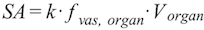 , with the constant of proportionality k, the fraction of vascular space of an organ 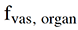, and the organ volume 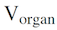. The idea behind this heuristics is the following: with the assumption that the morphology of the vascular tree is similar in each organ, the specific surface area per organ volume can be estimated by the capillary density of an organ, which in turn can be estimated by the fraction of vascular space of an organ.

2.  **Blood flow.** The capillary surface area is estimated by 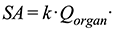 , with the constant of proportionality k, the organ blood flow Qorgan, the shape factor beta (default: beta=1). The permeability-surface area product 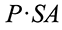 is related to the extraction E by 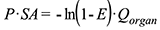 \[[8](../references.md#8)\]. With the assumption that the extraction of drug in each organ is equal, 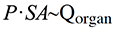 is obtained. If it is further assumed, that the permeability is equal for each organ one obtains 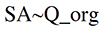.

#### Anatomy & Physiology‌

Anatomical and physiological properties in PK-Sim® are set at default values for a mean representative of a species. These default values were carefully selected from literature. In the human species module, also the mean values for children of all age groups are included. For some purposes, e.g. to simulate pathological disorders, it is desirable to change these values. This can be done in the **Anatomy & Physiology** tab, in which the parameters are, using the default settings, displayed in a tree structure on the left hand side.

By default, a **Simple** view of the various properties is displayed, in which only the most relevant parameters are shown. Using the drop-down menu at the bottom of the window, you can switch to the **Advanced** tree view or to the **Hierarchy** view. In the **Simple** and the **Advanced** view, the parameters are grouped based on function whereas in the **Hierarchy** view, they are listed according to the internal model structure. Please note that only containers comprising visible parameters are displayed. There are additional parameters in the model which are not displayed in PK-Sim®. They are, however, displayed in MoBi®. For details please see [Working with MoBi®](../part-4/first-steps.md). The tree view shows only drawings that are currently open. To access the various parameters,

1.  Click on the light grey arrow to open the respective tree view node

2.  If present, click on the next light grey arrow to open the subsequent level of the tree view

3.  Click on the desired parameter group


Use the **Filter** function above the tree view to find parameters more quickly.


In the window on the right hand side, the details of the respective parameter group will be shown.

Typically, the first column(s) contains the **Name** of the parameter and/or its location (i.e. the organ or segment). In the next column, the default **Value** for the parameter in the given organ or segment for the species selected is provided together with the corresponding unit. For humans, the column **Percentile** depicts the percentile within the respective population. If an average subject is selected, this bar should be equal or at least close to 50%. In the last column, you can define parameters as **Favorites**  in order to select certain parameters, e.g. if they have to be changed frequently. Parameters defined as favorites will be listed in the undermost node of the tree view and are thereby easily accessible.


The order of the columns can be changed manually. Drag the column header to the desired position to change the sequence of columns.



The column by which the parameters are grouped can be selected. Drag the column header to the top of the table into the group box.


To change the value of a parameter, do one of the following

- Enter a new value in the respective input field

- Multiply the default values with the scale option There are three types of parameter values:

1.  Parameter values displayed by default on a white background represent constants values. By changing the parameter value, the default value will be overwritten and the background of the field turns yellow. To reset the parameter value to default click **Reset parameter to default**  or use the **Rollback** function of the **History manager**, see [Shared Tools - History manager and history _reporting_](../part-5/history-manager-history-reporting‌.md).

2.  Parameter values displayed by default on a light blue background represent parameters calculated using a formula. By changing these values, the formula is overwritten and the background of the field turns yellow. To reset to the default value(s) click **Reset parameter to default** .

3.  Parameter values displayed by default on a grey background represent values which cannot be changed by the user, because otherwise a fundamental relationship could be destroyed.


The background colors that indicate the different types of parameters (1.-3.) can be changed by the user. For details please see [PK-Sim® - Options](pk-sim-options.md).


For some parameters, reasonable ranges are defined. For example pH values should be less than or equal to 14. In case a value outside this range is defined, a warning appears and the window cannot be closed without setting the parameters to a reasonable value.

The **Advanced** view offers the implementation of a zonated liver into an individual. Metabolic pathways in the liver are spatially separated along the liver sinusoids \[[29](../references.md#29)\]. Splitting the liver into more than one zone will improve simulation accuracy. As shown below, the liver is not zonated per default (only periportal zone). Upon zonation, the liver is split into a periportal and a pericentral zone. The parameter **Fraction of periportal zone** defines the ratio of the zone volumes and the surface areas and is set to 50% per default.

Switching between zonated and non-zonated liver does not alter the model structurally, but changes only the model parameterization.

The relative expressions for enzymes, transporters and binding proteins can be set independently for both zones. The relative expression in the pericentral zone have no effect if the liver is not zonated. Currently, the PK-Sim gene expression database delivers the same relative expression for both zones for all proteins, but this will be improved in the future.


Please note that when switching to another species on the Biometrics tab all parameters of the individual defined in the **Anatomy & Physiology** tab and in the **Expression** tabs, including applied changes (e.g. active processes), are overwritten.



**User Defined** parameter node shows an overview of all parameters changed by the user in the individual.


#### Expression‌

In the **Expression** tab, all relevant enzymes, transport proteins and protein binding partners can be defined for the selected individual.

For details on how to create an expression profile, please see [PK-Sim® - Expression Profile](pk-sim-expression-profile.md).

To add a protein to the individual, right click on the corresponding protein type in the tree view and select the corresponding action in the context menu

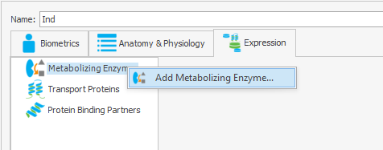

This will open a view to select the expression profile to link with the individual. Either select an existing expression profile, load one from template or create a new one by clicking on  

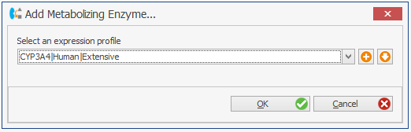

Once the expression profile is selected, it will be linked to the individual and displayed in the **Expression** tab.

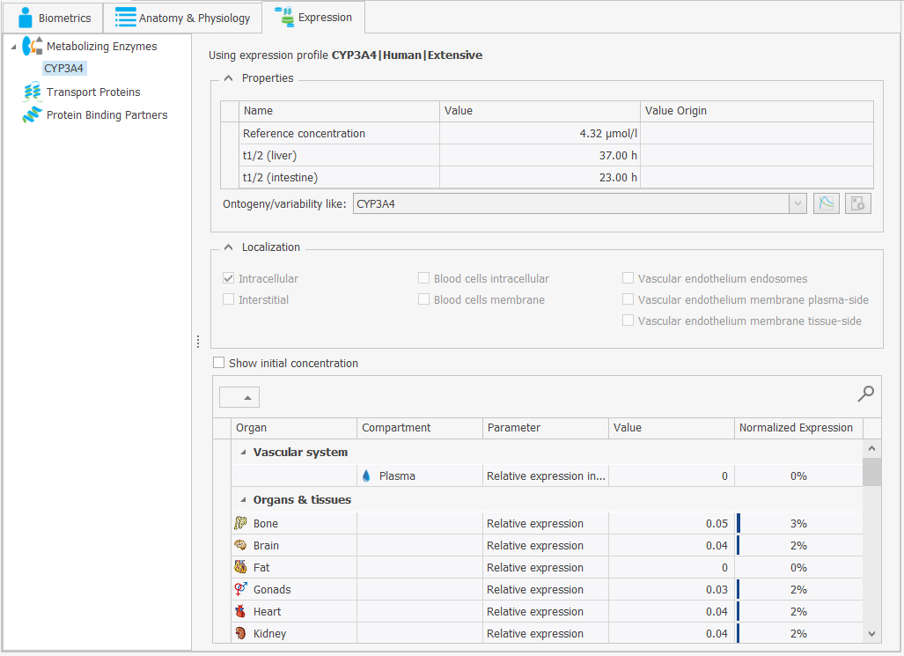

This is the only instance in PK-Sim where a a building block is referencing another building block. 


Please note that when adding an expression profile to an individual, the expression profile is linked directly to the individual. Any modification performed in the expression profile will be immediately reflected into the individual. This is the reason why all parameters are read-only in the individual.


### Editing and Scaling Individual Properties‌

To edit properties of existing individuals:

1.  Right mouse click on the respective individual in the **Building Block Explorer**

2.  Select  **Edit...**

or simply double click on the existing individual in the **Building Block Explorer**.

This will open the properties window of the individual. The properties defined in the **Anatomy & Physiology** tab and those defined in the **Expression** tab can be set or changed appropriately. Changes are saved by simply closing the window (click on  ).

Please note that the **Biometrics** of an existing individual cannot be changed later on. In order to change the **Biometrics** please create a new individual or use the scale function. Using the scale function transfers modifications at the individual and expression levels to the scaled individual.

In order to **scale** an existing individual:

1.  Right mouse click on the respective individual in the **Building Block Explorer**

2.  Select  **Scale...**

    The **Scale Individual** dialog opens, which is divided into four tabs: **Biometrics**, **Scaling configuration**, **Anatomy & Physiology**, and **Expression**. Details about the three tabs **Biometrics**, **Anatomy & Physiology**, and **Expression** have already been described for the **Create Individual** dialog (please see above). Here, only details about the tab **Scaling configuration** are given:

    If, and only if, certain individual parameters such as organ weights or blood flow rates were modified in the base individual used for scaling, these parameters will be listed in this tab. This is e.g. the case if an individual with specific characteristics due to certain diseases (e.g. renal or hepatic impairment) was created and you would now like to transfer these changes to another individual.

    The following six columns appear in the **Scaling configuration** tab:

    * **Parameter**: The name of the parameter modified in the base individual used for scaling.

    * **Source default value**: The original value of the parameter in the base individual according to the database underlying PK-Sim®. The source default value depends on the biometrics (race, age, and gender) of the base individual.

    * **Source value**: The modified value of the parameter in the base individual.

    * **Default value**: The default value of the parameter in the scaled individual according to the database underlying PK-Sim®. This value will differ from the source default value if the scaled individual is characterized by different biometrics (race, age, and/or gender).

    * **Scaled value**: The modified value of the parameter in the scaled individual. This value depends on the scaling method selected in the last column (Scaling method):

    * **Scaling method**: Select between four options for the scaling method from the drop-down menu:

      1.  **Same percentile**: This method is only available in the case of distributed parameters such as organ weights and blood flow rates in human populations. If a modification was made in the base individual the parameter value will not represent an average value anymore, i.e. it will not lie on the 50th percentile of the distributed parameters for the given population (characterized by race, age, and gender). Choosing this option, the same percentile will be used for your scaled individual of the selected population based on the PK-Sim® database.

      2.  **Use default value**: The modification made in the base individual will not be transferred to the scaled individual. Instead, the default value of the parameter in the scaled individual according to the database underlying PK- Sim® will be used.

      3.  **Use source value**: If a modification was made in the base individual the identical parameter value will be used in the scaled individual. Please note that for most parameters this is only a reasonable option if the biometrics (race, age, gender) of the base and the scaled individual are identical or at least similar.

      4.  **Same ratio**: The ratio of the source value divided by the source default value is multiplied by the default value of the scaled individual.

The line **Target weight**, which appears only on the top of this window if modifications in organ volumes were made in the base individual, indicates the body weight of the scaled individual. A modification of organ volumes will automatically lead to a change in total body weight, which is the sum of all organ weights. Thus, if the default value of an organ weight is changed, the new body weight, which is no longer in agreement with the body weight previously selected on the biometrics tab, will be shown.

### Clone an Individual‌

To clone an individual in the project:

1.  Right mouse click on the respective individual in the **Building Block Explorer**

2.  Select  **Clone...**

3.  Set an alternative name for the clone and enter a description if desired

4.  Confirm and close the window by clicking  **OK**

### Saving of Individuals as Templates‌

Previously defined individuals can be saved as a template in the template database and then be shared among several projects and users.

To save an existing individual as template:

1.  Right mouse click on the respective individual in the **Building Block Explorer**

2.  Select  **Save as Template...**

A message will appear confirming that the Individual was successfully saved in the template database.

In case an individual with the same name already exists, a warning message will pop up and you have the following opportunities:

- Override: This action will override the existing template.

- Save as: You can save the individual under a different name. In this case, you will be asked to Rename the new template.

- Cancel: This action will abort the saving process.

### Loading existing Individuals from Templates‌‌

To load existing individuals from the template database:

1.  Right mouse click on **Individuals** in the **Building Block Explorer**

2.  Select  **Load From Template...**

3.  Select the desired individual from the user templates. In case an individual with the same name already exists in the project, a warning appears and you will have to **Rename** the individual that is to be loaded from template.

4.  Click **OK** 

The selected individual will appear in the **Building Block Explorer** view.

In addition, individuals can be directly loaded from the template database within a simulation (see [PK-Sim® - Simulations](pk-sim-simulations.md).

### Deleting Individuals‌

To delete individuals from a project:

1.  Right mouse click on the respective individual in the **Building Block Explorer**

2.  Select  **Delete...**

3.  Confirm to delete the individual by clicking **Yes**


Please note that an individual that is used in any simulation of the project cannot be deleted.

