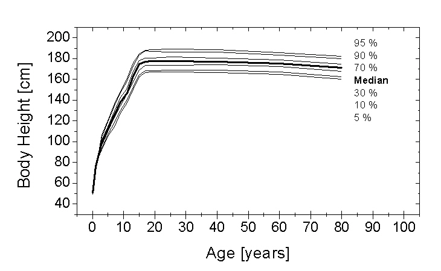

# Creating Populations

The properties of a population of individuals can be defined in the building block **Population** using the physiological database of PK-Sim®.

* In case of the various **animal species**, no age-dependent distribution information for the anatomical and physiological parameters is included in the database so far. The algorithm generates random values in the Minimum Weight, Maximum Weight interval defined by the user. The generation of a population then simply is done by linear scaling of an average animal of the given species. This means, all organs always contribute to the same extent to the total body weight without taking into account differences e.g. related to growth or to different races of the respective animal species.
* For **humans**, the population parameters database that comes with PK-Sim® includes information on the dependence of anatomical and physiological parameters relevant for PK-Sim® such as organ weights, blood flow rates, or tissue composition on age, gender, body weight, and body mass index, which have been collected in a comprehensive literature search. The algorithm generating a population then involves the following steps which are repeated until the target number of individuals is reached \[[97](../references.md#97)]:

1. A list of genders is created according to the settings chosen by the user. Then for each gender, the algorithm tries to create an individual that should fulfill the previously defined criteria:
2. An age value **Age** is drawn from a uniform random number distribution in the Minimum Age, Maximum Age interval.
3. For the **Age** assigned above, a height value **Height** is randomly generated according to the height distribution defined in the database for the given age.
4. Depending on the user inputs, the generation of the height value **Height** might fail (i.e. for **Age** defined in 2., the returned **Height** in 3. is not within the Minimum Height, Maximum Height interval). In that case, the algorithm tries to perform steps 2. and 3. again. After at maximum 100 attempts, there is certainly no data available in the database matching the user inputs and an exception is thrown.
5. With **Age** and **Height** defined, the algorithm tries to create a random individual based on these values. The resulting body weight **Weight** should be in the Minimum Weight, Maximum Weight interval. The organ volumes are randomly generated according to their organ volume distribution. If the resulting weight, i.e. the sum of all organ volumes times their density, is in the desired Minimum Weight, Maximum Weight interval, the individual will be kept. If not, another individual is generated. This step is repeated up to one hundred times. If then still no individual with a BW within the Minimum Weight, Maximum Weight interval is found an exception is thrown.
6. Then, the organ volume fractions of protein, water, and lipids are scaled according to the value defined in the database for the given age.
7. Finally, all parameters other than organ volumes for which also distributions are available in the database (e.g. blood flow rates, hematocrit etc.) are being randomly generated according to their distributions.
8. Finally, the algorithm checks that the **BMI** value corresponding to the generated **Height** - **Weight** combination resides in the Minimum BMI, Maximum BMI interval. If so, the individual is added to the population. If not, the individual is discarded.

The following figures show, as an example, the age dependence of the body weight, body height, and body mass index distribution for a certain population (white males). The data were taken from the NHANES study 82.

### Definition of new Populations in PK- Sim®‌

To create a new population, do one of the following:

* Click on **Population**  in the **Create New Building Blocks** Group of the

Modeling & Simulation Tab

* Right mouse click on **Populations** in the **Building Block Explorer** and select

Add Population...

* Use the shortcut **Ctrl+Alt+P**

A dialog box will open where the properties of the population can be selected and/ or defined. The **Create Population** building block is subdivided into three tabs: **Demographics**, **User Defined Variability**, and **Distribution**.

The population is initialized by giving it a **Name** in the respective input field. The name is used to identify the population when its properties are saved in the project and/or as a template. Moreover, the name is used for identification of the population in the simulation.

#### Demographics‌

In the first drop-down menu (**Based on individual**) you can specify an **Individual** that you previously defined in this project. A **Population** can then be created based on any **Individual** already defined. You need to specify the number of individuals in your population comprises and the percentage of females therein. In the tab **User Defined Variability**, changes in anatomical and physiological properties of the population you chose may be specified, i.e. anatomy and physiology including expression and ontogeny information about metabolizing enzymes, transport proteins and protein binding partners. Likewise, the distribution of the property may be specified and results are visualized in the next tab **Distribution**. A population can be based on an individual saved as template:

* Click on **Load** 
* Select the individual from **User Templates** or **Predefined Templates**
* Click OK
* If the name of the **Individual** loaded from template is already used in the project, a new name has to be defined.

Alternatively, you can create a new individual which serves as a basis individual for the population:

* Click on **Create** 
* Define the properties of the **Individual**. For details see [PK-Sim® - Creating Individuals](pk-sim-creating-individuals.md).

In the following line, information about the population that will be used based on the selected basis individual is given. For the different animal species, no alternative populations are provided, but for humans, the following populations are available:

* Asian (Tanaka, 1996) \[[74](../references.md#74)]
* Black American (NHANES, 1997) \[[82](../references.md#82)]
* European (ICRP, 2002) \[[84](../references.md#84)]
* Mexican American -White (NHANES, 1997) \[[82](../references.md#82)]
* White American (NHANES, 1997) \[[82](../references.md#82)]
* Japanese (2015) \[[67](../references.md#67)]
* Preterm
* Pregnant (Dallmann et al. 2017)

In the **Population Properties,** the number of individuals can be selected. For human the individual's gender is defined additionally. You can define a female (proportion of females 100%), male (proportion of females 0%), or a mixed gender (proportion of females 1-99%) virtual population.

Further below, the **Population Parameters Ranges** can be set i.e. the anthropometry of the individuals can be constrained at the lower and/or upper end of the range.

If one of the animal species, i.e. **Monkey, Beagle, Dog, Minipig, Rat, Rabbit** or **Mouse** is selected, solely the minimum and maximum body weight in units of g or kg can be set.


Please note that for animal populations the minimum and maximum body weight represent required input parameters.



Technically, there is no restriction on the Minimum Weight, Maximum Weight interval values. However, please note that the generation of an animal population simply results from linear scaling of the average animal species with the algorithm generating random values in the entire Minimum Weight, Maximum Weight interval defined by the user. Hence, reasonable values should be chosen for this interval.


If a human population is defined, the menu items for the **Population Parameters Ranges** change and ranges for the following parameters can be set:

* Age: The age range in units of year(s), month(s), week(s), or day(s).

The population database contains physiological information starting from newborns (age "0") to 80 year old individuals. In addition, a preterm model has recently been developed that has been integrated as a special population (see below). When a pediatric or elderly population is simulated, only the age dependence of anatomical properties (size of the organs, blood flow rates, body composition, etc.) is considered. However, important pharmacokinetic differences in children and elderly can be caused by age-related differences in, for example, hepatic metabolic activity. These effects are automatically accounted for if the ontogeny of the elimination process has been defined in the **Expression** tab for the underlying **Individual**. To manually account for variations in elimination, use the **User Defined Variability** tab.

* Height: The range of body heights of the individuals in units of cm or m.
* Weight: The range of body weight of the individuals in units of kg or g.
* BMI: The range of body mass index of the individuals in units of kg/m2.

The BMI is a measure for the human fat content. It is given by the individual's height (H) and weight (BW) according to: BMI = BW / H2.

If as a special human population **Preterm** is selected, an additional age scale has to be taken into account. Preterm neonates are characterized by their gestational age (GA), which ranges between about 24 and 37 weeks, and their postnatal age (PNA, "Age"). In the model, preterm neonates catch up growth during their first two years of life so that there are no differences between a > 2 year old individual of the same race and gender born either preterm or term.


Please note that for human populations, the minimum and maximum age (and gestational age in case of preterms) are required input parameters. For height, weight and BMI, empty fields indicate the unconstrained state. The population database contains information on the age dependence of the body weight, body height, and body mass index distributions of various human populations. To remove a user input value press the delete button.



The algorithm will only create virtual individuals with reasonable characteristics, i.e. that are in agreement with the database. It is, for example, impossible to create a 30 year old male with a height of 100cm weighing 200 kg. If implausible combinations of weight, height and body mass index are given as constraints, PK-Sim® will not be able to create any individuals.


#### User Defined Variability‌

In the **User Defined Variability** tab, further physiological parameters can be varied, e.g. the gastrointestinal transit pattern, or transport or elimination via active processes, that are not automatically varied in the algorithm. The parameters that are available for additional statistical variation are grouped based on function and displayed, using the default settings, in a tree structure on the left hand side. Two parameter groups will always be available, namely the **Anatomy** and the **Physiology** parameter group. The appearance of a third parameter group, the **Relative expressions** is dependent on the processes defined in the basis individual.

The tree view shows only drawings that are currently open. To select a parameter,

1. Click the plus sign (+) to open the respective tree view node
2. If present, click the next plus sign (+) to open the subsequent level of the tree view
3. Click on the desired parameter


Use the **Filter** function above the tree view to find parameters more quickly.


Selected parameters can be added to the box on the right hand side by clicking  **Add**. Accordingly, parameters can be removed from the box by clicking  **Remove**. Parameters added to the box on the right hand side can be varied within the population simulation. For each parameter, a type of distribution and associated parameters can be chosen. Four types of distributions are available:

* Normal: The parameter is normally (Gaussian-like) distributed. Mean and standard deviation must be given. Select the unit accordingly.
* LogNormal: The parameter is log-normally distributed. Mean and geometric standard deviation must be given. Select the unit for the mean value accordingly. The standard deviation can be given as a (dimensionless) relative standard deviation.
* Uniform: The parameter is evenly distributed between the minimum and maximum value. Select the unit accordingly.
* Constant: The mean value is used for all individuals. Select the unit accordingly.


Variability in clearance processes does not only originate from variability in the organ volume or blood flow to the eliminating organ, but also from variability in the expression levels of the protein involved. Therefore, variations of the reference concentration of the enzyme or transporter can be taken into account in addition to the variability that automatically results from the physiological variations.



In case of a virtual human population that contains individuals of different ages, PK-Sim® automatically takes into account the developmental changes in the specific glomerular filtration rate, i.e. in the glomerular filtration rate normalized to the volume of the kidney. However, like for active processes, additional variations of the specific glomerular filtration rate can be taken into account.



If for active processes, i.e. metabolizing enzymes, transport proteins, and protein binding partners, an ontogeny function was selected in the **Expression** tab of the **Individual** building block for the basis individual, relative activity as a function of age will be taken into account in the human population.


#### Distribution‌

In the **Distribution** tab, the distribution of parameters that are variable in the virtual population are shown. To select a certain parameter, mark it in the parameter tree on the left hand side. Again, you can use the **Filter** function above the tree view to find parameters more quickly. The distribution of the parameter selected will be depicted in the adjacent graphic. The parameter distribution can either be displayed as absolute counts or as percentage. Choose either **Count** or **Percent** from the drop-down menu below the parameter tree. For human populations, the parameter distributions are color coded. In case of a virtual human population that contains male and female individuals, you can select from the first drop-down menu whether all, only male, or only female individuals should be displayed. If **All** is selected, the gender specific data can either be shown as neighboring bars or stacking bars.


The distribution of any parameter can be copied as image via right mouse click on the graphic on the right hand side of the tab.


### Setting or Editing Population Properties‌

To set or edit the properties of an existing population:

1. Right mouse click on the respective population in the **Building Block Explorer**
2. Select  **Edit...**

or simply double click on the existing population in the **Building Block Explorer**.

The window with the properties of the population will open. The properties defined in the **Additional Parameters** tab can be set or changed appropriately. Changes can be verified in the **Distribution** tab. After having set or changed the properties, the window can be closed by clicking on  which will save the changed population properties.


Please note that the **Demographics** of an existing population including all parameters automatically generated by the population algorithm cannot be changed later on. In order to change the **Demographics** please create a new population.


### Exporting Populations to CSV‌

Populations generated in PK-Sim® can be exported to a CSV format. The file, which can be opened in Excel®, contains all anatomical and physiological parameter values of each individual of the population. In order to export a population to csv:

1. Right mouse click on the respective population in the **Building Block Explorer**
2. Select **Export to CSV...**
3. Choose directory and enter file name
4. Click **Save**. The file is saved and can be subsequently opened with excel


In addition to the export of the population parameters to CSV, population simulations can be exported to CSV via the Simulation Explorer. Then, the population parameters file (.CSV), the respective model file (.xml) as well as an information file (.txt) with the relevant information about the PK-Sim® version number will be generated. For details please see (see [PK-Sim® - Importing and Exporting Project Data and Models](importing-exporting-project-data-models.md).


### Cloning of Populations‌

To clone populations in the project:

1. Right mouse click on the respective population in the **Building Block Explorer**
2. Select  **Clone...**
3. Set an alternative name for the population clone and enter a description, if desired
4. Confirm and close the window with **OK** 

### Saving Populations as Templates‌

Previously defined populations can be saved as templates and then be shared among several projects and users.

To save an existing population as template:

1. Right mouse click on the respective population in the **Building Block Explorer**
2.  Select  **Save as Template...**

    In case a population with the same name already exists, a warning message will pop up and you have the following options:

    * Override: This action will override the existing template
    * Save as: You can save the population under a different name. In this case, you will be asked to Rename the new template.
    * Cancel: This action will abort the saving process

### Loading of existing Populations from Templates‌‌

To load an existing population from the template database:

1. Right mouse click on **Populations** in the **Building Block Explorer**
2. Select  **Load From Template...**
3.  Select the desired population from the user templates

    In case a population with the same name already exists in the project, a warning message will pop up and you will have to **Rename** the population that is to be loaded from the template.
4. Click **OK** 

The selected population will appear in the **Building Block Explorer** view.

In addition, populations can be directly loaded from the template database within a simulation (see [PK-Sim® - Simulations](pk-sim-simulations.md).

### Deleting Populations‌

To delete a population from the project:

1. Right mouse click on the respective population in the **Building Block Explorer**
2. Select  **Delete...**
3. Confirm to delete the population by clicking on **Yes**


Please note that a population that is used in any simulation of the project cannot be deleted.

