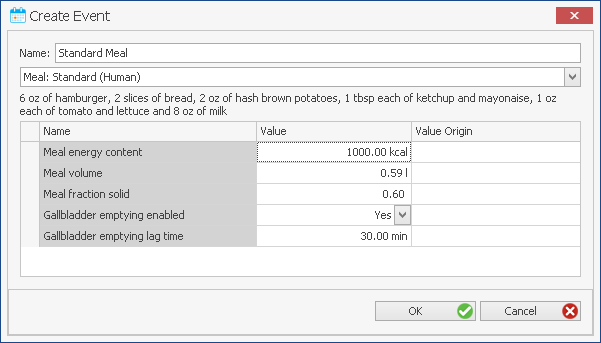

# PK-Sim® Events

In the building block **Event** you can define special events that are to occur during simulation time. These are, for example, the ingestion of a meal and the associated physiological changes or the discrete emptying of the gallbladder independent of a meal event. It is the idea of this building block that special physical conditions such as sports or nightly sleep can be defined in the **Event** Building Block, and thus, considered in the simulation.


Please note that the **Event** Building Block does not represent an essential building block for the simulation.


## Definition of new Events in PK-Sim®‌

To create a new event, do one of the following:

*   Click **Event**  in the **Create** Group of the **Modeling** Tab

*   Right mouse click on **Events** in the **Building Block Explorer**

and select **Add Event...**

*   Use the short cut **Ctrl+Alt+E**

The following dialog will open in which the properties of the event can be selected and/or defined:

First the event is initialized by giving it a **Name** in the respective input field. The name is used to identify the event when its parameters are saved in the project and/or as a template. The name is used for the identification of the event in the simulation.

From the drop-down menu you can currently choose from the following predefined events:

*   Meal: Standard (Human)

*   Meal: High-fat breakfast (Human)

*   Meal: Ensure Plus® (Human)

*   Meal: High-fat soup (Human)

*   Meal: Mixed solid/liquid meal (Human)

*   Meal: Dextrose solution (Human)

*   Meal: Egg sandwich (Human)

*   Gallbladder emptying

In the case of the meals, the typical composition of the selected meal is provided below the drop-down menu.

The following model-relevant parameters of the meal are given:

*   Meal energy content in units of kcal or cal.

*   Meal volume in units of L or mL.

*   Meal fraction solid (value between 0 and 1), characterizing the composition of the meal with respect to solid and liquid components.

Finally, the following two parameters can be defined:

*   The decision on whether the discrete gallbladder emptying should be enabled or disabled. Enabling gallbladder emptying will activate discrete mass flow from the gallbladder into the duodenum.

*   The gallbladder emptying lag time, i.e. the lag time between the ingestion of meal and gallbladder emptying


Please note that enabling gallbladder emptying does not automatically imply active secretion of the compound into the bile! In order to simulate enterohepatic circulation of the compound, an active transport process from the liver into the bile is needed, i.e. the definition of an efflux or P-gp like efflux transport process at the apical side of the hepatocytes or a biliary clearance process, which‌ can be defined in the **Compound** Building Block, is required.



Please note that the rat lacks a gallbladder. The combination of discrete gallbladder emptying with the species rat, thus, is not possible! However, continuous bile flow from the hepatocytes into the duodenum can now be simulated in the rat as well as in all other species.



In order to additionally or alternatively activate continuous mass flow from the liver into the duodenum please change the EHC continuous fraction in the **Individual** Building Block accordingly. In fasted humans, the fraction of hepatic bile that flows into the gallbladder averages about 60-70% and, accordingly, the fraction that flows directly into the duodenum is about 30-40%. Per default, however, the continuous bile flow is set to 0% as continuous enterohepatic circulation of a drug is frequently not observed, because this would only result in a net reduction of the plasma clearance. Other parameters related to the gallbladder emptying function, such as the gallbladder ejection fraction and the half-time of gallbladder emptying, can also be parameterized in the **Anatomy & Physiology** tab of the **Individual** Building Block.


For the various meals provided, the pH in the stomach and the gastric emptying function will change significantly. Irrespective of the meal chosen, the gastric pH will be increased 5.5 and then decay exponentially. The rate of gastric emptying, which controls the transport of the drug to the absorption sites in the intestine, will change according to a function that is based on the Weibull equation. The Weibull function was parameterized based on about 100 datasets for gastric emptying profiles in humans following ingestion of various meals \[[81](../references.md#81)\].


The predefined events are, so far, only parameterized based on information obtained for human adults. Therefore, the combination of these events with children and/or the various animal species in the simulation without adjusting certain meal parameters may not be possible. This is true particularly for the meal volume, which cannot exceed the volume of the stomach of the individual!


## Setting or Changing Event Properties‌

To set or change the properties of an existing event:

1.  Right mouse click on the respective event in the **Building Block Explorer**

2.  Select  **Edit...**

or simply double click on the existing event in the **Building Block Explorer**

The window with the properties of the event will open. The properties can be set or changed appropriately. To save the changes close the window by clicking on .

## Cloning of Events‌

To clone an event in the project:

1.  Right mouse click on the respective event in the **Building Block Explorer**

2.  Select  **Clone...**

3.  Set an alternative name for the event clone and enter a description if desired.

4.  Confirm and close the window by clicking **OK** 

## Saving Events as Templates‌

For each project, a number of events can be defined. They can be saved as templates and then be shared among several projects and users.

To save an existing event as template:

1.  Right mouse click on the respective event in the **Building Block Explorer**

2.  Select  **Save as Template...**

In case an event with the same name already exists, a warning appears and you have the following options:

*   Override: This action will override the existing template.

*   Save as: You can save the event under a different name. In this case, you will be asked to Rename the new template.

*   Cancel: This action will abort the saving process.

To load an existing formulation from the template database:‌‌

1.  Right mouse click on **Events** in the **Building Block Explorer**

2.  Select  **Load From Template...**

3.  Select the desired event from the user templates

In case an event with the same name already exists in the project, a warning appears and you will have to **Rename** the event that is to be loaded from template.

4.  Click **OK** 

The selected event will appear in the **Building Block Explorer** view.

Alternatively, events can be directly loaded from the template database within a simulation.

## Deleting Events‌

To delete an event from the project:

1.  Right mouse click on the respective event in the **Building Block Explorer**

2.  Select  **Delete...**

3.  Confirm to delete the event by clicking **Yes**


Please note that an event that is used in any simulation of the project cannot be deleted.
