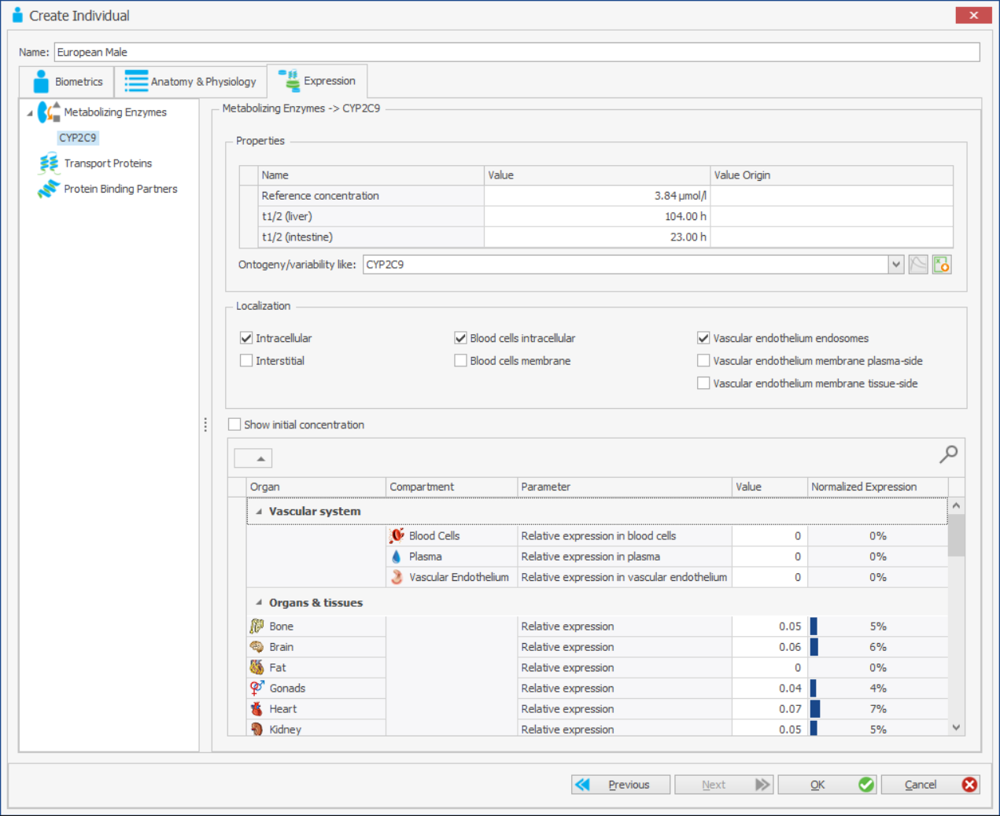

# PK-SIM Expression Data

## Background: Active Processes in PK-SIM

### The role of proteins in PBPK modeling‌

Small molecules frequently interact with proteins. All aspects of ADME may be influenced to a varying extent by protein/compound interaction. Metabolic and transport processes are of particular importance in this context. Most proteins concentrations vary spatially as well as temporally. PK-Sim® allows the user to model proteins and compound/protein interactions.

Active, protein-mediated processes involved in drug ADME generally occur simultaneously in various organs. A quantitative description of active processes, however, is difficult due to limited experimental accessibility of tissue-specific protein activity _in vivo_. PK-Sim® uses gene expression data as a surrogate for protein abundance to estimate _in vivo_ activity of such enzymes or transporters which have an influence on drug pharmacokinetics. This concept implies that protein availability and catalytic rate constants, which ultimately underlie enzyme and transporter activity, are decoupled. For more detail, please see \[[46](../references.md#46)\].

In brief, the concept of using gene expression data as proxy for protein abundance is based on the definition of the maximum velocity _Vmax_ _µ_mol/l/min. According to the Michaelis-Menten equation, _Vmax_ depends on both the total enzyme or transporter concentration E0 µmol/l and the catalytic rate constant _kcat_ 1/min:

Assuming that kcat is not influenced by _in vivo_ factors, the tissue-specific maximum velocity _Vmax,organ_ is defined as:

By replacing E0, organ by relative expression values erel,organ - times a scaling factor _SF_ µmol/l the absolute _in vivo_ protein concentration is corrected for such that organ specific activity can be rewritten to obtain:

This reformulation enables automatic quantification of the organ specific activity Vmax,organ for each protein-mediated process at the whole-body scale.
        
Notably, there are only two types of parameters in this reformulation of the organ- specific activity:

*   _erel,organ_, which is a tissue specific parameter. This value can be directly taken from the PK-Sim® expression database

*   kcat,s, represents an apparent catalytic rate constant µmol/l/min. kcat,s is a global parameter that implicitly considers translational efficacy and post- transcriptional modifications for a particular protein.

Relative protein abundance can be set according to available expression data while catalytic parameters are described by a global kinetic rate constant that is adjusted during model setup. On the one hand, this method enables direct estimation of _in vivo_ enzyme and transporter activity based on data-based inclusion of tissue-specific protein abundance which represents first-hand experimental- measurements. On the other hand, the number of free model parameters, which would have to be measured or adjusted in case of an exhaustive mechanistic representation in multiple organs, is reduced significantly. Later, we will describe, how such information can be included in PBPK models.

The PK-Sim® library includes large-scale gene-expression data from publicly available sources which were downloaded, processed, stored and customized such that they can be directly utilized in PBPK model building \[[46](../references.md#46)\]. The database needs to be referenced in the PK-Sim® options, see [Options](02-pk-sim-options.md). Public database which were imported are

*   whole genome expression arrays from ArrayExpress (ArrayExpress, 2010)

*   RT-PCR derived gene expression estimates from literature \[[49](../references.md#49)\], \[[50](../references.md#50)\], \[[51](../references.md#51)\]

*   expressed sequence tags (EST) from UniGene.

The consolidated expression data was stored in a database with three sections termed EST (UniGene), Array (ArrayExpress), and RT-PCR (literature cited above), respectively.

It should be noted that the current version of the database only describes spatial distribution of active processes in PBPK models. Temporal aspects such as circadian rhythms underlying chronogenetics are not included in the current version of the database. If necessary, such effects may be considered in a corresponding MoBi® model. Also, the current version of the database is restricted to human expression data. Extensions to other organism are currently under development and will be become available in future versions of PK-Sim®.

### The cellular and tissue specific location of active proteins‌
    
A key feature of biological cells is polarity. Cellular polarity leads to functional differentiation of different sides of a cell. Organs have a spatial organization that reflects function. Active proteins (binding partners, transporters, enzymes that interact with a pharmacologically active enzyme) have to be correctly placed in the context of the cell and the organ. In addition, active transporters have a directionality of the transport, i.e. substance is transported into or out of a cell.

#### Epithelial polarity: Apical, basolateral
        
Organs in PK-Sim® may be covered by an epithelial cell sheet. Epithelial cell membranes have three distinct domains. The apical domain is exposed as 'free' surface. Basolateral surfaces are opposite to the apical surface and interface the 'interior' of an organ. The lateral cell membrane connects epithelial cells to a two dimensional sheet. Tight junctions separate basal and apical membrane domains.
        
If active processes are part of a PK-Sim® project, the localization (apical or basolateral) of transporters have to be set for key organs:
        

*   Liver (Basolateral): Transport between cytosol of liver cells and interstitial space

*   Liver (Apical): Transport between cytosol of liver cells and bile

*   Kidney (Basolateral): Transport between cytosol of kidney cells and interstitial space

*   Kidney (Apical): Transport between cytosol of kidney cells and urine

*   Intestinal mucosa (Basolateral): Transport between cytosol of mucosa cells and the interstitial space

*   Intestinal mucosa (Apical): Transport between cytosol of mucosa cells and the intestinal lumen

*   Brain (Tissue): Transport between cytosol of brain cells and the brain interstitial space

*   Brain (Blood Brain Barrier): Transport between blood plasma and cytosol of brain cells.

#### Transport type: Influx, Efflux, P-gp like‌
    
Transporters are located in the cell membrane, partly restricted to certain areas of the membrane. In general, active transports move a substance against the concentration gradient and the direction is specific for the transporter. In PK- Sim®, three transport directions are distinguished and need to be specified:    

*   Influx: The substance is transported from the interstitial space or lumen to the intracellular space.

*   Efflux: The substance is transported from intracellular space to interstitial space or lumen.

*   P-gp like: The substance is transported from intracellular space and interstitial space to the interstitial space.

#### Location in tissue: Intracellular, Extracellular membrane, Interstitial

The location of protein binding partners and enzymes has to be defined. In PK- Sim®, three distinct locations are available:

*   Intracellular: Protein is located within the cell, the cytosol.

*   Extracellular Membrane: Protein is located within the extracellular membrane.

*   Interstitial: Protein is located between cells, in the interstitial space.

In addition, for the vascular endothelium, proteins can either be located in the cytosol or in endosomes. In PK-Sim®, only the endosomal space of the vascular endothelium is explicitly represented by respective compartments. Since the cytosol of the vascular endothelium is not explicitly represented, cytosolic proteins of the vascular endothelium are technically implemented in the interstitial space of the organs. To account for the true cytosolic location, the respective protein activities are calculated on the basis of an expression value corrected by the ratio of the volumes of vascular endothelium and interstitial space. For this reason, the following selections are possible in the drop-down menu:

*   Location in vasc. endothelium: Endosomal

*   Location in vasc. endothelium: Interstitial as surrogate for cytosolic space

## The workflow‌

If you want to use the gene expression databases, ensure that they are correctly installed and linked to the application, see [Options](02-pk-sim-options.md).

The workflow of integrating protein data with PBPK models comprises the following steps:

1.  Identification of relevant metabolizing enzymes, transport proteins, and protein binding partners for the compound of interest (_your internal research or literature_)
    
2.  Determination of organ and tissue specific distribution of protein concentrations (PK-Sim® supports this task with an in-built data base)
    
3.  Identification of cellular location of proteins (_your internal research or literature_)
    
4.  Devise applicable kinetics and adjust kinetic parameters (_modeling, your internal research or literature_)

## Modeling protein/drug interactions in PK-Sim®‌

Proteins are added to a PBPK model as part of the building block individual. Proteins are added as binding partners, as metabolizing enzymes or as transporters for “compound”. The specifics of the interaction is adjusted in the compounds building block, see [PK-Sim® Compounds: Definition and Work Flows](07-pk-sim-compounds-definition-and-work-flow.md), while the quantities and localization of proteins is parameterized in the individual building block. There are two ways of adding proteins to the building block “ individual”, either via a database query using the PK-Sim® gene expression database, or through direct entering of protein quantities to a list of organs and tissues. In either case, a protein is added either as “Metabolising Enzyme”, as “Transport Protein” or as “Protein Binding Partners”. Below the tab “Expression”, you find an area that lists all possible protein ‘types’. For each type, it is possible to select via right click a context menu with two entries, **Add type… (Default)** or **Add type… (Database Query)** with type being one of “Metabolising Enzyme”, “Transport Protein” or “Protein Binding Partners”.

## Adding protein quantities manually‌

If you know quantities of proteins in one or several organs you can define the expression data manually. Start by selecting the type of protein you have, enzyme, transporter or binding partner.
    
Right click on this type, and select the first entry in the context menu: **Add Metabolizing Enzyme ... (Default)** (assuming you want to add an enzyme).

Next, you will be required to choose a name for your protein. After doing so, an area to configure properties of this protein will appear. It is divided into an upper and a lower panel.


To be able to query expression data from a database you have to select a database for the current species in PK-Sim ®options (see [PK-Sim® Options](02-pk-sim-options.md).


We will explain the upper panel in [Settings in the protein expression tab](#settings-in-the-protein-expression-tab). In the lower panel relative protein quantities per organ are specified. When adding protein quantities manually values for all organ/tissue for which estimates are available should be given as the default values are simply zero. For transporters, more options are available in the lower panel which are explained in [Settings in the protein expression tab](#settings-in-the-protein-expression-tab).

## Adding protein quantities by querying the internal database‌

Use this if you do not know quantities of proteins in all PK relevant organs/tissues. PK-Sim® is shipped with an internal gene expression database. Gene expression is experimentally more amenable then actual protein expression, in particular with the wide spread use of micro array chip technology. Then, a proportionality of gene expression and protein quantities across organs and tissues is assumed.

Start by selecting the type of protein you have, enzyme, transporter or binding partner. Right click on this type, and select the first entry in the context menu: “Add Metabolizing Enzyme (Database query)” (assuming you want to add an enzyme).

Next, a database query wizard will open. This is discussed in more detail in, “[Advanced Analysis](#advanced-analysis)”. Here we walk you through the simplest possible process.

### Adding search criteria‌
        
The first panel of the database search wizard allows you to enter a search term in the search bar

This term can be anything from gene name, gene symbol, or parts of the description.


The term is automatically enclosed by wildcards. You can turn off this default behavior by enclosing the term with “quotes”. As wildcards you can use a percent sign (%) or a star (\*) for multiple characters and a question mark (?) or underscore (\_) for a single character.


Once you hit enter, you will see a list of database entries that match your search. Several details are displayed like:

*   Gene Name

*   Name Type (e.g. is the gene name a synonym)

*   the gene symbol (this is the most authoritative naming convention)

*   the (entrez) gene ID

*   the official full name for the protein or gene

Select the appropriate entry in the list of search results (or refine your search).


The (entrez) gene ID is also a hyper link to the NCBI gene page where you can find additional information about the gene.



A hit row is highlighted in gray if the gene is known in the database but there are no expression data available. In this case the other tabs are disabled.


### Reviewing measured gene expression‌

In the upper panel you can find a table of gene expression values. The table is organized with tissues in rows, and data sources in columns.


You can select one or several cells with the mouse (press left mouse key down), copy the content with **Ctrl+C**, and paste the values into another application, e.g. Microsoft Excel,® with **Ctrl+V**.


The lower panel gives a graphical representation of the gene expression values. In the table (upper panel), the data can be filtered by several criteria. (REF: How to use the database query wizard).
    

### Reviewing data before transfer‌

In the data transfer overview tab the data to be transferred are compiled for reviewing. Note, that relative expression values are given. In the upper part of the windows one or more radio buttons are displayed. The radio buttons are used to select the appropriate data source. Currently, Array, EST or RT-PCR can be selected. After selecting one of the data sources the expression levels in different PBPK containers are displayed in the lower panel. Select the most appropriate data source and click **OK** to close the database query wizard. The expression data is transferred to PK-Sim®


The Array Database is best in terms of the number of genes covered (essentially the complete genome), RT-PCR provides the most accurate measurements, and EST data in some cases covers unusual types of tissue. Use the data soures that has the most appropriate coverage of tissues for your purpose. Array data is usually a good choice.



When using several proteins different data sources for different proteins may safely be used.



The complete data set is stored within the PK-Sim® project. If you re-enter the query by selecting the **Edit...** menu item from the context menu of a defined protein, all data will be taken from the internally saved data set. To force access to the database you need to re-query the protein in the protein selection form.



You can rename a defined protein within your PK-Sim® project by selecting the **Rename...** menu item from the context menu of a defined protein. This name has no impact on the query and is only used to identify the protein within the PK-Sim® project.


## Settings in the protein expression tab‌
    
In the upper section, the following entries can be adjusted:
    
*   Reference concentration: Enter the molar concentration of the protein in the organ with the highest enzyme concentration (typically the liver). This is useful as you will later solely enter relative enzyme concentrations. If you do not know the absolute concentration in the organ with the highest expression level you can leave this entry at its default value of 1.00 pmol/mg and adjust the active process, e.g. via the Vmax value.

See [Reference Concentration](#reference-concentration) for a more detailed discussion of the Reference concentration.

*   Ontogeny like: A list of typical enzymes and locations is shown for which the PK-Sim® software already knows ontogenies. Ontogenies are age-depending changes of enzyme concentrations in the respective organ or tissue.

Currently, ontogeny information is only available for the liver and restricted to a selection of important cytochromes.

If the selected enzyme is recognised and ontogeny information is available, that enzyme is preselected. Otherwise, from this list the ontogeny of an enzyme/ protein may be selected. The button to the right of the list can be used to visualise the ontogeny. The fraction of adult protein content in a specific organ is plotted against age.

The gene expression that is used in the simulation incorporates the age- dependency of the ontogeny.

*   For metabolizing enzymes and protein binding partners:

*   The localization in tissue can be used to specify the localization, in either intra-, extracellular or interstitial space
    
*   The localization in vascular endothelium can be set to endosomal or interstitial
    
*   For transport proteins:

*   Transporter Type can be set to efflux, influx, or Pgp-like.
    
In the lower section, values of relative expression can be edited for individual tissues. For transport proteins and some organs, apical or basolateral can be set (see [The cellular and tissue specific location of active proteins‌](#the-cellular-and-tissue-specific-location-of-active-proteins‌) for explanation of the various parameters).

## Reference Concentration‌
        
Internally, PK-Sim represents the protein expression relative to the expression in the organ with highest concentration of the respective enzyme. This corresponds to 100%. Whenever active processes are used, this relative amount is converted to an actual enzyme concentration by multiplying the relative expression with a reference concentration, i.e. the concentration that is equivalent to 100% in molar units.

For example, CYP3A4 is mainly expressed in the liver of human adults, some in the gastro intestinal tract, and minor amounts are expressed in almost all other tissues. Hence, the relative expression of CYP3A4 in the liver is 100%. A reference concentration can be entered in the protein expression tab which will refer to the expression in liver, while expression in other organs is scaled by the relative expression.

In this example, the concentration of CYP3A4 in the liver is 108 pmol/mg microsomal protein 63. The concentration of microsomal protein in the liver is 40 mg microsomal protein/g Liver. Simple multiplications (and assuming a specific density of 1 g/mL for the liver) results in 4.32 µmol CYP3A4/L liver tissue. This number can be used as reference concentration for the protein expression tab.

The following table shows reference concentrations from a selection of CYP enzymes. The values were derived from measurements of human microsomal samples, see \[[63](../references.md#63)\].

Table: Reference concentration of CYP enzymes

|Enzyme |pmol/mg human liver microsomes |µmol CYP/L liver tissue (Reference concentration)|
|--- |--- |---|
|CYP1A2|45|1.8 |
|CYP2A6|68|2.72|
|CYP2B6|39|1.56|
|CYP2C18|<2.5|<0.1|
|CYP2C19|19|0.76|
|CYP2C8|64|2.56|
|CYP2C9|96|3.84|
|CYP2D6|10|0.4|
|CYP2E1|49|1.96|
|CYP3A4|108|4.32|
|CYP3A5|1|0.04|

Special attention has to be paid when using ontogeny information together with the reference concentration. The reference concentration is subject to an age depending ontogeny, and the underlying implementation assumes that the reference concentration refers to an ontogeny factor of 1. For example: if it is known that for a 0.5 year old individual the ontogeny factor of a particular enzyme is 0.1, and the concentration of the enzyme in individuals of that age is 0.13 µmol/ L, the reference concentration (of an adult) is 1.3 µmol/L (that is 0.13/0.1).

## Advanced Analysis‌

In this section the more advanced features of the expression database integration are explained.

### Pivot Table‌

In the upper section of the “Data Analysis tab page” the expression data is compiled in a pivot table. With the help of a pivot table cross tabulations are easily possible. You can drag fields to use them as additional row or column headers. The table changes dynamically.


You can change the X-Axis field used by the corresponding chart by double clicking on a row header. This feature is only available for fields with no empty values.



You can change the series building field used by the corresponding chart by double clicking on a column header. This feature is only available for fields with no empty values.



You can reset all fields back to their default position by double clicking on a filter field header. The fields used in the chart are also reset by that action.


## Filtering Data‌
            
Each field can be used for filtering. To open the filter dialog click on the filter symbol  which is shown in the field header when hovering over a field.

By ticking the check boxes you can toggle the filtering of individual values.
            


The buttons in the upper area have the following meaning:
*   The  button can be used to limit the list of values to only those that are currently visible. If you would have added a filter on another field some values might are unreachable. Those values would be hidden.
*   The  button can be used to change the check box into an option box which means that you can only select one filter value at a time and that the previously selected value gets automatically deselected by selecting a new value.
*   The  button can be used to invert the selected filter values which means that every selected value gets deselected and vice versa..


The respective active filter is shown right under the table.

Click on **Edit Prefilter** to open a dialog for editing complex filter conditions.

To add a condition for the age of the population used in the expression data measurements you can add a condition in the prefilter dialog with the following steps:
            
*   First save the current condition to the clipboard by selecting the topmost logical operator and pressing **Ctrl+C**.

*   Change the topmost logical operator to “And”.

*   Restore the original condition by pressing **Ctrl+V**.

*   Add a new condition by pressing the button behind the topmost logical operator “And”.

*   Select the column “Age(Minimum)” and select the condition operator “Is greater than or equal to” and enter the value “18”.

Now the condition has changed and only data from adults will be used


For filtering age ranges of populations you might find it more convenient to use the \[Age(Minimum)\] and \[Age(Maximum)\] columns.


### Edit Mapping‌    

A default mapping maps measured expression data of tissues to PK-Sim® containers. This mapping can be changed by users. If you double click on the value of a container or tissue the edit mapping dialog opens.

On the left hand side of the dialog the containers with their corresponding icons are shown and on the right hand side the currently mapped tissue is shown. Blue font means that there is no expression data available for that tissue. At the end of the list all tissues are displayed for which data could be found but which are not already mapped.

It is possible to map one tissue to multiple containers. For example the Small Intestine is mapped by default to several areas of the GI tract.

In the navigator panel of the edit mapping dialog, the following buttons can be used:

*   The  button brings you to the first record.

*   The  button brings you 10 records backwards.

*   The  button brings you to the previous record.

*   The record counter ( ) shows you the actual position and the total number of records.

*   The  button brings you to the next record.

*   The  button brings you 10 records forwards.

*   The  button brings you to the last record.

*   The  button enters the edit mode.

*   The  button leaves the edit mode and accepts the changes.

*   The  button leaves the edit mode and rejects the changes.

Even though you can accept changes in the edit mode, ultimately they will only be saved by leaving the dialog and pressing the **OK** button. Changes done within the dialog are highlighted with orange background color.

If you want to discard all changes you can just leave the dialog with the **Cancel** button.