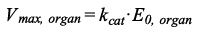
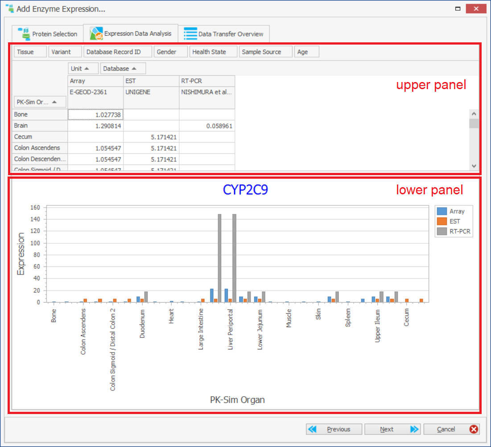
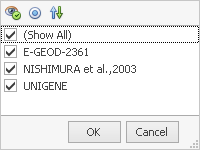
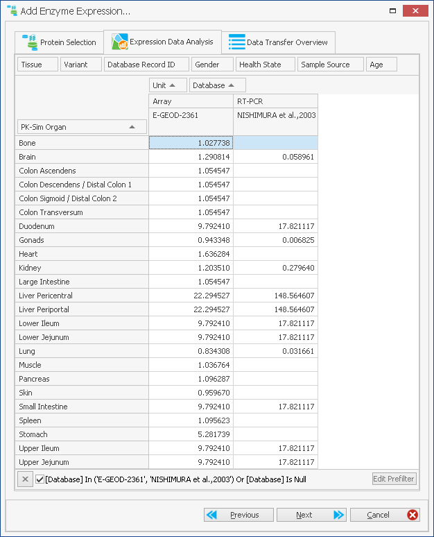
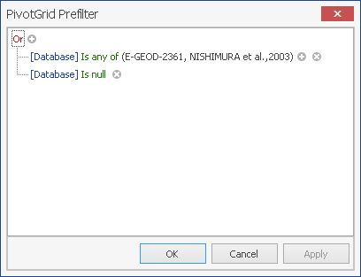
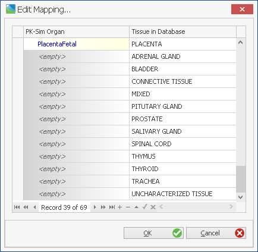
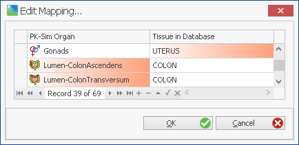

# PK-SIM Expression Profile

## Background: Active Processes in PK-SIM

### The role of proteins in PBPK modeling

Small molecules frequently interact with proteins. All aspects of ADME may be influenced to a varying extent by protein/compound interaction. Metabolic and transport processes are of particular importance in this context. Most proteins concentrations vary spatially as well as temporally. PK-Sim® allows the user to model proteins and compound/protein interactions.

Active, protein-mediated processes involved in drug ADME generally occur simultaneously in various organs. A quantitative description of active processes, however, is difficult due to limited experimental accessibility of tissue-specific protein activity _in vivo_. PK-Sim® uses gene expression data as a surrogate for protein abundance to estimate _in vivo_ activity of such enzymes or transporters which have an influence on drug pharmacokinetics. This concept implies that protein availability and catalytic rate constants, which ultimately underlie enzyme and transporter activity, are decoupled. For more detail, please see \[[46](../references.md#46)\].

In brief, the concept of using gene expression data as proxy for protein abundance is based on the definition of the maximum velocity _Vmax_ _µ_mol/l/min. According to the Michaelis-Menten equation, _Vmax_ depends on both the total enzyme or transporter concentration E0 µmol/l and the catalytic rate constant _kcat_ 1/min:


Assuming that kcat is not influenced by _in vivo_ factors, the tissue-specific maximum velocity _Vmax,organ_ is defined as:



### Protein expression profile

Following from **Equation 2**, the effective rate of a protein-mediated process, be it metabolization or transport or binding reaction, is directly dependent on the total amount of the protein in the respective compartment. The abundance of proteins in different organs in PK-Sim is calculated from **relative expression** values. For each organ, the relative expression defines the concentration of the protein in whole organ as a fraction of a defined **reference concentration** value.


### Reference concentration

The **reference concentration** can be measured *in vitro* and allow direct *in vitro - in vivo* extrapolation (IVIVE). The concentration of the protein in the organ with the **relative expression = 1** will equal to that measured concentration. The concentrations in all other organs will be set relative to that value. In case no *in vitro* protein abundance values are available for any organ, the reference concentration can be set to any arbitrary value (the default value is 1 µmol/L). While direct IVIVE will not be possible in this case, the model will still be able to account for the different contributions of the organs to the total process rate (e.g. metabolism of a compound) through the relative expressions.

For example, CYP3A4 is mainly expressed in the liver of human adults, some in the gastrointestinal tract, and minor amounts in almost all other tissues. The concentration of CYP3A4 in the liver is 108 pmol/mg microsomal protein \[[63](../references.md#63)\]. The concentration of microsomal protein in the liver is 40 mg per g liver. Assuming a specific tissue density of 1 g/mL the concentration of CYP3A4 in whole liver is 4.32 µmol/L . This number can be used as a reference concentration with relative expression of 1 in the liver.

The following table shows reference concentrations from a selection of CYP enzymes. The values were derived from measurements of human microsomal samples, see \[[63](../references.md#63)\].

Table: Reference concentration of CYP enzymes

| Enzyme  | pmol/mg human liver microsomes | µmol CYP/L liver tissue (Reference concentration) |
| ------- | ------- | ------- |
| CYP1A2  | 45                             | 1.8  |
| CYP2A6  | 68                             | 2.72 |
| CYP2B6  | 39                             | 1.56 |
| CYP2C18 | <2.5                           | <0.1 |
| CYP2C19 | 19                             | 0.76 |
| CYP2C8  | 64                             | 2.56 |
| CYP2C9  | 96                             | 3.84 |
| CYP2D6  | 10                             | 0.4  |
| CYP2E1  | 49                             | 1.96 |
| CYP3A4  | 108                            | 4.32 |
| CYP3A5  | 1                              | 0.04 |

Special attention has to be paid when using ontogeny information together with the reference concentration. The reference concentration is subject to an age depending ontogeny, and the underlying implementation assumes that the reference concentration refers to an ontogeny factor of 1. For example: if it is known that for a 0.5 year old individual the ontogeny factor of a particular enzyme is 0.1, and the concentration of the enzyme in individuals of that age is 0.13 µmol/ L, the reference concentration (of an adult) is 1.3 µmol/L (that is 0.13/0.1).

The PK-Sim® library includes large-scale human gene-expression data from publicly available
sources which were downloaded, processed, stored and customized such that they can be directly utilized in PBPK model building \[[63](../references.md#63)\]. The database needs to be configured in the PK-Sim® options, see [Options](pk-sim-options.md). Public databases which were imported are

- whole genome expression arrays from ArrayExpress (ArrayExpress, 2010)
- RT-PCR derived gene expression estimates from literature \[[49](../references.md#49)\], \[[50](../references.md#50)\], \[[51](../references.md#51)\]
- expressed sequence tags (EST) from UniGene.

The consolidated expression data was stored in a database with three sections termed EST (UniGene), Array (ArrayExpress), and RT-PCR (literature cited above), respectively.

It should be noted that the current version of the database only describes spatial distribution of active processes in PBPK models. Temporal aspects such as circadian rhythms underlying chronogenetics are not included in the current version of the database. If necessary, such effects may be considered in a corresponding MoBi® model. Also, the current version of the database is restricted to human expression data. Extensions to other organism are currently under development and will be become available in future versions of PK-Sim®.

### The cellular and tissue specific location of active proteins

Proteins involved in metabolism or transport of compounds are located in different organ sub-compartments. While enzymes usually reside inside organ cells, transport proteins are located in membranes. Another important feature of biological cells that has to be considered is polarity.

Organs containing epithelial cell membranes, like intestinal mucosa or liver (bile duct epithelium) and kidney (tubular epithelium), express different types of proteins on either side of the cell, whether basolateral or apical. The *apical* membrane is exposed to the luminal space, while the *basolateral* membrane is facing the interstitial space of the tissue.

The *relative expression* defines the concentration of the protein in whole organ, i.e., the sum volume of the sub-compartments interstitial space, intracellular space, blood plasma and blood cells, and (for the large molecules model) the endosomal space. Within the organ, the protein can be distributed over the different sub-compartments, with the *effective concentration* in the compartment being calculated by PK-Sim such that the concentration in the whole organ  is 


with ***RC*** being the reference concentration and  the relative expression in this organ. The following sections give an overview over the possible localizations and the equations used to calculate the effective concentrations in the different compartments for enzymes and transport
proteins.

### Localizations and initial concentrations of enzymes


By default, an added enzyme is localized only in the intracellular space of the organs. The user can select additional compartments where the enzyme should be expressed and set the expression values.

* **Plasma**: Enzymes floating in blood plasma. The specified relative expression will be added to the expression of the enzyme in plasma compartment of every organ.

* **Blood Cells**: Enzymes expressed in blood cells of all organs; the specified relative expression refers to blood cell volume. These enzymes can be located either within blood cells or in the cell membrane, facing blood plasma. The relative distribution of the enzyme between cellular space and plasma membrane is defined by the parameters:

  *  “*Fraction expressed in blood cells*” defines the amount of protein within the cell and acts on educts located in the cell,

  *  “*Fraction expressed in blood cell membrane*” is added to the expression in plasma and acts on educts located in blood plasma.

* **Vascular endothelium**: Enzymes expressed in arteries, veins, and capillaries. The relative expression refers to the volume of vascular endothelium of the organ. Due to the specificity of implementation in PK-Sim, vascular endothelium is not explicitly modeled in the organs “Arterial Blood”, “Venous Blood”, and “Portal Vein”.

  * “*Fraction expressed in endosome*”: The enzyme is located in the endosomes of the vasculature. Please keep in mind that the endosomal compartment is not present in the model for small molecules.

  * “*Fraction expressed on plasma-side membrane of vascular endothelium*”: the enzyme is located in the membrane of endothelial cells facing blood plasma and acts on educts in plasma. The fraction of the relative expression is added to the expression in plasma.

  * “*Fraction expressed on tissue-side membrane of vascular endothelium*”: the enzyme is located in the membrane of endothelial cells facing the interstitial space and acts on educts in the interstitial space of the organ. The fraction of the relative expression is added to the expression in interstitial space.



The relative expressions (and the fractions expressed at different sites) of the enzyme in the vascular system are equal for all organs. 



* **Tissue**: The expression values for the organ tissue (excluding the vascular system) can be defined per organ and refer to the amount of the protein in whole organ (including plasma and blood cells). The “*Fraction expressed intracellular*” defines the concentration of the enzyme located intracellularly as fraction of total amount and acts on educts located intracellularly. The “*Fraction expressed interstitial*” defines the amount of the enzyme that is available in the interstitial space. Usually this refers to the enzymes located in the cellular membrane facing the interstitial space. NOTE: As per construction, it’s always `Fraction expressed interstitial = 1 - Fraction expressed intracellular`

**Initial concentrations** of the enzymes in the different compartments within the model are combined from the relative expression values of organs having direct access to this compartment.
The name “initial concentration” refers to the fact that these concentrations may change during simulation course e.g. through mechanism based inactivation. The concentration of the enzyme in the compartment ultimately defines the rate of the reaction catalyzed by this enzyme.



The initial concentration value will be effecitively calculated when the expression profile is linked to an individual e.g. when individual specific parameters such as volumes, hematocrit etc... are defined



To set a specific initial concentration value in a given compartment, simply overwrite the value in the expression profile for this specific compartment. This will effectively ensure that all individual using the expression profile will use the same initial concentration.



Do only overwrite initial concentration by hand if absolutely required.



* **BloodCells:**  `RC * rel_exp_bc * f_exp_bc_cell`
  * *RC*: Reference concentration
  * *rel_exp_bc*: Relative expression in blood cells
  * *f_exp_bc_cell*: Fraction expressed in blood cells

* **Plasma (ArterialBlood, VenousBlood, PortalVein):** Combination of the expression in plasma and in blood cells in the membrane facing plasma.
    `RC * (rel_exp_pls + rel_exp_bc * f_exp_bc_membrane * HCT / (1 - HCT))`
  * *RC*: Reference concentration
  * *rel_exp_pls*: Relative expression in plasma
  * *rel_exp_bc*: Relative expression in blood cells
  * *f_exp_bc_membrane*: Fraction expressed in blood cells membrane
  * *HCT*: Hematocrit

* **Plasma (in organs except for ArterialBlood, VenousBlood, PortalVein):** Combination of the expression in plasma, in blood cells in the membrane facing plasma, and in vascular endothelium in the membrane facing plasma.
    `RC * (rel_exp_pls + rel_exp_bc * f_exp_bc_membrane * HCT / (1 - HCT) + rel_exp_vasend * f_exp_vasend_apical * V_vasend / V_pls)`
  * *RC*: Reference concentration
  * *rel_exp_pls*: Relative expression in plasma
  * *rel_exp_bc*: Relative expression in blood cells
  * *f_exp_bc_membrane*: Fraction expressed in blood cells membrane
  * *HCT*: Hematocrit
  * *rel_exp_vasend*: Relative expression in vascular endothelium
  * *f_exp_vasend_plasma*: Fraction expressed on membrane of vascular endothelium facing blood plasma
  * *V_vasend*: Volume (endothelium)
  * *V_pls*: Volume plasma 

* **Interstitial:** Combination of the expression in organ and in vascular endothelium in the membrane facing interstitial space. Be aware that depending on how the expression values for the organs have been obtained, explicit addition of the expression in vascular endothelium may result in higher calculated effective concentration.                                                                                                                                  `RC * (rel_exp_org * f_exp_org_int * 1 / f_int + rel_exp_vasend * f_exp_vasend_tissue * V_vasend / V_int)`
    * *RC*: Reference concentration
    * *rel_exp_org*: Relative expression in organ
    * *f_exp_org_int*: Fraction expressed interstitial
    * *f_int*: Fraction interstitial (of total organ volume)
    * *rel_exp_vasend*: Relative expression in vascular endothelium
    * *f_exp_vasend_tissue*: Fraction expressed on membrane of vascular endothelium facing tissue
    * *V_vasend*: Volume (endothelium)
    * *V_int*: Volume (organ interstitial) 

* **Intracellular:** `RC * rel_exp_org * f_exp_org_cell * 1 / f_cell`
  * *RC*: Reference concentration
  * *rel_exp_org*: Relative expression in organ
  * *f_exp_org_cell*: Fraction expressed intracellular
  * *f_cell*: Fraction intracellular(of total organ volume)

* **Endosome:** `RC * rel_exp_vasend * f_exp_vasend_endosomes * 1 / f_endo`
  * *RC*: Reference concentration
  * *rel_exp_vasend*: Relative expression in vascular endothelium
  * *f_exp_vasend_endosomes*: Fraction expressed in endosomes
  * *f_endo*: Fraction endosomal (of total organ volume)

### Localizations, directions, and initial concentrations of transport proteins


Transporters are located in the cell membranes, connecting two neighbor compartments. Four transport directions can be specified:

* **Influx**: The substance is transported from the interstitial space or lumen to the intracellular space.
* **Efflux**: The substance is transported from intracellular space to interstitial space or lumen.
* **Bi-directional**: Facilitated transport along the concentration gradient. It is assumed that Vmax and Km values are equal for both directions. Only Michaelis-Menten kinetics can be used with this direction.
* **Plasma to interstitial space** across endothelial border
* **Interstitial space to plasma** across endothelial border
* **P-gp like**: The substance is transported from intracellular space and interstitial space to the interstitial space.

As the model structure of PK-Sim does not explicitly contains membranes, expression of transporters is modeled in one of the neighbor compartments. In addition to the default transporter direction that is applied for all compartments, the direction can be specified for each compartment separately. As for proteins, the relative expression of a transport protein in an organ refers to the volume of organ tissue without blood cells and blood plasma.

Following localizations are available:

* **Blood cells**: Transport between blood cells and plasma
  Initial concentration: `RC * rel_exp_bc`
  
  * *RC*: Reference concentration
  * *rel_exp_bc*: Relative expression in blood cells
  
* **Vascular endothelium**: Transport between blood plasma and the interstitial space of all organs. The transporter is placed in blood plasma with initial concentration given by the equation `RC * rel_exp_vasend * V_vasend / V_pls`
  
  * *RC*: Reference concentration
  * *rel_exp_vasend*: Relative expression in vascular endothelium
  * *V_vasend*: Volume (endothelium)
  * *V_pls*: Volume of plasma



Be aware that depending on how the expression values for the organs have been obtained, explicit addition of the expression in vascular endothelium may result in higher calculated effective amount of the protein in tissue.



* **Organs**: In organs that do not have a lumen (bone, fat, gonads, heart, lung, muscle, pancreas, skin, spleen, stomach, and non-mucosal small and large intestine), with the exception of brain, transport proteins are always modeled in the interstitial space, transporting the molecules between intracellular and interstitial spaces. The initial concentration is given by the equation `RC * rel_exp_org * 1 / f_int`

  * *RC*: Reference concentration
  * *rel_exp_org*: Relative expression in organ
  * *f_int*: Fraction interstitial (of total organ volume)

* **Brain**: Transporter proteins in brain tissue are usually located in endothelial cells, transporting molecules across the blood-brain-barrier. This distinct nature of the brain tissue is captured in PK-Sim by locating the transport proteins by default into plasma compartment for the transport between plasma and interstitial space. The user can enforce expression of the transporter in interstitial compartment for the transport between interstitial and intracellular by setting the “Fraction expressed at blood brain barrier” and “Fraction expressed in brain tissue”. The concentrations in the respective compartments are calculated such that the total concentration in brain is `RC * rel_exp_org`.
  * The concentration in **plasma** is given by the equation `RC * rel_exp_brn * f_exp_brn_bbb * 1 / (f_vas * (1 - HCT))`

    * *RC*: Reference concentration
    * *rel_exp_brn*: Relative expression in brain
    * *f_exp_brn_bbb*: Fraction expressed at blood brain barrier
    * *f_vas*: Fraction vascular (of total organ volume)
    * *HCT*: Hematocrit

  * The concentration in **interstitial space** is given by the equation `RC * rel_exp_brn * f_exp_brn_tissue * 1 / f_int`
    * *RC*: Reference concentration
    * *rel_exp_brn*: Relative expression in brain
    * *f_int*: Fraction interstitial

* **Kidney** and **Liver**: In kidney and liver, transport proteins can be located between interstitial and intracellular spaces (defined by “Fraction expressed basolateral” and modeled in interstitial space) and/or on the apical site of renal tubule and hepatic bile duct cells (defined by “Fraction expressed apical” and modeled in intracellular space), respectively. Transporters located on the apical site are responsible for active excretion of the compounds into urine and bile in kidney and liver, respectively.
  * Initial concentration in **interstitial space** is given by the equation `RC * rel_exp_org * f_exp_org_basolatateral * 1 / f_int`
    * *RC*: Reference concentration
    * *rel_exp_org*: Relative expression in organ
    * *f_exp_org_basolatateral*: Fraction expressed on the membrane between cellular and interstitial spaces
    * *f_int*: Fraction interstitial (of total organ volume)

  * Initial concentration in **intracellular space** is given by the equation `RC * rel_exp_org * f_exp_org_apical * 1 / f_cell`
    * *RC*: Reference concentration
    * *rel_exp_org*: Relative expression in apical
    * *f_exp_org_apical*: Fraction expressed on epithelial membrane
    * *f_cell*: Fraction intracellular (of total organ volume)

* **Mucosal tissue**: The apical site of mucosal cells is facing the gastrointestinal lumen and facilitates the absorption or active excretion, while the basolateral site connects the intracellular and interstitial spaces. 

  * Initial concentration in **interstitial space** is given by the equation  `RC * rel_exp_org * f_exp_org_basolatateral * 1 / f_int`
    * *RC*: Reference concentration
    * *rel_exp_org*: Relative expression in organ
    * *f_exp_org_basolatateral*: Fraction expressed on the membrane between cellular and interstitial spaces
    * *f_int*: Fraction interstitial (of total organ volume)

  * Initial concentration in **intracellular space** is given by the equation `RC * rel_exp_org * f_exp_org_apical * 1 / f_cell`
    * *RC*: Reference concentration
    * *rel_exp_org*: Relative expression in apical
    * *f_exp_org_apical*: Fraction expressed on epithelial membrane
    * *f_cell*: Fraction intracellular (of total organ volume)

## The workflow

If you want to use the gene expression databases, ensure that they are correctly installed and linked to the application, see [Options](pk-sim-options.md).

The workflow of integrating protein data with PBPK models comprises the following steps:

1.  Identification of relevant metabolizing enzymes, transport proteins, and protein binding partners for the compound of interest (_your internal research or literature_)
    
2.  Determination of organ and tissue specific distribution of protein concentrations (PK-Sim® supports this task with a built-in database)
    
3.  Identification of cellular location of proteins (_your internal research or literature_)
    
4.  Devise applicable kinetics and adjust kinetic parameters (_modeling, your internal research or literature_)

## Modeling protein/drug interactions in PK-Sim®‌
s
Proteins are added to a PBPK model in the building block expression profile. Proteins are defined as binding partners, as metabolizing enzymes or as transporters for “compound”. The specifics of the interaction is adjusted in the compounds building block, see [PK-Sim® Compounds: Definition and Work Flows](pk-sim-compounds-definition-and-work-flow.md), while the quantities and localization of proteins is parameterized in the expression profile building block. An individual or population can then use a predefined expression profile. 

## Definition of new Expression Profile in PK-Sim®‌

To create a new expression profile, do one of the following:

*   Click **Expression Profile**  in the **Create** Group of the **Modeling** Tab and select the protein type (metabolizing enzyme, transport protein or protein binding partner)

*   Right mouse click on **Expression Profiles** in the **Building Block Explorer**

and select **Add Expression Profile...**

The following dialog will open in which the properties of the expression profile can defined:


* Species: Species for which the expression profile will be defined.

* Metabolizing Enzyme: Name of the enzyme. You can select from a predefined list of common proteins or enter a name

* Phenotype: A free text allowing you to describe the expression profile. For example, you might want to create different profile for CYP3A4 in human for poor vs extensive metabolizer. In this case,  **poor** and **extensive** could be used. Alternatively, you might want to create a profile for an **healthy** vs **sick** individual etc...


The combination {Species, Protein, Phenotype} needs to be unique in the project. It will define the name of the expression profile building block


## Editing an Expression Profile in PK-Sim®‌

There are two ways of editing an expression profile building block, either via a database query using the PK-Sim® gene expression database, or through direct entering of protein expression to a list of organs and tissues. 

### Editing protein expression manually‌

If you know expression of proteins in one or several organs you can define the expression data manually. 

We will explain settings in detail in [Settings in the protein expression tab](#settings-in-the-protein-expression-tab). 

### Editing protein expression by querying the expression database‌


To be able to query expression data from a database you have to select a database for the current species in PK-Sim ®options (see [PK-Sim® Options](pk-sim-options.md).


PK-Sim® is shipped with an internal gene expression database. Gene expression is experimentally more amenable then actual protein expression, in particular with the wide spread use of micro array chip technology. Then, a proportionality of gene expression and protein quantities across organs and tissues is assumed.

Click on **Database Query**. A database query wizard will open, using the name of the protein as a default search criteria. This is discussed in more detail in, “[Advanced Analysis](#advanced-analysis)”. Here we walk you through the simplest possible process.

### Adding search criteria‌

The first panel of the database search wizard allows you to enter a search term in the search bar


This term can be anything from gene name, gene symbol, or parts of the description.


The term is automatically enclosed by wildcards. You can turn off this default behavior by enclosing the term with “quotes”. As wildcards you can use a percent sign (%) or a star (\*) for multiple characters and a question mark (?) or underscore (\_) for a single character.


Once you hit enter, you will see a list of database entries that match your search. Several details are displayed like:

*   Gene Name

*   Name Type (e.g. is the gene name a synonym)

*   the gene symbol (this is the most authoritative naming convention)

*   the (entrez) gene ID

*   the official full name for the protein or gene

Select the appropriate entry in the list of search results (or refine your search).


The (entrez) gene ID is also a hyper link to the NCBI gene page where you can find additional information about the gene.



A hit row is highlighted in gray if the gene is known in the database but there are no expression data available. In this case the other tabs are disabled.


### Reviewing measured gene expression‌

In the upper panel you can find a table of gene expression values. The table is organized with tissues in rows, and data sources in columns.


You can select one or several cells with the mouse (press left mouse key down), copy the content with **Ctrl+C**, and paste the values into another application, e.g. Microsoft Excel,® with **Ctrl+V**.


The lower panel gives a graphical representation of the gene expression values. In the table (upper panel), the data can be filtered by several criteria. (REF: How to use the database query wizard).
    


### Reviewing data before transfer‌

In the data transfer overview tab the data to be transferred are compiled for reviewing. Note, that relative expression values are given. In the upper part of the windows one or more radio buttons are displayed. The radio buttons are used to select the appropriate data source. Currently, Array, EST or RT-PCR can be selected. After selecting one of the data sources the expression levels in different PBPK containers are displayed in the lower panel. Select the most appropriate data source and click **OK** to close the database query wizard. The expression data is transferred to PK-Sim®



The Array Database is best in terms of the number of genes covered (essentially the complete genome), RT-PCR provides the most accurate measurements, and EST data in some cases covers unusual types of tissue. Use the data sources that has the most appropriate coverage of tissues for your purpose. Array data is usually a good choice.



When using several proteins different data sources for different proteins may safely be used.




The complete data set is stored within the PK-Sim® project. If you re-enter the query by selecting the **Edit...** menu item from the context menu of a defined protein, all data will be taken from the internally saved data set. To force access to the database you need to re-query the protein in the protein selection form.



You can rename a defined protein within your PK-Sim® project by selecting the **Rename...** menu item from the context menu of a defined protein. This name has no impact on the query and is only used to identify the protein within the PK-Sim® project.


## Settings in the protein expression tab‌

In the upper section, the following entries can be adjusted:
    
*   **Reference concentration**: Enter the molar concentration of the protein in the organ with the highest enzyme concentration (typically the liver). This is useful as you will later solely enter relative enzyme concentrations. If you do not know the absolute concentration in the organ with the highest expression level you can leave this entry at its default value of 1.00 μmol/mg and adjust the active process, e.g. via the Vmax value.
See [Reference Concentration](#reference-concentration) for a more detailed discussion of the Reference concentration.

*   **t1/2 (liver)** and **t1/2 (intestine)**: Half-life of the protein turnover in the liver and in the intestine.
*   **Ontogeny like**: A list of typical enzymes and locations is shown for which the PK-Sim® software already knows ontogenies. Ontogenies are age-depending changes of enzyme concentrations in the respective organ or tissue.

Currently, ontogeny information is only available for the liver and for the intestine and restricted to a selection of important enzymes.



Detailed information on the integrated enzyme ontogenies is available in the separate documentation [PK-Sim® Ontogeny Database](https://github.com/Open-Systems-Pharmacology/OSPSuite.Documentation/blob/master/PK-Sim%20Ontogeny%20Database%20Version%207.3.pdf)



If the selected enzyme is recognised and ontogeny information is available, that enzyme is preselected. Otherwise, from this list the ontogeny of an enzyme/ protein may be selected. The button to the right of the list can be used to visualise the ontogeny. The fraction of adult protein content in a specific organ is plotted against age.

The gene expression that is used in the simulation incorporates the age- dependency of the ontogeny.

In the lower section, values of relative expression can be edited for individual tissues, vascular system and GIT - Lumen. Additionally:

* For metabolizing enzymes and protein binding partners:

  * The localization in tissue, blood cells and vascular endothelium can be modified (see [Localizations and initial concentrations of enzymes](#localizations-and-initial-concentrations-of-enzymes) for explanation of the various parameters).

Activating/deactivating checkboxes in each of these 3 localization groups changes some parameter values and shows/hides parameters following the following logic:
    
    - If only one option in a group is activated: corresponding ```fraction expressed``` parameter will be set to 1; other ```fraction expressed``` parameter(s) of this group will be set to 0; all ```fraction expressed``` parameters of the group will be hidden. E.g. activating the checkboxes as in the screenshot above will result in:
      - **Tissue** localization parameters:
        - `Fraction expressed intracellular = 1` (parameter is hidden)
        - `Fraction expressed interstitial = 0` (parameter is hidden)
      - **Blood Cells** localization parameters:
        - `Fraction expressed in blood cells = 1` (parameter is hidden)
        - `Fraction expressed in blood cells membrane = 0` (parameter is hidden)
      - **Vascular Endothelium** localization parameters:
        - `Fraction expressed in endosomes = 1` (parameter is hidden)
        - `Fraction expressed on plasma-side membrane of vascular endothelium = 0` (parameter is hidden)
        - `Fraction expressed on tissue-side membrane of vascular endothelium = 0` (parameter is hidden)
      
    - If more than one option in a group is activated: corresponding ```fraction expressed``` parameters are shown and can be edited by user. E.g. for the selection below:

      
      - **Tissue** localization parameters:
        - `Fraction expressed intracellular` is shown and can be edited by user
        
        - `Fraction expressed interstitial` is shown 
        
          (not editable; always set as `1 - Fraction expressed intracellular`)
      - **Blood Cells** localization parameters:
        - `Fraction expressed in blood cells ` is shown and can be edited by user
        
        - `Fraction expressed in blood cells membrane` is shown 
      
          (not editable; always set as `1 - Fraction expressed in blood cells`)
      - **Vascular Endothelium** localization parameters:
        
        - `Fraction expressed in endosomes ` is shown and can be edited by user
        - `Fraction expressed on plasma-side membrane of vascular endothelium ` is shown and can be edited by user
        - `Fraction expressed on tissue-side membrane of vascular endothelium ` is hidden and always set to `1 - (Fraction expressed in endosomes + Fraction expressed on plasma-side membrane of vascular endothelium)`

    - If all options in a group are deactivated: all corresponding `Fraction expressed` parameters are hidden AND all corresponding relative expressions are automatically set to 0. E.g. deactivating both options "*Blood cells intracellular*" and "*Blood cells membrane*" will not only hide the parameters `Fraction expressed in blood cells ` and `Fraction expressed in blood cells membrane` but also set `Relative expression in blood cells ` to 0 and hide it.
    
      In such a case, before setting relative expressions to zero a warning is shown to the user to avoid the loss of information:


* For transport proteins:
  * For some organs, `Fraction expressed apical` can be set (see [Localizations, directions, and initial concentrations of transport proteins](#localizations-directions-and-initial-concentrations-of-transport-proteins) for explanation of the various parameters).
  * Transporter direction can be set to **Efflux**, **Influx**, **Bi-Directional** or **Pgp-Like**.
    * Transporter direction can be set **for each organ independently**. In order to change the direction in all organs simultaneously, change the selected value in the "Default Transporter Direction" selection box.

The value of the "Default Transporter Direction" is only used to reset all organ transporter directions to the given type and is not used in the model. E.g. if the user sets the default transporter direction to **Efflux** in all organs and then changes it to **Influx** in one organ: in this particular organ the Influx transporter will be created!



* For all proteins:
  * Initial concentration in every compartment (which is calculated based on the reference concentration, relative expression values and localization settings as described above) is hidden as per default. To show and **to edit** it (if required), the *Show initial concentration* checkbox must be activated:

  
  Most initial concentration values can only be computed in the context of an individual. If you enter a specific value, it will be used in all individual using this expression profile and will effectively replace the formula described previously.
  


## Advanced Analysis‌

In this section the more advanced features of the expression database integration are explained.

### Pivot Table‌

In the upper section of the “Data Analysis tab page” the expression data is compiled in a pivot table. With the help of a pivot table cross tabulations are easily possible. You can drag fields to use them as additional row or column headers. The table changes dynamically.



You can change the X-Axis field used by the corresponding chart by double clicking on a row header. This feature is only available for fields with no empty values.



You can change the series building field used by the corresponding chart by double clicking on a column header. This feature is only available for fields with no empty values.



You can reset all fields back to their default position by double clicking on a filter field header. The fields used in the chart are also reset by that action.


## Filtering Data‌

Each field can be used for filtering. To open the filter dialog click on the filter symbol  which is shown in the field header when hovering over a field.



By ticking the check boxes you can toggle the filtering of individual values.
            



The buttons in the upper area have the following meaning:
*   The  button can be used to limit the list of values to only those that are currently visible. If you would have added a filter on another field some values might are unreachable. Those values would be hidden.
*   The  button can be used to change the check box into an option box which means that you can only select one filter value at a time and that the previously selected value gets automatically deselected by selecting a new value.
*   The  button can be used to invert the selected filter values which means that every selected value gets deselected and vice versa..


The respective active filter is shown right under the table.



Click on **Edit Prefilter** to open a dialog for editing complex filter conditions.



To add a condition for the age of the population used in the expression data measurements you can add a condition in the prefilter dialog with the following steps:
            
*   First save the current condition to the clipboard by selecting the topmost logical operator and pressing **Ctrl+C**.

*   Change the topmost logical operator to “And”.

*   Restore the original condition by pressing **Ctrl+V**.

*   Add a new condition by pressing the button behind the topmost logical operator “And”.

*   Select the column “Age(Minimum)” and select the condition operator “Is greater than or equal to” and enter the value “18”.

Now the condition has changed and only data from adults will be used



For filtering age ranges of populations you might find it more convenient to use the \[Age(Minimum)\] and \[Age(Maximum)\] columns.


### Edit Mapping‌    

A default mapping maps measured expression data of tissues to PK-Sim® containers. This mapping can be changed by users. If you double click on the value of a container or tissue the edit mapping dialog opens.


On the left hand side of the dialog the containers with their corresponding icons are shown and on the right hand side the currently mapped tissue is shown. Blue font means that there is no expression data available for that tissue. At the end of the list all tissues are displayed for which data could be found but which are not already mapped.



It is possible to map one tissue to multiple containers. For example the Small Intestine is mapped by default to several areas of the GI tract.

In the navigator panel of the edit mapping dialog, the following buttons can be used:

*   The  button brings you to the first record.

*   The  button brings you 10 records backwards.

*   The  button brings you to the previous record.

*   The record counter ( ) shows you the actual position and the total number of records.

*   The  button brings you to the next record.

*   The  button brings you 10 records forwards.

*   The  button brings you to the last record.

*   The  button enters the edit mode.

*   The  button leaves the edit mode and accepts the changes.

*   The  button leaves the edit mode and rejects the changes.

Even though you can accept changes in the edit mode, ultimately they will only be saved by leaving the dialog and pressing the **OK** button. Changes done within the dialog are highlighted with orange background color.



If you want to discard all changes you can just leave the dialog with the **Cancel** button.
