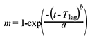

# PK-Sim® Formulations

In the building block **Formulation** the properties of the dosage form that is administered can be defined. Most of the predefined formulations are related to formulations typically administered via the oral route, whereas others, such as the **Zero Order** and the **First Order** release function, can technically be administered into any other compartment desired. Please note that not all combinations of formulations and administration routes are possible. For an intravenous administration (bolus and infusion), formulation is not required as a drug administered intravenously is assumed to be dissolved in a medium.

## Definition of new Formulations in PK- Sim®‌

To create a new formulation, do one of the following:

- Click on  **Formulation** in the **Create New Building Blocks** Group of the Modeling & Simulation Tab

- Right mouse click on **Formulations** in the **Building Block Explorer** and select **Add Formulation...**

- Use the short cut **Ctrl+Alt+F**

A dialog will open where the properties of the formulation can be selected and/ or defined.

The formulation is initialized by giving it a **Name** in the respective input field. The name is used to identify the formulation when its parameters are saved in the project and/or as a template. The name is also used for identification of the formulation in the simulation.

For the different types of empirical or user-defined release functions, the dissolution curve will be depicted in the adjacent graph as fraction of dose dissolved _vs._ time. To zoom into the plot either use the mouse wheel or keep your finger pressed on the left mouse button and move the cursor down to where you want the bottom right-hand corner to be. For **Particle Dissolution**, the dissolution function represents the result of the mechanistic dissolution model of the Noyes- Whitney type in combination with the physiological conditions, rather than an input function. Thus, the dissolution properties do not only change as a function of the physico-chemical properties of the drug and the formulation characteristic, but also with the physiological conditions of the individual or animal. The resulting fraction dissolved as a function of time within the intestinal segments represents a simulation output that can be displayed in the **Results Window** of the simulation (see [Shared Tools - Chart Component](../part-5/chart-component.md)).

From the drop-down menu you can choose from the following predefined formulations:

- Dissolved

- Weibull

- Lint80

- Particle Dissolution

- Table

- Zero Order

- First Order

In the following sections, the different formulation functions are described in more detail.

### Dissolved‌

Using this type of formulation the drug is assumed to be administered in solution. This type of formulation can only be combined with the Administration type **Oral**. However, e.g. by using the Zero Order function with an End time = 0, a bolus administration of a drug in solution into every compartment can also be simulated. For an intravenous administration types, i.e. intravenous bolus injection and intravenous infusion, the drug is aassumed to be administered in solution. In that case only, a formulaton building block is not required.


The formulation type **Dissolved** characterizes the drug as being in solution at the point of oral administration. However, in case of poorly soluble compounds the intestinal absorption may be limited by the solubility, with the solubility (or in case of ionizable compounds the local pH-dependent GI solubility calculated using to the Henderson-Hasselbalch equation), imposing an upper bound to the absorption rate.


### Weibull‌

The Weibull function can be used to empirically describe the dissolution behavior of various dosage forms. However, this function does not characterize the dissolution properties mechanistically. The advantage of the Weibull function is its ability to fit almost any kind of dissolution curve, and it is, therefore, often used to describe experimental data, especially when the mechanism of release that underlies dissolution is not known \[[7](../references.md#7)\] \[[30](../references.md#30)\].

When applied to drug dissolution and release from pharmaceutical dosage forms, the Weibull function expresses the accumulated fraction of the drug (m) in solution at a time t according to the following equation \[[40](../references.md#40)\].

where a is the scale parameter, defining the time scale of the process, the location parameter Tlag characterizes the lag time before the onset of the dissolution or release process, and the shape parameter b characterizes the curve as either exponential (b = 1), sigmoid (b > 1), or parabolic (b < 1).
  
The following parameters have to be defined when choosing the Weibull function:

- Dissolution shape corresponding to the shape parameter b and, thus, characterizing the curve as either exponential (b = 1), sigmoid (b > 1), or parabolic (b < 1).

- Dissolution time (50% dissolved) defining the time after the start of dissolution, when 50% of the administered dose is dissolved and, thus, corresponding to the scale parameter of the Weibull function.

- Lag time characterizing the time after which dissolution begins.

Please note that the Weibull function can only be combined with the Administration type **Oral**.

### Lint80‌

The Lint80 is an empirical function assuming linear release until 80% of the administered dose is dissolved. This type of formulation can also only be combined with the Administration type **Oral**.

The following parameters have to be defined when choosing the Lint80 function:

- The **Dissolution time (80% dissolved)**, defining the time, after the start of dissolution, when 80% of the administered dose is dissolved.

- The **Lag time** characterizing the time after which dissolution starts.

### Particle Dissolution‌

Particle Dissolution calculates the dissolution kinetics of spherical particles with a predefined particle size distribution based on the Noyes-Whitney approach. The details of the mechanistic dissolution model have been described by Willmann et al \[[102](../references.md#102)\]. In PK-Sim®, the particle dissolution can only be combined with the Administration type **Oral**. To simulate the particle size dependent dissolution, the following formulation-dependent parameters have to be defined in the **Formulation Building Block**.

- Thickness of the unstirred water layer (thickness of the diffusion layer).

- Particle size distribution (either normal or log normal, for polydisperse particle size distribution only).

- Type of particle size distribution (either monodisperse or polydisperse).

- Mean particle radius.

- Standard deviation of the particle radius (for polydisperse, normal particle size distribution only) or the coefficient of variation of the particle radius (for polydisperse, log normal particle size distribution only).

- Number of bins (for polydisperse particle size distribution only).

- Minimum particle radius, i.e. the lower limit for the particle radius (for polydisperse particle size distribution only).

- Maximum particle radius, i.e. the upper limit for the particle radius (for polydisperse particle size distribution only).

In addition, in order to use the Particle Dissolution function, the drug-related parameters have to be defined in the **Compound Building Block**. These include the aqueous diffusion coefficient, density of the drug material and the threshold for immediate dissolution. Further, you will have to indicate how the precipitated amount should be treated (either as soluble or insoluble).

### Table‌

Table defines the amount of drug applied per unit time as a continuous function. You can either manually specify time and fraction of the applied dose values or import dissolution data from Excel®.

In order to manually enter values:

- Click on **Add Point**  to add a new row to the table

- Enter appropriate values for **Time** and **Fraction (dose)** dissolved


The origin (0, 0) is always present. Values must be monotonically increasing in the **Time** column. The resulting function will be represented in the adjacent graphic. The absolute dose will be taken from the respective **Administration Protocol Building Block** that will later be used in the simulation.


In order to **import** experimental dissolution data from Excel®:

1.  Click  **Import Formulation**

2.  Select and open the Excel® file

3.  Import and transfer the appropriate Excel® sheet


For additional information about the import data and mapping workflow see [Import and Edit of Observed Data](../part-5/import-edit-observed-data.md).


### Zero Order‌

Zero Order defines the application as occurring in a dose-dependent manner. The required input is the time at which the entire application has been input **(End time)**.

### First Order‌

First Order defines the application as a first order input. The required input is the half-life of application value **(t1/2)**.

## Setting or Changing Formulation Properties‌

To set or change the properties of an existing formulation:

1.  Right mouse click on the respective formulation in the **Building Block Explorer**

2.  Select  **Edit...**

or simply double click on the formulation in the **Building Block Explorer**

The window with the properties of the formulation will open. The properties can be set or changed appropriately. The changes are saved by closing the window by clicking on .

## Cloning Formulations‌

To clone a formulation in the project:

1.  Right mouse click on the respective formulation in the **Building Block Explorer**

2.  Select  **Clone...**

3.  Set an alternative name for the formulation clone and enter a description, if desired.

4.  Confirm and close the window by clicking **OK** .

5.  ### Saving Formulations as Templates‌

For each project, a number of formulations can be defined. They can be saved as a template and then be shared among several projects and users.

To save an existing formulation as template:

1.  Right mouse click on the respective formulation in the **Building Block Explorer**

2.  Select  **Save as Template...**

In case a formulation with the same name already exists, a warning appears and you have the following opportunities:

- Override: This action will override the existing template.

- Save as: You can save the formulation under a different name. In this case, you will be asked to Rename the new template.

- Cancel: This action will abort the saving process.

## Loading existing Formulations from Templates‌

To load an existing formulation from the template database:

1.  Right mouse click on **Formulations** in the **Building Block Explorer**

2.  Select  **Load From Template...**

3.  Select the desired formulation from the user templates

In case a formulation with the same name already exists in the project, a warning appears and you will have to **Rename** the formulation that is to be loaded from template.

4.  Click **OK** 

The selected formulation will appear in the **Building Block Explorer** view.

In addition, formulations can be directly loaded from the template database within a simulation (see [Simulations](pk-sim-simulations.md)).

## Deleting Formulations‌

To delete a formulation from the project:

1.  Right mouse click on the respective formulation in the **Building Block Explorer**

2.  Select  **Delete...**

3.  Confirm to by clicking **Yes**


Please note that a formulation that is used in any simulation of the project cannot be deleted.

