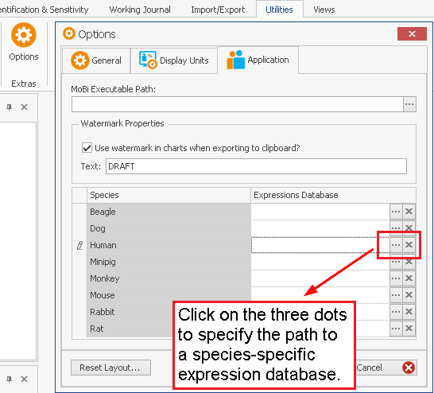

# PK-SIM Options

PK-Sim® can be customized using several options. To do this click on the **Options**
    
Button  within the **Utilities** Ribbon Tab.

Within the **User** Tab, you can specify the following user specific options:
    
## Numerical Properties

*   Allows scientific notation: You can specify if parameter values and results are displayed in scientific notation and if they are very small or very large.
    
*   Decimal place: You can specify the number of decimal places displayed for parameter values and results.
    
*   Maximum number of processors to use
    
*   Absolute tolerance and Relative tolerance: You can specify the absolute and relative tolerance in order to control the error of the ODE solver. Changes will only effect simulations that are created after changing values.


Setting tolerances lower than default values (absolute tolerance: 1.0E-10; relative tolerance: 1.0E-5) may cause conversion errors in simulations following oral administration.


## Look and Feel

*   Active skin: By changing the skin in the Skins group next to the Options icon the graphical appearance of the program can be changed.
    
*   Number of recent file items shown: Changes the number of recent documents displayed within the File Tab. The program needs to be restarted for the changes to take effect.
    
*   Preferred view layout: Choose from either tabbed or accordion view in e.g. the Compound window.
    
*   Restore opened view when loading project: Open tabs (e.g. particular simulations, individuals or compounds) are saved upon saving and restored when re-opening the project.
    
*   **Show software update notification if available**: When enabled and connected to the internet, a check for new versions of PK-Sim® is done automatically.

##	Defaults

*   Default species and Default population: Changes the default species and default population used for creation of a new individual.      
    
*   Default parameter layout: Changes the default parameter layout used for parameters shown within the Anatomy & Physiology ta b of an individual and within the Parameters tab of a simulation.
    
*   Lipophilicity, Fraction unbound and Solubility: You can specify the defaults for the description used for the Experiment input box when a new compound is created.
    
*   Population analysis: After the first simulation run an analysis window opens automatically. The default type of this first analysis ('Time Profile', 'Box Whisker', ...) is set by this option.

## Icon Sizes

You can change the size of the icons displayed within the **Tree view**, the **Tabs** and the **Context menu**

## Template Database Path

You can change the path to the template database or create a new template database by clicking on 

## Colors

*   Formula parameter: Changes the background color for parameters which are calculated by a formula.
    
*   Parameter changed: Changes the background color for formula calculated parameters which have been manually changed by the user.
    
*   Chart background and Chart diagram background: Changes the chart colors. For simulation charts, this is the default if no other color is specified in the Chart Editor of the Results Tab.
    
*   Disabled: Changes the background color of all boxes with non-editable content.
    

Within the **Application** Tab, you can specify the path to a species-specific **Expression Database** you would like to use. To do so, click on the three dots in the **Expression Database** column in the row of the species you require.

The available expression databases can be downloaded from
http://setup.open-systems-pharmacology.org/ 