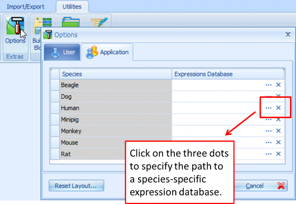

# Options

PK-Sim® can be customized using several options. To do this, click on the **Options** Button  within the **Utilities** Ribbon Tab.

## **General** Tab

### Numerical Properties

* **Allows scientific notation**: You can specify if parameter values and results are displayed in scientific notation and if they are very small or large.
* **Decimal place**: You can specify the number of decimal places displayed for parameter values and results.
* **Absolute tolerance** and **Relative tolerance**: You can specify the absolute and relative tolerance to control the error of the ODE solver. Changes will only affect simulations that are created after changing values.
* **Maximum number of processors to use** for tasks that can be executed in parallel (population simulations, parameter identification, parallel execution of simulations).
* **Number of bins**: number of bins to display in histograms of populations/population simulations for parameter distribution.


Setting tolerances higher than the default values (absolute tolerance: 1.0E-10; relative tolerance: 1.0E-5) may reduce simulation time but cause convergence errors.


### Look and Feel

* **Active skin**: The program's graphical appearance can be changed by changing the skin in the Skins group next to the Options icon.
* **Number of recent file items shown**: Changes the number of recent documents displayed within the File Tab. The program needs to be restarted for the changes to take effect.
* **Preferred view layout**: Choose from either tabbed or accordion view, e.g., the Compound window.
* **Restore opened view when loading project**: Open tabs (e.g., particular simulations, individuals, or compounds) are saved upon saving and restored when re-opening the project. Warning—this may significantly impact a project's loading time!
* **Show software update notification if available**: When enabled and connected to the internet, a check for new versions of PK-Sim® is done automatically.

### Defaults

* **Species** and **Population**: Changes the default species and default population used for the creation of a new individual or population.
* **Parameter layout**: Changes the default parameter layout used for parameters shown within the Anatomy & Physiology tab of an individual and the Parameters tab of a simulation.
* **Lipophilicity**, **Fraction unbound,** and **Solubility**: You can specify the defaults for the description used for the Experiment input box when a new compound is created.
* **Population analysis**: After the first simulation run, an analysis window opens automatically. This option sets the default type of this first analysis ('Time Profile', 'Box Whisker', ...).
* **Chart y scale**: Default scaling (lin or log) of the y axis in new time-profile charts.

### Icon Sizes

You can change the size of the icons displayed within the **Tree view**, the **Tabs,** and the **Context menu**

### Template Database

* **Template database path:** The path to the template database. You can create a new template database by clicking on 
* **Load metabolites when loading compound:** Choose whether or not to load the metabolites of a compound when loading a (parent) compound.

### Colors

* **Formula parameter**: Changes the background color for parameters that are calculated by a formula.
* **Parameter changed**: Changes the background color for formula-calculated parameters that have been changed by the user.
* **Chart background** and **Chart diagram background**: Changes the chart colors. For simulation charts, this is the default if no other color is specified in the Chart Editor of the Results Tab.
* **Color group observed data from same folder when dropping to chart**: If enabled, when adding observed data sets to a chart via drag-and-drop from a folder (or multiple folders) within the "Observed Data" group, all data sets within one folder will get the same color.

## **Application** Tab

* **MoBi Executable Path**: Path to the location of the MoBi.exe file

Specify the path to a species-specific **Expression Database** you would like to use by clicking on the three dots in the **Expression Database** column in the row of the species you require.

The available expression databases can be downloaded from the [gene expression databases repository](https://github.com/Open-Systems-Pharmacology/Gene-Expression-Databases/releases).
