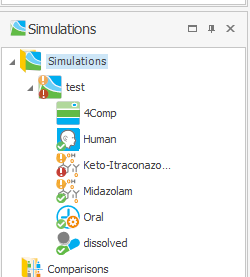
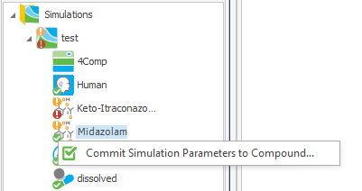
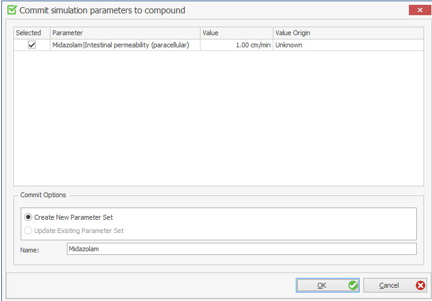
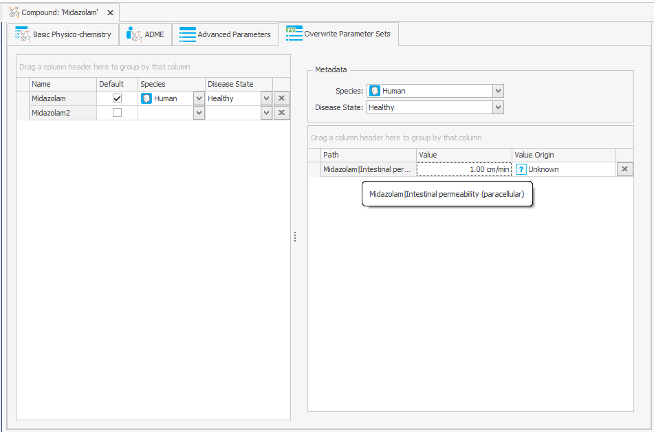
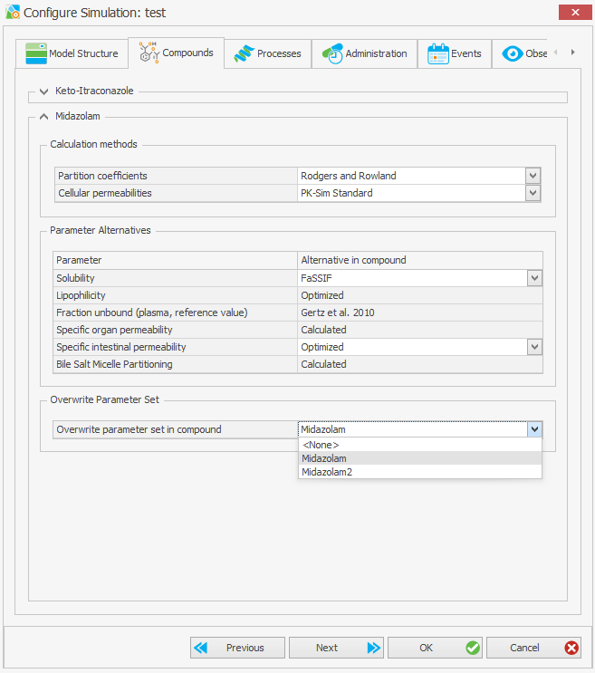

# Overwrite Parameter Sets

## Motivation

Not every compound-dependent parameter of a simulation is stored in the **Compound** building block. Many of them — for example organ-plasma partition coefficients, cellular permeabilities or the permeabilities of the endothelial barriers — are *calculated* during simulation creation from the physico-chemical properties of the compound and from the properties of the individual. Such parameters only exist inside the simulation, and PK-Sim® treats them as **simulation parameters**.

If you replace such a calculated value by a constant value of your own — for example a partition coefficient obtained from an in vitro experiment, or a permeability obtained by parameter identification — the new value lives in that one simulation only. It is not part of the compound, so it is not applied when the same compound is used in another simulation, it is not carried over when the compound is saved as a template, and it has to be re-entered manually every time.

An **Overwrite Parameter Set** solves this. It is a *named collection of parameter values* that is stored inside the Compound building block. You create it by **committing** the changed simulation parameters of a compound back to that compound, and you re-use it by **selecting** it when a simulation is created or configured. One Overwrite Parameter Set can be selected per compound and simulation, and selecting one is optional.


Overwrite Parameter Sets complement, but do not replace, the existing synchronization between a simulation and its building blocks (see [Synchronization options for building blocks in a simulation](pk-sim-simulations.md#synchronization-options-for-building-blocks-in-a-simulation)). **Commit to Building Block** writes back the values of parameters that *exist* in the compound; an Overwrite Parameter Set stores the values of compound-dependent parameters that *do not exist* in the compound.


## Which parameters can be committed

A simulation parameter is offered for a commit when both of the following are true:

- It is a **simulation parameter**, i.e. its value is not taken from a building block but is calculated during simulation creation.
- Its path contains the name of a compound that is used as a building block in the simulation configuration.

Compounds that are created inside the simulation but are not part of the simulation configuration — for example an unnamed metabolite of a parent/metabolite simulation — are therefore not considered.

Parameters that were applied from an Overwrite Parameter Set are also offered for a commit if you change them again, so a set can be refined step by step.

## Uncommitted changes

As soon as you change such a parameter, PK-Sim® marks the change as **uncommitted**. This is shown by an orange indicator:

- On the **simulation** in the **Simulation Explorer**, an orange overlay is added to the simulation icon as long as the simulation contains any uncommitted compound-dependent change.
- On the **compound inside the simulation**, a second, orange status indicator is added next to the green or red synchronization state, which itself does not change. The combination of a green and an orange indicator means that the compound is in sync with its building block but has uncommitted compound-dependent parameter changes; the combination of a red and an orange indicator means that it is out of sync *and* has uncommitted changes.



Resetting a parameter to its original value removes it from the uncommitted changes again, and undo/redo restores the previous state of the indicator. The list of uncommitted changes is saved with the project, so the indicator is still there when the project is reopened.

## Committing simulation parameters to a compound

1. In the **Simulation Explorer**, expand the simulation and right mouse click on the compound whose parameters you want to store.
2. Select **Commit Simulation Parameters to Compound...**




The action is only offered for a compound of an **individual simulation** that actually has uncommitted changes. Overwrite Parameter Sets can be *used* in population simulations, but they cannot be created from one — see [Population simulations](#population-simulations) below.


The **Commit simulation parameters to compound** dialog opens. It contains:

- A table of all uncommitted parameters of this compound, with the columns **Selected**, **Parameter** (the path of the parameter in the simulation), **Value** (with its display unit) and **Value Origin**. Every parameter is selected by default; clear the check box of the ones you do not want to store.
- A **Commit Options** group with two mutually exclusive choices:
  - **Create New Parameter Set** — enter a **Name** for the new set. By default it is filled in with the name of the compound. The name must not be empty and must not be used by another Overwrite Parameter Set of the same compound.
  - **Update Existing Parameter Set** — select an existing set from the **Parameter Set** drop-down list. This option is disabled as long as the compound has no Overwrite Parameter Set yet.



Confirm with **OK**. The set is created in — or updated on — the Compound building block of the project, and the committed parameters are no longer marked as uncommitted. The whole commit is a single action and can be undone.

### What happens when an existing set is updated

Updating an existing set is not a full replacement. PK-Sim® keeps the set consistent with the current state of the simulation:

- Parameters you are committing are added to the set, or their stored value is overwritten.
- Parameters that were in the set and that you have **reset** in the simulation since the last commit are **removed** from the set.
- Parameters that were in the set and that you have not touched are **preserved**.

After an update commit, re-creating the simulation with this set therefore reproduces exactly the parameter values the simulation has at the moment of the commit.

## The Overwrite Parameter Sets tab of a compound

The Overwrite Parameter Sets of a compound are shown in the same-named tab of the compound editor, after the **Advanced Parameters** tab. The tab uses a master-detail layout:

- The **list on the left** shows all Overwrite Parameter Sets of the compound with the columns **Name**, **Default**, **Species** and **Disease State**, followed by a button that deletes the set.
- The **details on the right** show the **Metadata** of the selected set above a table of its parameter values, with the columns **Path**, **Value** and **Value Origin**, followed by a button that deletes the entry. The value is displayed together with its unit.




New Overwrite Parameter Sets can only be created by committing from a simulation, never from this tab. The tab is for reviewing, documenting and correcting existing sets.


### Editing a set

In the parameter table you can:

- Change the **Value** of a stored parameter.
- Change the unit of the value, in the unit selector of the value editor. As for any other parameter in the suite, the displayed number is kept and the value in base unit is recalculated (see [Default, Display and Base Units](../part-5/default-display-base-units.md)).
- Set the **Value Origin** of the entry, to document where the value comes from.
- Delete a single parameter from the set, with the button at the end of its row.

Additionally you can:

- Delete an entire Overwrite Parameter Set, with the button at the end of its row in the list on the left, after confirming the deletion.
- Mark a set as the **Default** of the compound, or clear that flag. A compound can have at most one default set, and setting a new default clears the previous one. A compound is not required to have a default set. The default set is the one preselected when the compound is used in a new simulation; if the compound has no default set, no set is preselected (see [Using an Overwrite Parameter Set in a simulation](#using-an-overwrite-parameter-set-in-a-simulation)).

All of these changes can be undone.


An Overwrite Parameter Set that is used in any simulation of the project cannot be deleted. The error message lists the simulations that block the deletion.


### Metadata

Each Overwrite Parameter Set can carry optional metadata that documents its intended use — by default **Species** and **Disease State**, chosen from the species and disease states known to PK-Sim®. The metadata is purely informational: it is displayed in the tab and stored with the compound, but it is not used to filter or validate the sets offered in a simulation.

## Using an Overwrite Parameter Set in a simulation

The Overwrite Parameter Set to be used is chosen per compound in the **Compounds** tab of the **Create Simulation** window — both when a new simulation is created and when an existing simulation is configured (see [Review compound settings](pk-sim-simulations.md#review-compound-settings)).

The **Overwrite parameter set in compound** drop-down list offers **\<None\>** plus all Overwrite Parameter Sets defined for that compound:

- If the compound has a **default** set, it is preselected.
- If it has none, **\<None\>** is preselected.
- **\<None\>** means that the compound-dependent simulation parameters keep their originally calculated values.



The selected set is applied at the end of the simulation creation, after the model has been built. For each entry of the set, the parameter with the stored path is looked up in the new simulation and its value is replaced.

An entry is stored with the full path of the parameter in the simulation, which starts with the name of the compound or contains it as one of its elements:

```text
Midazolam|Intestinal permeability (paracellular)
```

The set can therefore only be applied to a simulation in which exactly these paths exist.

Parameters that were overwritten this way behave as **compound parameters** from then on:

- They are shown as compound parameters and lose the reset behavior of a simulation parameter, because their reference value is now the value stored in the set.
- Their value origin is taken from the entry of the set.
- They have no counterpart in the Compound building block itself, so they can only be written back through a commit to an Overwrite Parameter Set, not through **Commit to Building Block**.


If a path stored in the selected Overwrite Parameter Set cannot be resolved in the new simulation, PK-Sim® reports an error listing the unresolved paths and the **simulation is not created**. No value of the set is applied in this case. This happens when the simulation does not contain a parameter stored in the set, for example because a process the parameter belongs to is not part of the simulation, or because the simulation uses a different distribution model or different *Calculation methods* than the simulation the set was committed from.


## Population simulations

An Overwrite Parameter Set can be selected for a compound of a population simulation, and its values are applied in the same way. In addition:

- Each overwritten parameter is flagged as **not variable in the population**, so that the value taken from the set is kept for every individual.
- If an advanced (varied) parameter had already been defined for one of these paths, it is removed from the population simulation, so that it cannot override the value at run time.

Committing simulation parameters is not available from a population simulation. Create the set from an individual simulation and select it in the population simulation.

## Overwrite Parameter Sets and the rest of the project

- **Compound renaming.** Renaming a compound also renames the compound in all paths stored in its Overwrite Parameter Sets, so existing sets stay applicable.
- **Templates and snapshots.** Overwrite Parameter Sets are part of the compound. They are stored in the project, saved with the compound as a template, and written to and read from snapshots, and are therefore available when the compound is re-used in another project.
- **Update and commit of the compound.** A commit writes the Overwrite Parameter Set to the Compound building block of the project, not to the copy of the compound held by the simulation. Both **Update from Building Block** and **Commit to Building Block** on a compound of a simulation copy the Overwrite Parameter Sets of the building block into that copy, so that the sets defined in the project become visible and selectable there. Sets are never copied in the opposite direction.
- **Comparison.** Overwrite Parameter Sets are part of the comparison of two compounds (see [Comparison of Building Blocks](../part-5/comparison-building-blocks.md)).
- **MoBi®.** When a simulation is exported to MoBi®, the values of the selected Overwrite Parameter Sets are merged into the `ParameterValues` building block created for the simulation. MoBi® therefore receives the overwritten values without needing to know the concept, and no additional step is required.
