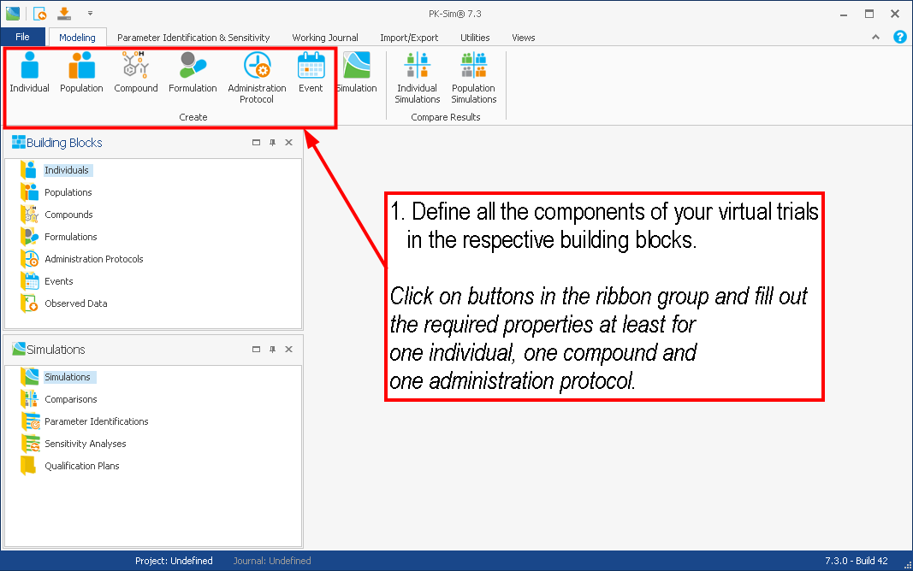
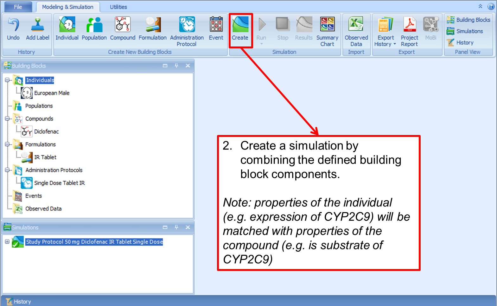
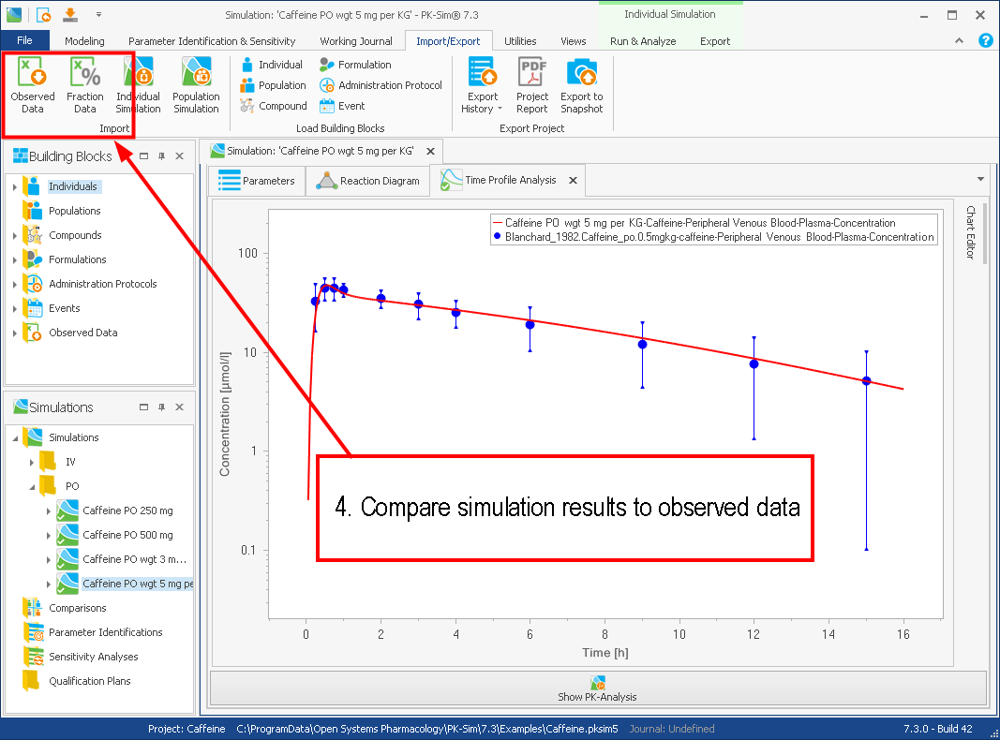
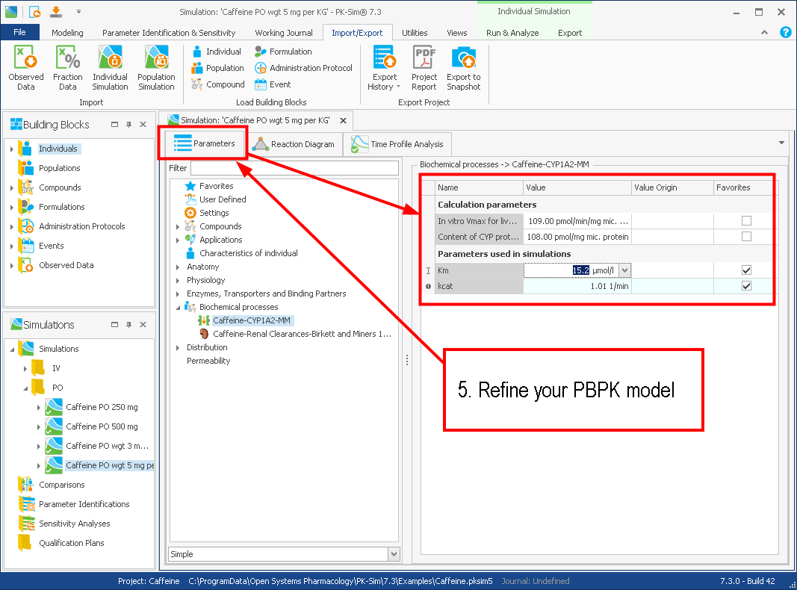
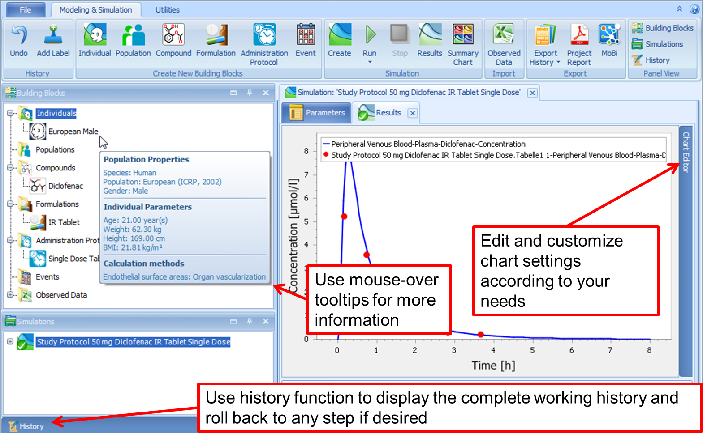

# PK-Sim® Quick Guide‌
    
Here, only the basic steps needed to work with a PBPK simulation in PK-Sim® are briefly described (creation of a model, comparison of simulation data to observed data and refinement of the model):

