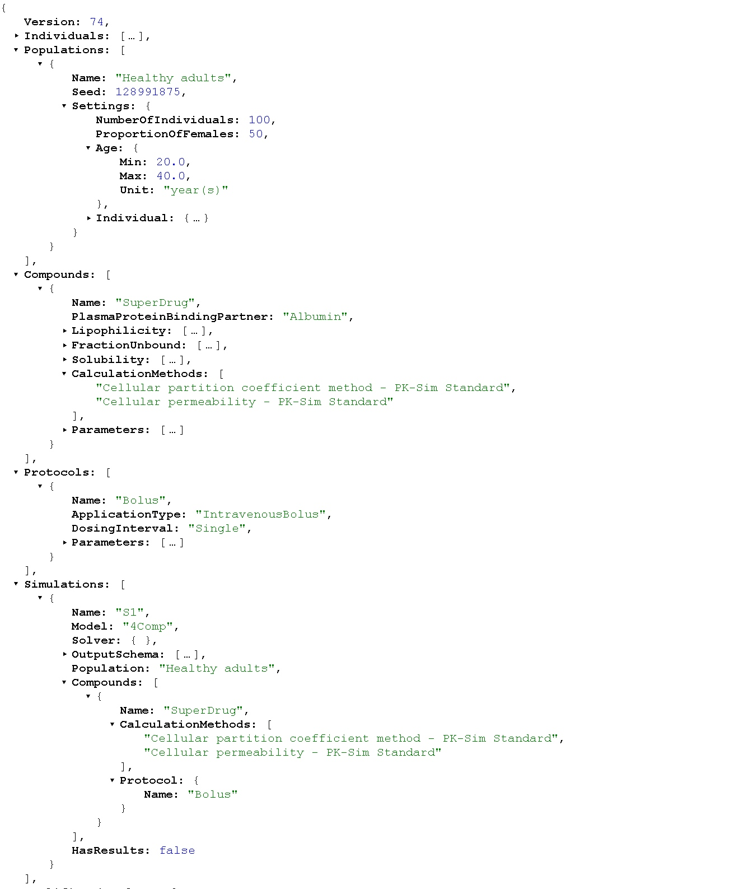
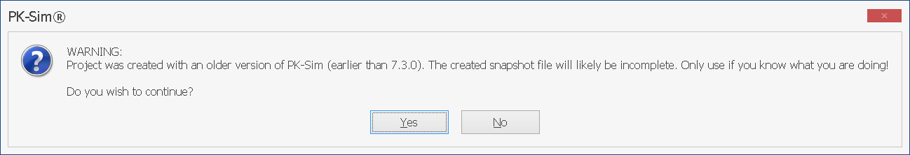
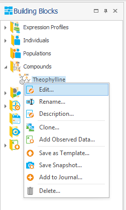
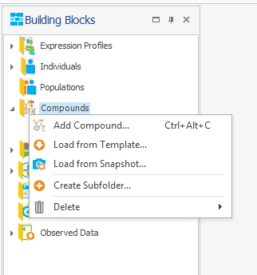

# Snapshots

PK-Sim® includes various structural models together with relevant physiological and molecular databases for PBPK modeling of small and large molecules in different animal species and human populations. Relatively few inputs from the user are required to setup a complete PBPK model.

Model and/or data information stored in PK-Sim® databases may change over time (e.g. in order to reflect the newest scientific findings) and be incorporated into newer PK-Sim® versions. Please ensure you have the latest version installed.

If an old project is simply opened with a new PK-Sim® version, it will contain **old** model information, **old** anatomical/physiological data etc. and will not make use of improvements in the new version. The most appropriate way to incorporate the new knowledge would be to **recreate, from scratch**, the existing project in the new PK-Sim® version.

To simplify this task, PK-Sim® offers the concept of **snapshots**.

A snapshot contains the **minimal amount of information** required to recreate a project - or a single building block - from scratch. This includes the information on primary substance specific input parameters (e.g., molecular properties like *molecular weight*, *lipophilicity*, etc.) and the required inputs (e.g., demographic characteristics) for defining the system parameters. Further, any changes made in the existing model, such as a change in liver volume, will be stored in the snapshot and included in the new model once recreated from the snapshot.

Snapshots are human-readable text files in [JSON format](https://en.wikipedia.org/wiki/JSON).


MoBi® supports the same concept for MoBi® projects, s. [MoBi Snapshots](../part-4/mobi-snapshots.md). MoBi® and PK-Sim® **project** snapshots are not interchangeable - a project snapshot records the application it was written with, and each application rejects a project snapshot created by the other with a message naming that application.


## Exporting a project to a snapshot / Loading a project from a snapshot

The following PK-Sim® entities are currently supported by project snapshots and will be recreated when a project is loaded from snapshot:

- All building block types (incl. observed data)
- Simulations
- Parameter Identifications
- Simulation comparisons

The following PK-Sim® entities are not yet supported:

- Sensitivity Analyses

To export a project to snapshot, select **File** :arrow\_right: **Export to Snapshot** 


Snapshots for a project created with a version of PK-Sim® <=7.2 might be incorrect. In this case PK-Sim® will warn you. If exported anyway, the new project created from this snapshot may have some undesired deviations from the original projects, which must be corrected manually by the user.



To load a project from snapshot, select **File** - **Load from Snapshot** 


When loading a project from snapshot, you can select whether to **run the simulations immediately** after loading or not. Not running the simulations can significantly speed up the loading process, especially for large projects with many simulations.


## Snapshots of single building blocks

Snapshots are not restricted to whole projects: every building block can be exported to, and loaded from, its own snapshot file. This applies to all PK-Sim® building block types:

- Compounds
- Individuals
- Populations
- Expression Profiles
- Administration Protocols
- Formulations
- Events
- Observer Sets

To **export** a building block, select **Save Snapshot...**  from the context menu of the building block in the **Building Block Explorer**.

To **load** building blocks, select **Load from Snapshot...**  from the context menu of the corresponding building block *folder* in the **Building Block Explorer**, and choose a snapshot file. The building blocks are added to the **open project**, so building blocks from different sources can be combined - this simplifies, for example, the assembly of a multi-compound project from separate snapshots.


The file must be a snapshot **of that building block type**, i.e. one written by **Save Snapshot...** on a building block of the same type. A file containing a snapshot of a whole *project*, or of a different building block type, is rejected.



**Individuals reference their Expression Profiles by name; they do not contain them.** An Individual snapshot stores only the *names* of the Expression Profiles assigned to it. When it is loaded, each name is resolved against the Expression Profiles **already present in the open project** - nothing is created from the Individual snapshot itself. A Population snapshot embeds the snapshot of its Individual, so the same applies to Populations.

To move an Individual (or a Population) between projects:

1. **Save Snapshot...** each of its Expression Profiles, and the Individual itself, to separate files.
2. In the target project, **load the Expression Profiles first**.
3. Then load the Individual.

If an Individual is loaded while a referenced Expression Profile is missing from the project, the name cannot be resolved and the Individual is not created.


**Observed data** behaves in the same way: **Save Snapshot...** is available in the context menu of a data set, and **Load from Snapshot...** in the context menu of the **Observed Data** folder.

## Snapshots in automated workflows

Snapshots are the input format of the batch workflows of the [PK-Sim command-line interface](pk-sim-command-line-interface.md):

* `run` executes the simulations of all snapshot files in a folder and exports the results,
* `snap` converts whole folders of `*.pksim5` projects to snapshots and back.

Snapshots are also the project format consumed by the [qualification](../part-5/qualification.md) workflow.
