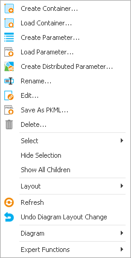

# Diagrams Overview

In this chapter you find an overview and details of the diagrams usage.

For the three building blocks **Reactions**, **Spatial Structure**, and **Simulation**, diagrams (also known as flow charts) are available in addition to the structure by lists or trees for the following reasons:

* Reactions and molecules form networks, which are much easier to comprehend from a graphical representation.
* The spatial structure consists of hierarchical containers, which are connected by so called neighborhoods; a two dimensional diagram can represent the structure much more naturally than a one dimensional list or tree.
* The simulation is built from a spatial structure and reaction networks within each compartment; so here the most complex graphical representation is required.

These diagrams are used for three purposes: visualization, navigation and editing of complex models.

In the following sections we will first describe these general concepts and features (using examples from a Spatial Structure diagram), and then the features specific for the different building block diagrams.

## General Visualization, Scrolling and Zooming‌

Obviously, you can comprehend two-dimensional network structures much easier in appropriate graphical representation. The most common example is an organism model exported from PK-Sim® to MoBi®, but you may also have simpler spatial structures (see “Spatial Structures” for an example).

You may zoom and scroll within the diagram, if the whole model cannot be displayed at once.

To scroll the diagram, use one of the following options:

* Use the scrollbars.
* Use the mouse wheel to scroll vertically or press the **Shift** key while using the mouse wheel to scroll horizontally.
*   For the spatial structure and simulation, there is a **Diagram Overview** to the left of the diagram and above the model tree. Here, the current clipping is marked by a rectangular frame. You can pick this frame at its edge and move it to select the displayed clipping of the diagram, i.e., to scroll the diagram.

    

To zoom the diagram, use one of the following options:

* Press the **Ctrl** key and use the mouse wheel to zoom in and out.
* Press the **Shift** key and drag the mouse to select a rectangle to zoom into the selected area.
* Right-click in the diagram to open the **context menu** and select a zoom command from the submenu **Diagram**.
* In the **Diagram Overview** (see above), use the mouse to grab the frame at the corner and resize it to zoom the diagram.


For visualization, model containers are represented by **container nodes**, which can be expanded and collapsed (see next section). Other model entities are represented by **elementary nodes** and **links**. Neighborhoods, for example, are represented by a neighborhood node and links.

## General Navigation, Expand and Collapse‌

You do not want to remain a passive viewer of these pictures, instead you want to use the graphical representation for navigation within the model and even for editing the model.

Of course, the navigation by the diagram and list or tree view is synchronized. You can navigate to some entity in the tree view or list and when you double click it, the diagram view is adjusted to show this entity and the **Properties Editor** opens.

Alternatively, you can navigate to some entity in the diagram, double click it, and the list or tree view is adjusted to show the entity and the properties editor opens.

In the spatial structure and simulation view, you can navigate into subcontainers and return to the parent container by expanding and collapsing a container. Do one of the following:

* Click the **expand** symbol  in the top left corner of a container to expand the container. Except for the parent containers, the superstructure is often masked out for clarity.
* Click the **collapse** symbol  to collapse a container. A possibly hidden superstructure is redisplayed.
* At anytime you can right-click into the diagram to open the context menu and select **Show all children** to show all hidden children of a container.
* Press **Shift** and click  to expand a container without hiding other containers.
* Press **Shift** and click  to collapse a container without redisplaying hidden structures.
* Press **Ctrl** and click  /  to expand resp. collapse a container recursively.


## General Editing‌

Editing is a more complex topic than navigating. You can make three kinds of changes:

* Model changes by adding or removing entities
* Diagram changes for example by changing or fixing the location of nodes
* Display changes like zooming and scrolling and Diagram options

The model and diagram state after changes is stored within the project, diagram options are stored within the user settings, zooming and scrolling is not stored.

You can perform many changes via the context menu. To open the **context menu**, right-click somewhere into the diagram. Depending on the location context, different menu items are displayed. The following context menu is shown when you right-click on a container.



The different context menu items are described in the sections below.

#### Model Changes‌

To edit the model, do one of the following:

* Select  **Create Container** from the **context menu** to add a new container (or any other entity type).
* Select  **Load Container** to load a previously saved container (or any other entity type).
* Select  **Rename** to rename an entity.
* Double click the entity or select  **Edit** from the context menu to focus and edit an entity.
* Select  **Save** to save an entity separate from the project. You can load such entities in the same or into other projects.
* Select  **Remove** to remove an entity.

### Diagram Changes‌

You can rearrange the position of nodes or hide nodes in order to get a better visualization in general or for publishing (you can export diagrams as bitmaps, see [More Actions](diagrams-overview.md#more-actions)).

#### Selection of Nodes

First select a single diagram node or a collection of diagram nodes you want to change. Do one of the following:

* Click a node to select it.
* Press the **Ctrl** key and click a node to add it to the selection
* Press the **Ctrl** key and drag a rectangle to add all nodes inside the rectangle to the selection
* Select **Select / All Children** from the **context menu** to select all children of a container.
* Select **Select / Visible linked nodes** to select all visible nodes, which are linked to nodes in the current selection.
* Select **Select / Invert selection** to invert the selection within a container.

#### Basic Actions‌

Now you can move, hide or resize the selected nodes:

* Drag the mouse to move the selected nodes. After moving a container, its neighborhood node positions are automatically adjusted.
* Select **Diagram / Location fixed** from the **context menu** to fix the location of selected nodes and prevent them from automatic movement (neighborhood node adjustment or Auto layout). You can deselect the checkbox, if you want to re-enable automatic movement.
* Select **Hide Selection** to hide the selected nodes.
* Select **Show all children** to show all hidden children of a container.
* If your collection contains not only container nodes but also elementary nodes, you can select **Large**, **Middle**, **Small** from the submenu **Nodesize** to change the node size of selected element nodes (neighborhoods, molecules, reactions, observers).


You may use different node sizes to emphasize important reactions and molecules or to minimize marginal reactions or molecules.


* Select  **Undo Diagram Layout change** to undo diagram changes like collapse/expand or auto layout. Model changes break the undo sequence, and also hide/show cannot be undone. Observe that the **History Manager** only stores model changes but not diagram changes.
* Select  **Diagram / To front** or  **Diagram / To back** to bring an element into front resp. back of another element/container in case of overlapping of containers and other nodes.
* Select  **Refresh** to refresh a diagram, for example after changing the Diagram Options (see [Display Changes](diagrams-overview.md#display-changes)).

#### Layout Actions

Instead of laying out the diagram by these basic actions you can also lay out the selected containers by using **diagram templates** or **auto layout algorithms**.

Auto layout of nodes via forces (repulsion by electrical charges, attraction by springs) is generally available, but yields inferior results in case of complex node networks. In the **Reaction** diagram, the context menu item "Auto layout in layers" yields good results in most cases, so using this function is recommended here.

The first template is often already used. When opening a Spatial Structure for an organism without diagram information (e.g., from PK-Sim®), a SpaceOrganismTemplate.mbdt is used - from the corresponding users profile (default path is C:\Users\\\AppData\Roaming\Open Systems Pharmacology\MoBi\3.0), if available, or else from the MoBi® installation folder.

Here are two tips, how you can benefit from templates:


You may define your own default organism template. For this purpose, save the organism container that you have modified according to your needs at the above location as SpaceOrganismTemplate.mbdt. (Saving templates is described below).



You can layout an organ in a simulation with all compartments expanded and reaction and transport networks arranged. Then save this organ container as template and apply this template to a selection of other organs.


To use a container template for layout:

1. Layout a container manually as described in the previous section.
2. Right-click in this container and select **Layout / Save Container as named Template** from the **context menu** to save the diagram information of the container and all contained elements as a template.
3. Select one or more containers, which you want to layout with this template.
4. Right-click on one of these containers and select **Layout / Apply named Template to Selection** to apply the container template to the selected containers. The diagram settings from the template and its contents will be transferred to the selected containers; the children are identified by their path.

In case of missing information in the template the respective element remains unchanged. In case of template elements not available in the container nothing happens.


You can use spatial structure templates for a simulation, but not vice versa.


In addition, you may use the following features:

* To save and load a diagram template, select the analogous items from the diagram context menu (right-click on the diagram pane).
* Select **Layout / Apply named Template to Container recursive** to apply a template to a container recursively; that means the template is applied to each subcontainer of the container. For example you can apply an organ template to all organs inside an organism by selecting this context menu item at the Organism container.
* Select **Layout / AutoLayout children** to apply a force-based auto layout.

#### More Actions‌

You can export a container as bitmap:

* Select **Diagram / Copy as bitmap** from the container or diagram context menu to copy the selected container or diagram as bitmap into the clipboard, from which you can insert it into documents or slides.
* Select **Diagram / Save as bitmap** from the container or diagram context menu to save the selected container or diagram as bitmap to a file.

### Display Changes‌

We have already explained in “General Visualization, Scrolling and Zooming” how to change the display of a diagram by zooming and scrolling.

You can change the general appearance of the diagrams in the **Diagram Options**

tab within the **User Settings** dialog (click  **Options** in the Utilities ribbon tab).

All these options are stored in the user settings and apply to newly opened diagram tabs. Refresh a diagram to apply the diagram options to an existing diagram tab (see “Basic Actions”).

The default node sizes apply only to newly created elementary nodes, because current node sizes may have already been changed by the user.

Here you can change the **diagram colors** for nodes and links.

You can change the **default node size** for reaction, molecule and observer nodes. You can show or hide

* the snap grid of the diagram pane,
* the molecule properties container in the spatial structure and simulation diagram,
* the observer links in the simulation diagram,
* Molecule nodes, which are unused in the simulation diagram containers.

## Reactions Diagram‌

### Visualization‌

The Reaction building block consists of a list of reactions. Each reaction has educts and products, which are listed in the stoichiometry tab of the reaction properties editor. In the reactions diagram the reaction is represented by a triangle with a blue educts port, a green products port and a red modifiers port.

Modifiers are molecules which influence the reaction, but which are neither consumed nor produced, e.g., enzymes. Modifiers, like educts and products, are listed in the properties tab of the reaction properties editor, so they can be used within formulas.

Besides these reaction nodes, the reaction diagram can contain molecule nodes. The molecule nodes themselves do not represent any model objects (neither from the reactions building block nor from the molecules building block), they only represent molecule names. Instead, an educt is represented by the connection between the educts port of a reaction node and a molecule node with the educt name. Products and modifiers are represented analogously by connections to the corresponding ports.


In the reaction diagram, no containers are used, so the remarks from “General Navigation, Expand and Collapse” do not apply here.


The diagram colors can be changed in the diagram options (see [Display Changes](diagrams-overview.md#display-changes)).


### Model Changes‌

You can **insert reactions and molecule nodes** by the context menu as described in “Model Changes”.

To **add an educt, product or modifier to a reaction**, connect a molecule node with its name to the corresponding port of the reaction node by doing one of the following:

```
1. Move the mouse to the outer circle or the molecule node until the mouse pointer looks like ; now you are in connection mode.

2.  Click and hold the left mouse button and drag the mouse to the intended port. A straight connection line is shown during dragging the mouse.

3.  When you reach the vicinity of a port, the connection line snaps to that port. Move the mouse to the vicinity of the intended port.

4.  Release the mouse button. A colored bended connection line is drawn now.

Alternatively, you can establish a connection in the opposite direction: Move the mouse first to the port until you are in connection mode () and connect to a molecule node as described before.
```

To **remove an educt, product or modifier from a reaction**, disconnect the molecule node from the corresponding port of the reaction node by clicking on the connection line (it will then be marked by four squares) and pressing the **Delete** key.

In the same way, you can remove an unconnected molecule node by clicking it and then pressing the **Delete** key.

### Diagram Changes‌

To move a molecule or reaction node, move the mouse to the center of the node until the cursor looks like  click it and move it around.

In circular reaction-molecule networks you may swap the positions of the educts and products port for some reaction nodes. To do so, check **Connect Educts right** in the **context menu** of a reaction node.

To apply an auto layout in layers to a reaction diagram, select **AutoLayout in layers**. This auto layout yields good results in most cases. Molecules and reactions are ordered from basic educts on the left to final products on the right. Any swapped ports for educts and products are therefore reset by this action.

You can emphasize and minimize reaction and molecule nodes by changing their node size in the context menu.


In more complex reaction-molecule networks, some molecule names may be used in many reactions. In such cases, you may prefer more than one molecule node for this molecule name to avoid long connection lines with many intersections. You can create so called **twin nodes** by inserting a molecule node with the same name. Ports are now connected to the nearest twin node of a molecule name - at least after a **Refresh**. You cannot connect them to a twin node further away.


## Spatial Structure Diagram‌

Most features of spatial structure diagrams have been explained in the general sections before.

To **insert a neighborhood** between two physical containers:

1. Move the mouse to the boundary of one of the physical containers you want to connect by a neighborhood until the cursor looks like ; now you are in connection mode.
2. Click and hold the left mouse button and drag the mouse to the other physical container. A straight connection line is shown when dragging the mouse.
3. When you reach the vicinity of a physical container, the connection line snaps to that container and turns from a thin red line to a thick black line. Move the mouse to the vicinity of the intended container.
4. Release the mouse. A **New Neighborhood** dialog appears.
5. Enter a unique name and click **OK**. A new neighborhood is generated.

## Simulation Diagram‌

Most features of simulation diagrams have been explained in the general sections before.

For the layout of a simulation diagram, you have an additional option. You can layout the underlying spatial structure and reaction diagrams first and then select **Apply current layouts from Structure and Reaction** from the **context menu** to apply that spatial structure layout to the container structure of the simulation diagram and to apply the reaction layout to the reaction-molecule network inside each physical container.

If you have opened (and possibly edited) the spatial structure diagram before you have opened the simulation diagram for the first time, the current spatial structure diagram (and the reaction diagram, if applicable) is automatically used as a template. Otherwise, when opening a simulation for an organism without diagram information (e.g., from PK-Sim® ) for the first time, the same SpaceOrganismTemplate.mbdt is used.

In the **Diagram Options** of the User Settings ([Display Changes](diagrams-overview.md#display-changes)) you can show or hide

* the molecule properties container in the spatial structure and simulation diagram,
* the observer links in the simulation diagram,
* molecule nodes, which are unused in the simulation diagram containers.
