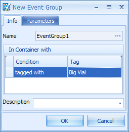
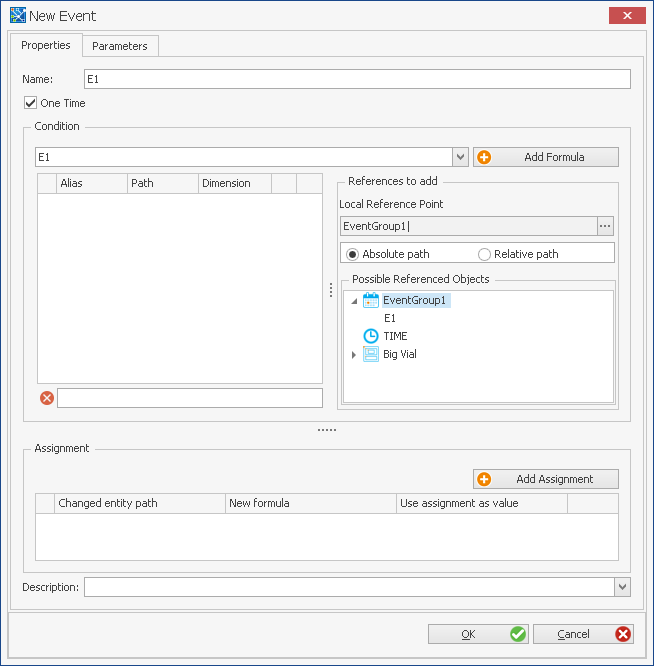
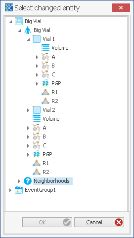
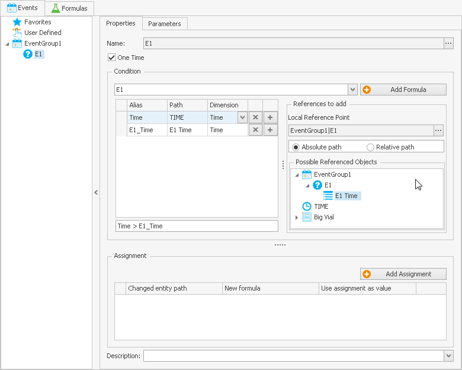
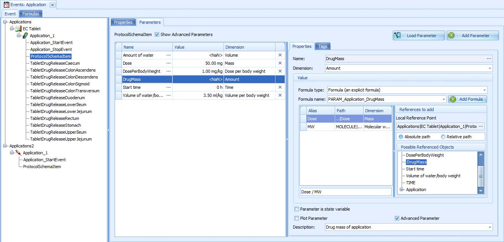

# Events Building Block

An **event** is used to change an entity, like the amount of molecules or a reaction rate, when a given condition is met. This condition can be, for example, that a given simulation time is reached, or that the concentration of a molecule has exceeded a certain value. Thus, such a programmed event is used to reflect external changes to the simulation, like the application of a drug or a sudden physical change in the spatial structure, like a vessel rupture.

A special case of an event is an **application**, which is used to apply a certain amount of a molecule to a container at a given time. This is typically used to simulate the administration of a drug to the body.

Events and applications are grouped in the **Events** building block (BB). Multiple events can be grouped in event groups, and organized in a hierarchy of  containers similar to that of a [spatial structure](spatial-structures-bb.md). Simulations imported from a PK-Sim® project contain all defined applications and additional events, such as food administration, in the events BB.

The following section describes the functionalities of the Events building block based on a PBPK model exported from PK-Sim. Later on, a simple [example](#example---creating-events) is given. Since the generation of an application in MoBi® can be rather complicated and is beyond the scope of this manual, we will restrict the description to adapting applications that were previously imported from PK-Sim®, where complex applications schemes can be generated more easily.

## Events - Functionality Overview

Events are organized in a tree structure. The top level container of the Events BB can be either an **Event Group** or an **Application**.

### Event Group

Event groups can combine **Applications**, **Events**, further **Event Groups**, and **Containers**.

An event group can be created within:
    - another event group,
    - Application

The top level event group has a *name*, the *container criteria* which determines where the events group will be created in a simulation, and a set of *parameters*.


Like for observers, an empty criteria for the events group means that the group will **not** be created in any container! The typical criteria for the events group is the `Events` node that is automatically created in an empty spatial structure.


### Application

Application is a special type of an event group that is defined for a specific **molecule**. In addition to the properties of an event group, an application has to specify an **administered molecule** and the path to the **Application Molecule Builder**.

 - **Application Model Builder**: Applications that add molecules to the system require an application model builder that is a virtual compartment for the administered molecule.

An Application can be created within:
    - an event group,
    - another application.

### Event

An **Event** is the actual event that changes something in the model, like the amount of a molecule or a parameter value.

Events can be created within:
    - an event (sub-)group,
    - an application.

Each event has 
    - parameters,
    - a start condition,
    - **One time** property - should the event be executed (maximal) once during the simulation? If true, the event will be executed only the first time the condition is met. If false, the event will be executed each time the condition is met.
    - list of assignments with
        - Changed entity path (parameter or molecule),
        - New value (or formula),
        - Property whether the new formula is applied only once as a calculated value at the time point of event execution, or the formula overwrites the value (or other formula).


    Setting the **One time** property to false may lead to unexpected behavior, especially if the event changes a parameter or molecule amount in a way that the event condition is always true after the first execution, e.g., with the condition `TIME >= StartTimeParameter`. In this case, the event will be executed at each simulated time step after the start time.


#### Event conditions

**Event condition** is defined by a logical expression that evaluates to `true` or `false` (examples: `Time = 100` or `Some_Parameter < 0.001 AND Another_Parameter >0`). Once the equation is evaluated to `true`, the event is executed.


Technically, the value of the equation is considered to be `true` if it is unequal to zero, and `false` if it is equal to zero.


See [Formulas](parameters-formulas-tags.md#formulas) for details on how to create formulas with conditions.

**Conditions based on the simulation time**

Whenever a condition compares the simulation time with an expression that is **constant during the simulation** - a number, a constant parameter, or a formula of constant parameters - the value of that expression is added to the time points at which the solver evaluates the system. Such a condition is therefore guaranteed to be evaluated at exactly this time, independent of the output intervals and resolution defined for the simulation. This applies to comparisons of the form `Time <operator> <constant expression>` as well as `<constant expression> <operator> Time`, and to any combination of such comparisons with `AND`, `OR`, and `NOT`.

For example, the condition `Time = 10 OR Time = 20 OR Time = P1 OR Time = P1 + P2` (with `P1` and `P2` being constant parameters) is evaluated at the time points 10, 20, `P1`, and `P1 + P2` - in addition to all time points defined by the output intervals.


Such a time point is used to evaluate the condition, but it is not automatically added to the simulation results. If the execution time of an event is not part of the output intervals, the event is still executed at exactly this time, but the resulting change will only become visible in the outputs at the next output time point.


Consequently, use `=` to let an event happen at a given time, e.g., `Time = 500`. For a **one time** event, `Time >= 500` is equivalent.


Do **not** use `>` to define the start time of an event, e.g., `Time > 500`. The condition is evaluated at 500 and returns `false` there, so the event will only be executed at the next output time point after 500. The actual execution time then depends on the output resolution of the simulation.


If you plan to quickly test different execution times, it is advantageous to define the time as a parameter which can be altered in the simulation, e.g., `Time = StartTimeParameter`.


If the condition depends on the system state (parameter or state variables calculated during simulation), no time point can be determined in advance, so the condition is only evaluated at the time points defined by the output intervals and resolution. In particular, if such an event should be repeatedly fired during the simulation (i.e., the **One time** property is set to false), the event will only be fired if this condition is met within the defined output interval and resolution! This may lead to unexpected behavior if the output resolution is too coarse. For example, if the condition is `Concentration > 1 && Concentration < 2` and the concentration is 0.5 at time point t1 and 2 at time point t2, but no output is defined between t1 and t2, the event will not be fired since the condition was not met at any of the output time points.

A discussion on this topic can be found in the [MoBi® Forum](https://github.com/Open-Systems-Pharmacology/MoBi/issues/321).


#### Events assignments

An **assignment** defines what should be changed when the event is executed. Each event can have multiple assignments. Each assignment has the following properties:

- **Name**: A unique name for the assignment.
- **Changed entity path**: Path to the parameter or molecule that should be changed by the event.
- **Assignment**: New value or formula that should be assigned to the entity.
- **Use assignment as value**: If true, the assignment is used as a calculated value at the time point of event execution. If false, the assignment (formula) overwrites the value (or other formula).

### Container

Containers can be created within:
    - an event (sub-)group,
    - an application.

A container can be either **logical** or **physical** and behaves similarly to containers in a [spatial structure](spatial-structures-bb.md). The container can have tags and parameters.

**Logical containers** are used to group parameters.

**Physical containers** can contain parameters and molecules. Typically required for applications with transport processes as the *source* container.

### Transport

Transports can be created within applications. An application transport is similar to a [passive transport](passive-transports-bb.md). It defines a transport process between a *source* and a *target* container. The *source* should be a physical container within the application. The *target* can be any physical container in the spatial structure.

In contrast to passive transports, it is not required to define a neighborhood between the source and the target. This neighborhood will be automatically created during simulation build.

## Example - Creating Events

Continue with the simple example we have been developing in the previous sections. Open the Events building block or create a new one by right clicking on the module and selecting "Add Building Blocks".

### Event Groups and Events

To **create a new event group**, either

* use the  **New** ribbon button,
* or right-click into the white space in the event edit window and select the  Create Event Group command.

A window named "New Event Group" will open. Then proceed with:

1. Enter a unique name into the Name input box, like "EventGroup1".
2. Enter a condition to define for which containers the event will be applicable. In order to do so, click into the white space below the "In Container with" field, and select **Match tag** condition or new **Not match tag condition** - depending if you want to include or exclude containers with a specific name or tag. In our example project, select `BigVial` as a **Match tag** condition. This will create the event group in the `BigVial` container only.

As in other instances, you may define parameters for an event group. To access the parameters window, click on the **Parameters** tab in the right part of the edit window. Entering a parameter entry works in the same way as described for molecules, reactions, or for spatial structure containers. Examples for event group parameters are values for event timing or amounts of molecules that you want to set within the individual events of this event group.

After the event group is created, individual events can be defined for this group. Right-click your event group, and you will see the options you have in the context menu. These are:

* Edit - this has the same function as selecting the name.
* Rename
* Save As PKML - saves the selected event group to a pkml file.
* Delete - deletes the selected event group.
* Create Application - see [Applications](#applications).
* Load Application - see [Applications](#applications).
* Load Application From Template
* Create Event - creates a new event within the current event group.
* Load Event - loads an existing event from a pkml file.
* Load Event From Template
* Create Event Group - creates a new event group below the highlighted event group.
* Load Event Group - loads an existing event group from a pkml file below the highlighted event group.
* Load Event Group From Template
* Create Container - see [Applications](#applications).
* Load Container - see [Applications](#applications).
* Load Container From Template

To create an event, click the **Create Event** option. A window named "New Event" will open (see image below). Then proceed with the following steps:

1. Enter an event name in the Name input box, e.g. "E1".
2. If your event should only be executed once during the simulation, check the box  **One Time Event** below the name. This is a useful option if, for example, you want to set an amount of molecules to a new value at a given time. For this example, check this box.
3. The section "Condition" below the checkbox requires that you enter an event condition name, which is comparable to a formula name of a reaction or a parameter. Click on "Add Formula" and name it "E1".
4.  To have more space for building the condition, close this window now by clicking **OK** or pressing **Enter** to complete the event building in the edit window. However, all required data could also be entered in the "New Event" window.

5. Continue working with the right part of the edit window with building the event in the "Properties" tab. From the Possible Referenced Objects tree, you need the TIME variable, which reflects the simulation time. The procedure is the same as described for referenced objects used in reaction equations (see [Reaction Kinetics](reactions-bb.md#reaction-kinetics)): Drag the TIME with the mouse to the left hand side and release it in the white space below the "Alias" header under the "Condition". "Time" should appear in this field.
6. There is still a Condition equation to be entered, as indicated by the red error sign  in front of that input box. The easiest way to let an event happen at a given simulation time would now be to enter the formula "Time = 500", which would execute the event at 500 minutes. As described in [Event conditions](#event-conditions), the condition is guaranteed to be evaluated at exactly this time point, so `=` is the operator of choice here - `Time > 500` would delay the execution to the next output time point after 500 minutes. Instead of entering the time directly into the condition, we will define it as a parameter, which makes it easy to test different execution times later on.
7. Define a time parameter as an event parameter (alternatively, it can be set as an event group parameter if it is needed in several events of this group). Click the "Parameters" tab, then the button  **Add Parameter**. A "New Parameter" window opens.
8. Enter "E1Time" as parameter name.
9. Select Time from the combobox "Dimension".
10. Enter "500". If you prefer to do this in other units than minutes, you may change the dimension (e.g., to "h") in the combobox to the right of the value.
11. Click **OK** or press **Enter**. The new parameter will appear in the parameters list.
12. Click the "Properties" tab. Drag and drop the newly created parameter "E1Time" from the Possible Referenced Objects list on the right into the white space below the already added "Time" reference. To find this parameter, you need to look below the E1 event, so click on the + sign to open that part of the reference tree. In case you have defined the parameter under the event group, you will find it below the event group.
13. Enter `Time = E1Time` into the formula input box, after which the error sign  to the left of it should disappear.
14. What is still needed is the assignment which determines what will happen when the event condition is fulfilled. As an example, we will set the amount of molecule "A" in the container "Vial1". To proceed, click the button **Add Assignment**. A window named "New Event Assignment" will open.
15. Enter "SetA" as name into the Name input box.
16. Click the **...** on the left hand side of the "Changed Entity" input box below Name. A window named "Select Changed Entity" will open. Select the molecule "A" in `BigVial|Vial1` as target.

17. Click the **OK** button. The red error symbol  to the left of the "Changed Entity" input box should now be gone, and a path to molecule A, `BigVial|Vial1|A`, should be visible.
18. Check the box  **Use Assignment As Value**, then enter "50" into the Value input box. This will set the amount of molecules to 50 µmol in "Vial1" when the event is executed. Finally, click the **OK** button or press **Enter**. The screen should look like in the following image, and the event is now completed.

Events can change a number of assignments, like reaction or transport rate constants, container volumes or neighborhood parameters. The entire formula of a reaction or transport may be changed by not checking "Use Assignment As Value" during the creation of an assignment, and by selecting Formula instead of Constant in "Formula Type". Also, you may change several assignments upon one condition: just click the button "Add Assignment" again, and you can go through the above steps 14 to 18 again and have another value changed.

Instead of a one time event, you can have an **event permanently active** if you uncheck the box  **One Time Event** in "Properties". For this, the condition must stay `true` after the start time, so change it to `Time >= E1Time`: in our example of setting the amount of molecule "A" to 50 µmol, this would result in keeping the amount of "A" constant at 50 µmol from 500 minutes on. With the condition `Time = E1Time`, it makes no difference whether the box is checked or not, since this condition is only `true` at exactly 500 minutes.

An assignment can be changed by the following actions:

* Click the **...** symbol to the right of "Changed Entity Path", and you will see the Select Changed Entity window again to alter the above choice.
* In the "New Formula" input box (or row in case of several assignments), you can change between different values or formulas for the target assignment.
* The box  **Use Assignment As Value** can be changed to insert a formula at the assignment.
* The  symbol has the same function as the button **Add Assignment**.
* Clicking the  symbol will delete the corresponding assignment.

### Applications

An application is basically an event group with a more complex structure than that described in the previous section. In almost all cases, the application will be created within PK-Sim®and then transferred to MoBi®. The scope of this section will be limited to working with this recommended workflow.

The image below shows two example applications imported from PK-Sim®, an  intravenous (iv) and an oral administration. You can see the two application in the tree view of the event edit window. Each application consist of the application group, the application start event, and the protocol schema item. To make changes, look at the parameters of the protocol schema item, as displayed in the image.

You may make changes in the following parameters of this group:

* Altering **DosePerBodyWeight** will change the dose per kg body weight. This will only work if it was used in the original PK-Sim® project, which can be recognized by having a formula in the **Dose** parameter.
* Altering **Dose** will let you change the absolute drug dose administered. If the original PK-Sim® project contained a dose per body weight, that formula will be overridden by the absolute value.
* The time where the drug administration starts can be altered by changing the **Start time parameter**.
* The volume of water per body weight can be changed for oral applications only by using the parameter **Volume of water / body weight**. This will only work if it was used in the original PK-Sim® project, which can be recognized by having a formula in the **Amount of water** parameter.
* Altering **Amount of water** will let you change the absolute amount of water administered with the drug. If the original PK-Sim® project contained a volume of water per body weight, that formula will be overridden by the absolute value.
* The other parameters of this block should not be changed.


The descriptions at the bottom section of each parameter gives you more information on each parameter.


More complex changes, like changing complex dosing schemes or changing dissolution patterns, are much easier to achieve using the user interface of PK- Sim® and then exporting the corresponding simulation. Within a MoBi® project, you may then combine drug applications from several PK-Sim® exports. The following describes the workflow for this operation:

1. Save all applications of interest as PK-Sim® simulations to pkml files (see [Export to \*.pkml file for MoBi®](../part-3/importing-exporting-project-data-models.md#export-to-pkml-file-for-mobi)).
2. Load your MoBi® project.
3. Right-click the Events entry in the building block explorer, select  **Load Event Group Building Block**.
4. Enter the name and location of your pkml file. You may be asked for a new building block name. A new Events building block is created.
5. When creating a simulation ([Create a Simulation](setting-up-simulation.md#create-a-simulation)), you can now select between several possible application building blocks.


A collection of template files with predefined building blocks is automatically installed together with MoBi® in the default program data directory. The entry "Templates" in the program start menu in the MoBi program group will lead you to the proper path.



Descriptive names for each of these applications building blocks could be helpful. Use the  **Rename** function from the building block context menu for this purpose.
