# MoBi - Exmple Workflows

The following workflows illustrate how to use MoBi in different scenarios.

## Modularization use case - adding a tumor to a PBPK model

This workflow illustrates how to add a tumor compartment to a PBPK model in MoBi. The steps are as follows:

- Export a simulation from PK-Sim to MoBi. This will create a PK-Sim module.

    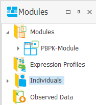

- Open the spatial structure of the PK-Sim module, select a tissue organ (e.g., muscle), and export it to pkml, e.g. as "**Muscle.pkml**".

    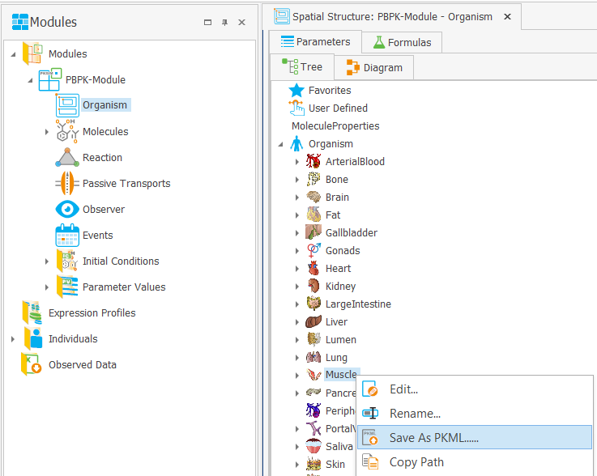

- Optionally, select an individual and expression profile(s) to include in the exported organ.

    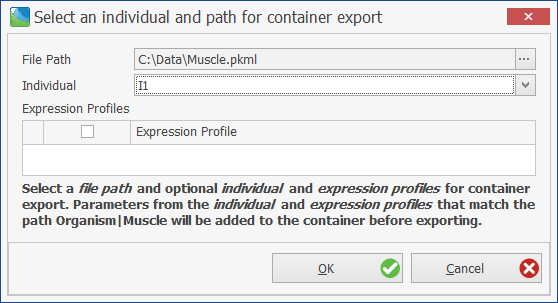

- Create a new "Tumor" extension module with the "Spatial Structure" and "Initial Conditions" building blocks.

    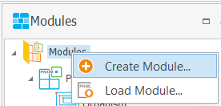 

    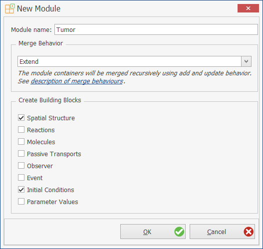

- In the "Tumor" extension module: open the spatial structure and load the top container from the previously saved file Muscle.pkml.

    
    Note that the neighborhoods between muscle and arterial/venous blood are also loaded.
    

    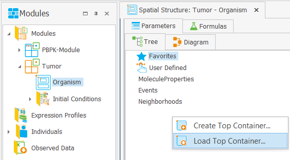
    
    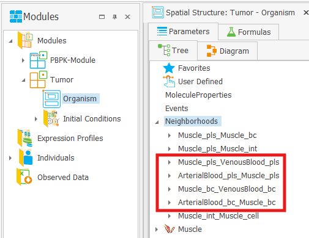

- Rename the "Muscle" container to "Tumor". **Be sure to check the "Rename Related Entities" checkbox in the next dialog!**.

    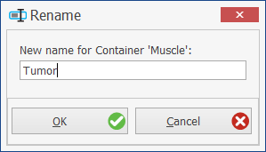

    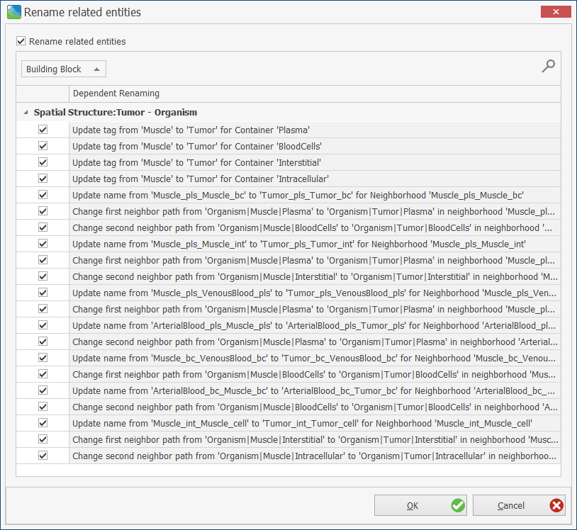

    
    After renaming, the neighborhoods have been renamed accordingly.
    

    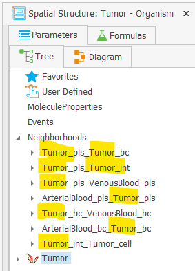

- Open the Initial Conditions building block of the Tumor module and click on "Extend".

    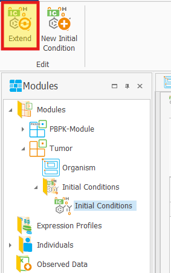

- Select molecules to be incorporated into the tumor.

    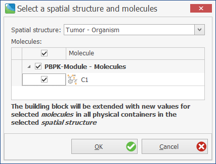

    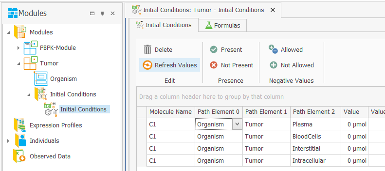

- Create a new simulation and select both modules (make sure that the PK-Sim module is on top!).

    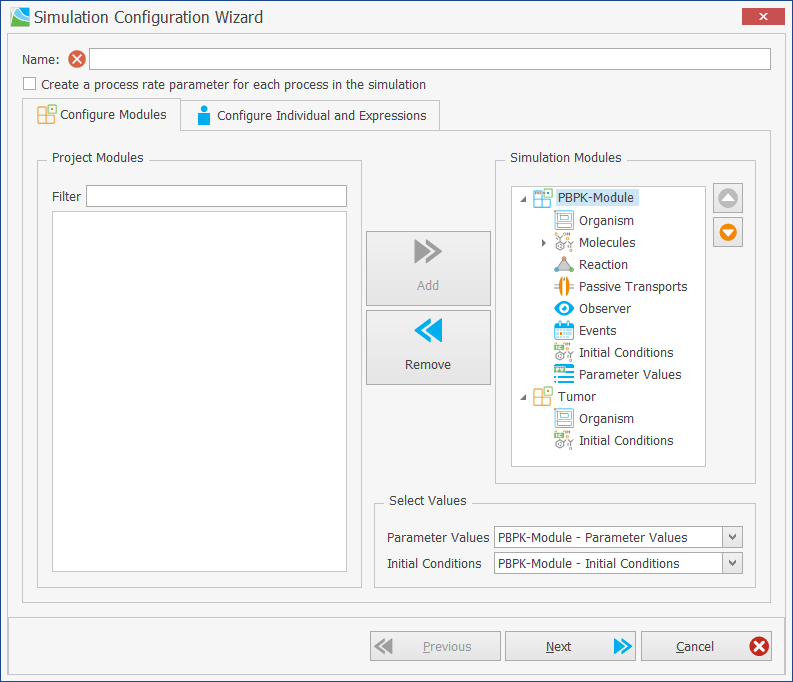

 In the next step, optionally select an Individual and Expression Profile(s).

   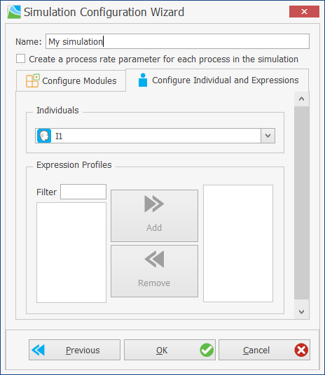

- The "Tumor" organ will now appear in the simulation.

    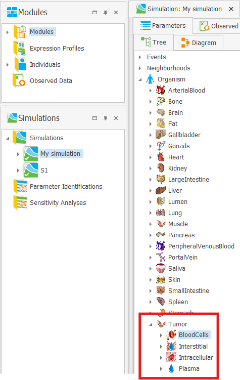

- Tumor drug concentrations, etc. can now be plotted in the simulation.

    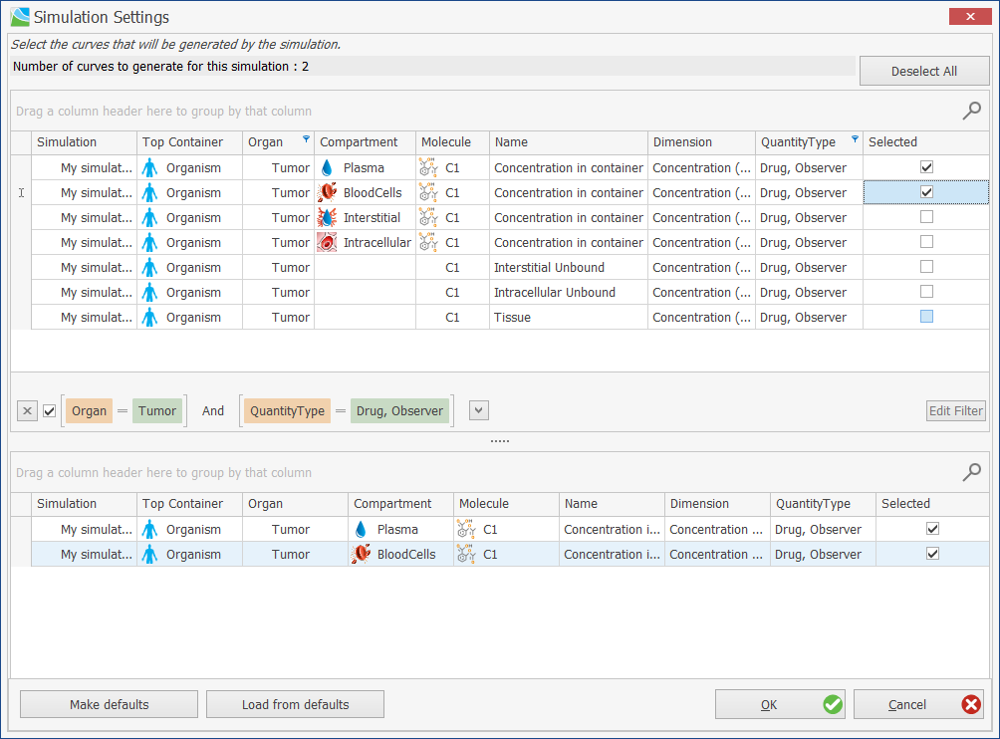
    
    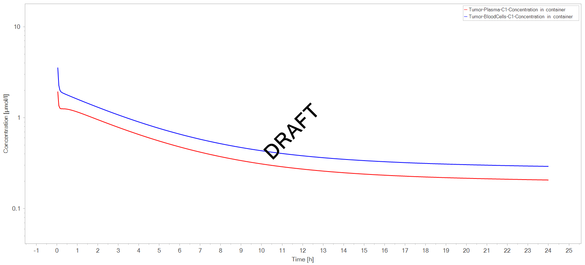