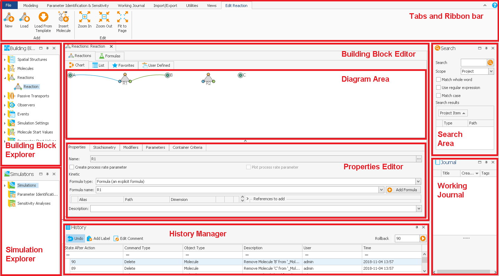
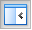
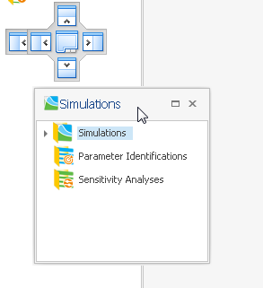
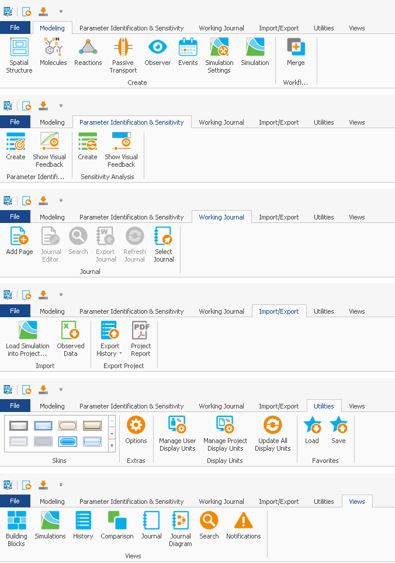
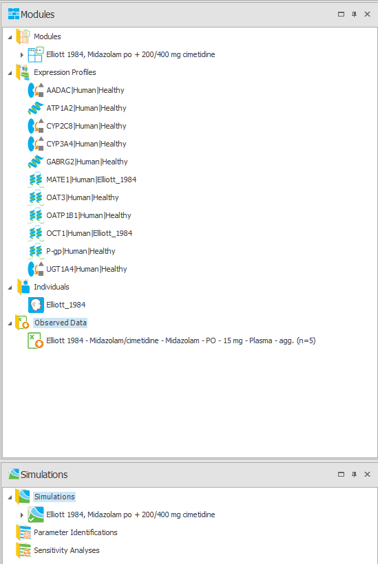
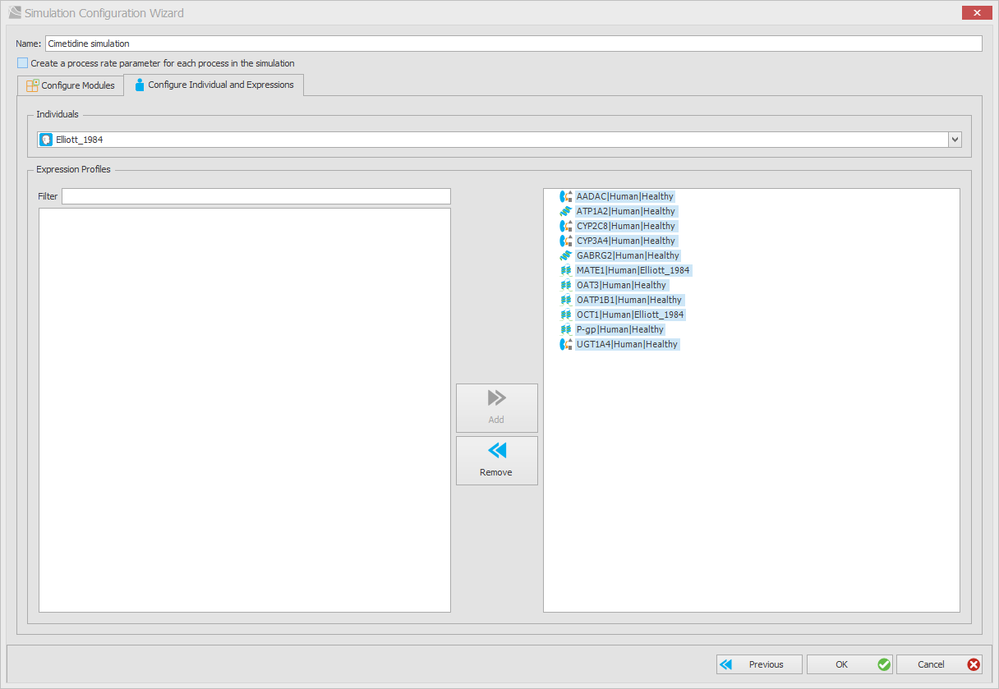

# MoBi®‌ - First Steps

This section guides you to your first project with MoBi® and familiarizes yourself with the software's user interface. If you are already familiar with MoBi® and want to learn about the modularization concept, please refer to [Modularization concept](modularization-concept.md).

First, the window structure of MoBi®and the basic steps for setting up a new MoBi® project are described, followed by a description on how to set up and carry out a simulation. Additionally, the import of a PK-Sim® simulation is explained. However, more sophisticated applications can be performed in MoBi®, and you are referred to the following chapters for a more detailed description.

To create your first MoBi® project, simply follow the steps described in the sections below.

## MoBi® - Window Overview‌

In this section, we give a brief overview of the MoBi® window architecture and introduce some nomenclature.

A typical MoBi® window looks like screenshot below. The window contains different subviews; although some of them are visible only after creating a project, we describe them right here in a comprehensive way.

- The tabs **File**, **Modeling**, **Parameter Identification & Sensitivity**, **Working Journal**, **Import/Export**, **Utilities**, and **Views** with the **Ribbon Bar**. Additional tabs may appear depending on the context, e.g. when editing a building block or a simulation.

- The **Modules Explorer** in the upper left section, which gives access to all modules and their building blocks, the individuals, expression profiles, and observed data of the current project,

- The **Simulation Explorer** in the bottom left section, which lists all Simulations, Parameter Identifications, Sensitivity Analyses, and Results (comparisons) views defined in the current project,

- The **History Manager** at the bottom that shows the history of model development,

- The **Building Block Editor** with a building block specific layout. Generally, it consists of a **List**, **Tree**, or **Diagram Area** of all elements of the building block and a **Properties Editor** where you can edit the properties of the selected Element.

You can rearrange the window by different actions:

- Click  to hide the ribbon bar or  to show it,

- Click  to auto hide the **Building Block Explorer**, the **Simulation Explorer** or the **History Manager** or  to dock it,

- Click  to close these views or click the corresponding symbol in the Views group in the **Utilities** ribbon bar to open it,

- Furthermore, you can drag these views and dock them to a different location. To do so, click on the title bar of the view, drag it around and drop it on one of the icons like 

In the following we describe some details of the different subviews.

The **ribbon bar** offers access to the various functionalities of the application.

The **Modules Explorer** shows all modules with their building blocks **Spatial Structures**, **Molecules**, **Reactions**, **Passive Transports**, **Observers**, **Events**, **Parameter Values**, **Initial Conditions**, and the building blocks for **Individuals** and **Expression Profiles** that are located outside of the modules. Additionally, you may find imported observed data in the modules explorer. More information on the concept of modules can be found in [Modularization concept](modularization-concept.md). The different building blocks are explained in [The Building Block Concept](building-block-concepts.md).


For convenient organization of the project, modules can be grouped in folders in the Modules Explorer.


A detailed introduction on how to develop models in MoBi® is given in [Model Building and Model Components](model-building-components.md). An in-depth explanation on how to create simulations from the modules can be found in [Setting up a Simulation](setting-up-simulation.md).

Once you have defined the simulations in the current project, the **Simulations Explorer** lists all of them. For details, see [Simulation Results](simulation-results.md).

The **History Manager** lists all modeling steps and gives the opportunity to look at earlier versions and thus at the modeling history of the project. For details, see [History Manager and History Reporting‌](../part-5/history-manager-history-reporting‌.md).

## Import PBPK Models from PK-Sim®‌

To develop a model in MoBi®, you can either create it from scratch or import a PBPK model from PK-Sim® and extend it. To import a PBPK model, proceed as follows:

1.  In PK-Sim®, create a simulation with the desired compound and individual.
2.  Save the simulation as `*.pkml` file (see [Export To MoBi®](../part-3/importing-exporting-project-data-models.md#export-to-mobi)).
3.  Start MoBi®.
4.  Open the `*.pkml` file using the **File** menu and choose the  **Open Simulation** command.

The simulation is loaded into MoBi® as a separate **PK-Sim module**. Additionally, an Individual and a set of Expression Profiles are created in the **Modules Explorer**. Furthermore, observed data are imported if they were part of the PK-Sim® simulation.

To add extensions to the PK-Sim® module, create an **Extension Module**. To do this, right-click the **Modules** folder in the **Modules Explorer**, and select  **Create Module...** from the context menu. A new window titled "New Module" will open. Enter a name for the new module (e.g., "Cimetidine Extension"), select the building blocks that should be created in the module, select the merge behavior (see [Modularization concept](modularization-concept.md) for details), and click **OK**. The new module will appear in the Modules Explorer.


You can always add building blocks later if you did not select them when creating the module.


## Create a Project‌ from scratch‌

Alternatively, you can create a new project from scratch. The first step to start working with MoBi® is to create a new project. To do this, click on **New** in the **File** menu. You can either work with amount or concentration based reaction networks which needs to be specified when creating a new project.

Create a new module, and create all building blocks in it by selecting them in the "New Module" window. See description of the building blocks on how to populate them with the required information.

## Create and Run a Simulation‌

With a model imported from PK-Sim® or created from scratch, you can now create and run a simulation. To do this, follow the steps below:

1.  In the ribbon tab **Modeling**, click the  **Simulation**. The simulation creation wizard allows you to enter simulation name, select the modules to combine, and choose the individual and expression profiles.

3.  Enter the simulation name.
2.  Select the modules to combine (e.g., the PK-Sim® module and the extension module you created earlier).

3. Click "Next >".
4. Select the individual and the expression profiles you want to use for the simulation.

5. Click "OK".

6.  Click the orange arrow  ribbon button to run the simulation, or alternatively press the **F5** key.

After the computation is done, the simulated results are displayed in the **Results** tab. On the right, a vertical **Chart Editor** panel is visible.

The **Chart Editor** allows you to select the data to be displayed in the chart, and to customize the chart appearance. See [Chart Component](../part-5/chart-component.md) for details.