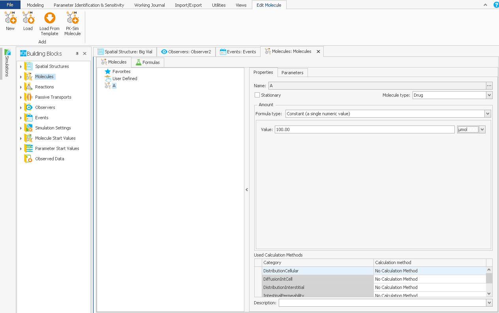

# MoBi®‌ - First Steps

This section guides you to your first project with MoBi® and familiarizes yourself with the software's user interface. First, the window structure of MoBi®and the basic steps for setting up a new MoBi® project are described and second how to set up and carry out a simulation. Additionally, the import of a PK-Sim® simulation is explained. However, more sophisticated applications can be performed in MoBi®, and you are referred to the following chapters for a more detailed description.

To create your first MoBi® project, simply follow the steps described in the sections below.

## Start the Program‌

After successful installation, MoBi® can be found under **Programs** in program group **Open Systems Pharmacology** in the Windows® **Start menu**. Start the program by clicking on this menu entry and an empty workspace will appear.

## MoBi® - Window Overview‌

In this section, we give a brief overview of the MoBi® window architecture and introduce some nomenclature.

A typical MoBi® window looks like screenshot below. The window contains different subviews; although some of them are visible only after creating a project, we describe them right here in a comprehensive way.

- The tabs **File**, **Modeling & Simulation**, **Import/Export** etc. with a **Ribbon Bar** specific for the selected tab in the upper part of the window provide shortcuts to functions on the currently selected building block or simulation,

- the **Building Block Explorer** on the left, which gives access to all building blocks of the project,

- the **Simulation Explorer** on the left,

- the **History Manager** at the bottom that shows the history of model development,

- the **Building Block Editor** with a building block specific layout. Generally, it consists of a **List**, **Tree** or **Diagram Area** of all elements of the building block and a **Properties Editor** where you can edit the properties of the selected Element.

You can rearrange the window by different actions:

- Click  to hide the ribbon bar or  to show it,

- Click  to auto hide the **Building Block Explorer**, the **Simulation Explorer** or the **History Manager** or  to dock it,

- Click  to close these views or click the corresponding symbol in the Views group in the **Utilities** ribbon bar to open it,

- Furthermore, you can drag these views and dock them to a different location. To do so, click on the title bar of the view, drag it around and drop it on one of the icons like 

In the following we describe some details of the different subviews.

The **Modeling & Simulation ribbon bar** is separated into the **History** group, **Create Building Blocks** group, the **Simulation** group, options for specific **Workflows** and the **Project** functionality that helps to manage and display the units of parameters. **Views** contains the selection of the basic windows in MoBi®, the building block explorer window, the simulation explorer, and the history manager window.

The **Building Block Explorer** consists of the different building blocks for Molecules, Reactions, Spatial Structures, Passive Transports, Observers, Events, Simulation Settings and the Start Values defined for Molecules and Parameters. Additionally, you may find imported observed data in the building block window. More elaborate information on the concept of building blocks with an explicit explanation of all building blocks of the MoBi® concept can be found in [The Building Block Concept](building-block-concepts.md).

A detailed introduction on how to use the building block concept to develop a project in MoBi® is given in [Model Building and Model Components](model-building-components.md). An in-depth explanation on how to use the **Create simulations** ribbon to define specific simulations from the different building blocks can be found in [Setting up a Simulation](setting-up-simulation.md).

Once you have defined the simulations in the current project, the **Simulations Explorer** lists all of them. For details, see [Simulation Results](simulation-results.md).

The **History Manager** lists all modeling steps and gives the opportunity to look at earlier versions and thus at the modeling history of the project. For details, see [History Manager and History Reporting‌](../part-5/history-manager-history-reporting‌.md).

## Create a Project‌

The first step to start working with MoBi® is to create a new project. To do this, click on the **New Project** command in the File menu. You can either work with amount or concentration based reaction networks which needs to be specified when creating a new project. Empty building blocks are automatically created shortly after in the **Building Block Explorer**: Molecules, Reactions, Spatial Structures, Passive Transports, Observers, and Events. Some of these building blocks need to be filled with data, which is successively done in the next sections.

## Enter Molecules‌

You now need to create molecules which are later used as reaction partners. Do this by the following steps:

1.  Click the + symbol in front of the  Molecules folder in the **Building Block Explorer**. Alternatively, double-click the  Molecules folder.

2.  Double-click the  **Molecules** entry to edit this building block. A new tab with an empty space will open.

3.  Click the newly visible icon  **New** in the context ribbon, or right-click  into the empty space below the **Molecules** tab and choose **Create Molecule** from the context menu. A new window titled "New Molecule" will open.

4.  Enter "A" as name and press the **Enter** key, or click **OK**. The molecule "A" appears in the left part of the **Molecules** tab, and a tab on the right shows the properties of the molecule.

5.  Within the properties window, uncheck the box  **Stationary** to define a fully mobile molecule.

6.  Enter "100" into the input box named **Value**, which represents molecule A's start amount in µmol.

The window should now look like this:

In the same way, create a second molecule, name it "B". Also, uncheck the box  **Stationary**, but this time leave the **Value** input box at its default 0. "B" will become our reaction product, so its initial amount is 0 µmol. You may also enter all these changes in one step in the "New Molecule" window together with the molecule's name prior to clicking **OK** or pressing **Enter**.

## Enter a Reaction‌

1.  Click on the + symbol in front of the  Reactions folder in the Building Block Explorer.

2.  Double-click the newly visible building block name "Reaction" in the Building Block Explorer. A new tab with an empty space will open.

3.  We will now make all needed previously created molecules available for the reactions to be defined. To do this, click the newly visible ribbon button  **Insert Molecule**, or right-click  into the empty white edit space of the Diagram Area and select **Insert Molecule**. A new window titled "Molecule" will open, showing an input box for manual name entry and a list of available molecules.

4.  Mark both molecules "A" and "B" by clicking on them with the mouse  while simultaneously keeping the **Shift** key pressed. Then release the **Shift** key and click the **OK** button. Green circular symbols will appear on the Diagram Area for each molecule.

5.  Click the ribbon button  **New**, or click again into the white space of the Diagram Area to get the context menu and select **Create Reaction**. A new window titled "New Reaction" will open.

6.  Enter "R" into the **Name** input box.

7.  Click the  **Add Formula** button. You will be asked for a reaction formula name. Enter "R" into the New Name input box, and the circular red error symbol  will vanish. Press **Enter** or click **OK**.

8.  Back in the "New Reaction" window, the circular red error symbol  in the Formula Name combo box has now vanished. Press again **Enter** or click **OK**. A reaction triangle symbol  with the name "R" underneath will now appear in the Diagram Area in addition to the molecules "A" and "B".

9.  You can now move the reaction triangle or either molecule within the Diagram Area by clicking on them, holding the left mouse button  and moving the mouse into the desired direction. To move a reaction, its grey center needs to be clicked on. To move a molecule, it needs to be clicked on in its darker green center.


Practice this procedure before advancing to the next step!


10. Now you are going to connect molecules to a reaction to use them as educt and product. Some preparations are needed:

- First, move the reaction triangle and the molecules into a position where "A" is on the left of the reaction triangle, and "B" on the right. Educts of a reaction are by default connected to the blue circle at the left triangle corner of a reaction, and products to the right green circle on the right triangle.

- Connections can be drawn by either "grabbing" (keeping the left mouse key  pressed) the outer light green rim of a molecule and pulling it to the corresponding place of a reaction triangle, or by "grabbing" the corresponding reaction port (i.e., the colored circle) and pulling it to the desired molecule.

- In each case, a hand symbol  will appear in place of the standard arrow mouse pointer .


Try it first without making a connection by just hovering with the mouse over a reaction or molecule symbol!


- A line will be extended from the reaction or the molecule symbol. If it does not connect, the line will disappear as soon as you release the mouse key.

- If you want to delete a connection (or if you produced a connection by mistake), click on the connection (which will then be highlighted by green squares) and then press the **Delete** key on your keyboard.

11. To complete the reaction where "A" reacts to "B", click onto the blue circle in the reaction triangle (educt port), keep the left mouse key  pressed, and pull the line to molecule "A". Release the mouse key, and a connection line will be displayed between molecule "A" and the left corner of the triangle.

12. Move the mouse pointer to the green reaction triangle circle (product port) on the left, click it, hold the left mouse key  , and pull a connection to molecule "B".

Below the Diagram Area you find a window with the three tabs **Properties**, **Stoichiometry**, and **Parameters**. Click the tab **Stoichiometry**. If the previous steps went well, you should see the molecule "A" listed in the "Educts" part with a stoichiometric coefficient of 1, and molecule "B" listed in the "Products" part, also with a stoichiometric coefficient of 1.

Now start to create a kinetic equation; in this example assuming an irreversible first order kinetic of molecule "A" reacting to "B". To proceed, define a first order rate constant as a reaction parameter.

1.  Click the **Parameters** tab, and then the **Add Parameter** button. A new window titled "New Parameter" will open.

2.  Input "k1" into the **Name** input box.

3.  Select Inversed Time as **Dimension** in the combobox, and enter 0.001 as **Value**. Then press **Enter** or click **OK**. The new parameter "k1" should be visible in the parameters list. Like for the molecule values, you can always change the entered values in the right part of the edit tab in case you pressed **Enter** prematurely.

4.  Click the **Properties** tab in the window. In the lower right of the window, there is a list called "Possible Referenced Objects". Click on the + sign in front of reaction name "R", and the reaction parameter "k1" that was just created will appear. Drag and drop the parameter "k1" into the left part of the window, to the blank space below the list with the molecules "A" and "B" and their corresponding paths and dimensions. "k1" will appear just below both molecules.

5.  Below this list, an input box with a red error symbol  is present. Enter the following formula into the input box right next to the error symbol: "A\*k1". The error sign will disappear, and the screen should look like in the figure below.

## Create Start Values for the Simulation‌

Now, you need to create the Molecules and Parameters Start Values. In our example, these are the initial amounts for the two molecules.

1.  In the building block explorer, right-click  the entry  **Molecule Start Values**.

2.  Right-click  it, select  and click the **OK** button. A window showing the start values for the molecules "A" and "B", 100 and 0 µmol, opens in the edit window of the screen. The values could be edited if other values than the defaults are required for the simulation.

4.  Repeat the procedure with the next building block,  **Parameter Start Values**: Right-click  it, select  **Create Parameter Start Values Building Block** from the menu, enter "1" as name in the "Create new start values" window, and click **OK**. This building block, however, should not show any values since our simple model does not contain any relevant parameters.


Start values can also be created during the next step (Simulation Creation Wizard window) by using the  icons which start the same parameter generation procedure. Compare and [Create a Simulation](setting-up-simulation.md#create-a-simulation).


## Create and Run a Simulation‌

Now you are ready to create a simulation using all the generated building blocks of the previous sections.

1.  Click the ribbon tab **Modeling & Simulation**.

2.  Click the ribbon button  **Create**. The simulation creation wizard opens, showing you the default values for all building blocks to be used for the simulation.

3.  Enter a "1" into the Name input box, and the circular red error symbol  will vanish.

4.  Click the now activated **Finish** button in the bottom of the window. After a few seconds, a tabbed simulation window should appear in the edit window.

5.  In case any warnings appear on the screen, you can ignore them at this point and click **OK** again.

6.  Click the orange arrow  ribbon button to run the simulation, or alternatively press the **F5** key.

Finally, after the computation is now done, we want to visualize the simulated results. In the simulation window, click the **Results** tab. On the right, a vertical **Chart Editor** bar is visible. Clicking it or hovering over it with the mouse pointer will bring up the possible selections for displaying the result curves.

1.  Click into the checkbox  on the right of molecule "A" (Column "Used") in the Data Browser, the top section of the Chart Editor.

2.  Repeat the previous step for molecule "B". Two curves should be visible.


The above description refers to an Editor Layout set to "Standard View". This should be the case in a fresh installation.

In other layouts, if you do not see any molecules, subsequently click on the + symbols in front of compartments, like "Organ" until you will see the checkboxes for the molecules "A" and "B" .


In the Chart Options section, the chart editor allows you to select grid lines and scales. You may want to try this option as well. You can look at the kinetics curves by clicking into the chart section and making the Chart Editor disappear.


Congratulations, you have done your first simulation using MoBi®!


## Running a PK-Sim® Simulation‌

If you want to run a simulation in MoBi® that you have already created in PK- Sim®, proceed with the following steps:

1.  Save your project as PK-Sim® simulation to a .pkml (see [Export To MoBi®](../part-3/importing-exporting-project-data-models.md#export-to-mobi).

2.  Open the .pkml file using the **File** menu and choose the  **Open Simulation** command.

3.  In the Simulations Explorer, double-click the  **Simulation Icon** or the name of your simulation left to it.

4.  Click the run  ribbon button of press the **F5** key. Wait until the calculation is done.

5.  Select the **Results** tab.

6.  Click the vertical **Chart Editor** bar on the right edge of the window (see the previous section).

7.  In the Data Browser section of the chart editor, select the proper organ and compartment as in your PK-Sim® project, for example Peripheral Venous Blood, and then Plasma. Check the box  in the column "Used". A PK curve should appear; if all went right, the results displayed in MoBi® should be the same as displayed with your original PK-Sim® simulation.

## Exit MoBi®‌

After a successful simulation session, MoBi® can be closed by selecting **File** -\> **Exit** from the menu bar; alternatively, press **Alt+F4**. Before the program is closed you are asked to save the current project. If you answer "Yes", all data belonging to the project are saved using the filename and folder you choose. You can reopen this project in a later session and continue your work at exactly the point where you left it.
