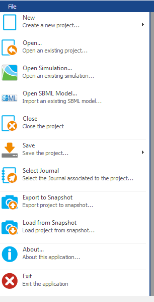
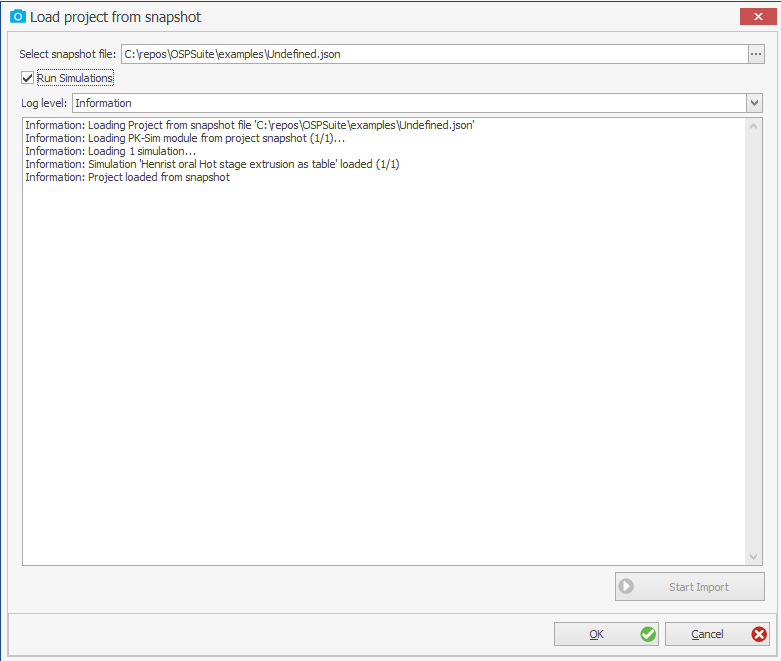
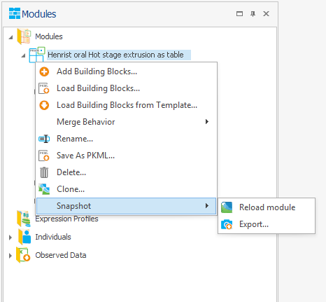

# Snapshots

Starting with version 13, MoBi® can export a project to a **project snapshot** and re-create a project from such a snapshot, in the same way PK-Sim® does (s. [PK-Sim Snapshots](../part-3/pk-sim-snapshots.md)).

A project snapshot is a human-readable text file in [JSON format](https://en.wikipedia.org/wiki/JSON) that contains the information required to re-create the project. In contrast to a `*.mbp3` project file, which stores the fully built models, a snapshot stores the *inputs*: the modules and building blocks of the project, the configuration of each simulation, and the changes made by the user. When the snapshot is loaded, the simulations are rebuilt from that configuration.

For a PBPK model built in PK-Sim®, the snapshot concept also carries the model *forward*: the PK-Sim® modules of a MoBi® project are stored as PK-Sim® snapshots and are re-created by a local PK-Sim® installation when the MoBi® snapshot is loaded, so they are rebuilt with the physiological and molecular database of the installed PK-Sim® version. See [Modularization concept](modularization-concept.md) and [Converting v12 projects to v13](converting-v12-projects-to-v13.md) for what this means for model migration.

## What a MoBi project snapshot contains

| Project content | How it is stored in the snapshot |
| --- | --- |
| PK-Sim® modules | as the PK-Sim® snapshot the module carries, embedded as a JSON sub-node. The module is **re-created by PK-Sim®** when the snapshot is loaded. |
| Extension modules | as PKML, stored verbatim (Base64-encoded). They are restored as they were, not re-created. |
| Individuals and Expression Profiles created in PK-Sim® | as the PK-Sim® snapshot of the building block, plus the parameter values (and formulas) that were changed in MoBi® afterwards. The building block is re-created by PK-Sim® and the stored changes are re-applied on top. |
| Individuals and Expression Profiles not originating from PK-Sim® | as PKML, stored verbatim (Base64-encoded). |
| Simulations | as their [simulation configuration](setting-up-simulation.md) — the modules used with the selected `Initial Conditions` and `Parameter Values` building blocks, the Individual and the Expression Profiles, solver settings, output schema and random seed — plus the output selections, the observed-data mappings, the charts, and every parameter value and scale divisor changed by the user inside the simulation. |
| Observed data | completely, including data values and meta data. |
| Parameter Identifications | completely, including their configuration and their link to the simulations. |
| Folder structure | the subfolders (classifications) used for observed data, simulations, modules, and parameter identifications. |
| Project settings | the reaction dimension mode of the project (amount- or concentration-based). |

The project snapshot also records the MoBi® project version it was written with and the application it was created with.

## What is not stored

The following is not part of a MoBi® project snapshot and is therefore missing after loading:

* **Simulation results.** They are re-computed when the simulations are run (s. below).
* **Sensitivity Analyses.**
* **The [Working Journal](../part-5/working-journal.md)** and the [project history](../part-5/history-manager-history-reporting.md).
* **Chart templates** and the **project-wide default simulation settings** (the default solver settings, output schema and output selections used for new simulations). They are reset to the MoBi® defaults.


Because a snapshot stores inputs rather than built models, keep the `*.mbp3` project file as the primary artifact of your work and use snapshots in addition to it — for versioning the model inputs, for automation, and for migrating a project to a new suite version.


## Exporting a project to a snapshot

To export the open project to a snapshot, select **File** :arrow\_right: **Export to Snapshot**  and choose the target `*.json` file.

Before the file is written, MoBi® checks two conditions and asks whether to proceed:

* **Simulations in a changed state.** If parameter values were changed in a simulation without committing them to a building block (the simulation is marked with a red icon), MoBi® warns that these simulations may not be re-imported correctly.
* **PK-Sim® modules without a snapshot.** PK-Sim® modules created with an older suite version do not carry a PK-Sim® snapshot. MoBi® lists them and warns that they will be exported as extension modules (PKML) instead, which means that they will *not* be re-created by PK-Sim® when the snapshot is loaded.


Editing a PK-Sim® module in MoBi® turns it into an extension module (s. [Modularization concept](modularization-concept.md)). Such a module is then stored as PKML in the snapshot and is no longer re-created by PK-Sim®. This is one more reason to keep PK-Sim® modules unchanged and to put all extensions into separate extension modules.


## Loading a project from a snapshot

To create a project from a snapshot, select **File** :arrow\_right: **Load from Snapshot** . In the **Load project from snapshot** dialog, select the `*.json` file, then press **Start Import**. Progress, warnings and errors are shown in the log; **Log level** controls how much detail is written. Press **OK** to keep the loaded project.

* Loading a **project** snapshot always creates a new project; it cannot be loaded into the open project. Re-creating a single module or building block from its own snapshot, by contrast, happens *in* the open project - s. [Snapshots of single modules and building blocks](#snapshots-of-single-modules-and-building-blocks) below.
* The option **Run Simulations** determines whether the simulations are run directly after they have been created. Clearing it can speed up the load considerably for projects with many or large simulations; the simulations can be run later as usual.
* If a single simulation cannot be created, the load continues with the remaining ones and reports how many simulations were loaded.


If the project snapshot contains PK-Sim® modules, or Individuals and Expression Profiles originating from PK-Sim®, a compatible **PK-Sim® installation is required** to load it, because these are re-created by PK-Sim®. MoBi® uses the PK-Sim® installation found on the system; a different one can be specified as **PK-Sim executable path** in the [options](mobi-options.md).



MoBi® and PK-Sim® **project** snapshots are not interchangeable: a project snapshot records the application it was written with, and loading a PK-Sim® project snapshot in MoBi® — or a MoBi® project snapshot in PK-Sim® — is rejected with a message naming that application. This does not apply to the snapshots of single modules and building blocks described below, which are PK-Sim® snapshots.


## Snapshots of single modules and building blocks

Modules, Individuals and Expression Profiles that were created in PK-Sim® carry their own PK-Sim® snapshot. For these, a **Snapshot** entry is available in the context menu of the object in the **Modules Explorer**:

* **Reload module** / **Reload Individual** / **Reload Expression Profile** re-creates the object from its stored PK-Sim® snapshot through the local PK-Sim® installation and **adds it to the project as an additional object** — the existing one is not overwritten. Use it to obtain an unmodified copy, or a copy rebuilt by a newer PK-Sim® version.
* **Export...** writes the stored PK-Sim® snapshot to a `*.json` file. For a module, this is a complete PK-Sim® project snapshot and can be loaded in PK-Sim®.


The snapshot embedded in a module or building block is the one PK-Sim® wrote when the model was transferred to MoBi®; it is not updated by later changes in MoBi®. Changes made in MoBi® to the parameter values of an Individual or an Expression Profile are therefore **not** contained in the file written by **Export...**, whereas they *are* contained in a snapshot of the whole project.



The **Snapshot** menu appears only on objects that carry a PK-Sim® snapshot, i.e. on Modules, Individuals and Expression Profiles that originate from PK-Sim®. The remaining MoBi® building block types - Spatial Structures, Molecules, Reactions, Passive Transports, Observers, Events, Initial Conditions and Parameter Values - are not built from PK-Sim® inputs and are exchanged as PKML instead (s. [The Building Block Concept](building-block-concepts.md)). This differs from PK-Sim®, where **every** building block type can be exported to and loaded from a snapshot (s. [PK-Sim Snapshots](../part-3/pk-sim-snapshots.md#snapshots-of-single-building-blocks)).


## Snapshots in automated workflows

Snapshots are the exchange format for MoBi® workflows that run without the user interface:

* The [command-line interface](mobi-command-line-interface.md) converts whole folders of projects to snapshots and back with the `snap` command, and uses snapshots as the input of [qualification](../part-5/qualification.md) workflows.
* The MoBi® R package can load the simulations contained in a project snapshot file and can run the snapshot conversion workflow from a script.
