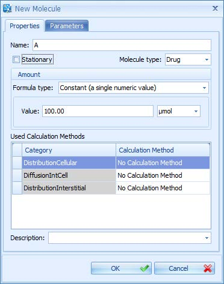
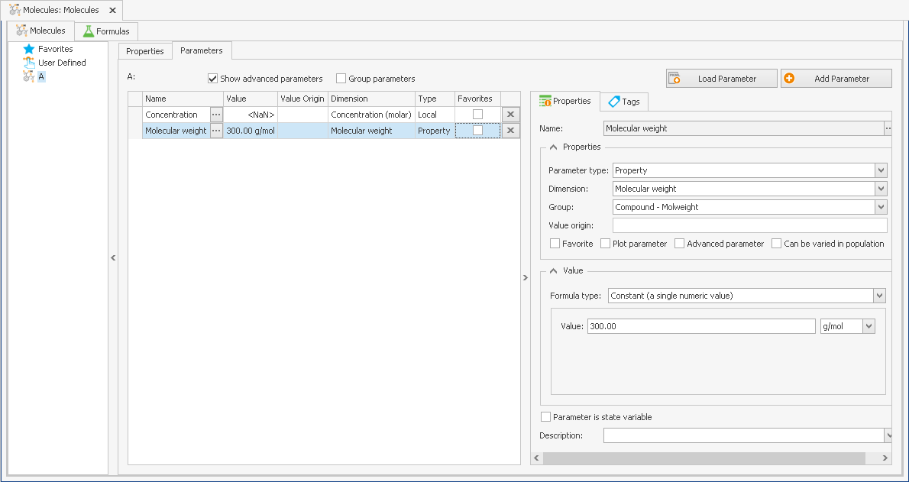

# Model Building and Model Components

After having made yourself familiar in the previous chapters with the building block concept and with the general structure of the program and projects ([“MoBi® - First Steps”](first-steps.md)), this section describes the practical approach how to build MoBi® models by stepwise entering content into the building blocks. Also, this knowledge is of use to upgrade models imported from PK-Sim®, as will be described in [Setting up a Simulation](setting-up-simulation.md).


Always watch for the helpful tool tips that appear when hovering for a few seconds with the mouse pointer over an input box or its description.


## Exporting and importing building blocks‌

You may also load and save an entire Spatial Structure building block as pkml file. This is described in detail for molecules in [Loading, Editing, and Saving Molecules](model-building-components.md#loading-editing-and-saving-molecules) and applies also for a spatial structure.


A collection of template files with predefined building blocks is automatically installed together with MoBi® in the default program data directory. The entry "Templates" in the program start menu in the "MoBi" program group will lead you to the proper path.



## MoBi® - Projects‌

### New Project‌

Your first step is to create a new project.

To create a new project select **New Project** on the **File** ribbon tab or alternatively press **Ctrl+N**.


The ribbon bar **Modeling & Simulation** with the different Ribbon Groups for creation of building blocks, simulations, and more will appear. Empty building blocks are now present for Molecules, Reactions, Spatial Structures, Passive Transports, Observers, and Events and are shown in the **Building Block Explorer**. You can now edit a building block by double-clicking the corresponding entry.


### Other project actions in the File tab‌

1. Open a Project

To open a project select **Open Project (Ctrl+O)** on the **File** tab.

A **File Selection Dialog** will open in which a project file (mbp3 file) can be selected. Alternatively, you can also choose one of the **Recent documents**.

After selection, the MoBi® project is opened.


You can alter the Number of recently opened projects: on the **Utilities** tab click **Options** and select the **General** tab.



Only one project can be opened at a time! This project may, however, contain several simulations. To work on more than one project in parallel, MoBi® can be started several times.


1. Close a Project

Close a project by selecting **Close Project** in the **File** tab. A confirmation dialog opens if there are unsaved changes.

1. Save a Project

To save the current project select **Save Project (Ctrl+S)** in the File tab or use the quick action button .

You can then choose either   **Save Project**, which saves the project under the name already given or  **Save As** to save the project with a new name in another file. The currently opened project will be saved with all information.

## Keywords

- `MOLECULE`
- `SOURCE`
- `TARGET`
- `<NBH>`

## Parameters, Formulas, and Tags‌

In all building blocks that are now created, there may be a need to create and edit parameters, to work with formulas or other elements like tables. This section describes the general options you have for parameters and formulas, and the general procedures to work with them.

Parameters are typically listed in a separate tabbed view, named "Parameters"; compare the figures within this Chapter for their exact location which will vary, depending on the building block. A parameter is used to describe physical or physiological properties of a molecule, a reaction or transport, a spatial structure, an event or an application.

For improved readability, two categories of parameters exist: "regular" and "advanced" parameters. In any parameter list of a building block, a checkbox exists above the list which is named  **Show Advanced Parameters**. If this box is checked, only those parameters tagged as "advanced" are displayed. Any parameter can be tagged as being "advanced" by checking the box  **Advanced Parameter** when a parameter is created or edited.

Parameters can be newly created, copied, moved, edited, or loaded from a pkml file:

* A parameter is added by clicking on the  **Add Parameter** button that is present in a parameter tab view, or by right-clicking the building block item's name (molecule, reaction, etc.) in the tree, list, or diagram view and choose **Create Parameter** from the context menu that appears.
* Instead of newly creating a parameter, you may also load it from a file. Use the **Load Parameter** button or context menu entry for this purpose and select a pkml file (e.g., a previously saved building block or simulation) that already contains a suitable parameter.
* A third option is to **copy and paste parameters** between building block items by pressing **Ctrl+C** (on the source parameter, like from an already entered molecule or reaction) and **Ctrl+V** after moving to the target area and after clicking into the empty parameter space. Instead of **Ctrl+C** to copy a parameter, you can use **Ctrl+X** to cut a parameter from its current position.

Within the different building blocks, there are slight differences in the procedure and in the selectable options which will be explained in the corresponding sections in this chapter. In the Molecules and Reactions building blocks, parameters may be of **different types**: Local, Global, and Property. As these names already suggest, the differences are the following:

* Parameters defined as Local can only be used locally, i.e., within the corresponding reaction or for a molecule where a local parameter is defined.
* Parameters defined as Global can also be used in other formulas, i.e., they appear in the reference lists described in [Working with Formulas](model-building-components.md#working-with-formulas). Furthermore, they are located in different places of a simulation hierarchy, as described in [Molecular Properties](setting-up-simulation.md#molecular-properties).
* Parameters defined as Property are identical to Global parameters except that they will not be listed and set in the parameter start values.


A change of the parameter type will influence the path wherever this parameter is used in a formula (compare [Working with Formulas](model-building-components.md#working-with-formulas)).

Furthermore, this different path will make this parameter appear in different locations within the simulation hierarchy. Global parameters appear below the reaction list in the top level hierarchy, local parameters below the reaction list in the container level where the reaction occurs.


Any parameter needs to have a **Dimension** assigned to it or the option Dimensionless has to be selected from the Dimension combobox. This feature is needed for the automatic dimension validation provided by MoBi®. Typical dimensions are concentration, volume, time, or the more complex dimensions for flow or rate constants.


If the box Validate Dimensions is  unchecked in Utilities -> Options -> General, the dimension field is not used in the model.


A parameter can be assigned to a **Group** using the combobox of the field. This information is only used for display purposes to show the list of parameters in e.g. a given container and will enable a grouped view instead of default flat view. You can switch from flat to grouped view by ticking the **Group parameters** box.

In the combobox of the field **Formula Type**, you can select if the parameter is defined as:

* a constant, consisting of a numeric value and a unit;
* a formula, having a formula name and a formula string (i.e., a mathematical expression) including references to the formula items;
* a table, using individual data pairs from which a value is interpolated over the simulated time;
* a value distributed around a constant value or between two limits (only available for parameters of spatial structure containers);
* a calculation method parameter, whose formula will be defined depending on the selected calculation method of each molecule in the model (only available for parameter of spatial structure container). Currently, this calculation method cannot be edited within MoBi® and is imported from PK-Sim® together with the parameter.

In the bottom part of the **Create** or **Edit** window are several input options that have different effects on the parameter:

* Checking  **Parameter is state variable** will open additional input fields for the right hand side of a differential equation (explained in detail in [State Variable Parameters](model-building-components.md#state-variable-parameters)).
* Checking  **Plot Parameter** will tag this parameter so that it can be visualized in a chart with the simulation results (see [Chart Component](../part-5/chart-component.md)).
* Checking  **Advanced Parameter** will hide this parameter from the lists if

Show Advance Parameters is  un-checked in the parameter list view.

* For all parameter types, **a description can be added** into the input box at the bottom, for example to quote a reference. Clicking into the text field will open an edit dialog into which you can enter or paste any text of your choice.

You may also **add tags to any parameter** which is done by first clicking the **Tags**

tab in the parameter window. This will switch you to the tag list view.

* To add a tag, click the "Add Tag" button and enter the tag in the input box.
* To delete a tag, click the symbol that appears behind every tag in the list.

Parameter tags are used for the evaluation of formulas of the type "Sum", see [Sum Formulas](model-building-components.md#sum-formulas). The general rationale behind tags is explained in, [How Tags are used](model-building-components.md#how-tags-are-used).

Each parameter can be edited by selecting it from the parameter list, upon which the parameter edit dialog right of the list is updated to show the selected parameter, then allowing to edit it.

### Working with Constant and Distributed Parameters‌

A constant parameter is simply entered as a number in the field **Value**. You may use decimal points, exponential notation, and minus signs (e.g., 2.34; 1.2E-6;

\-150). Next to the value, its unit will be shown; the default unit is selected by your choice in the Dimension field, but it can be changed to other units listed in the combobox, e.g. from 1/min to 1/sec or 1/h.

Examples for constant parameters are given below, like the property "Molecular weight" for a molecule (see [Molecule Parameters](model-building-components.md#molecule-parameters)) or the rate constant for a reaction (see [Reaction Kinetics](model-building-components.md#reaction-kinetics)).

**Distributed parameters** (only available for parameters of spatial structure containers) describe a variation around a constant value or between two numerical limits. Within a given MoBi® simulation, a distributed parameter has a fixed value (default defined by the value in the field **value**). A distributed parameter can be used only to calculate the percentile of the parameter value given a certain distribution. Distributed parameters are useful if population statistical data are to be defined within a model. To define such a parameter, use the **Create Distributed Parameter** command from the context menu of a spatial structure item, like for containers (e.g. organ sizes) or neighborhoods (e.g., blood flow rate). In addition to what is entered for constant parameters, the **Distribution Type** has to be selected. Available options are:

* Discrete Distribution, which is identical to a constant parameter; this feature is implemented for the purpose of simply disabling the distribution function without going through the parameter creation process again.
* Uniform Distribution, where a parameter will be uniformly distributed between a **Minimum** and a **Maximum**, both have to be defined as numeric values. This is done by the same rules for value and units as used for the constant parameter value.
* Normal Distribution, where a parameter is varied around a **Mean** value using a **Standard Deviation** - both values have to be specified.
* LogNormal Distribution, where a parameter is logarithmically varied around a **Mean** value using a **Geometric Standard Deviation** - both values have to be entered.

If you use one of the different distributions, a **percentile** will be automatically calculated for the parameter value define in field **value** given the defined distribution. The functionality of this feature is particularly useful in combination with the script toolboxes for MoBi®.

### Working with Formulas‌

A parameter can be defined by a formula that may also use other parameters. A formula string defines the formula. Additionally to parameters, formulas are used in the kinetics equations of reactions and transport processes as well as in the monitor equation of observers. See the corresponding sections for a description. To define a formula, select Formula in the combobox **Formula Type**.

Each formula needs a formula name. The combobox **Formula Name** allows you to select from already existing formulas or to enter a new name. A new formula can be entered by clicking the  **Add Formula** button and you will be asked for the formula name. Then press **Enter** or click **OK** to return to the main window.


It is a good idea to use a name related to the object where the formula is used (e.g., parameter, reaction, observer) - you may even use identical names here.


To enter or edit a **formula string**, click into the unnamed input box above the **Description** field and then use your keyboard. This formula string will be evaluated by the solver once the simulation is run. It is written as a mathematical term that comprises numeric values, arithmetic operation signs, and names of parameters or their alias names. As long as the formula has errors or is incomplete, a red error sign  is displayed left of the empty input box. Hovering the mouse over this warning symbol will show you a tool tip on the validity of the equation (e.g., missing references or syntax errors).


Useful workflows with parameter aliases or with reference paths to aliases are described below, see [Reaction Kinetics](model-building-components.md#reaction-kinetics) and [Passive Transports](model-building-components.md#passive-transports).


In a formula, the following characters may be used:

* numbers can be entered as described for constants
* the arithmetic operation signs **+**, **-**, **\***, **/**, **^** (for exponents)
* round brackets **(** **)**
* the constants **pi** and **e**
* the mathematical functions **ACOS**, **ASIN**, **ATAN**, **COS**, **COSH**, **EXP**, **LN**, **LOG** (identical to **LN**, natural logarithm), **LOG10**, **MAX**, **MIN**, **POW**, **SIN**, **SINH**, **SQRT**, **TAN**, **TANH**; if two operators are required (**MAX**, **MIN**, **POW**), a semicolon is used for separation, e.g., _POW(3;2)_ which corresponds to _3^2_
* the random number generator functions **RND** and **SRND**, both to be used with the dummy argument **()**
* if conditions, using the notation `<condition> ? <formula string for true> : <formula string for false>`
* in the conditions, the operators **<**, **>**, **<>**, **>=**, **<=**, **=** ; alternatively: **LT**, **GT**, **NEQ**, **GEQ**, **LEQ**, **EQ**, for which the use is `<function>(<expression1>;<expression2>)`
* conditions can be composed out of sub-conditions that are logically connected by **AND**, **OR**, or inverted by **NOT**. An alternative symbol for **AND** is **&**; an alternative symbol for **OR** is **|**. Besides logical conditions, the numbers 0 and 1 can be used as arguments.

- `TIME` variable: The simulation time.


The above mathematical functions are defined as in the C programming language. For standard reaction kinetic models, these functions are not required at all. It is recommended to use events rather than "if conditions" in a formula.


Furthermore, defined **aliases** can be used in a formula as described in the next paragraph.


As opposed to mathematical functions, constants, and operators aliases are case sensitive.


Below the formula name and above the formula string, there is a **Reference Table** showing a header line above the columns named **Alias**, **Path**, and **Dimension**. On the right hand side of the reference table, there is a second table (separated by a vertical bar) titled **References to add**. From this left part, references are moved to the right Reference Table part by drag & drop.


In some cases, e.g. when working with formula-defined molecule parameters, it may be helpful to expand this window to have enough working space. To do so, use the vertical bars between the window sections and drag them with the mouse.


References can be of two different kinds:

* An **absolute path** reference specifying the complete path to a referenced object (e.g., parameter, another formula). An example for this would be "Organism| Organ|Volume".
* A **relative path** reference specifying the truncated path relative to the current formula. The expression ".." is used for "one level up", using a structure similar to that of file systems paths. An example for such a relative reference would be "..|..|Volume".

You need to choose between absolute and relative path by selecting the corresponding radio button in the References to add a section of the window. If you select relative, you will be asked for a **Local Reference Point**. This reference point depends on the level on which you create your formula (e.g., the organism or an organ level) and may be specified in the expandable selection tree (see below). Recommendations of how to choose your reference point are given within this chapter. Click **OK** to finalize your selection.

The selected local reference point will be displayed with its absolute path in the "References to add" window. In case you need to correct or alter the local reference point, click on the **...** icon right of the path. This will re-open the reference point selection window.

To add a reference to a formula, after having selected the reference point:

1. Find the reference by name in the **Possible Referenced Objects** tree. Click on the + signs in the displayed tree to get to deeper levels of selectable points.
2. Click on the object's name, then drag it to the Reference Table area left to it; drop it there by releasing the mouse button. The object will be added to the list, usually with its name as the alias. If that name already exists in the list, the alias name is automatically renamed by adding a number. The path and dimension of the object are also added.


Not all entries in the tree are allowed to be moved to the left, depending on the context of the formula. A + sign displayed next to the mouse pointer indicates an allowed reference.


1. If needed, you may edit the alias name of the object manually. Alias names need to be identical to the names that are used in the formula string. Simply click on the alias name and change or override (or copy/paste) the name. For example, if you added several "Concentration" parameters from different molecules to a reaction kinetics equation, it may be helpful to manually add the molecule name next to them.
2. In the same way as for aliases, it is also an option to manually edit the path. However, the standard procedure would be to remove the object and add it again, using a new local reference point.
3. Dimensions can be changed by clicking on the displayed dimension and selecting a different one from the combobox.


A reference path may also contain a global part, like "|MOLECULE", which is recognizable by being written in all capital letters. The reference to "|MOLECULE" means that this part of the path refers to a parameter or property of the currently evaluated molecule, whatever its name. This is useful in formulas that are computed for all molecules present in a container. Compare the formulas in [Observers](model-building-components.md#observers) or [Passive Transports](model-building-components.md#passive-transports). A global reference is selected automatically by MoBi® where appropriate.


To **remove an object from the reference list**, right-click it and select **Remove**from the context menu.

Clicking on the **Formulas tab** in the edit window will show a list of all formulas used in the reaction building block. This list is a quick overview of formula names within one building block. Clicking on a formula in the list will show the references and the equation for the selected formula. Right-clicking on a formula in the list opens a context menu that allows you to **Rename**, **Clone** and **Remove** formulas.

### Sum Formulas

In addition to the formulas described in the previous section, sum formulas can be used to calculate sums of a specified parameter name. As a selection criterion, parameter tags can be specified.

To define a parameter or a reaction by a sum formula, use the following procedure:

1. Select Sum Formula in **Formula Type** combobox.
2. To create a new sum formula, click the  **Add Formula** button, upon which you will be asked for the formula name. Then press **Enter** or click **OK** to return to the main window.
3. In the **Formula Name** combobox, you may alternatively select an existing sum formula name.
4. In the **Parameter Criteria** field, right click into the empty white space and select either a New match tag condition. (The New not match tag condition is available too if needed). You will then be asked to enter a tag to match; or select one after clicking the combobox arrow. All parameters carrying the specified condition will be summed; if more than one condition is used, they will be connected with a logical AND. The general rationale behind tags is explained in (How Tags are used]\(#how-tags-are-used).
5. Conditions can also be removed using the context menu that appears when right-clicking into the white space in the **Parameter Criteria** field.

### Working with Tables‌

A parameter can be defined by a table that is made up out of pairs of simulation- time and corresponding functional value. The parameter value as a function of time that is used in the simulation will be interpolated between these values. To enter a table:

1. Select Table as **Formula Type**. A table layout will open below the Formula Type combobox.
2. To create a new table formula, click the  **Add Formula** button, upon which you will be asked for the formula name. Then press **Enter** or click **OK** to return to the main window.
3. In the **Formula Name** combobox, you may alternatively select an existing table formula name.


A formula name needs to be entered or selected before entering any value points.


1. To add a data point, click the **Add Value Point** button.
2. Enter a time value in the **X** (Time) input box and a parameter value in the **Y** value input box. Units of the values can be selected as described for a constant parameter value.
3. You may check **Restart Solver** box in case the solver generates errors when arriving at these time points.
4. More data points can be entered by clicking **Add Value Point** again, or by clicking on the button in the right to the values lines. You can delete a data pair by clicking the **delete** button .
5. If you would like to use the first derivative of the interpolation, check **Use Derivative Values**. Values before the first and after the last data point of the series are set to 0.


Data points cannot be edited, but have to be deleted and newly entered. Data point units can be changed, leading to a recalculation of the associated value to its new unit.


### Working with Table Formulas with Offset‌

A table described in [Working with Tables](model-building-components.md#working-with-tables) may need to be reused and shifted by a constant time value. For example, PK-Sim® uses this logic to build up repeated advanced application protocols (compare [PK-Sim® - Administration Protocols](../part-3/pk-sim-administration-protocols.md)). To enter a table formula with offset:

1.  Select Table Formula with Offset as **Formula Type**.
    
2.  To create a new table formula with offset, click the  **Add Formula** button, upon which you will be asked for the formula name. Then press **Enter** or click **OK** to return to the main window.
    
3.  In the **Formula Name** _combobox_, you may select an existing table formula with offset.
    
4.  In the box below the formula name, there is a selection to a **path with a table object**. Upon clicking the "..." icon, you can select one such object from a path tree. This must be a parameter, a transport or a reaction defined by a table defined as described in [Working with Tables](#working-with-tables). Only when you select a valid object, the  **OK** button will become active, and you can successfully continue.
    
5.  Below the table object path, there is a selection to a **path with an offset object**. Upon clicking the "..." icon, you can select one such object from a path tree. This must be a parameter containing a time, i.e., its dimension has to be Time.

Only when you select a valid object, the  **OK** button will become active, and you can successfully continue. The X values of the table selected before will be shifted by the constant time value given in the selected parameter of this step.

### State Variable Parameters‌

A parameter can also be defined as state variable. This means, that the parameter value is defined by a differential equation. To do this, click the  checkbox **Parameter is state variable** when entering or editing a parameter. The parameter value of a parameter _p_, for example, is defined as: , with  representing the expression for _change of parameter value per unit time step_ defined by the formula on the right hand side (_RHS_). Once the checkbox is active , the parameter edit view is extended by an additional input box for a formula. This formula defines the **Right Hand Side** of the parameter's differential equation. This right hand side equation itself is entered in the same way as a constant or formula type parameter. The formula in the top half of the parameter edit view now defines the initial condition for the differential equation of the parameter. The value of the parameter is defined when the differential equation is solved during the simulation of the model.


Once the  **Parameter is state variable** checkbox is deactivated again, the input box for the RHS will disappear. The parameter is no longer a state variable, and the right hand side (RHS) formula reverts to RHS = 0. If you have accidentally deactivated the checkbox and then reactivate it, the formula you may have previously defined as RHS is not lost, since all created formulas are stored. To reinstate the formula you may have previously defined as the RHS, select the formula from the combobox after the formula type explicit formula is selected.


### How Tags are used‌ - container criteria for formulas, observers, transports, and events‌

Containers and neighborhoods within a spatial structure, elements of an application, or parameters may be labelled with tags. These tags, together with the name given to a container or neighborhood, may be used for selectively enabling observers, active or passive transports, or events. They are used for formula evaluations of the formula type "sum".

Tags can be entered when creating or editing a tag-carrying entity. The detailed procedures are described within this chapter in the corresponding sections describing spatial structures, observers, events, or parameters. Generally, one or more names are entered in a special input window of the corresponding entity.

Conditions are evaluated in fields of observers, transports, or event groups titled "In Container with" or "Between Containers with". Conditions can be combined using either **AND logic** (`Condition1 AND Condition2 AND ...`), or **OR logic** (`Condition1 OR Condition2 OR ...`).
 
Imagine the following simple model structure:

```
Organism (logical)
  |
  +-- Container A (logical)
  |      |
  |      +-- Container A1 (physical)
  |      +-- Container A2 (physical)
  |
  +-- Container B (logical))
         |
         +-- Container B1 (physical)
         +-- Container B2 (physical)
```

A molecule `Molecule A` is present in the physical containers `A1`, `A2`, `B1`, and `B2`. Each container has a parameter `Param A`, including the molecule.

The physical containers have additionally the parameter `Concentration`.


The following examples demonstrate the concept of tags and container criteria. They are not meant to represent a physiologically meaningful model.


If we create a sum formula with the following conditions:

1. **Match tag condition**: the condition is fulfilled when the tag name is matched.
    - For the sum formula with match tag condition "Param A", the sum will include the following parameters:
        - `Organism|Param A`
        - `Organism|Container A|Param A`
        - `Organism|Container A|Container A1|Param A`
        - `Organism|Container A|Container A1|Molecule A|Param A`
        - `Organism|Container A|Container A2|Param A`
        - `Organism|Container A|Container A2|Molecule A|Param A`
        - `Organism|Container B|Param A`
        - `Organism|Container B|Container B1|Param A`
        - `Organism|Container B|Container B1|Molecule A|Param A`
        - `Organism|Container B|Container B2|Param A`
        - `Organism|Container B|Container B2|Molecule A|Param A`

2. **Not match tag condition**: the condition is fulfilled when the tag name is **not** matched.
    - For the parameter `SumOfParameters` with the conditions `Not tagged with: Param A` and `Not tagged with: SumOfParameters` (the latter is required to avoid a circular reference), the sum will include the following parameters:
        - `Organism|Container A|Container A1|Volume`        
        - `Organism|Container A|Container A1|Molecule A|Concentration`
        - `Organism|Container A|Container A2|Volume`
        - `Organism|Container A|Container A2|Molecule A|Concentration`
        - `Organism|Container B|Container B1|Volume`
        - `Organism|Container B|Container B1|Molecule A|Concentration`
        - `Organism|Container B|Container B2|Volume`
        - `Organism|Container B|Container B2|Molecule A|Concentration`
     **AND** molecule amounts
        - `Organism|Container A|Container A1|Molecule A`
        - `Organism|Container A|Container A2|Molecule A`
        - `Organism|Container B|Container B1|Molecule A`
        - `Organism|Container B|Container B2|Molecule A`

3. **In Container**: the condition is fulfilled by all model entities located in the specified container and its children.
    - For the parameter with the condition "In Container with: Organism", the sum will include the following parameters:
        - `Organism|Param A`
        - `Organism|Container A|Param A`
        - `Organism|Container A|Container A1|Param A`
        - `Organism|Container A|Container A1|Volume`        
        - `Organism|Container A|Container A1|Molecule A|Concentration`
        - `Organism|Container A|Container A1|Molecule A|Param A`
        - `Organism|Container A|Container A2|Param A`
        - `Organism|Container A|Container A2|Volume`
        - `Organism|Container A|Container A2|Molecule A|Concentration`
        - `Organism|Container A|Container A2|Molecule A|Param A`
        - `Organism|Container B|Param A`
        - `Organism|Container B|Container B1|Volume`
        - `Organism|Container B|Container B1|Molecule A|Concentration`
        - `Organism|Container B|Container B1|Param A`
        - `Organism|Container B|Container B1|Molecule A|Param A`
        - `Organism|Container B|Container B2|Param A`
        - `Organism|Container B|Container B2|Volume`
        - `Organism|Container B|Container B2|Molecule A|Concentration`
        - `Organism|Container B|Container B2|Molecule A|Param A`
     **AND** molecule amounts
        - `Organism|Container A|Container A1|Molecule A`
        - `Organism|Container A|Container A2|Molecule A`
        - `Organism|Container B|Container B1|Molecule A`
        - `Organism|Container B|Container B2|Molecule A`

    - For the parameter with the condition "In Container with: Container A", the sum will include the following parameters:
        - `Organism|Container A|Param A`
        - `Organism|Container A|Container A1|Param A`
        - `Organism|Container A|Container A1|Volume`        
        - `Organism|Container A|Container A1|Molecule A|Concentration`
        - `Organism|Container A|Container A1|Molecule A|Param A`
        - `Organism|Container A|Container A2|Param A`
        - `Organism|Container A|Container A2|Volume`
        - `Organism|Container A|Container A2|Molecule A|Concentration`
        - `Organism|Container A|Container A2|Molecule A|Param A`
     **AND** molecule amounts
        - `Organism|Container A|Container A1|Molecule A`
        - `Organism|Container A|Container A2|Molecule A`

4. **Not in Container with**: the condition is fulfilled for all model entities that are **not** in the specified container or any of its children.

5. **In Parent**: the condition is fulfilled by all model entities located in the specified container and its children. This can be considered as a special case of "In Container", where the container is the parent of the entity being considered.

6. **In Children**: the condition is fulfilled by any model entity in all children of the parent container of the entity for which the criteria is defined. 

    - For the parameter with the condition "In Childre" located in `Organism|Container A`, , the sum will include the following parameters:
        - `Organism|Container A|Container A1|Param A`
        - `Organism|Container A|Container A1|Volume`        
        - `Organism|Container A|Container A1|Molecule A|Concentration`
        - `Organism|Container A|Container A1|Molecule A|Param A`
        - `Organism|Container A|Container A2|Param A`
        - `Organism|Container A|Container A2|Volume`
        - `Organism|Container A|Container A2|Molecule A|Concentration`
        - `Organism|Container A|Container A2|Molecule A|Param A`
     **AND** molecule amounts
        - `Organism|Container A|Container A1|Molecule A`
        - `Organism|Container A|Container A2|Molecule A`

More than one condition can be combined for evaluation; the combinations are connected with a logical AND. The detailed procedures when and how to enter tag conditions are described in this chapter ([Sum Formulas](model-building-components.md#sum-formulas), [Transport Processes](model-building-components.md#transport-processes), [Observers](building-block-concepts.md#observers), [Events and Applications](model-building-components.md#events-and-applications)).

Models generated in **PK-Sim**® make extensive **use of tags**: For example, open a PK-Sim® model and look under [Passive Transports](model-building-components.md#passive-transports) for one part of the blood flow through the organs of an organism called "MassTransferBloodPool2OrgPl". This is a passive transport process that occurs from the arterial plasma compartment to the plasma compartments of all organs except for the lung. Consequently, this transport process is occurring under the following conditions:

1. Source container: tagged with "Arterial Blood" and tagged with "Plasma".
2. Target container: tagged with "Plasma" and not tagged with "Arterial Blood" and not tagged with "Lung".

Similarly, observers or events can be included or excluded from being created in different parts of the spatial structure. The molecule observer "Fraction excreted", for example, makes use of the tag "Urine", so this observer is only created in the urine container.

## Molecules‌

The Molecules building block contains all molecules with their default start values, molecule-specific parameters and properties. A molecule has a name, typically the name of the compound. Parameters and properties can be defined by you to describe the physico-chemistry, like solubility or lipophilicity. These parameters may later be used in reactions, passive and active transport processes, or may influence events. Also, active transporter molecules and transport processes are defined for each molecule, if relevant for the model.

Start by opening a Molecules building block for editing. In the **Building Block Explorer**, open the Molecules folder and edit the Molecules building block by either right-clicking it and selecting "Edit", or by double-clicking on it. A new tab with an empty space will open. This is the work space where you can add new molecules or load molecules from other projects. You may notice that the ribbon of the MoBi® window has changed, being tabbed "Edit Molecule", to offer you clickable ribbon buttons for molecule-related actions (compare in [Enter Molecules](first-steps.md#enter-molecules)).

### Creating New Molecules‌

To create a new molecule:

1. Click in the newly visible ribbon **Add** on the button  **New**, or right-click into the Diagram area (the empty space below the tab "Molecules") and choose **Create Molecule** from the context menu that appears. A new window titled "New Molecule" will open.
2. Enter a molecule name into the "Name" input box.
3. Alternatively, a molecule can be created based on a PK-Sim® template. This can be achieved by using the button **PK-Sim Molecule** in the **Add** ribbon or **Add PK-Sim Molecule** from the context menu in the diagram area.
4. Enter a name for the PK-Sim molecule and the four physicochemical properties as listed.

At this point, you may already input a value for the "Default Start Amount" which is set to zero by default. Also, you may define molecule parameters after clicking on the "Parameters" tab of the "New Molecule" window (see below). Both operations, however, can also be done after the molecule is created (see below), which is finalized by pressing the **Enter** key or by clicking **OK**. The newly created molecule name now appears in the left part of the Molecules edit tab, and a tab on the right shows the properties of the molecule.



### Loading, Editing, and Saving Molecules‌

Alternatively to newly creating a molecule, **molecules can be loaded from a pkml file**. This file can be

* a PK-Sim® export containing molecules (see [Export to \*.pkml file for MoBi®](../part-3/importing-exporting-project-data-models.md#export-to-pkml-file-for-mobi), for how to create such a file),
* an entire previously saved MoBi® simulation,
* a saved Molecules building block from a previous project,
* or a previously saved molecule file.


A collection of template files with predefined building blocks is automatically installed together with MoBi® in the default program data directory. The entry "Templates" in the program start menu in the MoBi program group will lead you to the proper path.


Use one of such files an proceed in the following way:

1. Click the  **Load** ribbon button, or right-click into the empty space below the tab "Molecules" and choose **Load Molecule** from the context menu that appears.
2. Select a folder and then a pkml file from the file browser window that will open.
3. If the pkml file contains more than one molecule, select one or more from the list that is displayed. If one or more molecule names are already in use in the current project, you will be asked for alternative names.

You can **edit the molecule properties** for the molecule in the tree that is currently being highlighted.

* Within the properties window, the checkbox  **Stationary** determines if the corresponding molecule will be transported by [Passive Transports](model-building-components.md#passive-transports) processes described below (see [Passive Transports](model-building-components.md#passive-transports)) - this box should thus be checked  only for immobile molecules, like membrane-bound receptors or transporters.
* Select the **Molecule Type** specification from the combobox. This has only influence on the icon depicted in front of the molecules in the molecules tree view to the right. Selectable options are  Drug,  Enzyme,  Transporter, ! Complex, Metabolite , Protein, and Other Protein.
* The **Default Start Amount** determines what default value will be used whenever "Molecule Start Values" are created (see “Molecule Start Values”). The value should be left on 0 for all molecules which only will be created in the process of the simulation. For complex spatial structures, it might be an alternative strategy to set all default start amount values to 0 and set everything manually in the molecule start values for those containers where a molecule is present in known concentrations.
* The **Used Calculation Methods** at the bottom right of the edit window shows three comboboxes for the selection of calculation methods for the distribution of the molecule within a model exported from PK-Sim®. The calculation method defines which method is used to calculate parameter values of parameters located in the "Spatial Structure" ("MoleculeProperties") which have the **Formula Type Calculation Method**. These selections are only needed if you want to use distribution methods from PK-Sim®. Otherwise, leave them on No Calculation Method. For further information on this subject, please refer to the discussion of the different distribution models in the PK-Sim® manual ([Simulations](../part-3/pk-sim-simulations.md)). If you select a certain "Calculation Method" you can get tool tip information on the equations and specific parameters used in the "Calculation Method" by hovering with the mouse over the "Category" entry.

To **save a molecule** as pkml file:

1. Right-click on its name in the molecules tree, and select **Save As** from the context menu.
2. Select a location where it is saved in the file browser window that will open and select a name to save it.

In a similar way, you can **save an entire molecules building block**.

1. Go to the Building Block Explorer, right-click your building block (the default name would be "Molecules", it would be the level under the building block group "Molecules"), and select **Save As** from the context menu.
2. Select a location where it is saved in the file browser window that will open and select a name to save it.

You can **load such a molecules building block** into any project by right-clicking the building block group (top level) and selecting **Load Molecules Building Block**. Also, you can use any saved molecules building block to **load individual molecules** from it into other projects, using the **Load Molecule** function described above.


If you are frequently building models in MoBi® where new molecules have to be defined, it is a good idea to once configure your typical **default molecule** and save it in your working directory. You can then compile your molecules building blocks by repeatedly loading your default molecule and each time changing the name to your desired molecule names.


Any molecules building block can also be **removed** (i.e., deleted), **renamed**, or **cloned** (i.e., copied under a different name) using the corresponding context menu functions.


The above operations, including save and load, are functions available for all other building blocks through the context menu that appears on right-clicking with the mouse at the corresponding positions.


### Molecule Parameters‌

Molecule parameters can created, loaded, copied, or changed after clicking on the Parameters tab in the right half of the window. For comprehensive information on parameters and parameter handling, see above [Parameters, Formulas, and Tags](model-building-components.md#parameters-formulas-and-tags).

A molecule parameter needs to have a name, a parameter type (Local, Property, or Global), a dimension, a value or a formula, and it may be a state variable.

* A typical local parameter is "Concentration", defined by the formula "Amount/ Volume".
* A typical property is "Molecular weight" which is used for calculating weight- based concentrations.
* An example for a global parameter might be a total start amount from which the start amounts of differently bound molecules are calculated.
* A description can be added into the input box a the bottom, like for giving a literature reference from where you obtained this value.

More examples for molecule parameters can be found by looking at a molecule in a simulation imported from PK-Sim®. If you enter a formula-defined or a state variable parameter, please refer to the [general section](model-building-components.md#parameters-formulas-and-tags) defining how to use this functionality.

As an example, we create the property "Molecular weight" for the molecule created above.

1. Click  **Add Parameter**, and a "New Parameter" window will open.
2. Enter "Molecular weight" as parameter name.
3. Select the Parameter Type Property from the combobox and confirm the security question.
4. Select MolecularWeight in the Dimension combobox - you can narrow down your search by entering the first few characters after clicking this combobox field.
5. Leave "Formula Type" on Constant and enter the molecule's molecular weight in g/mol into the "Value" input box.
6. Finally, press the **Enter** key or click **OK**. The screen should look like in the screen shot below.



As a second example, load the parameter "Concentration" from a PK-Sim® simulation export (see [Export to \*.pkml file for MoBi®](../part-3/importing-exporting-project-data-models.md#export-to-pkml-file-for-mobi) for how to create such a file).

1. Click the **Load Parameter** button or select it from the context menu.
2. Select a pkml file that you previously generated in PK-Sim® and select Concentration from the list. This local parameter is defined by a formula, and it is useful to have it in every molecule which is later used in a reaction kinetic equation.


For a detailed description of the creation and use of formulas see below, [Reactions](model-building-components.md#reactions).



For **continuing our test project**, enter three molecules and name them "A", "B", and "C". Uncheck the checkbox  **Stationary** for each molecule to allow transport processes. Set the **Default Start Amount** for molecule "A" to 50 µmol and leave "B" and "C" at the default, 0 µmol. It will be needed to practice in the next sections.


### Active Transporter

In addition to the molecules described so far, active transporter molecules and transport processes related to them can be created. Since their use requires that a spatial structure and neighborhoods have been created, they and the dependent active transport processes are described below in [Active Transporter Molecules](model-building-components.md#active-transporter-molecules).

# Observers‌ Building Block‌

An **observer** which can be displayed in a chart (see [Simulation Results](simulation-results.md)) is an output derived from one or several molecules or parameters by a defined formula. There are two classes of observers: **molecule observers** and **container observers**; creating and editing of both classes will be explained in this section. The main difference between those two classes is:

- **Molecule observers** are calculated for instances of molecules in *physical containers* where these molecules are present.

- **Container observers** can be calculated for *any container* (physical and logical) in the spatial structure, independent of whether a certain molecule is present in this container or not. However, even a container observer must be defined for at least one molecule, as it will be created as the property of this molecule.

The following section describes the functionalities of the **Observers** building block (BB) based on a PBPK model exporter from PK-Sim. Later on, a simple [example](#example---creating-observers) is given to create observers from scratch.

After loading a simulation that was generated in PK-Sim® (see [Load a Simulation](setting-up-simulation.md#load-a-simulation)), the PK-Sim module contains the Observers building block with the standard observers for the PBPK models.

## Observers - Functionality Overview

Each observer has **container conditions** that define in which containers the observer will be created and a **list of molecules** that defines for which molecules it will be created. Container conditions explained in [How Tags are used](model-building-components.md) in detail. The list of molecules can either include all molecules or it can be restricted to a list of included or excluded molecules.

If an observer cannot be created because the conditions do not match any container or molecule, a warning will be issued when creating a simulation (see [Create a Simulation](setting-up-simulation.md#create-a-simulation)).

## Example - Creating Observers‌

In our **example project**, open the created **Observers** building block for editing by double-clicking it. If the observers BB was not created in the module, right click on the module and select **Add Building Blocks** and then select "Observers" from the list.

For **creating a new observer** or loading one from a previously saved file, select the corresponding button  **New** or  **Load** from the context-dependent ribbon and there select the proper observer type. Alternatively, you may right-click into the empty white space of the edit window and select **Create Molecule (resp. Container) Observer** or **Load Molecule (resp. Container) Observer** from the context menu. If you choose **New** or **Create**, a window named **New Molecule (resp. Container) Observer** opens.

### Molecule Observers‌

To work with molecule observers, make sure the tab "Molecule Observer" in the edit window is selected. To create a new molecule observer, use **Create Molecule Observer** as described above, upon which the "New Molecule Observer" window opens (see image below). For our test project, we want to create an observer that calculates the molar concentration from the amount of molecules, doing so for each molecule and each compartment except for "BigVial".

1. Enter the name "MolarConcentration" in the Name input box, and select **Concentration (molar)** as Dimension below.
2. Check the box **All** in the section "Calculated for following molecules". If this checkbox is selected, the observer is defined for all existing molecules. Exceptions can be defined in the **Exclude List**. In order to add a molecule to the Exclude List, click the  **Add Molecule** button within the section Exclude List. The observer is not defined for molecules listed in the Exclude List. If the checkbox **All** is un-checked, you can add molecules to the Include List. Then, the observer is defined only for molecules listed in the Include List.
3. Then right-click into the white space below "In Container with", and select **New match tag** condition from the context menu.
4.  You are asked for a tag name. Select "Obs" from the combobox or enter it manually. The "New Molecule Observer" window should now look like:

    
5. The next step is to create the **Monitor** formula which defines how the value of the observer is calculated. At this point, at least a formula **name** is required for the observer creation; all other data like the observer formula can be defined at a later point, if needed. Click on the "Monitor" tab in the "New Molecule Observer" window.
6. Click the  **Add Formula** button. You will be asked for a reaction formula name; enter the name "MolarConcentration"; if this formula name is already existing, you may select it in the combobox instead of adding a new formula. In any case, the error symbol  will disappear from the "Formula Name" line as well as from the "Monitor" tab, and the **OK** button becomes active.
7.  You can now continue to create the formula in the "New Molecule Observer" window.

    
    Alternatively, you can click **OK** or press **Enter** and return to the edit window, where you need to click the "Monitor" tab again. 
    
8.  On the right hand side of the Monitor window, you will see the "References" column. The screen now looks like in the screen shot below:

    

9. The formula for molecular concentration you will need to enter is the ratio of molecule amount and container volume. For both, you need the references, similar to all previously described formulas. For the amount of molecules, this is straightforward: just drag and drop the word `MOLECULE` from the "Possible Referenced Objects" tree on the right to the white space below "Alias/Path/Dimension" on the left. The alias `M`, the path `..`, and the dimension `Amount` will appear. This alias `M` stands for the corresponding amount for each molecule the observer is calculated for, according to the conditions defined previously, visible under the "Properties" tab.
10. Since our concentration observer should be computed for containers of different hierarchical levels (in case the spatial structure will be extended in the future), you need to select "Relative Path" by clicking the corresponding radio button on the right. The first time you do that in this window, you will be asked for entering a path by the window shown below. To completely visualize the path, press the **\*** key or click on all + symbols to the left of the names. You may select any of the containers here and then use its corresponding Volume parameter; however, do not use any of the "MoleculeProperties" branches, as that would invalidate the path. To complete our example observer, click on `Vial1` and then on the OK button; see the following image.


1. In the "Possible Referenced Objects" tree, navigate to `BigVial|Vial1` and expand it. You will see the parameter `Volume` below it.


The **Local Reference Point** can be changed any time by clicking on the **...** symbol to the right of the path.


2. Drag and drop the `Volume` to the left, below the `M`. The alias `Volume`, the path `..|..|Volume`, and the dimension `Volume` should appear. Compare the screenshot below with your monitor window.
3. Finally, enter the equation `M / Volume` into the input box below the references (showing a red symbol  next to it before the formula is entered), and all should look like in this image.


If you have already loaded or created a concentration parameter when building the molecules (see [Molecule Parameters](molecules-bb.md#molecule-parameters)), you may wonder why you cannot use this reaction parameter for the observer. This is indeed an alternative option. Instead of dragging and dropping `M` and `Volume`, you can use the `Concentration` parameter with the correct relative path, which can be found under `BigVial|Vial1|A|Concentration`.

Examples for many other molecule observers can be best studied when opening the observer building block in a simulation exported from PK-Sim®.

### Container Observers‌

To work with container observers, make sure the tab "Container Observer" in the edit window is selected. For our test project, we want to create an observer that calculates the sum of concentrations of the two metabolites **B** and **C**. This creation procedure is almost identical to molecule observers, but the paths you get are different, and you will use different properties and formulas.

1. To create a new container observer, use "Create Container Observer" as described above, upon which the "New Container Observer" window opens, similar to the molecule observer.
2. Enter "SumMetabolites" as Name, "Concentration (molar)" as "Dimension".
3. Then click the "Add Molecule" button within the section "Include List". You will be asked for a molecule name; select or enter "C" and click **OK**.
4. As container criteria, select `Match Tag: Obs`.
5. Click on the "Monitor" tab, then click the  **Add Formula** button. Enter "SumMetabolites" as Formula Name. Then click **OK** or press **Enter**. (As described above for the molecule observers, you may also continue the formula work in the "New Container Observer" window.)
6. Since the display returns to the properties tab, you need to click the "Monitor" tab again. Set the relative path as described for the Molecule Observer to `Vial1`.
7. In the "Possible Referenced Objects", open the `Vial1` paths all the way down until you see the "Concentration" parameters for molecules "B" and "C".
8. Drag and drop both of them successively to the reference list.
9. Enter `Concentration + Concentration1` into the formula input box left of the red symbol , which should disappear upon completion.

The screen should look like in the screen shot below:


## Molecule Start Values‌

Molecule start values are needed to define the initial amounts of all molecules present in the molecules building block used in a simulation for all containers. These values are either imported when loading a simulation, or they can be created automatically and edited manually, if needed.


Molecule and Parameter Start Values can also be created within the Simulation Creation Wizard (compare [Create a Simulation](setting-up-simulation.md#create-a-simulation)).


To automatically create molecule start values by MoBi®:

1. Right-click the entry **Molecule Start Values** in the building block explorer.
2. Select **Create Molecule Start Values Building Block** from the context menu that appears.
3. A window called "Create new start values" opens. Enter a unique name for the building block.
4. In the comboboxes below, you can select between different molecules or spatial structure building blocks from which the start values are calculated.
5. Click **OK** or press **Enter**.
6. If the name you have entered is already in use, you may be asked for entering a new name.
7. An edit window opens, containing all created parameters.

All molecule or concentrations are automatically set to their default values as defined in the selected molecules building block, and these values are used for all containers in the selected spatial structure. All molecules are set to the status IsPresent in all physical containers.


Start values which are defined by a formula are displayed as "" at this stage, which means that their values are not determined before the simulation is created.


Instead of creating molecule start values, you may load them from a previously saved simulation or a saved molecule start value building block, a pkml file.

1. Right-click the entry **Molecule Start Values** in the Building Block Explorer.
2. Select **Load Molecule Start Values Building Block** from the context menu that has appeared.
3. Select the pkml file in the file explorer window.

Molecule start values can also be imported from Excel-files which is detailed below.

To edit a molecule start value building block, double-click on it or use the context menu in the Building Block Explorer and select **Edit** . An edit window opens, analogue to the one used when creating new start values. You can now

* manually override the start concentrations or dimensions for every molecule in every container;
* manually change the "IsPresent" state for each molecule;
* use the  **Extend** ribbon button to automatically add new molecules in case more of them have been created or loaded in the molecules building block after initially creating the start values or executing the last **Extend** command;
* use the combobox "Is Present" in the upper right to make global selections for the "IsPresent" state for all molecules, where you can check or uncheck it for all molecules or selected molecules, giving you a high degree of flexibility in defining the presence of molecules only in desired organs. The  **Apply** button has to be pressed after a global selection. Manual changes (see second bullet) are still possible afterwards.


Restricting the presence of molecules to certain organs may improve your computing performance, but use it carefully to keep your model valid!


Restricting the presence of molecules to certain organs may improve your computing performance, but use it carefully to keep your model valid!

A complete start values building block can be saved as pkml file by

1. Right-clicking on its entry in the Building Block Explorer.
2. Select the command **Save As**.
3. Select a folder and file name under which it is saved for later use.

A start values building block can also be cloned by choosing the **Clone** command from the context menu in the Building Block Explorer. The name "Clone of <\building block name>" is chosen by default, and you may be asked for a different name if it is not unique. Cloning is particularly useful if you want to create several sets of similar start values building blocks with few manual changes to test different simulation scenarios.

Every start values building block can also be renamed by choosing the **Rename** command from the context menu in the Building Block Explorer. This operation allows you to choose more descriptive names for cloned building blocks.


For our **test model**, create new molecule start values and set the concentration of molecule "A" in "Vial2" to 0. Then, set the concentration of "PGP" to 1 µmol. Uncheck the  **IsPresent** box for the unnamed path elements which represent the top level container "BigVial".


## Parameter Start Values‌

Parameter Start Values are needed to define the values of various parameters present in the molecules and spatial structures building blocks used in a simulation. For example, this is true for the volume parameters of containers. These values are either imported when loading a simulation, or they can be created automatically and edited manually, if needed. Handling of this building block is very similar to the procedure described in the previous section for Molecules Start Values. In particular, cloning, loading from and saving to a pkml file is done in the same fashion (see previous section).

To automatically create Parameter Start Values by MoBi®:

1. Right-click the entry **Parameter Start Values**  in the Building Block Explorer.
2. Select **Create Parameter Start Values Building Block** from the context menu that opens.
3. A window called "Create new start values" opens. Enter a unique name for the building block.
4. In the combo boxes below, you can select between different molecules or spatial structure building blocks from which the start values are calculated.
5. Click **OK** or press **Enter**.
6. If the name you have entered is already in use, you may be asked for entering a new name.
7. An edit window opens, containing all created parameters.

All parameter start values are set to the values used in the corresponding building block.

To edit a parameter start value building block, double-click on it or use the context menu in the building block explorer and select **Edit**. An edit window opens, analogue to the one that is used for creating new start values. You can now

* manually override the displayed values or dimensions.
* use the  **Extend** ribbon button at the top to automatically add new parameters in case more of them have been created or loaded in the selected building blocks after initially creating the start values or executing the last **Extend** command.

Again, cloning and manual parameter changes at this level allow for quickly switching among different simulation scenarios.


The example model is now ready for setting up a simulation which is described in the next chapter (see [Create a Simulation](setting-up-simulation.md#create-a-simulation)).


## Import Molecule and Parameter Start Values from Excel‌

A major new feature of MoBi®™ 3.5 allows import of Molecule and Parameter Start Values from Excel files on an existing building block. This features enables easier maintenance of start values and exchange with other software tools. The import is started through the context menu of the respective building block.

Files might be of older (.xls) or newer format (.xlsx). The Excel®™ file may include several worksheets and selection of relevant worksheets is part of the import workflow. The workflow includes an import step that validates and creates a start value on each row. Once the import step is successfully completed and all rows are validated, the start values are transferred into the selected building block. This workflow prevents improperly specified or formatted data from from being partially imported.


It is not necessary that the target building block of the import is empty. If there is a collision of existing and imported start values (a collision is defined by matching name and path), the imported value takes precedence.

A valid Excel file for import of Molecule Start Values must have columns specified for Path, Molecule Name, Is Present, Value, Unit, Scale Divisor and columns must appear in that order.

You may update Molecule Start Values by importing a file of a valid format that contains new values only and is empty otherwise. Upon import for updating, existing Molecular Start Values matching the empty columns remain as is and only those matching the non-empty columns are updated.

| Path | Molecule Name | Is Present | Value | Unit | Scale Divisor |
| ---- | ------------- | ---------- | ----- | ---- | ------------- |
| M\|W | A             | 1          | 30    | µmol |               |
| M\|W | B             | 50         | µmol  | 3.5  |               |

Upon import, the heading row will be ignored and can contain any values indicating the purpose of this column; however, all columns must have a heading.


**Scale divisor**: Internally, very small numerical values are divided by the scale divisors to get to an order of magnitude which is reasonable for the solver. The purpose is to reduce numerical noise and to enhance computation performance. This is also important when working with a broad variety of magnitudes of values. The scale divisors specify a typical scale for each species. Per default, all scale divisors are set to 1. The scale divisors are defined in the Molecule Start Value building block for each start value. If you work with with very small amounts and/or a broad variety of magnitudes of values and your simulation yields implausible results (numerical noise, negative values etc.), use the Calculate Scale Divisor to adjust the scale divisor for computational purposes.


A valid Excel file for import of **Parameter Start Values** must have columns specified for Path, Parameter Name, Value and Unit and columns must appear in that order.

| Path | Parameter Name | Value | Unit  |
| ---- | -------------- | ----- | ----- |
| M\|W | B              | 321   | g/mol |

## Editing of Molecule and Parameter Start Values‌

Start values can be edited which allows the user to quickly modify the list of start values. However, the user has to take care that the data entered manually makes sense within the existing building block. Refreshing a start value will allow the user to revert any modifications made to a start value, formula or dimension and use the values for start value, formula and dimension in the original builder. This is realized by finding the original builder using the container path of the start value.


