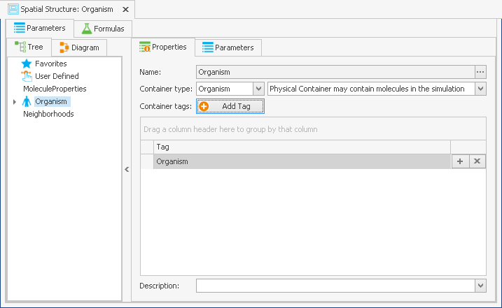
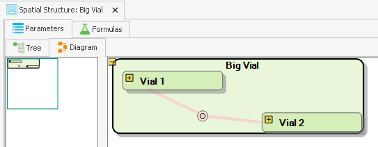
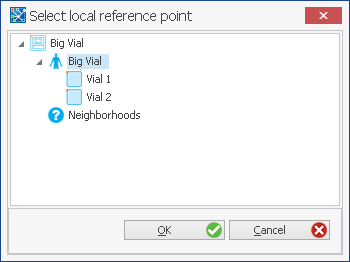
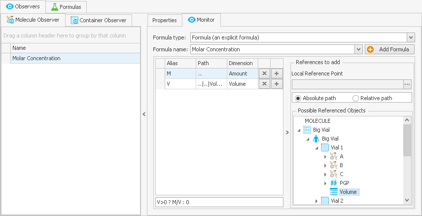
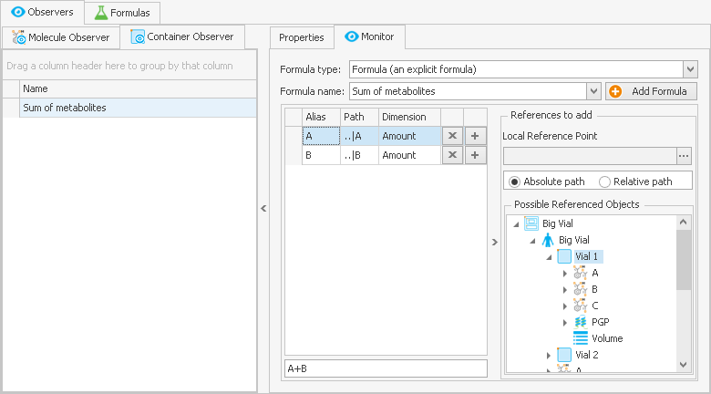
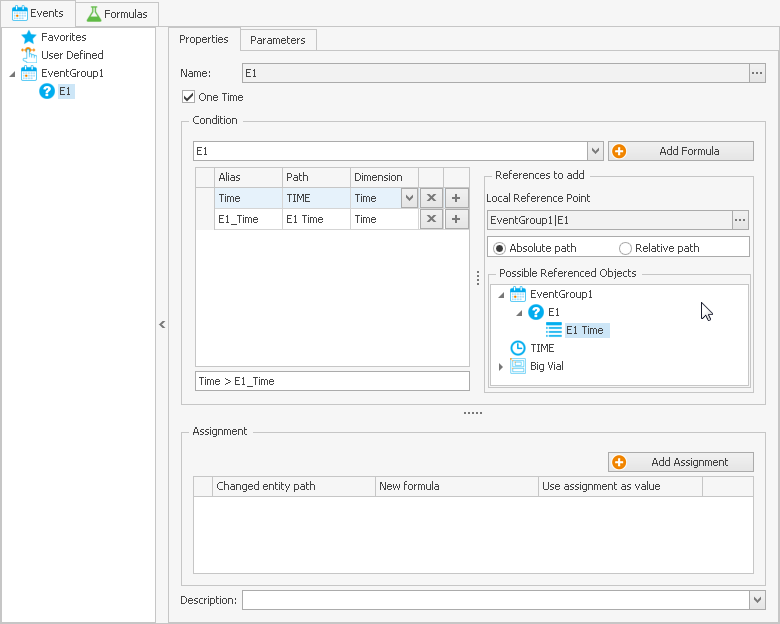

# Model Building and Model Components

After having made yourself familiar in the previous chapters with the building block concept and with the general structure of the program and projects ([“MoBi® - First Steps”](first-steps.md)), this section describes the practical approach how to build MoBi® models by stepwise entering content into the building blocks. Also, this knowledge is of use to upgrade models imported from PK-Sim®, as will be described in [Setting up a Simulation](setting-up-simulation.md).


Always watch for the helpful tool tips that appear when hovering for a few seconds with the mouse pointer over an input box or its description.


## MoBi® - Projects‌

### New Project‌

Your first step is to create a new project.

To create a new project select **New Project** on the **File** ribbon tab or alternatively press **Ctrl+N**.

The ribbon bar **Modeling & Simulation** with the different Ribbon Groups for creation of building blocks, simulations, and more will appear. Empty building blocks are now present for Molecules, Reactions, Spatial Structures, Passive Transports, Observers, and Events and are shown in the **Building Block Explorer**. You can now edit a building block by double-clicking the corresponding entry.

### Other project actions in the File tab‌

1. Open a Project

To open a project select **Open Project (Ctrl+O)** on the **File** tab.

A **File Selection Dialog** will open in which a project file (mbp3 file) can be selected. Alternatively, you can also choose one of the **Recent documents**.

After selection, the MoBi® project is opened.


You can alter the Number of recently opened projects: on the **Utilities** tab click **Options** and select the **General** tab.



Only one project can be opened at a time! This project may, however, contain several simulations. To work on more than one project in parallel, MoBi® can be started several times.


1. Close a Project

Close a project by selecting **Close Project** in the **File** tab. A confirmation dialog opens if there are unsaved changes.

1. Save a Project

To save the current project select **Save Project (Ctrl+S)** in the File tab or use the quick action button .

You can then choose either  **Save Project**, which saves the project under the name already given or  **Save As** to save the project with a new name in another file. The currently opened project will be saved with all information.

## Parameters, Formulas, and Tags‌

In all building blocks that are now created, there may be a need to create and edit parameters, to work with formulas or other elements like tables. This section describes the general options you have for parameters and formulas, and the general procedures to work with them.

Parameters are typically listed in a separate tabbed view, named "Parameters"; compare the figures within this Chapter for their exact location which will vary, depending on the building block. A parameter is used to describe physical or physiological properties of a molecule, a reaction or transport, a spatial structure, an event or an application.

For improved readability, two categories of parameters exist: "regular" and "advanced" parameters. In any parameter list of a building block, a checkbox exists above the list which is named  **Show Advanced Parameters**. If this box is checked, only those parameters tagged as "advanced" are displayed. Any parameter can be tagged as being "advanced" by checking the box  **Advanced Parameter** when a parameter is created or edited.

Parameters can be newly created, copied, moved, edited, or loaded from a pkml file:

* A parameter is added by clicking on the  **Add Parameter** button that is present in a parameter tab view, or by right-clicking the building block item's name (molecule, reaction, etc.) in the tree, list, or diagram view and choose **Create Parameter** from the context menu that appears.
* Instead of newly creating a parameter, you may also load it from a file. Use the **Load Parameter** button or context menu entry for this purpose and select a pkml file (e.g., a previously saved building block or simulation) that already contains a suitable parameter.
* A third option is to **copy and paste parameters** between building block items by pressing **Ctrl+C** (on the source parameter, like from an already entered molecule or reaction) and **Ctrl+V** after moving to the target area and after clicking into the empty parameter space. Instead of **Ctrl+C** to copy a parameter, you can use **Ctrl+X** to cut a parameter from its current position.

Within the different building blocks, there are slight differences in the procedure and in the selectable options which will be explained in the corresponding sections in this chapter. In the Molecules and Reactions building blocks, parameters may be of **different types**: Local, Global, and Property. As these names already suggest, the differences are the following:

* Parameters defined as Local can only be used locally, i.e., within the corresponding reaction or for a molecule where a local parameter is defined.
* Parameters defined as Global can also be used in other formulas, i.e., they appear in the reference lists described in [Working with Formulas](model-building-components.md#working-with-formulas). Furthermore, they are located in different places of a simulation hierarchy, as described in [Molecular Properties](setting-up-simulation.md#molecular-properties).
* Parameters defined as Property are identical to Global parameters except that they will not be listed and set in the parameter start values.


A change of the parameter type will influence the path wherever this parameter is used in a formula (compare [Working with Formulas](model-building-components.md#working-with-formulas)).

Furthermore, this different path will make this parameter appear in different locations within the simulation hierarchy. Global parameters appear below the reaction list in the top level hierarchy, local parameters below the reaction list in the container level where the reaction occurs.


Any parameter needs to have a **Dimension** assigned to it or the option Dimensionless has to be selected from the Dimension combobox. This feature is needed for the automatic dimension validation provided by MoBi®. Typical dimensions are concentration, volume, time, or the more complex dimensions for flow or rate constants.


If the box Validate Dimensions is  unchecked in Utilities -> Options -> General, the dimension field is not used in the model.


A parameter can be assigned to a **Group** using the combobox of the field. This information is only used for display purposes to show the list of parameters in e.g. a given container and will enable a grouped view instead of default flat view. You can switch from flat to grouped view by ticking the **Group parameters** box.

In the combobox of the field **Formula Type**, you can select if the parameter is defined as:

* a constant, consisting of a numeric value and a unit;
* a formula, having a formula name and a formula string (i.e., a mathematical expression) including references to the formula items;
* a table, using individual data pairs from which a value is interpolated over the simulated time;
* a value distributed around a constant value or between two limits (only available for parameters of spatial structure containers);
* a calculation method parameter, whose formula will be defined depending on the selected calculation method of each molecule in the model (only available for parameter of spatial structure container). Currently, this calculation method cannot be edited within MoBi® and is imported from PK-Sim® together with the parameter.

In the bottom part of the **Create** or **Edit** window are several input options that have different effects on the parameter:

* Checking  **Parameter is state variable** will open additional input fields for the right hand side of a differential equation (explained in detail in [State Variable Parameters](model-building-components.md#state-variable-parameters)).
* Checking  **Plot Parameter** will tag this parameter so that it can be visualized in a chart with the simulation results (see [Chart Component](../part-5/chart-component.md)).
* Checking  **Advanced Parameter** will hide this parameter from the lists if

Show Advance Parameters is  un-checked in the parameter list view.

* For all parameter types, **a description can be added** into the input box at the bottom, for example to quote a reference. Clicking into the text field will open an edit dialog into which you can enter or paste any text of your choice.

You may also **add tags to any parameter** which is done by first clicking the **Tags**

tab in the parameter window. This will switch you to the tag list view.

* To add a tag, click the "Add Tag" button and enter the tag in the input box.
* To delete a tag, click the symbol that appears behind every tag in the list.

Parameter tags are used for the evaluation of formulas of the type "Sum", see [Sum Formulas](model-building-components.md#sum-formulas). The general rationale behind tags is explained in, [How Tags are used](model-building-components.md#how-tags-are-used).

Each parameter can be edited by selecting it from the parameter list, upon which the parameter edit dialog right of the list is updated to show the selected parameter, then allowing to edit it.

### Working with Constant and Distributed Parameters‌

A constant parameter is simply entered as a number in the field **Value**. You may use decimal points, exponential notation, and minus signs (e.g., 2.34; 1.2E-6;

\-150). Next to the value, its unit will be shown; the default unit is selected by your choice in the Dimension field, but it can be changed to other units listed in the combobox, e.g. from 1/min to 1/sec or 1/h.

Examples for constant parameters are given below, like the property "Molecular weight" for a molecule (see [Molecule Parameters](model-building-components.md#molecule-parameters)) or the rate constant for a reaction (see [Reaction Kinetics](model-building-components.md#reaction-kinetics)).

**Distributed parameters** (only available for parameters of spatial structure containers) describe a variation around a constant value or between two numerical limits. Within a given MoBi® simulation, a distributed parameter has a fixed value (default defined by the value in the field **value**). A distributed parameter can be used only to calculate the percentile of the parameter value given a certain distribution. Distributed parameters are useful if population statistical data are to be defined within a model. To define such a parameter, use the **Create Distributed Parameter** command from the context menu of a spatial structure item, like for containers (e.g. organ sizes) or neighborhoods (e.g., blood flow rate). In addition to what is entered for constant parameters, the **Distribution Type** has to be selected. Available options are:

* Discrete Distribution, which is identical to a constant parameter; this feature is implemented for the purpose of simply disabling the distribution function without going through the parameter creation process again.
* Uniform Distribution, where a parameter will be uniformly distributed between a **Minimum** and a **Maximum**, both have to be defined as numeric values. This is done by the same rules for value and units as used for the constant parameter value.
* Normal Distribution, where a parameter is varied around a **Mean** value using a **Standard Deviation** - both values have to be specified.
* LogNormal Distribution, where a parameter is logarithmically varied around a **Mean** value using a **Geometric Standard Deviation** - both values have to be entered.

If you use one of the different distributions, a **percentile** will be automatically calculated for the parameter value define in field **value** given the defined distribution. The functionality of this feature is particularly useful in combination with the script toolboxes for MoBi®.

### Working with Formulas‌

A parameter can be defined by a formula that may also use other parameters. A formula string defines the formula. Additionally to parameters, formulas are used in the kinetics equations of reactions and transport processes as well as in the monitor equation of observers. See the corresponding sections for a description. To define a formula, select Formula in the combobox **Formula Type**.

Each formula needs a formula name. The combobox **Formula Name** allows you to select from already existing formulas or to enter a new name. A new formula can be entered by clicking the  **Add Formula** button and you will be asked for the formula name. Then press **Enter** or click **OK** to return to the main window.


It is a good idea to use a name related to the object where the formula is used (e.g., parameter, reaction, observer) - you may even use identical names here.


To enter or edit a **formula string**, click into the unnamed input box above the **Description** field and then use your keyboard. This formula string will be evaluated by the solver once the simulation is run. It is written as a mathematical term that comprises numeric values, arithmetic operation signs, and names of parameters or their alias names. As long as the formula has errors or is incomplete, a red error sign  is displayed left of the empty input box. Hovering the mouse over this warning symbol will show you a tool tip on the validity of the equation (e.g., missing references or syntax errors).


Useful workflows with parameter aliases or with reference paths to aliases are described below, see [Reaction Kinetics](model-building-components.md#reaction-kinetics) and [Passive Transports](model-building-components.md#passive-transports).


In a formula, the following characters may be used:

* numbers can be entered as described for constants
* the arithmetic operation signs **+**, **-**, \*\*\*\*\*, **/**, **^** (for exponents)
* round brackets **(** **)**
* the constants **pi** and **e**
* the mathematical functions **ACOS**, **ASIN**, **ATAN**, **COS**, **COSH**, **EXP**, **LN**, **LOG** (identical to **LN**, natural logarithm), **LOG10**, **MAX**, **MIN**, **POW**, **SIN**, **SINH**, **SQRT**, **TAN**, **TANH**; if two operators are required (**MAX**, **MIN**, **POW**), a semicolon is used for separation, e.g., _POW(3;2)_ which corresponds to _3^2_
* the random number generator functions **RND** and **SRND**, both to be used with the dummy argument **()**
* if conditions, using the notation `<condition> ? <formula string for true> : <formula string for false>`
* in the conditions, the operators **<**, **>**, **<>**, **>=**, **<=**, **=** ; alternatively: **LT**, **GT**, **NEQ**, **GEQ**, **LEQ**, **EQ**, for which the use is `<function>(<expression1>;<expression2>)`
* conditions can be composed out of sub-conditions that are logically connected by **AND**, **OR**, or inverted by **NOT**. An alternative symbol for **AND** is **&**; an alternative symbol for **OR** is **|**. Besides logical conditions, the numbers 0 and 1 can be used as arguments.


The above mathematical functions are defined as in the C programming language. For standard reaction kinetic models, these functions are not required at all. It is recommended to use events rather than "if conditions" in a formula.


Furthermore, defined **aliases** can be used in a formula as described in the next paragraph.


As opposed to mathematical functions, constants, and operators aliases are case sensitive.


Below the formula name and above the formula string, there is a **Reference Table** showing a header line above the columns named **Alias**, **Path**, and **Dimension**. On the right hand side of the reference table, there is a second table (separated by a vertical bar) titled **References to add**. From this left part, references are moved to the right Reference Table part by drag & drop.


In some cases, e.g. when working with formula-defined molecule parameters, it may be helpful to expand this window to have enough working space. To do so, use the vertical bars between the window sections and drag them with the mouse.


References can be of two different kinds:

* An **absolute path** reference specifying the complete path to a referenced object (e.g., parameter, another formula). An example for this would be "Organism| Organ|Volume".
* A **relative path** reference specifying the truncated path relative to the current formula. The expression ".." is used for "one level up", using a structure similar to that of file systems paths. An example for such a relative reference would be "..|..|Volume".

You need to choose between absolute and relative path by selecting the corresponding radio button in the References to add a section of the window. If you select relative, you will be asked for a **Local Reference Point**. This reference point depends on the level on which you create your formula (e.g., the organism or an organ level) and may be specified in the expandable selection tree (see below). Recommendations of how to choose your reference point are given within this chapter. Click **OK** to finalize your selection.

The selected local reference point will be displayed with its absolute path in the "References to add" window. In case you need to correct or alter the local reference point, click on the **...** icon right of the path. This will re-open the reference point selection window.

To add a reference to a formula, after having selected the reference point:

1. Find the reference by name in the **Possible Referenced Objects** tree. Click on the + signs in the displayed tree to get to deeper levels of selectable points.
2. Click on the object's name, then drag it to the Reference Table area left to it; drop it there by releasing the mouse button. The object will be added to the list, usually with its name as the alias. If that name already exists in the list, the alias name is automatically renamed by adding a number. The path and dimension of the object are also added.


Not all entries in the tree are allowed to be moved to the left, depending on the context of the formula. A + sign displayed next to the mouse pointer indicates an allowed reference.


1. If needed, you may edit the alias name of the object manually. Alias names need to be identical to the names that are used in the formula string. Simply click on the alias name and change or override (or copy/paste) the name. For example, if you added several "Concentration" parameters from different molecules to a reaction kinetics equation, it may be helpful to manually add the molecule name next to them.
2. In the same way as for aliases, it is also an option to manually edit the path. However, the standard procedure would be to remove the object and add it again, using a new local reference point.
3. Dimensions can be changed by clicking on the displayed dimension and selecting a different one from the combobox.


A reference path may also contain a global part, like "|MOLECULE", which is recognizable by being written in all capital letters. The reference to "|MOLECULE" means that this part of the path refers to a parameter or property of the currently evaluated molecule, whatever its name. This is useful in formulas that are computed for all molecules present in a container. Compare the formulas in [Observers](model-building-components.md#observers) or [Passive Transports](model-building-components.md#passive-transports). A global reference is selected automatically by MoBi® where appropriate.


To **remove an object from the reference list**, right-click it and select **Remove**from the context menu.

Clicking on the **Formulas tab** in the edit window will show a list of all formulas used in the reaction building block. This list is a quick overview of formula names within one building block. Clicking on a formula in the list will show the references and the equation for the selected formula. Right-clicking on a formula in the list opens a context menu that allows you to **Rename**, **Clone** and **Remove** formulas.

### Sum Formulas

In addition to the formulas described in the previous section, sum formulas can be used to calculate sums of a specified parameter name. As a selection criterion, parameter tags can be specified.

To define a parameter or a reaction by a sum formula, use the following procedure:

1. Select Sum Formula in **Formula Type** combobox.
2. To create a new sum formula, click the  **Add Formula** button, upon which you will be asked for the formula name. Then press **Enter** or click **OK** to return to the main window.
3. In the **Formula Name** combobox, you may alternatively select an existing sum formula name.
4. In the **Parameter Criteria** field, right click into the empty white space and select either a New match tag condition. (The New not match tag condition is available too if needed). You will then be asked to enter a tag to match; or select one after clicking the combobox arrow. All parameters carrying the specified condition will be summed; if more than one condition is used, they will be connected with a logical AND. The general rationale behind tags is explained in (How Tags are used]\(#how-tags-are-used).
5. Conditions can also be removed using the context menu that appears when right-clicking into the white space in the **Parameter Criteria** field.

### Working with Tables‌

A parameter can be defined by a table that is made up out of pairs of simulation- time and corresponding functional value. The parameter value as a function of time that is used in the simulation will be interpolated between these values. To enter a table:

1. Select Table as **Formula Type**. A table layout will open below the Formula Type combobox.
2. To create a new table formula, click the  **Add Formula** button, upon which you will be asked for the formula name. Then press **Enter** or click **OK** to return to the main window.
3. In the **Formula Name** combobox, you may alternatively select an existing table formula name.


A formula name needs to be entered or selected before entering any value points.


1. To add a data point, click the **Add Value Point** button.
2. Enter a time value in the **X** (Time) input box and a parameter value in the **Y** value input box. Units of the values can be selected as described for a constant parameter value.
3. You may check **Restart Solver** box in case the solver generates errors when arriving at these time points.
4. More data points can be entered by clicking **Add Value Point** again, or by clicking on the button in the right to the values lines. You can delete a data pair by clicking the **delete** button .
5. If you would like to use the first derivative of the interpolation, check **Use Derivative Values**. Values before the first and after the last data point of the series are set to 0.


Data points cannot be edited, but have to be deleted and newly entered. Data point units can be changed, leading to a recalculation of the associated value to its new unit.


### Working with Table Formulas with Offset‌

A table described in [Working with Tables](model-building-components.md#working-with-tables) may need to be reused and shifted by a constant time value. For example, PK-Sim® uses this logic to build up repeated advanced application protocols (compare [PK-Sim® - Administration Protocols](../part-3/pk-sim-administration-protocols.md)). To enter a table formula with offset:

1.  Select Table Formula with Offset as **Formula Type**.
    
2.  To create a new table formula with offset, click the  **Add Formula** button, upon which you will be asked for the formula name. Then press **Enter** or click **OK** to return to the main window.
    
3.  In the **Formula Name** _combobox_, you may select an existing table formula with offset.
    
4.  In the box below the formula name, there is a selection to a **path with a table object**. Upon clicking the "..." icon, you can select one such object from a path tree. This must be a parameter, a transport or a reaction defined by a table defined as described in [Working with Tables](#working-with-tables). Only when you select a valid object, the  **OK** button will become active, and you can successfully continue.
    
5.  Below the table object path, there is a selection to a **path with an offset object**. Upon clicking the "..." icon, you can select one such object from a path tree. This must be a parameter containing a time, i.e., its dimension has to be Time.

Only when you select a valid object, the  **OK** button will become active, and you can successfully continue. The X values of the table selected before will be shifted by the constant time value given in the selected parameter of this step.

### State Variable Parameters‌

A parameter can also be defined as state variable. This means, that the parameter value is defined by a differential equation. To do this, click the  checkbox **Parameter is state variable** when entering or editing a parameter. The parameter value of a parameter _p_, for example, is defined as: , with  representing the expression for _change of parameter value per unit time step_ defined by the formula on the right hand side (_RHS_). Once the checkbox is active , the parameter edit view is extended by an additional input box for a formula. This formula defines the **Right Hand Side** of the parameter's differential equation. This right hand side equation itself is entered in the same way as a constant or formula type parameter. The formula in the top half of the parameter edit view now defines the initial condition for the differential equation of the parameter. The value of the parameter is defined when the differential equation is solved during the simulation of the model.


Once the  **Parameter is state variable** checkbox is deactivated again, the input box for the RHS will disappear. The parameter is no longer a state variable, and the right hand side (RHS) formula reverts to RHS = 0. If you have accidentally deactivated the checkbox and then reactivate it, the formula you may have previously defined as RHS is not lost, since all created formulas are stored. To reinstate the formula you may have previously defined as the RHS, select the formula from the combobox after the formula type explicit formula is selected.


### How Tags are used‌

Containers and neighborhoods within a spatial structure, elements of an application, or parameters may be labelled with tags. These tags, together with the name given to a container or neighborhood, may be used for selectively enabling observers, active or passive transports, or events. They are used for formula evaluations of the formula type "sum".

Tags can be entered when creating or editing a tag-carrying entity. The detailed procedures are described within this chapter in the corresponding sections describing spatial structures, observers, events, or parameters. Generally, one or more names are entered in a special input window of the corresponding entity.

Tags are evaluated in fields of observers, transports, or event groups titled "In Container with" or "Between Containers with". More than one condition can be used, being one of the following classes:

1. Match tag condition: the condition is fulfilled when the tag name is matched.
2. Not match tag condition: the condition is fulfilled when the tag name is **not** matched.
3. Match all tag condition: the condition is fulfilled for all tags (not available for transport processes or sum formulas).

More than one condition can be combined for evaluation; the combinations are connected with a logical AND. The detailed procedures when and how to enter tag conditions are described in this chapter ([Sum Formulas](model-building-components.md#sum-formulas), [Transport Processes](model-building-components.md#transport-processes), [Observers](building-block-concepts.md#observers), [Events and Applications](model-building-components.md#events-and-applications)).

Models generated in **PK-Sim**® make extensive **use of tags**: For example, open a PK-Sim® model and look under [Passive Transports](model-building-components.md#passive-transports) for one part of the blood flow through the organs of an organism called "MassTransferBloodPool2OrgPl". This is a passive transport process that occurs from the arterial plasma compartment to the plasma compartments of all organs except for the lung. Consequently, this transport process is occurring under the following conditions:

1. Source container: tagged with "Arterial Blood" and tagged with "Plasma".
2. Target container: tagged with "Plasma" and not tagged with "Arterial Blood" and not tagged with "Lung".

Similarly, observers or events can be included or excluded from being created in different parts of the spatial structure. The molecule observer "Fraction excreted", for example, makes use of the tag "Urine", so this observer is only created in the urine container.

## Spatial Structures‌

A spatial structure can be an organism consisting of organs, cells and other substructures. Alternatively, it can be a laboratory setup, like a test tube or a flow chamber with interconnected compartments. Typically, each structure is described by physical parameters, in particular by volume. Containers of a spatial structure can be defined as Physical, which may contain molecules in the simulation. They can also be defined as Logical, meaning they do not represent a real container with molecules but instead just representing a grouping of sub-containers. Containers are also grouped in categories like Organism, Organ, and others. This way, the physical makeup of an organism is described.

The complex structure of a complete organism can be inspected, used, and modified after loading a simulation that was generated in PK-Sim® (see [Load a Simulation](setting-up-simulation.md#load-a-simulation)). Alternatively, a spatial structure can be loaded on its own by using the  **Load Spatial Structure** command in the Building Block Explorer and selecting the pkml file generated in PK-Sim® or MoBi®. The operations described below for creating new structures can also be used to modify imported structures.


In the process of this and the next sections of this chapter, you will create an example project. An already completed project file named "ManualModel\_Sim.mbp3" is automatically installed together with MoBi® in the default program data directory. The entry "Examples" in the program start menu in the "MoBi" group will lead you to the proper path.


A very simple spatial structure named "Organism" has already been automatically created by executing the **New Project** command. For becoming familiar with editing spatial structures, proceed further:

1. Click on the + sign next to "Spatial Structures" in the Building Block Explorer.
2. Edit the "Organism" by double-clicking on it or by using the **Edit** command of the context menu that appears after right-clicking on **Organism**.

The screen should now look as shown in the following figure:

In the **Edit** window of a spatial structure, you have a diagram area like in the

Edit Reactions mode, which is used here to display the physical and logical arrangement of organs or reaction vials and their interactions. On the left of the **Diagram Area** is a miniature view of the entire diagram which is thought to be helpful in navigating within larger spatial structures. Below the miniature view is a tree view of the spatial structure including any neighborhoods.

### Creating a Spatial Structure‌

For continuing with our example project, construct a simple spatial structure which consists of a surrounding top level container having two interconnected sub-containers. A common tag will be added to both sub-containers which will be used later for restricting some computations (e.g., observers) to be only done for the two sub-containers. Tags are also used for restricting events or selecting source and target for transport processes. Check the corresponding sections for their use.

1. First, **rename the top level container** from its default name that was initially created. Right-click the greenish oval symbol with the name "Organism" inside. A context menu will come up; select  Rename from it.
2. You will be asked for a new name. Enter "BigVial" and press **Enter** or click OK.
3. A new window named "Rename also" will open, where a list of object references to the renamed spatial structure will appear. Leave all the checkboxes checked , and continue by clicking **OK**. The names in the Diagram Area and in the tree views will now show "BigVial".
4. Now create two sub-containers. Right-click again into the light green oval symbol in the Diagram Area, but this time select  **Create Container**.
5. A new window named "New Container" opens, similar to the creation of molecules or reactions. Enter "Vial1" as name, and leave the Container Type on Organ. Select Physical Container in the right combobox below the name input box.
6. Click the **Add Tag** button below the Container Type. You are asked for a tag name. Enter "Obs" as a tag name.
7. Finally, click **OK** or press **Enter**.

After this step, the top container "BigVial" has expanded in the Diagram Area, and a new oval "Vial1" has appeared within the expanded range. Now, repeat the "Create Container" steps 4 to 7. Make sure to right-click into the green-shaded "BigVial" area surrounding "Vial1", but not into "Vial1" and not in the white area outside the outer "BigVial"! A good place would be some distance to the right of "Vial1". Name the second sub-container "Vial2" and tag it also with "Obs". You can then expand the view by dragging "Vial2" to a more distant point from "Vial1" using the mouse. The screen should now look like this:

The spatial structure can be handled in a similar way as the reactions diagram area. You can zoom in and out using the mouse wheel and the **Ctrl** key, through the context menu or the ribbon icons, and you can move structures around by dragging and dropping. Structures can be expanded by clicking on the + sign in the upper right, or they can be collapsed by clicking on the - sign. Templates can be saved or applied, and a **Layout** function can be applied using the context menu after right-clicking. Sometimes the display needs to be refreshed, using the  **Refresh** entry in the context menu.

Any container or sub-container may have parameters associated with it. They can describe physical or biological properties of the container that are required for processes like transports or reactions. What is needed in our practice model is the volume parameter which is used to calculate concentrations required for kinetic equations or for plotting concentrations after a simulation has been performed.‌‌

As for molecules or reactions, parameters become accessible after clicking the "Parameters" tab in the lower section of the edit window. To enter a spatial structure parameter:

1. Click on "BigVial" either in the Diagram Area or in the edit tree.
2. Click the "Parameters" tab.
3. Click the button  **Add Parameter**, upon which a window named "New Parameter" opens.
4. Enter "Volume" into the Name input box, select Volume in the Dimension input box, then enter "1" into the Value input box. The Formula Type remains on "Constant".
5. Finally, click **OK**, and the new parameter "Volume" will appear in the parameter list.
6. Repeat this procedure for the sub-containers "Vial1" and "Vial2", but set their volume values to smaller values, like 0.1 and 0.2 liters.

A Spatial Structure (whole or in part) can also be loaded from or saved to a template (pkml) file. Right-clicking into the Diagram Area will open a context menu that show a **Load Container** and a **Save As** entry.

To **save a Container of a Spatial Structure** as pkml file:

1. Right-click on it in the Diagram Area or in the tree view, and select **Save As** from the context menu.
2. In the file browser window that will open, select a location where it is saved and choose a name to save it.

The selected container, including all its sub-containers, parameters and neighborhoods between the sub-containers will be saved.

To **load a Container into a Spatial Structure** from a pkml file:

1. Right-click onto the desired target position for it in the Diagram Area or in the tree view, and select **Load Container** from the context menu.
2. Select a folder and then a pkml file from the file browser window that will open.
3. If the pkml files contains more than one container, select the desired container.

The selected container, including all its sub-containers and neighborhoods between the sub-containers, will be loaded. If duplicate names occur, you may be asked to enter a new name. Any desired neighborhood relations (see [Creating Neighborhoods](model-building-components.md#creating-neighborhoods)) to already existing containers in the spatial structure will have to be newly created.

You may also load and save an entire Spatial Structure building block as pkml file. This is described in detail for molecules in [Loading, Editing, and Saving Molecules](model-building-components.md#loading-editing-and-saving-molecules) and applies also for a spatial structure.


A collection of template files with predefined building blocks is automatically installed together with MoBi® in the default program data directory. The entry "Templates" in the program start menu in the "MoBi" program group will lead you to the proper path.


### Creating Neighborhoods‌‌

Within a spatial structure, transport processes may occur (see [Active Transporter Molecules](model-building-components.md#active-transporter-molecules) or [Passive Transports](model-building-components.md#passive-transports)). If you plan to define a transport process within a project, it is necessary to define a neighborhood for a transport to become active. Creating a neighborhood works similar to connecting reaction partners with a reaction triangle:

1. Move the mouse to one of the connected containers until the mouse pointer changes from the standard arrow  to a hand symbol .
2. Hold the left mouse button and drag the connection, displayed by a line, to the container you want to have as a second neighborhood partner until the line hits its rim. In our case, connect "Vial1" with "Vial2".
3. You will be asked for a neighborhood name that is required to proceed. Enter "V1V2Connection" and click **OK**. In the Diagram Area, the thin initial line is replaced by a bold line showing a circle half-way in the connection. Also, the neighborhood appears in the tree view of the spatial structure.

The screen now looks like this:

Like the containers, the neighborhood may contain parameters and may carry tags. These parameters could describe the physical makeup of a neighborhood, and these values may later be used in the formulas of transport processes. If you look at simulations imported from PK-Sim®, you will see examples for such parameters. The spatial structure of such a PBPK model is much more complex, but editing it works in the same way as described for our simple example.

## Molecules‌

The Molecules building block contains all molecules with their default start values, molecule-specific parameters and properties. A molecule has a name, typically the name of the compound. Parameters and properties can be defined by you to describe the physico-chemistry, like solubility or lipophilicity. These parameters may later be used in reactions, passive and active transport processes, or may influence events. Also, active transporter molecules and transport processes are defined for each molecule, if relevant for the model.

Start by opening a Molecules building block for editing. In the **Building Block Explorer**, open the Molecules folder and edit the Molecules building block by either right-clicking it and selecting "Edit", or by double-clicking on it. A new tab with an empty space will open. This is the work space where you can add new molecules or load molecules from other projects. You may notice that the ribbon of the MoBi® window has changed, being tabbed "Edit Molecule", to offer you clickable ribbon buttons for molecule-related actions (compare in [Enter Molecules](first-steps.md#enter-molecules)).

### Creating New Molecules‌

To create a new molecule:

1. Click in the newly visible ribbon **Add** on the button  **New**, or right-click into the Diagram area (the empty space below the tab "Molecules") and choose **Create Molecule** from the context menu that appears. A new window titled "New Molecule" will open.
2. Enter a molecule name into the "Name" input box.
3. Alternatively, a molecule can be created based on a PK-Sim® template. This can be achieved by using the button **PK-Sim Molecule** in the **Add** ribbon or **Add PK-Sim Molecule** from the context menu in the diagram area.
4. Enter a name for the PK-Sim molecule and the four physicochemical properties as listed.

At this point, you may already input a value for the "Default Start Amount" which is set to zero by default. Also, you may define molecule parameters after clicking on the "Parameters" tab of the "New Molecule" window (see below). Both operations, however, can also be done after the molecule is created (see below), which is finalized by pressing the **Enter** key or by clicking **OK**. The newly created molecule name now appears in the left part of the Molecules edit tab, and a tab on the right shows the properties of the molecule.

### Loading, Editing, and Saving Molecules‌

Alternatively to newly creating a molecule, **molecules can be loaded from a pkml file**. This file can be

* a PK-Sim® export containing molecules (see [Export to \*.pkml file for MoBi®](../part-3/importing-exporting-project-data-models.md#export-to-pkml-file-for-mobi), for how to create such a file),
* an entire previously saved MoBi® simulation,
* a saved Molecules building block from a previous project,
* or a previously saved molecule file.


A collection of template files with predefined building blocks is automatically installed together with MoBi® in the default program data directory. The entry "Templates" in the program start menu in the MoBi program group will lead you to the proper path.


Use one of such files an proceed in the following way:

1. Click the  **Load** ribbon button, or right-click into the empty space below the tab "Molecules" and choose **Load Molecule** from the context menu that appears.
2. Select a folder and then a pkml file from the file browser window that will open.
3. If the pkml file contains more than one molecule, select one or more from the list that is displayed. If one or more molecule names are already in use in the current project, you will be asked for alternative names.

You can **edit the molecule properties** for the molecule in the tree that is currently being highlighted.

* Within the properties window, the checkbox  **Stationary** determines if the corresponding molecule will be transported by [Passive Transports](model-building-components.md#passive-transports) processes described below (see [Passive Transports](model-building-components.md#passive-transports)) - this box should thus be checked  only for immobile molecules, like membrane-bound receptors or transporters.
* Select the **Molecule Type** specification from the combobox. This has only influence on the icon depicted in front of the molecules in the molecules tree view to the right. Selectable options are  Drug,  Enzyme,  Transporter,  Complex, Metabolite ,  Protein, and Other Protein.
* The **Default Start Amount** determines what default value will be used whenever "Molecule Start Values" are created (see “Molecule Start Values”). The value should be left on 0 for all molecules which only will be created in the process of the simulation. For complex spatial structures, it might be an alternative strategy to set all default start amount values to 0 and set everything manually in the molecule start values for those containers where a molecule is present in known concentrations.
* The **Used Calculation Methods** at the bottom right of the edit window shows three comboboxes for the selection of calculation methods for the distribution of the molecule within a model exported from PK-Sim®. The calculation method defines which method is used to calculate parameter values of parameters located in the "Spatial Structure" ("MoleculeProperties") which have the **Formula Type Calculation Method**. These selections are only needed if you want to use distribution methods from PK-Sim®. Otherwise, leave them on No Calculation Method. For further information on this subject, please refer to the discussion of the different distribution models in the PK-Sim® manual ([Simulations](../part-3/pk-sim-simulations.md)). If you select a certain "Calculation Method" you can get tool tip information on the equations and specific parameters used in the "Calculation Method" by hovering with the mouse over the "Category" entry.

To **save a molecule** as pkml file:

1. Right-click on its name in the molecules tree, and select **Save As** from the context menu.
2. Select a location where it is saved in the file browser window that will open and select a name to save it.

In a similar way, you can **save an entire molecules building block**.

1. Go to the Building Block Explorer, right-click your building block (the default name would be "Molecules", it would be the level under the building block group "Molecules"), and select **Save As** from the context menu.
2. Select a location where it is saved in the file browser window that will open and select a name to save it.

You can **load such a molecules building block** into any project by right-clicking the building block group (top level) and selecting **Load Molecules Building Block**. Also, you can use any saved molecules building block to **load individual molecules** from it into other projects, using the **Load Molecule** function described above.


If you are frequently building models in MoBi® where new molecules have to be defined, it is a good idea to once configure your typical **default molecule** and save it in your working directory. You can then compile your molecules building blocks by repeatedly loading your default molecule and each time changing the name to your desired molecule names.


Any molecules building block can also be **removed** (i.e., deleted), **renamed**, or **cloned** (i.e., copied under a different name) using the corresponding context menu functions.


The above operations, including save and load, are functions available for all other building blocks through the context menu that appears on right-clicking with the mouse at the corresponding positions.


### Molecule Parameters‌

Molecule parameters can created, loaded, copied, or changed after clicking on the Parameters tab in the right half of the window. For comprehensive information on parameters and parameter handling, see above [Parameters, Formulas, and Tags](model-building-components.md#parameters-formulas-and-tags).

A molecule parameter needs to have a name, a parameter type (Local, Property, or Global), a dimension, a value or a formula, and it may be a state variable.

* A typical local parameter is "Concentration", defined by the formula "Amount/ Volume".
* A typical property is "Molecular weight" which is used for calculating weight- based concentrations.
* An example for a global parameter might be a total start amount from which the start amounts of differently bound molecules are calculated.
* A description can be added into the input box a the bottom, like for giving a literature reference from where you obtained this value.

More examples for molecule parameters can be found by looking at a molecule in a simulation imported from PK-Sim®. If you enter a formula-defined or a state variable parameter, please refer to the [general section](model-building-components.md#parameters-formulas-and-tags) defining how to use this functionality.

As an example, we create the property "Molecular weight" for the molecule created above.

1. Click  **Add Parameter**, and a "New Parameter" window will open.
2. Enter "Molecular weight" as parameter name.
3. Select the Parameter Type Property from the combobox and confirm the security question.
4. Select MolecularWeight in the Dimension combobox - you can narrow down your search by entering the first few characters after clicking this combobox field.
5. Leave "Formula Type" on Constant and enter the molecule's molecular weight in g/mol into the "Value" input box.
6. Finally, press the **Enter** key or click **OK**. The screen should look like in the screen shot below.

As a second example, load the parameter "Concentration" from a PK-Sim® simulation export (see [Export to \*.pkml file for MoBi®](../part-3/importing-exporting-project-data-models.md#export-to-pkml-file-for-mobi) for how to create such a file).

1. Click the **Load Parameter** button or select it from the context menu.
2. Select a pkml file that you previously generated in PK-Sim® and select Concentration from the list. This local parameter is defined by a formula, and it is useful to have it in every molecule which is later used in a reaction kinetic equation.


For a detailed description of the creation and use of formulas see below, [Reactions](model-building-components.md#reactions).



For **continuing our test project**, enter three molecules and name them "A", "B", and "C". Uncheck the checkbox  **Stationary** for each molecule to allow transport processes. Set the **Default Start Amount** for molecule "A" to 50 µmol and leave "B" and "C" at the default, 0 µmol. It will be needed to practice in the next sections.


### Active Transporter

In addition to the molecules described so far, active transporter molecules and transport processes related to them can be created. Since their use requires that a spatial structure and neighborhoods have been created, they and the dependent active transport processes are described below in [Active Transporter Molecules](model-building-components.md#active-transporter-molecules).

## Reactions‌

In a Reactions building block, all (bio-)chemical reactions which are of interest for the current project are defined. Like a molecule, each reaction has to have a unique name, a reaction kinetics equation, may have parameters, and it also needs reaction partners.

Like in the Molecules section, you first need to select a reaction building block for editing.

1. In our newly created project, open the Reactions folder and edit the Reaction building block by either right-clicking it and selecting **Edit**, or by double- clicking on it.
2. A new tab with an empty diagram area will open. This is the work space where you can add new reactions and molecules or load reactions from other projects. Again, the ribbon of the MoBi® window changes to a reaction-related view, named "Edit Reaction".

Working with reactions is done mostly using the Reaction Diagram. We describe the most important features in this section, for more details see [Diagrams Overview](diagrams-overview.md)

### Reactions and Molecules‌

When creating a simulation (see [Setting up a Simulation](setting-up-simulation.md)) the reactions defined in this building block are combined with the molecules from the Molecules building block. When we use the term **Molecule** in this section we refer to Molecule names only, which define the relationship between the Reactions to the Molecules from the Molecules building block.


If you insert a molecule that has not yet been defined in the Molecules building block, this may cause an error later when setting up a simulation. Remember to define that molecule later.


To have access to molecules as reaction partners for the reactions you want to create, it is advisable to first insert the molecules that you need into the Diagram Area, our work space. Alternatively, you may insert the molecules after reactions are created. To insert molecules:

1. Click the newly visible ribbon button  **Insert Molecule**, or right-click into the Diagram Area and choose **Insert Molecule** from the context menu that appears. A box listing all molecules available in this project will appear.
2. You can either enter a name manually into the "Molecule Name" input box, or select as many as you wish from the list below this input box. Multi-select is done in the standard Windows® way by keeping the **Shift** key (for a contiguous part of the list) or the **Ctrl** key pressed (for individual selection) followed by clicking with the mouse on the desired molecule range or molecule names.
3. Click **OK** to execute the operation. For each molecule, a green circular symbol appears in the diagram area.

The added **molecules can be moved** by the mouse within the diagram area. To do this, left-click a molecule on its dark-green center, hold the mouse button and drag it with the mouse. Release the mouse button when the molecule sits at its desired place.

To **create a new reaction**:

1. Click the ribbon button  **New**, or right-click into the diagram area at the position where you want to have the new reaction, then choose **Create Reaction** from the context menu that appears. A new window titled "New Reaction" will open with the "Properties" tab selected.
2. Enter a reaction name into the "Name" input box, e.g. "R1".
3. Below the name, you can check the box  **Create process rate parameter**. If this box is checked, a parameter which equals the reaction rate equation is automatically generated when a simulation is build. You can use this parameter to refer to the reaction rate in any equation. It can also be used to plot the reaction rate (additionally check the box **Plot Process Rate Parameter**) .
4. Next, you can choose the Formula Type from a combobox - by default, Formula is selected.
5. If you want to use a formula that has already been defined, you may select it from the "Formula Name" combobox. To create a new formula, click the  **Add Formula** button. You will be asked for a reaction formula name. It is a good idea to use a related name for the reaction and for the reaction's formula - you may even use the same names here. Then press **Enter** or click **OK** to return to the "New Reaction" window.
6. You may then continue to create reaction parameters (like rate constants) and the reaction formula, but that can be done later as well.
7. Finally, press **Enter** or click **OK**.


For completing our example and to get more practice, repeat steps 1 to 6 to enter a second reaction that you name "R2".


A **reaction triangle** symbol showing the reaction name "R1" underneath will be created in the Diagram area. This triangle  has differently colored circles on its corners:

* The blue circle, by default on the left, is where the educts are to be connected (see where already two reactions are present).
* The green circle, by default on the right, is where the products are connected.
* The red circle on the top is where reaction modifiers, like catalysts or inhibitors, are connected - i.e., those molecules that do not change in the course of the reaction, but influence the reaction kinetics.

Like molecules, reaction triangles can be dragged with the mouse to a desired position within the diagram area. Click into the grey center of a reaction triangle and hold the left mouse key to drag the reaction symbol.

### Connecting Molecules and Reactions‌

Now you may want to connect molecules to the reaction and verify or change the stoichiometry. There are two ways to connect a molecule to a reaction as educt, product, or modifier:

* You can either click on the corresponding circle of the reaction triangle (i.e., blue for educt) and drag it towards the desired molecule, holding the left mouse button pressed and releasing it when the connection line that is protruding from the triangle connects to the proper molecule.
* Alternatively, you can drag the light-green rim of a molecule symbol towards the desired position of a reaction triangle until the connection line connects to the correct target circle.

In both cases, the correct position of the mouse pointer to start the action is indicated by a change of the mouse pointer from an arrow symbol  to a hand symbol . As long as you keep the left mouse button pressed, the connection is not yet finalized. So, if the connection line appears to connect to the wrong target, continue moving the mouse towards the desired target symbol and only release the mouse button when the correct points are connected. You should get an arrangement like shown for reaction R1 in below.


In case a wrong connection is established, you can click on a connection, after which it is highlighted by light green squares, and then press the **Delete** key on the keyboard.


Now, continue and check the **reaction's stoichiometry**. If you have connected one or more molecules to the reaction, you should see them appearing in the properties tab of this reaction.

1. Click the reaction triangle. Below the Diagram area, the **Properties Editor**, a three-tabbed window, is shown.
2. Click the **Properties** tab, and you see the Alias names (how they will be used in the formula, see next section), the path, and the dimension of the amount of molecules .
3. Clicking on the **Stoichiometry** tab will list the educt and product stoichiometric coefficients. By default, these coefficients are set to 1, and you need to change that manually if your reaction has a different stoichiometry, e.g. if two molecules form a dimer.

### Reaction Kinetics‌

You are now ready to define **Reaction Parameters**, like kinetic rate constants, Michaelis-Menten parameters (kcat or KM), or binding constants. These parameters will then be used for the equation that defines the reaction kinetics. A new reaction parameter is defined by the following procedure:

1. Click the Parameters tab in the edit reactions window.
2. Click the  **Add Parameter** button. A "New Parameter" window opens (compare molecule parameter creation, “Molecule Parameters”).
3. Enter a parameter name, like "k1" as a first order rate constant in our example.
4. Select the parameter type (Local/Property/Global). For a rate constant only used in one single reaction, the recommendation is to choose Local, whereas Global is the right choice if several reactions need this parameter and you want to define it only once.
5. Select the proper dimension in the **Dimension** combobox, which is Inversed Time for the first order rate constant in our example.
6. Enter a value for your parameter, 0.01 as an example. If needed, select a different dimension unit in the combobox to the right of the value input box. The parameter may also be defined by a formula or data table, or you may make the parameter state variable (compare [Parameters, Formulas, and Tags](model-building-components.md#parameters-formulas-and-tags)).
7. Optionally you may enter a description.
8. Finally, press **Enter** or click **OK**.

Alternatively to entering it manually, you may also load it from a file or copy and paste it from another reaction in the same way as described above, see [Parameters, Formulas, and Tags](model-building-components.md#parameters-formulas-and-tags). Any setting of a parameter can be edited later, and as many parameters as you need can be added to a reaction. The figure below shows what the screen would look like after one parameter has been added.

The following steps describe how to enter a **kinetic equation** to the reaction:

1. Click the **Properties** tab again, and notice the red error sign  left of the empty input box (see lower left). Hovering with the mouse over this warning symbol will show you a tool tip with information on the validity of the equation - currently the problem is that it is still empty. Examples for kinetic equations are a irreversible term, like "k1\*A", an equilibrium like "k1\*A- k2\*B", or a Michaelis-Menten type of equation.
2. If you want to use relative paths, select the corresponding radio button on the right hand side, and then the corresponding reference point in the tree window that pops up.
3. All variables you use in the kinetic equation will have to be present in the reference list. The molecules that were previously drawn to the reaction (educts, products, or modifiers) are already present with their corresponding amount parameters.
4. To add the reaction parameters that you defined before to the reference list, click on the + sign next to the reaction name in the tree display in the "Possible Referenced Objects" part of the window. Drag and drop all reaction parameters that you want to use in your formula into the references area left of the tree, where product and educt molecule references are listed.
5. If you need molecular concentration parameters in the formula, select Relative path and choose one container. Open this container in the possible referenced objects tree by clicking on the + sign next to it, then open MoleculeProperties underneath it, open the needed molecule and drag the concentration parameter (which needs to be created beforehand in the Molecules building block, see [Molecule Parameters](model-building-components.md#molecule-parameters)) into the references area left of the tree. Finally, you may want to edit the automatically generated alias names to have molecule names as part of the aliases. Just click into the alias name field and edit the name.
6. Besides reaction and molecule parameters, parameters of other building blocks, like the volume of a spatial structure, might be needed. They have to be defined first, so look up the corresponding sections in this chapter to see how to do that.
7. Finally, enter your kinetic equation into the empty input box below the references; for our example, enter "k1\*A". This will let the error symbol  disappear, if everything is properly defined and if all parameters are defined in the references. Compare your results to the series of screen shots of the Quick guide in [Enter a Reaction](first-steps.md#enter-a-reaction).


To complete reaction R2 (created above, see [Reactions and Molecules](model-building-components.md#reactions-and-molecules)) which you will need for continuing with the model building, connect molecule "B" as educt to R2, then "C" as product, as done for R1 in the previous section. Then define another k1 parameter for R2, this time set it to 0.005. Note that the name k1 appears twice, but is assigned to different reactions - thus they can both be separated. Next drag k1 to the references list, then enter k1\*B as reaction kinetics formula. We will need a working reaction system if we move on to setting up a simulation later on.

If using the same rate constant name for two different reactions is too confusing, use different names for the rate constants in different reactions.


### Additional Features for Editing Reactions‌

There are more features available to handle reaction building. Some of which are briefly described here:

* you can delete an object using the **Delete** key or the context menu,
* you can zoom, for instance by pressing the **Shift** key and selecting a rectangle by dragging the mouse,
* different layout features like usage of templates and auto layout mechanisms are available.

To get more details on which techniques are available in all diagrams, see [Diagrams Overview](diagrams-overview.md).

Instead of the diagram area, the graphical display of all reactions, you can switch to a list view by clicking the **List tab** in the upper part of the edit window. Reactions are listed by name with their stoichiometry and kinetic equations. Right-clicking the lines allows you to edit, rename, save, and remove any reaction by selecting the corresponding entry in the context menu.

## Transport Processes‌

In MoBi®, passive and active transport processes use common logics in their setup. However, for technical reasons they are defined in different building blocks: a separate passive transports building block for those passive processes that are generic for all molecules, while the active and passive transport processes specific to the molecules are defined in the molecules building block. Typical examples for all groups are mentioned in the sections below.

### Passive Transports‌

Passive transports which will affect all non-stationary molecules can be defined in this building block. Examples are passive diffusion, the flow of body fluids like blood, or perfusion processes. Open the building block for editing by opening the folder "Passive Transports" in the Building Block Explorer  and then double- clicking the building block which is by default also called "Passive Transports". A passive transport is defined by source (origin) and target (sink), while the transport rate is defined by a kinetic formula. Often, it is desired to define transport processes by a generic type of equation, e.g., _in all organs from blood to interstitial space_. This is done by selecting the corresponding container tag conditions which previously should be defined to contain such container type information (see [Creating a Spatial Structure](model-building-components.md#creating-a-spatial-structure)). Further, passive processes that should transport all present and non-stationary molecules require a kinetic equation with generic references to molecule concentration or amount. By default, MoBi® uses relative reference paths with such generic names. This will be shown in the following example process.

For **creating a new transport** or loading one from a previously saved file:

1. Select the corresponding ribbon button  **New** or  **Load**. Alternatively, you may right-click into the empty white space in the left part of the edit window and select **Create Passive Transport** or **Load Passive Transport** from the context menu. If you choose **New** or **Create**, a window named "New Passive Transport" opens.

1. Enter a name for this transport process, for example "Diffusion".
2. Define descriptors for target and source containers:
   * Right-click into the corresponding empty space below "Condition" and "Tag", then either select New match tag condition or New not match tag condition.
   * A window where you will be asked for the tag name will open.
   * A tag can simply be the name of a container of a spatial structure; you can select from the available names by clicking the drop-down arrow. In our example project, select "Vial1" as "New match tag condition" for "Source Descriptor", and select "Vial2" as "New match tag condition" for "Target Descriptor". Selecting the "not match condition" will simply invert the selection.
   * The arrangement of neighborhood connections set up in the spatial structure (see [Creating Neighborhoods](model-building-components.md#creating-neighborhoods)) will restrict the pattern of transport streams.
3. Define which molecules are transported. Per default, the checkbox  **All** is selected, which means that all molecules which are present in the corresponding compartments are transported. Exceptions can be defined in the Exclude List. In order to add a molecule to the Exclude List, click the  **Add Molecule** button within the section Exclude List. Molecules listed in the Exclude List will not be transported. If the checkbox **All** is un-checked, you can add molecules to the Include List. Then, only molecules listed in the Include List are transported.
4. If the box  **Create process rate parameter** is checked, a parameter which equals the transport rate equation is automatically generated when a simulation is build. You can use this parameter to refer to the transport rate in any equation. It can also be used to plot the transport rate (additionally check the box **Plot Process Rate Parameter**) .
5. In order to define a transport rate, go to the Tab **Kinetic**. Select Formula in the Formula Type combobox.
6. Click the  **Add Formula** button. You will be asked for a reaction formula name. Name the formula "Diffusion". Press **Enter** or click **OK**.
7. Next you need to compile the referenced values for the diffusion formula. To have more space for easier navigation, you may either click **OK** and edit the formula in the larger space of the edit window, or you may increase the size of the window by pulling on its rims with the left mouse button pressed.

A **diffusion equation** typically requires you to use concentration differences between two connected containers. Also, a diffusion constant is required which may be molecule-dependent.

* To have such values as molecule parameters available, you need to go back to edit the Molecules building block and introduce them (see [Molecule Parameters](model-building-components.md#molecule-parameters)).
* If transport rates depend primarily on the processes rather than on the molecular properties (e.g., blood vessel flow rates), it might be better to attach such parameters to the neighborhood (see [Creating Neighborhoods](model-building-components.md#creating-neighborhoods)).
* If only one global diffusion coefficient is needed (e.g., if all molecules diffuse rather similarly), you may define it as a parameter to the transport process. Use the "Parameters" tab in the edit window of the newly created passive transport, and create a diffusion constant in the way described for the other building blocks, using the "New Parameter" button.
* Another alternative is to just enter a diffusion constant as a numerical value into the formula input box, as it is done below.

In any of the above cases, the tree view within the field "Possible Referenced Objects" allows you to pick parameters from a variety of building blocks.


If you notice later that a parameter would rather be placed at another location, you can move a parameter by clicking to the left of it, pressing **Ctrl+X** and inserting it with **Ctrl+V** at the proper position. However, all "Possible Referenced Objects" list entries pointing to this parameter need to be entered again manually.


Continuing with our example, let us enter a simple diffusion equation based on a constant multiplied with the concentration difference between source and target container.

1. Make sure that the molecules created above all have a "Concentration" parameter. If not, see [Molecule Parameters](model-building-components.md#molecule-parameters) how to proceed.
2. To make the concentrations available for the diffusion formula, work with the "Possible Referenced Objects" tree view, as described in [Reaction Kinetics](model-building-components.md#reaction-kinetics). Select "Relative path", and choose "BigVial|Neighborhoods|V1V2Connection" as reference point. The relative path will result in source and target molecule paths that are generic for all molecules, whereas selecting an absolute path will be molecule-specific.
3. Successively expand the "Possible Referenced Objects" tree view by clicking on the + signs to the left of "BigVial", then again "BigVial" in the level that opened, there on "Vial1", then on "MoleculeProperties", then on "A" (or any other molecule name). The "Concentration" parameter should now appear, if present.
4. Drag and drop exactly this "Concentration" parameter to the white references area to the left of the tree. The alias name "Concentration" and the path "SOURCE|MOLECULE|Concentration" should appear in the list.‌
5. Then open the tree below "Vial2" -> "MoleculeProperties" -> "A" and drag exactly this "Concentration" parameter into the references as well. This time, the alias should be named "Concentration1" and the path should read "TARGET|MOLECULE|Concentration".‌
6. Compare your screen to to the images below. If you want to change the aliases manually, you can do so by clicking on any name input box and replace the corresponding name with another.
7. Now enter the formula "0.001\*(Concentration-Concentration1)" into the formula input box below the references. The error symbol  that was displayed to the left of this input box should now disappear, if everything is typed correctly. Compare your result again with the images below.


The resulting formula is a generic formula. The example model has 3 different molecules, "A", "B", and "C". Each of them will be transported by the above passive transport, as long as they are all present in the compartments "Vial1" and "Vial2" and the checkbox "All" is selected, which is the case in our example.


### Molecule-specific Passive Transports‌

Besides generic transport processes, molecule-specific passive transports may be required. An example is a molecule's clearance from the body which is not further characterized and cannot be attributed to specific enzymes or transporters.

As with generic passive transports, molecule-specific transports only affect non-stationary molecules. Following the logic of MoBi®, molecule-specific transport processes are to be defined in the "Molecules" building block. Refer to [Creating New Molecules](model-building-components.md#creating-new-molecules) and open your Molecules building block for re-editing by double-clicking or by use of the context menu. If it is still open, you can click the Molecules tab in the edit window.

To create a molecule-specific transport process:

1. In the molecules building block and in the molecules tree, right-click on the molecule that you want to be transported.
2. Select **Create Passive Transport** from the context menu.
3. A "New Passive Transport" window opens.
4. Then follow the same protocol as given for the generic passive transports, “Passive Transports”.

Like with the generic passive transports, you may also load an existing process from a pkml file. Existing passive transports appear below the affected molecule in the tree view. Selecting such a process by clicking it will display an edit window as for the active transports.

### Active Transporter Molecules‌

An active transport process, as opposed to a passive transport, requires a transporter molecule (like a protein channel) that works similar to an enzyme. Unlike a chemical reaction, however, this process does not change a molecule but transfers it between containers, for example, from the intercellular space into a cell. As with passive transports, active transports only affect non-stationary molecules. Following the logic of MoBi®, all active transporter molecules and their transport processes are to be defined in the "Molecules" building block. Refer to [Creating New Molecules](model-building-components.md#creating-new-molecules) and open your Molecules building block for re-editing by double-clicking or by use of the context menu. If it is still open, you can click the Molecules tab in the edit window.

First, an active transporter molecule needs to be defined:

1. In the molecules building block and in the molecules tree, right-click on the molecule that you want to be transported.
2. Select **Create Transporter Molecule** from the context menu.
3. You are asked for a transporter name. Either enter a new name (e.g., "TRANS"), or the name of an already existing transporter molecule if the very same transporter is active for several molecules in your list and has been previously defined.
4. Press **Enter** or click **OK**. In the molecules tree, a transporter molecule is displayed, and a transporter entry is added to the molecule selected in step 1.
5. In the transporter entry below the selected molecule, you may enter a description and parameters, as for any molecule.
6. Click on the transporter molecule at the top level of the molecules tree to modify this molecule's parameters, as described above in, [Molecule Parameters](model-building-components.md#molecule-parameters). This may be the initial amount of transporter or a concentration parameter.
7. Right-click on the transporter attached to the molecule to be transported, and select **Create Transport** from the context menu. A window named "New Active Transport" opens.
8. Enter a name into the Name input box, like "TRANS Transport". Then, follow the steps described in the previous section “Passive Transports” for selecting source and target, define a transport rate parameter and entering a transport kinetics formula.
9. The kinetics formula of an active transport process is entered into the formula input box within the Tab **Kinetic** so that the red error symbol  will disappear. A typical active transport formula will be dependent on the transporter concentration, substrate concentration in source and target container, and on molecule specific parameters, like a KM value for substrate and transporter. You will need to add all the required concentrations and parameters as references, or you may enter them in numeric form into the equation.

Continuing with our **example project**, let us enter a transport called "TRANS" for molecule "A" and a transport process called "TRANS Transport A" which runs in the opposite direction of the above passive transport, i.e., from "Vial2" as source to "Vial1" as target. As references for the transport equation, you need the concentration parameters of "TRANS" and of "A" from the references tree. The alias of the TRANS concentration is renamed to "C\_TRANS", and that of molecule "A" to "C\_A" by just overriding the default names. The equation to be entered is "0.001\*C\_TRANS\*C\_A". The figure below shows what the screen should look like after everything is properly set up.


If more than one molecule is transported by the very same transporter, you just create the same transporter molecule twice, i.e., with the same name under the second molecule. This will only create a new active transport, but no duplicate transporter molecule. You can then proceed like for the first molecule and create a transport process.



If two molecules compete for the same transporter, you can add inhibition terms to the transport equations that use all molecules, either as transporter substrate or as transporter inhibitor.


## Observers‌

An observer which can be displayed in a chart (see [Simulation Results](simulation-results.md)) is an output derived from one or several molecules or parameters by a defined formula. There are two classes of observers: **molecule observers** and **container observers**; creating and editing of both classes will be explained in this section. The main difference between those two classes is that a container observer can be computed for every molecule in every container (or for a selectable subset of both), whereas an molecule observer can be used to compute a value from one or more molecules specified in its formula, but for all or a selectable subset of containers.

In our **example project**, a spatial structure named "Observer" has already been created by initially executing the **New Project** command. To proceed further, click on the + sign to the left of "Observers" in the building block explorer, and then open the "Observer" for editing by double-clicking on it or by using the **Edit** command of the context menu that appears after right-clicking on "Observer". In the edit window, you can choose between the tabs "molecule observer" (the default selection on opening) and "Container Observer".

For **creating a new observer** or loading one from a previously saved file, select the corresponding button  **New** or  **Load** from the context-dependent ribbon and there select the proper observer type. Alternatively, you may right-click into the empty white space of the edit window and select **Create Molecule (resp. Container) Observer** or **Load Molecule (resp. Container) Observer** from the context menu. If you choose **New** or **Create**, a window named "New Molecule (resp. Container) Observer" opens.

Each **observer class has a conditions** attached to it that determines for which molecules and in which parts of the spatial structure an observer is calculated. Observers can be selected by inclusion or exclusion criteria based on their tags by selecting New match tag condition or New not match tag condition. Tags are either the name of a container or they can be manually added (compare “Creating a Spatial Structure”). All conditions entered for one observer are connected by a logical "and". Make sure you have entered proper data into these fields, or otherwise an observer is not generated in a simulation and warnings will be reported when creating a simulation (see [Create a Simulation](setting-up-simulation.md#create-a-simulation)). As a further option, you may select the Add match all tag condition, which selects all containers.

All conditions, parameters, formulas, names, and paths that have been defined for any observer may later be edited, renamed, or deleted. Use the corresponding context menus, or override the entries in input boxes, comboboxes, or checkboxes.

### Molecule Observers‌

To work with molecule observers, make sure the tab "Molecule Observer" in the edit window is selected. To create a new molecule observer, use **Create Molecule Observer** as described above, upon which the "New Molecule Observer" window opens (see image below). For our test project, we want to create an observer that calculates the molar concentration from the amount of molecules, doing so for each molecule and each compartment except for "BigVial".

1. Enter the name "MolarConcentration" in the Name input box, and select Concentration as Dimension below.
2. Check the box "All" in the section "Calculated For Molecules".
3. Check the box **All** in the section "Calculated for following molecules". If this checkbox is selected, the observer is defined for all existing molecules. Exceptions can be defined in the Exclude List. In order to add a molecule to the Exclude List, click the  **Add Molecule** button within the section Exclude List. The observer is not defined for molecules listed in the Exclude List. If the checkbox **All** is un-checked, you can add molecules to the Include List. Then, the observer is defined only for molecules listed in the Include List.
4. Then right-click into the white space below "In Container with", and select New match tag condition from the context menu.
5.  You are asked for a tag name. Select "Obs" from the combobox or enter it manually. The "New Molecule Observer" window should now look like:

    
6. The next step is to create the Monitor formula which defines how the value of the observer is calculated from the molecule or parameters. At this point, at least a formula **name** is required for the observer creation; all other data like the observer formula can be defined at a later point, if needed. Click on the "Monitor" tab in the "New Molecule Observer" window.
7. Click the  **Add Formula** button. You will be asked for a reaction formula name; enter the name "MolarConcentration"; if this formula name is already existing, you may select it in the combobox instead of adding a new formula. In any case, the error symbol  will disappear from the "Formula Name" line as well as from the "Monitor" tab, and the **OK** button becomes active.
8.  • You can now continue to create the formula in the "New Molecule Observer" window. In this case, it is advisable to enhance the size of this window to have more work space.

    • Alternatively, you can click **OK** or press **Enter** and return to the edit window, where you need to click the "Monitor" tab again. Let us continue our example in the edit window since there is more space to select references.
9.  On the right hand side of the Monitor window, you will see the "References" column. The screen now looks like in the screen shot below:

    
10. The formula for molecular concentration you will need to enter is the ratio of molecule amount and container volume. For both, you need the references, similar to all previously described formulas. For the amount of molecules, this is straightforward: just drag and drop the word "MOLECULE" from the "Possible Referenced Objects" tree on the right to the white space below "Alias/Path/Dimension" on the left. The alias "M", the path "..", and the dimension "Amount" will appear. This alias "M" stands for the corresponding amount for each molecule the observer is calculated for, according to the conditions defined previously, visible under the "Properties" tab.
11. Since our concentration observer should be computed for containers of different hierarchical levels (in case the spatial structure will be extended in the future), you need to select "Relative Path" by clicking the corresponding radio button on the right. The first time you do that in this window, you will be asked for entering a path by the window shown below. To completely visualize the path, press the **\*** key or click on all + symbols to the left of the names. You may select any of the containers here and then use its corresponding Volume parameter; however, do not use any of the "MoleculeProperties" branches, as that would invalidate the path. To complete our example observer, click on "Vial1" and then on the OK button; see the following image.

1. On the right hand side of the edit window, the "Possible Referenced Objects" tree, "Vial1" is now highlighted. Open the "Vial1" tree by clicking on the + symbol to the left of "Vial1". You will see the parameter "Volume" below it, after "MoleculeProperties".
2. Drag and drop exactly this "Volume" to the left, below the "M". The alias "Volume", the path "..|..|Volume", and the dimension "Volume" should appear. Compare the screen shot below with your monitor window.
3. Finally, enter the formula "M/Volume" into the input box below the references (showing a red symbol  next to it before the formula is entered), and all should look like in this image.

1. The warning symbol disappears, you can see the still highlighted "Volume" that was used to drag the reference path, and you will see the amount of molecules M. In case there was a mistake and you need to reset the Local Reference Point, click on the **...** symbol to the right of the path and re-enter it. Wrong references above the formula can be deleted by right-clicking on them and selecting **Remove** from the context menu.

If you have already loaded or created a concentration parameter when building the molecules (see [Molecule Parameters](model-building-components.md#molecule-parameters)), you may wonder why you cannot use this reaction parameter for the observer. This is indeed an alternative option. Instead of dragging and dropping "M" and "Volume", you can use the "Concentration" parameter with the correct relative path, which can be found under "Vial1/MoleculeProperties/A", if you repeatedly click on the corresponding + signs to open up the paths. As formula, this time just insert "Concentration", and you are done. you will use this method again for the container observers, so it will be further elaborated there.

Examples for many other molecule observers can be best studied when opening the observer building block in a simulation exported from PK-Sim®.

### Container Observers‌

To work with container observers, make sure the tab "Container Observer" in the edit window is selected. For our test project, we want to create an observer that calculates the sum of our two metabolites, B and C. This creation procedure is almost identical to molecule observers, but the paths you get are different, and you will use different properties and formulas.

1. To create a new container observer, use "Create Container Observer" as described above, upon which the "New Container Observer" window opens, similar to the molecule observer.
2. Enter "SumMetabolites" as Name, "Concentration" as "Dimension".
3. Then click the "Add Molecule" button within the section "Include List". You will be asked for a molecule name; select or enter "C" and click **OK**. Select the Add match all tag condition, which means that the observer will be calculated for all containers.
4. You need to select a target container tag in the "In Container with" field in the same way as described in [Molecule Observers](model-building-components.md#molecule-observers) or for "Source" or "Target" in [Transport Processes](model-building-components.md#transport-processes). For our example project, use the same condition as for the example molecule observer: select New match tag condition from the context menu and then Obs from the combobox.
5. Click on the "Monitor" tab, then click the  **Add Formula** button. Enter "SumMetabolites" as Formula Name. Then click **OK** or press **Enter**. (As described above for the molecule observers, you may also continue the formula work in the "New Container Observer" window.)
6. Since the display returns to the properties tab, you need to click the "Monitor" tab again. Set the relative path as described for the Molecule Observer to "Vial1".
7. In the "Possible Referenced Objects", open the "Vial1" paths all the way down until you see the "Concentration" parameters for molecules "B" and "C".
8. Drag and drop both of them successively to the reference list.
9. Enter "Concentration + Concentration1" into the formula input box left of the red symbol , which should disappear upon completion.

The screen should look like in the screen shot below:

## Events and Applications‌

An event is used to change an entity, like the amount of molecules or a reaction rate, when a given condition is met. This condition can be, for example, that a given simulation time is reached, or that the concentration of a molecule has exceeded a certain value. Thus, such a programmed event is used to reflect external changes to the simulation, like the application of a drug or a sudden physical change in the spatial structure, like a vessel rupture.

In the drug delivery case, however, you rather want to use an application instead of an event to have more options available for drug release and repeated applications. Since the generation of an application in MoBi® can be rather complicated and is beyond the scope of this manual, we will restrict the description to adapting applications that were previously imported from PK-Sim®, where complex applications schemes can be generated more easily.

Events and applications are grouped in an events building block, where events are sub-grouped in event groups. To create such a structure, you may need to create a new events building block using the context menu of the building block explorer or the corresponding ribbon button of the Modeling & Simulation tab. In our example, an empty events building block named "Events" has already been created automatically. Simulations imported from a PK-Sim® project also contain such a building block that contains the applications.

To add events or applications to the project, you need to open the events building block for editing. This can be done by double-clicking on it or by using the **Edit** command of the context menu in the building block explorer.

### Event Groups and Events‌

To **create a new event group**, either

* use the  **New** ribbon button,
* or right-click into the white space in the event edit window and select the  Create Event Group command.

A window named "New Event Group" will open. Then proceed with:

1. Enter a unique name into the Name input box, like "EventGroup1".
2. Enter a condition to define for which containers the event will be applicable. In order to do so, click into the white space below the "In Container with" field, and select New match tag condition or New not match tag condition - depending if you want to include or exclude containers with a specific name or tag. You can enter more than one condition, which will be combined by a logical "and". A further option is to select the Add match all tag condition, which selects all containers.
3. After this, you will be asked to enter a container tag for your condition, where you can select from available tags in a combobox. In our example project, select BigVial as a New match tag condition. This will make the event group effective for the entire spatial structure you created above.
4. As always, you may enter a description into the input box at the bottom.
5. Click **OK** or press **Enter** to finalize the event group. The new event group should now be listed in the left part of the event building block edit window. The right part should show the previously specified event group tag conditions.

As in other instances, you may define parameters for an event group. To access the parameters window, click on the "Parameters" tab in the right part of the edit window. Entering a parameter entry works in the same way as described for molecules, reactions, or for spatial structure containers. Examples for event group parameters are values for event timing or amounts of molecules that you want to set within the individual events of this event group.

After the event group is created, individual events can be defined for this group. Right-click your event group, and you will see the options you have in the context menu. These are:

* Edit - this has the same function as selecting the name.
* Rename
* Save As - saves the selected event group to a pkml file.
* Remove - deletes the selected event group.
* Create Application - see [Applications](model-building-components.md#applications).
* Load Application - see [Applications](model-building-components.md#applications).
* Create Event - creates a new event within the current event group.
* Load Event - loads an existing event from a pkml file.
* Create Event Group - creates a new event group below the highlighted event group.
* Load Event Group - loads an existing event group from a pkml file below the highlighted event group.
* Create Container - see [Applications](model-building-components.md#applications).
* Load Container - see [Applications](model-building-components.md#applications).

To create an event, click the Create Event option. A window named "New Event" will open (see image below). Then proceed with the following steps:

1. Enter an event name in the Name input box, e.g. "E1".
2. If your event should only be executed once during the simulation, check the box  **One Time Event** below the name. This is a useful option if, for example, you want to set an amount of molecules to a new value at a given time. For this example, check this box.
3. The section "Condition" below the checkbox requires that you enter an event condition name, which is comparable to a formula name of a reaction or a parameter. Enter "E1" into this input box.
4.  To have more space for building the condition, close this window now by clicking **OK** or pressing **Enter** to complete the event building in the edit window. However, all required data could also be entered in the "New Event" window.

    
5. Continue working with the right part of the edit window with building the event in the "Properties" tab. From the Possible Referenced Objects tree, you need the TIME variable, which reflects the simulation time. The procedure is the same as described for referenced objects used in reaction equations (see [Reaction Kinetics](model-building-components.md#reaction-kinetics)): Drag the TIME with the mouse to the left hand side and release it in the white space below the "Alias" header under the "Condition". "Time" should appear in this field.
6. There is still a Condition equation to be entered, as indicated by the red error sign  in front of that input box. The easiest way to let an event happen at a given simulation time would now be to enter the formula "Time > 500", which would execute the event at 500 minutes. The use of "> 500" instead of "= 500" is advantageous since it might well be that during the simulation, the exact value of 500 will never be assumed, depending on the time step. If you plan to quickly test different values for this time, it is advantageous to define this execution time as a parameter which can be altered in the simulation.
7. Define a time parameter as an event parameter (alternatively, it can be set as an event group parameter if it is needed in several events of this group). Click the "Parameters" tab, then the button  **Add Parameter**. A "New Parameter" window opens.
8. Enter "E1Time" as parameter name.
9. Select Time from the combobox "Dimension".
10. Enter "500". If you prefer to do this in other units than minutes, you may change the dimension (e.g., to "h") in the combobox to the right of the value.
11. Click **OK** or press **Enter**. The new parameter will appear in the parameters list.
12. Click the "Properties" tab. Drag and drop the newly created parameter "E1Time" from the Possible Referenced Objects list on the right into the white space below the already added "Time" reference. To find this parameter, you need to look below the E1 event, so click on the + sign to open that part of the reference tree. In case you have defined the parameter under the event group, you will find it below the event group.
13. Enter "Time > E1Time" into the formula input box, after which the error sign  to the left of it should disappear.
14. What is still needed is the assignment which determines what will happen when the event condition is fulfilled. As an example, we will set the amount of molecule "A" in the container "Vial1". To proceed, click the button **Add Assignment**. A window named "New Event Assignment" will open.
15. Enter "SetA" as name into the Name input box.
16. Click the **...** on the left hand side of the "Changed Entity" input box below Name. A window named "Select Changed Entity" will open. Select the molecule "A" in "Vial1" as target. To see it and be able to click it, you need to open the levels BigVial|BigVial|Vial1 by clicking successively on the + sign to the left of them. Then click on **A**. The window should look like the following screen shot.

1. Click the **OK** button. The red error symbol  to the left of the "Changed Entity" input box should now be gone, and a path to molecule A, "BigVial| Vial1|A", should be visible.
2. Check the box  **Use Assignment As Value**, then enter "50" into the Value input box. This will set the amount of molecules to 50 µmol in "Vial1" when the event is executed. Finally, click the **OK** button or press **Enter**. The screen should look like in the following image, and the event is now completed.

Instead the amount of molecules, an event allows for changing a number of assignments, like reaction or transport rate constants, container volumes or neighborhood parameters. The entire formula of a reaction or transport may be changed by not checking "Use Assignment As Value" during the creation of an assignment, and by selecting Formula instead of Constant in "Formula Type". Also, you may change several assignments upon one condition: just click the button "Add Assignment" again, and you can go through the above steps 14 to 18 again and have another value changed.

Instead of a one time event, you can have an **event permanently active** if you uncheck the box  **One Time Event** in "Properties". In our example of setting the amount of molecule "A" to 50 µmol at above 500 minutes, this would result in keeping the amount of "A" constant at 50 µmol after 500 minutes.

An assignment can be changed by the following actions:

* Click the **...** symbol to the right of "Changed Entity Path", and you will see the Select Changed Entity window again to alter the above choice.
* In the "New Formula" input box (or row in case of several assignments), you can change between different values or formulas for the target assignment.
* The box  **Use Assignment As Value** can be changed to insert a formula at the assignment.
* The  symbol has the same function as the button **Add Assignment**.
* Clicking the  symbol will delete the corresponding assignment.


The above actions allow for basic editing of assignments. For all other and deeper changes, the recommended workflow is to delete and re-create an assignment.


### Applications‌

An application is basically an event group with a more complex structure than that described in the previous section. In almost all cases, the application will be created within PK-Sim®and then transferred to MoBi®. The scope of this section will be limited to working with this recommended workflow.

The image below shows two example applications imported from PK-Sim®, one

i.v. and one oral. You can see the two application in the tree view of the event edit window. Each application consist of the application group, the application start event, and the protocol schema item. To make changes, look at the parameters of the protocol schema item, as displayed in the image.

You may make changes in the following parameters of this group:

* Altering **DosePerBodyWeight** will change the dose per kg body weight. This will only work if it was used in the original PK-Sim® project, which can be recognized by having a formula in the **Dose** parameter.
* Altering **Dose** will let you change the absolute drug dose administered. If the original PK-Sim® project contained a dose per body weight, that formula will be overridden by the absolute value.
* The time where the drug administration starts can be altered by changing the

Start time parameter.

* The volume of water per body weight can be changed for oral applications only by using the parameter **Volume of water / body weight**. This will only work if it was used in the original PK-Sim® project, which can be recognized by having a formula in the **Amount of water** parameter.
* Altering **Amount of water** will let you change the absolute amount of water administered with the drug. If the original PK-Sim® project contained a volume of water per body weight, that formula will be overridden by the absolute value.
* The other parameters of this block should not be changed.


The descriptions at the bottom section of each parameter gives you more information on each parameter.


More complex changes, like changing complex dosing schemes or changing dissolution patterns are much easier to achieve using the user interface of PK- Sim® and then exporting the corresponding simulation. Within a MoBi®project, you may then combine drug applications from several PK-Sim® exports. The following describes the workflow for this operation:

1. Save all applications of interest as PK-Sim® simulations to pkml files (see [Export To MoBi®](../part-3/importing-exporting-project-data-models.md#export-to-mobi)).
2. Load your MoBi® project.
3. Right-click the Events entry in the building block explorer, select  **Load Event Group Building Block**.
4. Enter the name and location of your pkml file. You may be asked for a new building block name. A new Events building block is created.
5. When creating a simulation ([Create a Simulation](setting-up-simulation.md#create-a-simulation)), you can now select between several possible application building blocks.


A collection of template files with predefined building blocks is automatically installed together with MoBi® in the default program data directory. The entry "Templates" in the program start menu in the MoBi program group will lead you to the proper path.



Descriptive names for each of these applications building blocks could be helpful. Use the  **Rename** function from the building block context menu for this purpose.


## Molecule Start Values‌

Molecule start values are needed to define the initial amounts of all molecules present in the molecules building block used in a simulation for all containers. These values are either imported when loading a simulation, or they can be created automatically and edited manually, if needed.


Molecule and Parameter Start Values can also be created within the Simulation Creation Wizard (compare [Create a Simulation](setting-up-simulation.md#create-a-simulation)).


To automatically create molecule start values by MoBi®:

1. Right-click the entry **Molecule Start Values** in the building block explorer.
2. Select **Create Molecule Start Values Building Block** from the context menu that appears.
3. A window called "Create new start values" opens. Enter a unique name for the building block.
4. In the comboboxes below, you can select between different molecules or spatial structure building blocks from which the start values are calculated.
5. Click **OK** or press **Enter**.
6. If the name you have entered is already in use, you may be asked for entering a new name.
7. An edit window opens, containing all created parameters.

All molecule or concentrations are automatically set to their default values as defined in the selected molecules building block, and these values are used for all containers in the selected spatial structure. All molecules are set to the status IsPresent in all physical containers.


Start values which are defined by a formula are displayed as "" at this stage, which means that their values are not determined before the simulation is created.


Instead of creating molecule start values, you may load them from a previously saved simulation or a saved molecule start value building block, a pkml file.

1. Right-click the entry **Molecule Start Values** in the Building Block Explorer.
2. Select **Load Molecule Start Values Building Block** from the context menu that has appeared.
3. Select the pkml file in the file explorer window.

Molecule start values can also be imported from Excel-files which is detailed below.

To edit a molecule start value building block, double-click on it or use the context menu in the Building Block Explorer and select **Edit** . An edit window opens, analogue to the one used when creating new start values. You can now

* manually override the start concentrations or dimensions for every molecule in every container;
* manually change the "IsPresent" state for each molecule;
* use the  **Extend** ribbon button to automatically add new molecules in case more of them have been created or loaded in the molecules building block after initially creating the start values or executing the last **Extend** command;
* use the combobox "Is Present" in the upper right to make global selections for the "IsPresent" state for all molecules, where you can check or uncheck it for all molecules or selected molecules, giving you a high degree of flexibility in defining the presence of molecules only in desired organs. The  **Apply** button has to be pressed after a global selection. Manual changes (see second bullet) are still possible afterwards.


Restricting the presence of molecules to certain organs may improve your computing performance, but use it carefully to keep your model valid!


Restricting the presence of molecules to certain organs may improve your computing performance, but use it carefully to keep your model valid!

A complete start values building block can be saved as pkml file by

1. Right-clicking on its entry in the Building Block Explorer.
2. Select the command **Save As**.
3. Select a folder and file name under which it is saved for later use.

A start values building block can also be cloned by choosing the **Clone** command from the context menu in the Building Block Explorer. The name "Clone of <\building block name>" is chosen by default, and you may be asked for a different name if it is not unique. Cloning is particularly useful if you want to create several sets of similar start values building blocks with few manual changes to test different simulation scenarios.

Every start values building block can also be renamed by choosing the **Rename** command from the context menu in the Building Block Explorer. This operation allows you to choose more descriptive names for cloned building blocks.


For our **test model**, create new molecule start values and set the concentration of molecule "A" in "Vial2" to 0. Then, set the concentration of "TRANS" to 1 µmol. Uncheck the  **IsPresent** box for the unnamed path elements which represent the top level container "BigVial".


## Parameter Start Values‌

Parameter Start Values are needed to define the values of various parameters present in the molecules and spatial structures building blocks used in a simulation. For example, this is true for the volume parameters of containers. These values are either imported when loading a simulation, or they can be created automatically and edited manually, if needed. Handling of this building block is very similar to the procedure described in the previous section for Molecules Start Values. In particular, cloning, loading from and saving to a pkml file is done in the same fashion (see previous section).

To automatically create Parameter Start Values by MoBi®:

1. Right-click the entry **Parameter Start Values**  in the Building Block Explorer.
2. Select **Create Parameter Start Values Building Block** from the context menu that opens.
3. A window called "Create new start values" opens. Enter a unique name for the building block.
4. In the combo boxes below, you can select between different molecules or spatial structure building blocks from which the start values are calculated.
5. Click **OK** or press **Enter**.
6. If the name you have entered is already in use, you may be asked for entering a new name.
7. An edit window opens, containing all created parameters.

All parameter start values are set to the values used in the corresponding building block.

To edit a parameter start value building block, double-click on it or use the context menu in the building block explorer and select **Edit**. An edit window opens, analogue to the one that is used for creating new start values. You can now

* manually override the displayed values or dimensions.
* use the  **Extend** ribbon button at the top to automatically add new parameters in case more of them have been created or loaded in the selected building blocks after initially creating the start values or executing the last **Extend** command.

Again, cloning and manual parameter changes at this level allow for quickly switching among different simulation scenarios.


The example model is now ready for setting up a simulation which is described in the next chapter (see [Create a Simulation](setting-up-simulation.md#create-a-simulation)).


## Import Molecule and Parameter Start Values from Excel‌

A major new feature of MoBi®™ 3.5 allows import of Molecule and Parameter Start Values from Excel files on an existing building block. This features enables easier maintenance of start values and exchange with other software tools. The import is started through the context menu of the respective building block.

Files might be of older (.xls) or newer format (.xlsx). The Excel®™ file may include several worksheets and selection of relevant worksheets is part of the import workflow. The workflow includes an import step that validates and creates a start value on each row. Once the import step is successfully completed and all rows are validated, the start values are transferred into the selected building block. This workflow prevents improperly specified or formatted data from from being partially imported.

It is not necessary that the target building block of the import is empty. If there is a collision of existing and imported start values (a collision is defined by matching name and path), the imported value takes precedence.

A valid Excel file for import of Molecule Start Values must have columns specified for Path, Molecule Name, Is Present, Value, Unit, Scale Divisor and columns must appear in that order.

You may update Molecule Start Values by importing a file of a valid format that contains new values only and is empty otherwise. Upon import for updating, existing Molecular Start Values matching the empty columns remain as is and only those matching the non-empty columns are updated.

| Path | Molecule Name | Is Present | Value | Unit | Scale Divisor |
| ---- | ------------- | ---------- | ----- | ---- | ------------- |
| M\|W | A             | 1          | 30    | µmol |               |
| M\|W | B             | 50         | µmol  | 3.5  |               |

Upon import, the heading row will be ignored and can contain any values indicating the purpose of this column; however, all columns must have a heading.


**Scale divisor**: Internally, very small numerical values are divided by the scale divisors to get to an order of magnitude which is reasonable for the solver. The purpose is to reduce numerical noise and to enhance computation performance. This is also important when working with a broad variety of magnitudes of values. The scale divisors specify a typical scale for each species. Per default, all scale divisors are set to 1. The scale divisors are defined in the Molecule Start Value building block for each start value. If you work with with very small amounts and/or a broad variety of magnitudes of values and your simulation yields implausible results (numerical noise, negative values etc.), use the Calculate Scale Divisor to adjust the scale divisor for computational purposes.


A valid Excel file for import of **Parameter Start Values** must have columns specified for Path, Parameter Name, Value and Unit and columns must appear in that order.

| Path | Parameter Name | Value | Unit  |
| ---- | -------------- | ----- | ----- |
| M\|W | B              | 321   | g/mol |

## Editing of Molecule and Parameter Start Values‌

Start values can be edited which allows the user to quickly modify the list of start values. However, the user has to take care that the data entered manually makes sense within the existing building block. Refreshing a start value will allow the user to revert any modifications made to a start value, formula or dimension and use the values for start value, formula and dimension in the original builder. This is realized by finding the original builder using the container path of the start value.

