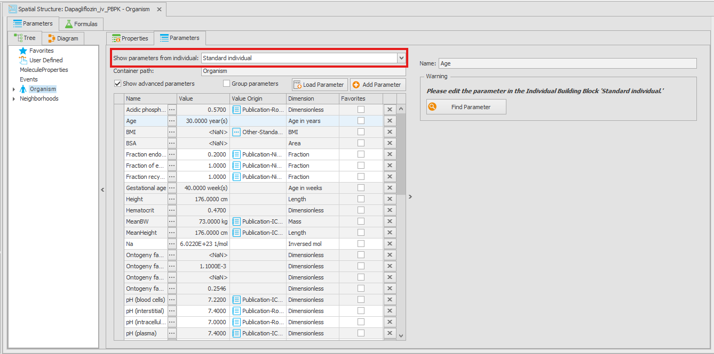

# Modularization Concept in MoBi

Starting with version 12, the OSP Suite introduces a new modularization concept for building models in MoBi. This new concept allows users to create, share, and re-use models more efficiently by breaking them down into smaller, manageable components called **modules**.

This section provides an overview of the modularization concept, and is especially suited for users familiar with previous versions of MoBi. It explains the advantages of using modules, how to create and manage them, and which rules the combination of modules follows. 

## MoBi project structure

The new concept introduces changes on how model structures are organized and combined into simulations. While OSPS \<V12 had two major layers of organization of a MoBi project – **Building Blocks** (BB) that are combined into **Simulations**, the new modularization concept extends the structure to **Modules**, **Building Blocks**, and **Simulations**.

A MoBi project contains a set of:

- PK-Sim modules
    - A module created from a PK-Sim PBPK model. As best practice, a PK-Sim module should not be modified. Instead, all changes/extensions to the model should be done in the so-called Extension modules (see below). A PK-Sim module is converted into an Extension module when edited by the user.
- Extension modules
    - Editable modules that contain any changes to the model structure made by the user.
- Individuals
- Expression Profiles
- Simulations, which are combinations of (0-n) PK-Sim modules, (0-n) Extension modules, (0-1) individual, and (0-n) expression profiles. At least one module (PK-Sim or Extension) must be selected to create a simulation.

Every module consists of [building blocks](building-block-concepts.md), with BB types Spatial Structures (SS) (0-1), Molecules (0-1), Reactions (0-1), Passive Transports (PT) (0-1), Observers (0-1), Events (0-1), Parameter Values (PV) (0-n), and Initial conditions (IC) (0-n). Every module includes no or exactly one BB of each type, except for PV and IC BBs, of which multiple can be present in one module.

### PK-Sim modules
A project in MoBi can be based on a PBPK model exported from PK-Sim. Such a model will be present as a **PK-Sim module** in MoBi containing *all of the BB types*. PK-Sim modules cannot be edited by default. If the user decides to edit a PK-Sim module, the PK-Sim module will be converted to an Extension module. A project can contain multiple or no PK-Sim modules.

Export of a PK-Sim model to MoBi creates one PK-Sim module, one individual, and (0-n) expression profile BBs.

### Extension modules
Each MoBi project may contain any number of **Extension modules**. An Extension module can add or modify any part of the default PK-Sim structure - spatial structures, molecules, reactions, etc.

When adding new compartments (e.g., adding a new organ) or molecules in an Extension module, it is important to keep in mind that molecules will only be created in compartments if entries for the molecule-container combination is present in *any* IC BB used in the simulation. Therefore, when adding a molecule or a container in an Extension module, the IC BB should be extended accordingly.

*Creation* of new modules can be performed from scratch ("Create new module" creates a module with empty BBs) or by cloning modules ("Clone module"). Modules can be saved as a `*.pkml` file, and BBs in a module can be loaded from `*.pkml` files.

## Location of (individual) parameters

Compared to the previous versions, v12 introduces some changes in how and where individual parameters are stored when a PBPK model is imported in MoBi. The Spatial Structure only contains parameters that are present in all species and have the same value or the same formula across all species **and** individuals. All the other parameters are defined in the **Individual** BB. Furthermore, the PV BB only holds values for parameters that are different from those stored in other BBs. In most cases, the PV BB will be empty when a PK-Sim model is imported into MoBi. An exception is when the user has modified parameter values in the PK-Sim simulation that are not part of any PK-Sim BB (e.g., intestinal permeability of Midazolam in the [Midazolam PBPK model](https://github.com/Open-Systems-Pharmacology/OSP-PBPK-Model-Library/tree/master/Midazolam).) These "Simulation parameters" are transfered in the PV BB.

- All parameters of the spatial structure that are **present in all species** and have the **same value or the same formula in all species and individuals** are stored directly in the spatial structures BB with the fixed value or an explicit formula. Example: `Organism|Thickness (endothelium)` (constant value) or `Organism|Weight of blood organs` (sum formula).

- Parameters that are present only for certain species (e.g., `Organism|Lumen|Duodenum|Thickness_p1` is only present in the human species, but not in rat, `Organism|Lumen|Duodenum|Default thickness of gut wall` is present in the rat but not in human), **or** have different species-specific values (`Organism|Acidic phospholipids (blood cells) [mg/g] - RR`) **or** vary within a population (e.g., `Orgnanism|Fat|Volume`) are **not** located in the spatial structures BB, but only in the individual. Such parameters are added to the simulation structure during the simulation creation step.

For convenience, parameters that are defined in the individuals can be shown in the spatial structure editor by selecting an individual in the "Show parameters from individual" box.

The parameters that are defined in the individual are shown with grey background and cannot be edited in the spatial structure editor. You will notice that some parameters have a  `NaN` value. These parameters are defined by an equation that cannot be evaluated at this time, e.g., because they depend on other parameters that are also defined in the individual. The values of these parameters will be calculated after the simulation creation.

## Creating simulations from modules and combination rules

Multiple modules can be combined to create a simulation. For simplicity, a specific combination of modules is called **model configuration**. When creating a simulation from modules, the Extension modules will *extend* or *overwrite* the previous modules. The user can select multiple PK-Sim modules, or PK-Sim modules in combination with Extension modules, or only the Extension module(s). The selection of the modules results in a *hierarchy* of the modules, where the order of module selection determines the order of overwrite/extend actions. I.e., multiple PK-Sim modules are always extended to a common PK-Sim module, the selected Extension module 1 extends/overwrites the common PK-Sim module, the selected Extension module 2 overwrites/extends the combination of the common PK-Sim module and the Extension module 1, and so on.

If a model configuration contains a PK-Sim module, the user must select an **Individual** and might include **Expression Profiles**. For each module that contains at least one IC or PV BB, the user can select one (or none) IC and/or PV BB.

During simulation creation, the modules are combined to a common model structure. Entities are combined (extended or overwritten) by their absoulte path (for containers in the spatial structure, parameters, and molecule values) or by their names (for neighborhoods, passive transports, molecules, etc). The result is a simulation which represents the combination of the selected modules.

There are two types of combination behavior that can be defined for a module - **overwrite** or **extend**. The following sections describe how different building blocks are merged and what are the differences between the **overwrite** and the  **extend** modes, if any.

### Spatial structure

#### Merge behavior "Overwrite"
When combining modules `A` and `B` (with the hierarchy `A <- B`), all containers from module `B` will overwrite the containers with the same path in module `A`. When overwriting, all descendants of a container are removed if not present in the module that overwrites (i.e., replacement of the whole tree structure). I.e., if module `A` has a container `Organism|Container 1` with two sub-containers `Container 2` and `Container 3` (absolute paths: `Organism|Container 1|Container 2` and `Organism|Container 1|Container 2`), and module `B` has a container `Organism|Container 1` without any sub-containers, the final model will contain `Organism|Container 1` without the sub-containers `Container 2` and `Container 3`. `Organism|Container 1` will only have parameters that are defined in module `B`, but not in module `A`.

- **Parameters** will be overwritten by their absolute path. If both modules have a parameter `Organism|Container 1|Param`, the parameter from module `B` will be used.
- **Container types** (physical or logical) will be overwritten.
- Container (including neighborhoods) **Tags** will be overwritten. If `Organism|Container 1` has a tag "Tag A" in module `A` and a tag "Tag B" in module `B`, in the final model, `Organism|Container 1` will only have tag "Tag B".
- **Formulas** are never overwritten (also not in the "overwrite" mode). Meaning, if module `B` defines a formula with the same name as a formula in module `A`, the updated formula will only be used for the parameters defined in module `B`, but not for other parameters that use this formula.
- **Neighborhoods** will be overwritten by their names. Their parameters, tags, and neighbors will be overwritten.

#### Merge behavior "Extend"
When combining modules `A` and `B` (with the hierarchy `A <- B`), all containers and parameters from module `B` will be added to module `A`. I.e., if module `A` has a container `Organism|Container 1` with two sub-containers `Container 2` and `Container 3` (absolute paths: `Organism|Container 1|Container 2` and `Organism|Container 1|Container 3`), and module `B` has a container `Organism|Container 1` without any sub-containers, the final model will contain `Organism|Container 1` with parameters defined in both modules, and with the sub-containers `Organism|Container 1|Container 2` and `Organism|Container 1|Container 3`.

- **Parameters** are always overwritten. If both modules have a parameter `Organism|Container 1|Param`, the parameter from module `B` will be used. This applies to all properties of the parameter (value, formula, unit, tags etc).
- **Container types** will be overwritten. If "Organism|Container 1" is "physical" in module "A" and "logical" in module "B", the container will be "logical" in the final model.
- **Tags** will be extended. If "Organism|Container 1" has a tag "Tag A" in module "A" and a tag "Tag B" in module "B", in the final model, "Organism|Container 1" will have tags "Tag A" and "Tag B".
- **Neighborhoods** are extended (e.g., addition of new parameters, tags).

### Molecules

Molecules are always overwritten by name. Therefore, if a molecule is defined in an Extension module, it must contain all required parameters. It is not possible to only add some parameters (in merge behavior "Extend"), while retaining parameters from the module that is higher in the hierarchy.

### Reactions

Reactions are always overwritten by name. Therefore, if a reaction is defined in an Extension module, it must contain all required parameters. It is not possible to only add some parameters (in merge behavior "Extend"), while retaining parameters from the module that is higher in the hierarchy.

### Passive transports

#### Merge behavior "Overwrite"

When combining passive transports, their "Kinetic" and "Parameters" properties are always overwritten. 

- The **Operator** (and/or) for the "Source" and "Target" lists are overwritten.

- **Source** and **Target** lists are overwritten (i.e., it is possible to remove source/target condition).

- **Include/Exclude** molecule lists for molecules are always extended. However, behavior of the **All checkbox** is overwritten.

The current behavior of combining the passive transports might appear inconsistent and somewhat confusing. The discussion on this topic is still ongoing and can be followed [on GitHub](https://github.com/Open-Systems-Pharmacology/MoBi/issues/2053).

### Observers

Observers are always overwritten by name. The "In container with" and "Include/Exclude molecules" lists are always combined.

### Events

Events are always overwritten by name. 2DO https://github.com/Open-Systems-Pharmacology/OSMOSES/issues/62

Will be changed https://github.com/Open-Systems-Pharmacology/OSPSuite.Core/issues/2328

### Parameter values

The final values of the parameters are determined in the following order:

1. **Values defined in the Building block.**  First, the value that is defined in the BB where the parameter is defined. E.g., `CYP3A4|Reference concentration` is set to 1 µmol/l in the Molecules BB. If a simulation is created only with the module with this Molecules BB without selection of an Expression Profile or a PV BB, the value will be 1 µmol/l.
2. **Values defined in the Individual**. If an individual is selected, the values from the Individual are applied. When applying an Individual to a PK-Sim module only, the parameters defined in the individual are not present in the Spatial Structure of the PK-Sim module (see #pk-sim-modules). These parameters are added to the structure upon simulation creation.
A special case is when an extension module explicitly defines a parameter in the spatial structure that is also present in the Individual. In this case, the value from the Individual will override the value (or formula) defined in the extension module. To overwrite the parameters that are defined in the Individual (e.g., defining the `Volume` of an organ as an age-dependent table instead of a constant value), define this parameter in the Parameter Values BB of an extension module.

3. **Values defined in an Expression Profile.** If an expression profile is selected, the values from the expression profile are applied. E.g., `CYP3A4|Reference concentration` is set to 4.32 µmol/l in the Molecules BB. If a simulation is created with the module with the Molecules BB and the Expression Profile, the value will be 4.32 µmol/l.
4. **Values defined in the PV BBs.** If a module is selected that contains a PV BB, the values from the PV BB are applied. If multiple modules have PV BBs with entries for the same parameters, the value from the latest module is selected. E.g., if the Extension module has an entry for `CYP3A4|Reference concentration` with the value of 2 µmol/l, and a simulation is created with the module with the Molecules BB where the value is 1 µmol/l, the Expression Profile where the value is 4.32 µmol/l, and the PV BB where the value is 2 µmol/l, the value in the simulation will be 2 µmol/l.

### Initial conditions

The final start values for molecules are determined in the following order:

1. **Values defined in the Molecules BB**. Start values as defined in the Molecules BB.
2. **Values defined in the Expression Profiles.** For proteins, values (including the formulas for start values) that are defined in the Expression Profile of the protein.
3. **Values defined in the IC BBvs.** If multiple modules have IC BBs with entries for the same molecules, the value from the latest module is selected. If an IC BB have entries for the same molecule/container combination as an Expression Profile, the values from the IC BB will be applied.

-------------

## Commit/update changes

The workflow of commiting changes from a simulation to a building block and updating a simulation with changes from a building block has been changed.

### Updating a simulation with changes from a building block

If a building block used in a simulation is changed after the creation of the simulation, the simulation will automatically be marked as "outdated". To update the simulation with the changes from the building block, simply right-click on the simulation and select "Update from Building Blocks". This will invoke re-creating the simulation from the building blocks, applying any changes made to **all** building blocks since the simulation was created. Any changes to parameter or start values made in the simulation will be lost!

It is no longer possible to update only selected building blocks.

### Committing changes from a simulation to a building block

Changes to parameter or start values made in a simulation can be committed to the building block (BB) the parameter/start value belongs to. To do so, right-click on the simulation and select "Commit to building blocks".

Changes to parameters values are committed to the selected Parameter Values (PV) building block of the last module in the simulation configuration. If the last module does not contain a PV BB, or no PV BB has been selected for this module, new PV BB will be created.


When committing changes made to a simulation created from PK-Sim module(s) only, the last PK-Sim module will be converted to an extension module. To avoide this, create a new extension module that should contain the changes. Then create the simulation with the extension module.


Changes to initial conditions (IC) of molecules are handled similarly. They are committed to the selected IC BB of the last module in the simulation configuration. If the last module does not contain an IC BB, or no IC BB has been selected for this module, a new IC BB will be created.

Structural changes made to building blocks (e.g., adding/removing reactions, molecules, compartments, etc.) cannot be reverted by committing an "outdated" version of the building blocks from a simulation. Only changes to parameter values and initial conditions can be committed.

## Best practices

The OSP software is best suited for the development of complex quantitative systems pharmacology/toxicology (QSP/T) models based on the physiologically-based kinetics (PBK) modeling framework. With the introduction of the modularization concept, development of such models is even more efficient, transparent, and sustainable. To get the most out of the new concept, the following best practices should be considered.

- If possible, each compound should be represented as a separate PK-Sim module.
- PK-Sim modules should never be modified. Any modification and/or extensions should be implemented as separate modules.
- An extension module should be defined as generic as possible. I.e., it should be compatible with any PK-Sim module with minimal adjustments, if possible.
- Avoid duplication of information across modules - only implement the differences to other modules!
- It is possible to combine PBPK models with different model structures (i.e., combine a model for small molecules with a model for large molecules). In this case, it is important that the models for small molecules are selected before the models for large molecules. Otherwise, simulation creation will fail due to missing parameters.

## Project conversion

To get the full advantage of the new modularization concept with the support of individuals and expression profiles in MoBi, you will require a PBPK model created with PK-Sim V12. For PK-Sim project created with previous version, the project must be re-created from a snapshot. Open your project in PK-Sim V12, export it to snapshot, and then re-load from snapshot (see documentation). After this, all simulations in the project will have the new structure and sending them to MoBi will properly transfer the individuals and expression profiles.

- When loading a simulation from a `*.pkml` file, one module will be created containing the entire model.
- When opening a MoBi project created with previous versions:
    - If the projects contains exactly one building block (BB) of each type (i.e., spatial structure BB, one reactions BB, on molecules BB, etc.), a single module will be created containing all the building blocks.
    - If the project contains multiple building blocks of the same type, a module will be created for each building block.

Due to the new structure of simulation configuration, changes in parameter values or initial conditions made in the simulations created with previous versions of MoBi cannot be committed to building blocks. When opening a project created with previous versions of MoBi, the simulations will be marked as "outdated", and a warning will be shown.