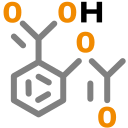
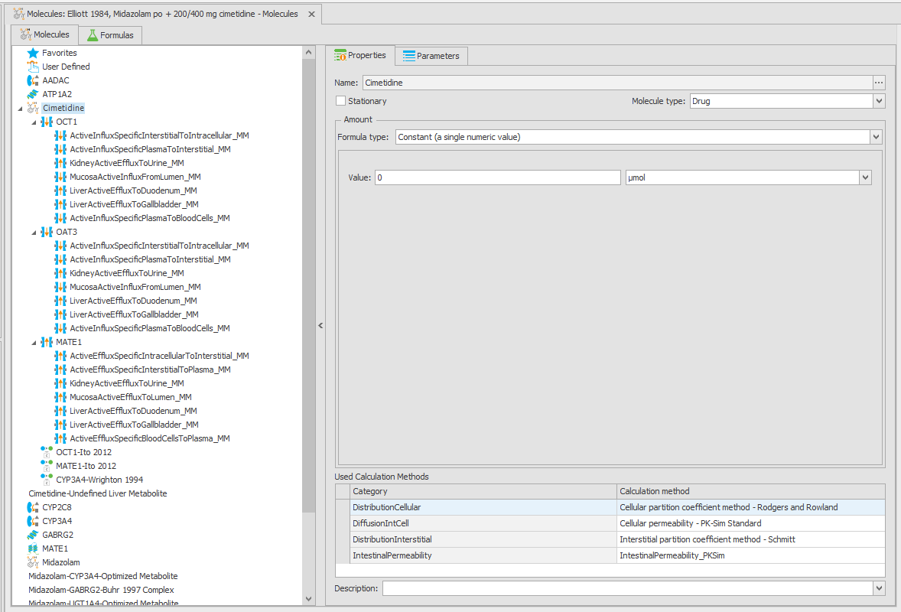
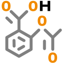
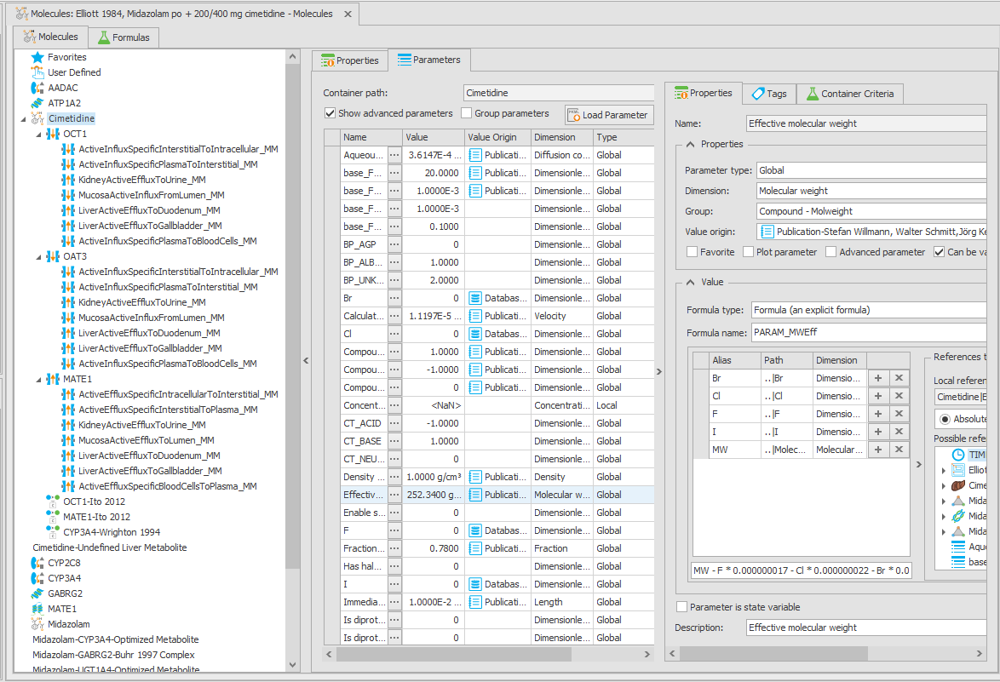
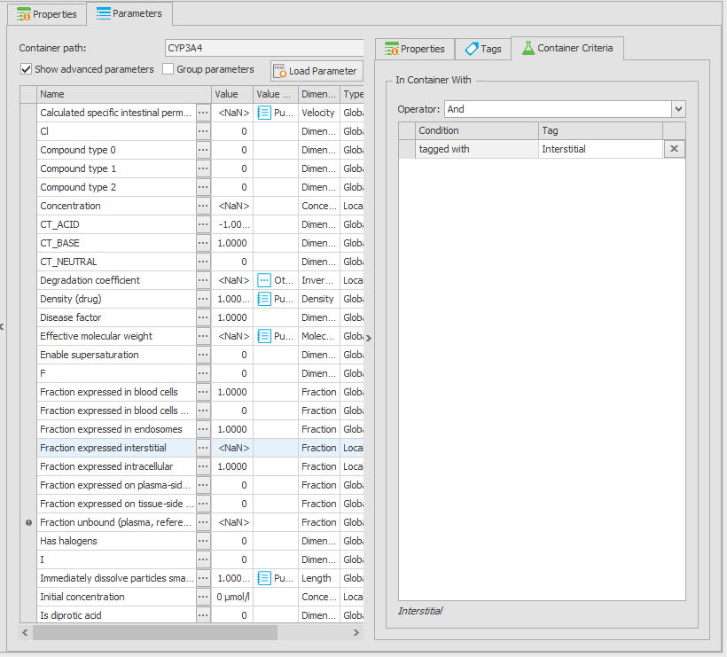
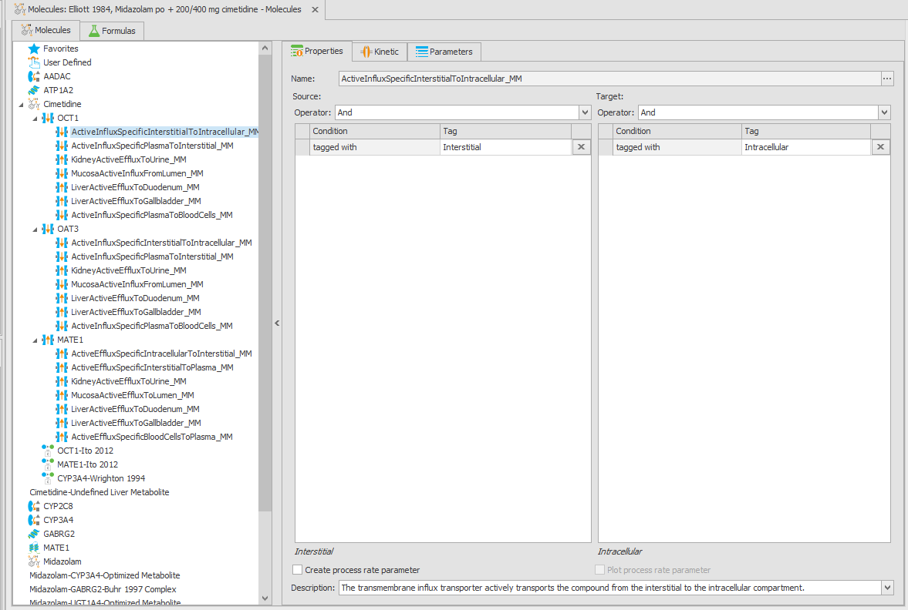
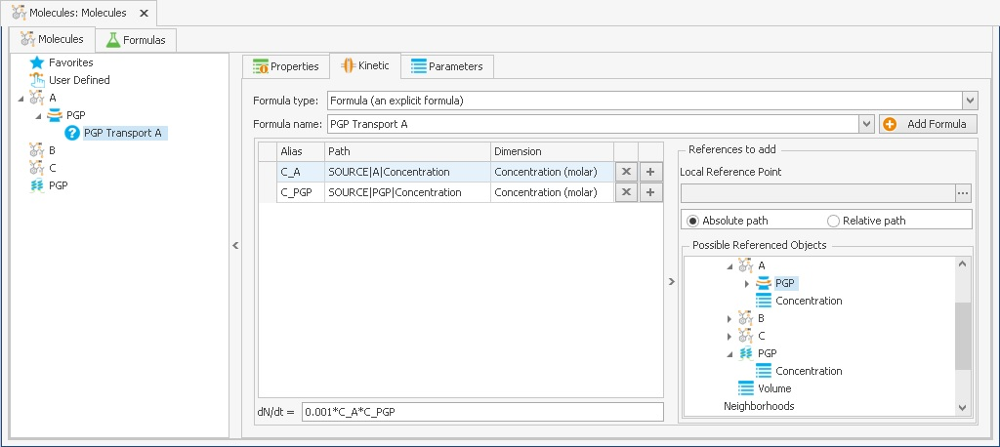

# Molecules

The **Molecules** building block contains all molecules with their default start values, molecule-specific parameters and properties. A molecule has a name, typically the name of the compound. Parameters and properties can be defined by you to describe the physico-chemistry, like solubility or lipophilicity. These parameters may later be used in reactions, passive and active transport processes, or may influence events. Also, active transporter molecules and active transport processes are defined for each molecule, if relevant for the model.

The following section describes the functionalities of the Molecules building block based on a PBPK model exported from PK-Sim. Later on, a simple [example](molecules-bb.md#example---creating-new-molecules) is given to create a molecule from scratch.

## Molecules - Functionality Overview

After loading a PBPK model from PK-Sim®, the molecules building block is located in the imported PK-Sim® module. Double-clicking on the Molecules () or using the **Edit** command of the context menu that appears after right-clicking on it opens an edit window.

In the left part of the window, a tree view lists all molecules that are currently defined in the project. Clicking on a molecule name will highlight it and show its properties in the right part of the window.

### Molecule Properties

The following molecule **properties** can be defined:

* **Stationary**: If checked, the molecule will not be transported by passive transport processes. Typical molecules that are stationary are proteins (e.g., "CYP3A4", "GABRG2"), protein-drug complexes (e.g., "Midazolam-GABRG2-Buhr 1997 Complex"), or drug metabolites that are defined as _sink_ (see [Definition of a metabolite in an enzymatic process](../part-3/pk-sim-compounds-definition-and-work-flow.md#definition-of-a-metabolite-in-an-enzymatic-process)) (e.g., "Midazolam-CYP3A4-Optimized Metabolite").
* **Molecule Type**: This has only influence on the icon depicted in front of the molecules in the molecules tree view to the right. Selectable options are  Drug,  Enzyme,  Transporter,  Complex, Metabolite , Protein, and Other Protein.
*   **Used calculation methods**: If the molecule is _not stationary_, it will be transported into the tissues by the _passive transports_ which require some parameters that are calculated by different calculation methods. The calculation methods (e.g., for tissue partitioning) can be changed in the Molecules BB and will be applied upon simulation creation.

    The calculation method defines which method is used to calculate parameter values of parameters located in the **Spatial Structure** (**MoleculeProperties** node) which have the **Formula Type: Calculation Method**. These selections are only needed if you want to use distribution methods from PK-Sim®. Otherwise, leave them on "No Calculation Method". For further information on this subject, please refer to the discussion of the different distribution models in the PK-Sim® manual ([Simulations](../part-3/pk-sim-simulations.md)). If you select a certain "Calculation Method" you can get tool tip information on the equations and specific parameters used in the "Calculation Method" by hovering with the mouse over the "Category" entry.
* The **Amount** field shows the default start amount of the molecule and can be defined either as a constant value (for drugs administered exogenously usually zero) or as a formula (e.g., for proteins, or endogenous compounds). To define different start amounts in different containers, use the **Initial Conditions** building block (see [Initial Conditions](initial-conditions-bb.md)).

### Molecule Parameters

The **Parameters** tab shows a list of all parameters defined for the currently selected molecule.

Each parameter has:

* a **Name**,
* a **Value**, defined by a constant or a different types of formulas (compare [Working with Formulas](parameters-formulas-tags.md#formulas)),
* a **Dimension** (compare [Parameters](parameters-formulas-tags.md#parameters)),
* a **Type** (**Local** or **Global**)
  * **Global** parameters are considered a property of a molecule that does not depend on the location of the molecule (e.g., "Molecular Weight", "LogP", "pKa"). These parameters are listed under the molecule node in the root of the simulation tree, and are accessed by the path `<MOLECULE>|<parameter name>`, e.g., `Cimetidine|Molecular weight`.
  * **Local** parameters are parameters whose values depend on the location of the molecule, e.g., "Concentration". These parameters are listed under the molecule node in each container of the simulation tree, and are accessed by the path `<ContainerPath>|<MOLECULE>|<parameter name>`, e.g., `Organism|VenousBlood|Plasma|Cimetidine|Concentration`.


The goal of defining a parameter as local is to have its value differ in different containers. Therefore, the parameter should either be defined by a formula that depends on the container (e.g., "Concentration" defined as `Amount/Volume`), or be set to different values in different containers by defining molecule start values (see [Initial Conditions](initial-conditions-bb.md))).



More examples for molecule parameters can be found by looking at a molecule in a simulation imported from PK-Sim®. Refer to the [general section](parameters-formulas-tags.md) for more information about the different formula types used for parameters.


* **Container Criteria**: Container criteria can be defined for local parameters to restrict the containers in which the parameter will be created. This is done by defining tag conditions (compare [How Tags are used](parameters-formulas-tags.md#how-tags-are-used---container-criteria-for-formulas-observers-transports-and-events)). If no criteria are defined, the parameter will be created in all containers where the molecule is present. An example of such parameter is `Fraction expressed interstitial` of a protein molecule, which is only relevant in interstitial spaces of organs.

### Active transports

Active transport processes of a molecule are listed as sub-nodes of the transported molecule. An active transport process requires a transporter protein. As with passive transports, active transports only affect non-stationary molecules and can only act between containers that are connected by a neighborhood.

Each transporter molecule can have multiple active transport processes defined for it. Clicking on an active transport process will show its properties in the right part of the window.

### Protein interactions

Protein interactions of a molecule are listed as sub-nodes of the interacted molecule. Protein interactions can be induction or inhibition processes of proteins, and their set up is described in [Defining Inhibition/Induction Processes](../part-3/pk-sim-compounds-defining-inhibition-induction-processes.md).

Note that in the Molecules BB, only the parameters of the interaction are defined. The interaction itself is modeled in the **Reactions** building block or taken into account in the equations of the active transport processes.

## Example - Creating New Molecules

### Creating a new molecule

1. Click on the **New** button  in the **Add** group of the **Edit Molecule** tab, or right-click in the empty space of the Molecules tree view and select **Create Molecule...**. A new window titled "New Molecule" will open.
2. Enter a molecule name into the "Name" input box.
3. Alternatively, a molecule can be created based on a PK-Sim® template. This can be achieved by using the button **PK-Sim Molecule** in the **Add** ribbon or **Add PK-Sim Molecule** from the context menu in the diagram area.
4. Enter a name for the PK-Sim molecule and the four physicochemical properties as listed.

At this point, you may already input a value for the "Default Start Amount" which is set to zero by default. Also, you may define molecule parameters after clicking on the "Parameters" tab of the "New Molecule" window (see below). Both operations, however, can also be done after the molecule is created.

### Adding molecule parameters

As an example, create the parameter "Molecular weight" for the molecule created above.

1. Click  **Add Parameter**, and a "New Parameter" window will open.
2. Enter "Molecular weight" as parameter name.
3. Select the **Parameter Type** - **Global** from the combobox.
4. Select `MolecularWeight` in the Dimension combobox - you can narrow down your search by entering the first few characters after clicking this combobox field.
5. Leave "Formula Type" on Constant and enter the molecule's molecular weight in g/mol into the "Value" input box.
6. Finally, press the **Enter** key or click **OK**. The screen should look like in the screen shot below.

As a second example, load the parameter "Concentration" from a PK-Sim® simulation export (see [Export to \*.pkml file for MoBi®](../part-3/importing-exporting-project-data-models.md#export-to-pkml-file-for-mobi) for how to create such a file).

1. Click the **Load Parameter** button or select it from the context menu.
2. Select a pkml file that you previously generated in PK-Sim® and select Concentration from the list. This local parameter is defined by a formula, and it is useful to have it in every molecule which is later used in a reaction kinetic equation.


For a detailed description of the creation and use of formulas see below, [Formulas description](parameters-formulas-tags.md#formulas).



For **continuing our test project**, enter three molecules and name them "A", "B", and "C". Uncheck the checkbox  **Stationary** for each molecule to allow transport processes. Set the **Default Start Amount** for molecule "A" to 50 µmol and leave "B" and "C" at the default, 0 µmol. It will be needed to practice in the next sections.


### Adding Active Transports

An active transport process, as opposed to a passive transport, requires a transporter molecule (like a protein channel). Unlike a chemical reaction, however, this process does not change a molecule but transfers it between containers, for example, from the intercellular space into a cell.

First, an active transporter molecule needs to be defined:

1. In the molecules building block and in the molecules tree, right-click on the molecule that you want to be transported.
2. Select **Create Transporter Molecule** from the context menu.
3. You are asked for a transporter name. Either enter a new name (e.g., **PGP**), or the name of an already existing transporter molecule if the very same transporter is active for several molecules in your list and has been previously defined.
4. Press **Enter** or click **OK**. In the molecules tree, a transporter molecule is displayed, and a transporter entry is added to the molecule selected in step 1.
5. In the transporter entry below the selected molecule, you may enter a description and parameters, as for any molecule.
6. Click on the transporter molecule at the top level of the molecules tree to modify this molecule's parameters. This may be the initial amount of transporter or a concentration parameter.
7. Right-click on the transporter attached to the molecule to be transported, and select **Create Transport** from the context menu. A window named "New Transport" opens.
8. Enter a name into the Name input box, like "PGP Transport". Select the **source** and the **target** container criteria (see [How Tags are used](parameters-formulas-tags.md#how-tags-are-used---container-criteria-for-formulas-observers-transports-and-events)), define a transport rate parameter, and enter a transport kinetics formula. Also ses [Creating a Passive Transport](passive-transports-bb.md#example---creating-a-passive-transport) as an example on how to define a transport process.
9. The kinetics formula of an active transport process is entered into the formula input box within the Tab **Kinetic** so that the red error symbol  will disappear. A typical active transport formula will be dependent on the transporter concentration, substrate concentration in source and target container, and on molecule specific parameters, like a $$K_M$$ value for substrate and transporter. You will need to add all the required concentrations and parameters as references, or you may enter them in numeric form into the equation.

Continuing with our **example project**, let us enter a transport called "PGP" for molecule "A" and a transport process called "PGP Transport A" which transports the molecule from "Vial2" as source to "Vial1" as target. As references for the transport equation, you need the concentration parameters of "PGP" and of "A" from the references tree. The alias of the PGP concentration is renamed to `C_PGP`, and that of molecule `A` to `C_A` by overriding the default names. The equation to be entered is `0.001 * C_PGP * C_A`. The figure below shows what the screen should look like after everything is properly set up.


If more than one molecule is transported by the very same transporter, you must assign the same transporter molecule twice, i.e., with the same name under the second molecule. This will only create a new active transport, but no duplicate transporter molecule. You can then proceed like for the first molecule and create a transport process.



If two molecules compete for the same transporter, you can add inhibition terms to the transport equations that use all molecules, either as transporter substrate or as transporter inhibitor.


## Loading, Editing, and Saving Molecules

Alternatively to newly creating a molecule as described in the \[Example - Creating New Molecules], **molecules can be loaded from a pkml file**. This file can be

* a PK-Sim® export containing molecules (see [Export to \*.pkml file for MoBi®](../part-3/importing-exporting-project-data-models.md#export-to-pkml-file-for-mobi) for how to create such a file),
* an entire previously saved MoBi® simulation,
* a saved Molecules building block from a previous project,
* or a previously saved molecule file.


A collection of template files with predefined building blocks is automatically installed together with MoBi® in the default program data directory. The entry "Templates" in the program start menu in the MoBi program group will lead you to the proper path.


Use one of such files and proceed in the following way:

1. Click the  **Load From Template** button, or right-click into the empty space below the tab "Molecules" and choose **Load Molecule** from the context menu that appears.
2. Select a folder and then a pkml file from the file browser window that will open.
3. If the pkml file contains more than one molecule, select one or more from the list that is displayed. If one or more molecule names are already in use in the current project, you will be asked for alternative names.

To **save a molecule** as pkml file:

1. Right-click on its name in the molecules tree, and select **Save As** from the context menu.
2. Select a location where it is saved in the file browser window that will open and select a name to save it.


If you are frequently building models in MoBi® where new molecules have to be defined, it is a good idea to configure your typical **default molecule** once and save it in your working directory. You can then populate your molecules building blocks by repeatedly loading your default molecule and each time changing the name to your desired molecule names.

