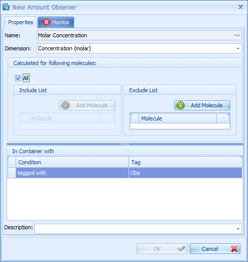
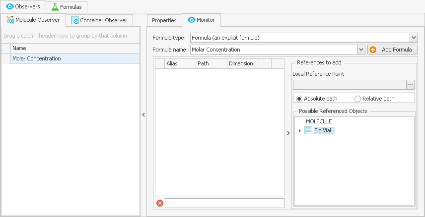
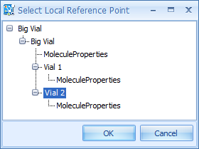
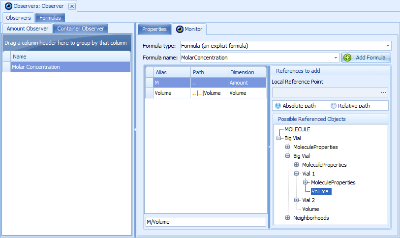
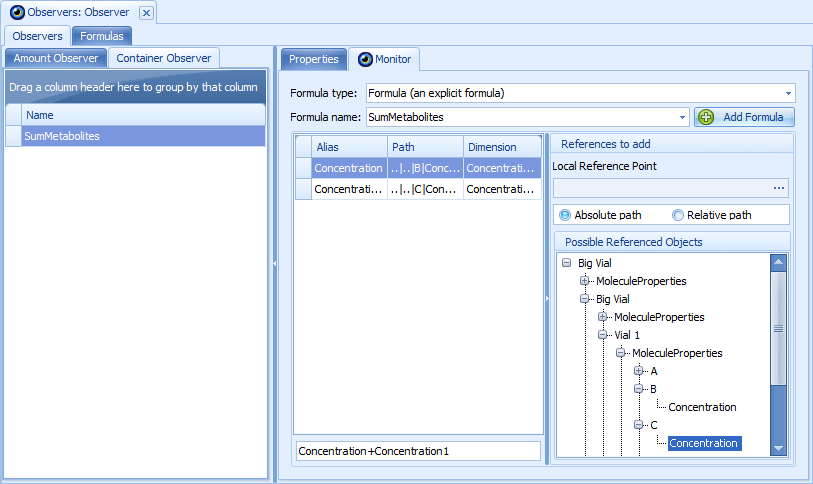

# Observers‌ Building Block‌

An **observer** which can be displayed in a chart (see [Simulation Results](simulation-results.md)) is an output derived from one or several molecules or parameters by a defined formula. There are two classes of observers: **molecule observers** and **container observers**; creating and editing of both classes will be explained in this section. The main difference between those two classes is:

- **Molecule observers** are calculated for instances of molecules in *physical containers* where these molecules are present.

- **Container observers** can be calculated for *any container* (physical and logical) in the spatial structure, independent of whether a certain molecule is present in this container or not. However, even a container observer must be defined for at least one molecule, as it will be created as the property of this molecule.

The following section describes the functionalities of the **Observers** building block (BB) based on a PBPK model exporter from PK-Sim. Later on, a simple [example](#example---creating-observers) is given to create observers from scratch.

After loading a simulation that was generated in PK-Sim® (see [Load a Simulation](setting-up-simulation.md#load-a-simulation)), the PK-Sim module contains the Observers building block with the standard observers for the PBPK models.

## Observers - Functionality Overview

Each observer has **container conditions** that define in which containers the observer will be created and a **list of molecules** that defines for which molecules it will be created. Container conditions explained in [How Tags are used](model-building-components.md) in detail. The list of molecules can either include all molecules or it can be restricted to a list of included or excluded molecules.

If an observer cannot be created because the conditions do not match any container or molecule, a warning will be issued when creating a simulation (see [Create a Simulation](setting-up-simulation.md#create-a-simulation)).

## Example - Creating Observers‌

In our **example project**, open the created **Observers** building block for editing by double-clicking it. If the observers BB was not created in the module, right click on the module and select **Add Building Blocks** and then select "Observers" from the list.

For **creating a new observer** or loading one from a previously saved file, select the corresponding button  **New** or  **Load** from the context-dependent ribbon and there select the proper observer type. Alternatively, you may right-click into the empty white space of the edit window and select **Create Molecule (resp. Container) Observer** or **Load Molecule (resp. Container) Observer** from the context menu. If you choose **New** or **Create**, a window named **New Molecule (resp. Container) Observer** opens.

### Molecule Observers‌

To work with molecule observers, make sure the tab "Molecule Observer" in the edit window is selected. To create a new molecule observer, use **Create Molecule Observer** as described above, upon which the "New Molecule Observer" window opens (see image below). For our test project, we want to create an observer that calculates the molar concentration from the amount of molecules, doing so for each molecule and each compartment except for "BigVial".

1. Enter the name "MolarConcentration" in the Name input box, and select **Concentration (molar)** as Dimension below.
2. Check the box **All** in the section "Calculated for following molecules". If this checkbox is selected, the observer is defined for all existing molecules. Exceptions can be defined in the **Exclude List**. In order to add a molecule to the Exclude List, click the  **Add Molecule** button within the section Exclude List. The observer is not defined for molecules listed in the Exclude List. If the checkbox **All** is un-checked, you can add molecules to the Include List. Then, the observer is defined only for molecules listed in the Include List.
3. Then right-click into the white space below "In Container with", and select **New match tag** condition from the context menu.
4.  You are asked for a tag name. Select "Obs" from the combobox or enter it manually. The "New Molecule Observer" window should now look like:

    
5. The next step is to create the **Monitor** formula which defines how the value of the observer is calculated. At this point, at least a formula **name** is required for the observer creation; all other data like the observer formula can be defined at a later point, if needed. Click on the "Monitor" tab in the "New Molecule Observer" window.
6. Click the  **Add Formula** button. You will be asked for a reaction formula name; enter the name "MolarConcentration"; if this formula name is already existing, you may select it in the combobox instead of adding a new formula. In any case, the error symbol  will disappear from the "Formula Name" line as well as from the "Monitor" tab, and the **OK** button becomes active.
7.  You can now continue to create the formula in the "New Molecule Observer" window.

    
    Alternatively, you can click **OK** or press **Enter** and return to the edit window, where you need to click the "Monitor" tab again. 
    
8.  On the right hand side of the Monitor window, you will see the "References" column. The screen now looks like in the screen shot below:

    

9. The formula for molecular concentration you will need to enter is the ratio of molecule amount and container volume. For both, you need the references, similar to all previously described formulas. For the amount of molecules, this is straightforward: just drag and drop the word `MOLECULE` from the "Possible Referenced Objects" tree on the right to the white space below "Alias/Path/Dimension" on the left. The alias `M`, the path `..`, and the dimension `Amount` will appear. This alias `M` stands for the corresponding amount for each molecule the observer is calculated for, according to the conditions defined previously, visible under the "Properties" tab.
10. Since our concentration observer should be computed for containers of different hierarchical levels (in case the spatial structure will be extended in the future), you need to select "Relative Path" by clicking the corresponding radio button on the right. The first time you do that in this window, you will be asked for entering a path by the window shown below. To completely visualize the path, press the **\*** key or click on all + symbols to the left of the names. You may select any of the containers here and then use its corresponding Volume parameter; however, do not use any of the "MoleculeProperties" branches, as that would invalidate the path. To complete our example observer, click on `Vial1` and then on the OK button; see the following image.

1. In the "Possible Referenced Objects" tree, navigate to `BigVial|Vial1` and expand it. You will see the parameter `Volume` below it.


The **Local Reference Point** can be changed any time by clicking on the **...** symbol to the right of the path.


2. Drag and drop the `Volume` to the left, below the `M`. The alias `Volume`, the path `..|..|Volume`, and the dimension `Volume` should appear. Compare the screenshot below with your monitor window.
3. Finally, enter the equation `M / Volume` into the input box below the references (showing a red symbol  next to it before the formula is entered), and all should look like in this image.

If you have already loaded or created a concentration parameter when building the molecules (see [Molecule Parameters](molecules-bb.md#molecule-parameters)), you may wonder why you cannot use this reaction parameter for the observer. This is indeed an alternative option. Instead of dragging and dropping `M` and `Volume`, you can use the `Concentration` parameter with the correct relative path, which can be found under `BigVial|Vial1|A|Concentration`.

Examples for many other molecule observers can be best studied when opening the observer building block in a simulation exported from PK-Sim®.

### Container Observers‌

To work with container observers, make sure the tab "Container Observer" in the edit window is selected. For our test project, we want to create an observer that calculates the sum of concentrations of the two metabolites **B** and **C**. This creation procedure is almost identical to molecule observers, but the paths you get are different, and you will use different properties and formulas.

1. To create a new container observer, use "Create Container Observer" as described above, upon which the "New Container Observer" window opens, similar to the molecule observer.
2. Enter "SumMetabolites" as Name, "Concentration (molar)" as "Dimension".
3. Then click the "Add Molecule" button within the section "Include List". You will be asked for a molecule name; select or enter "C" and click **OK**.
4. As container criteria, select `Match Tag: Obs`.
5. Click on the "Monitor" tab, then click the  **Add Formula** button. Enter "SumMetabolites" as Formula Name. Then click **OK** or press **Enter**. (As described above for the molecule observers, you may also continue the formula work in the "New Container Observer" window.)
6. Since the display returns to the properties tab, you need to click the "Monitor" tab again. Set the relative path as described for the Molecule Observer to `Vial1`.
7. In the "Possible Referenced Objects", open the `Vial1` paths all the way down until you see the "Concentration" parameters for molecules "B" and "C".
8. Drag and drop both of them successively to the reference list.
9. Enter `Concentration + Concentration1` into the formula input box left of the red symbol , which should disappear upon completion.

The screen should look like in the screen shot below:

