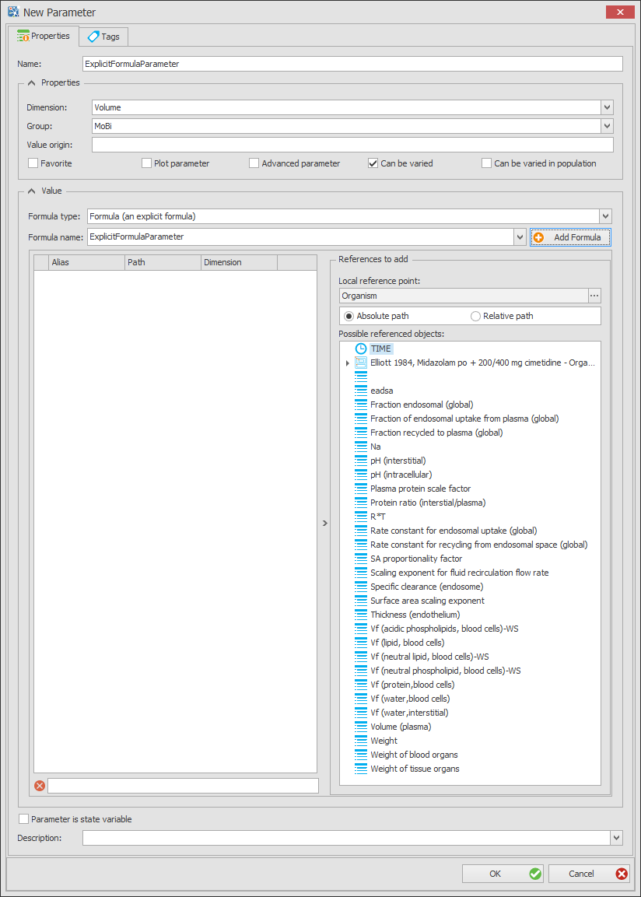
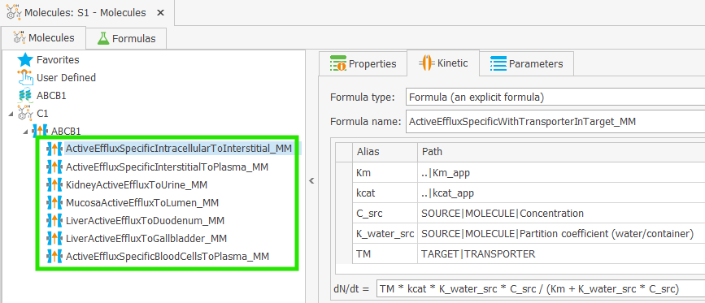

# Parameters, Formulas, Tags‌, and Keywords

This section describes in detail how to work with the important concepts of models building in MoBi.

First, different types of [parameters](#parameters) and their properties are explained.

Then, the use of the different types of [formulas](#formulas) is described. Formulas are used to define parameters, reaction kinetics, transport processes, observer equations, and molecule initial conditions.

Following is the explanation of the [tag concept](#how-tags-are-used---container-criteria-for-formulas-observers-transports-and-events). Tags are widely used to define conditions for localization of observers, transport processes, events, parameters, as well as for sum formulas.

Finally, the special [keywords](#keywords) that can be used in paths to define references in formulas are listed.

## Parameters

### Functionality Overview‌

In all building blocks, there may be a need to create and edit parameters. Parameters are typically listed in a separate tabbed view, named "Parameters". A parameter is used to describe physical or physiological properties of a molecule, a reaction or transport, a spatial structure, an event or an application.

For improved readability, two categories of parameters exist: "regular" and "advanced" parameters. In any parameter list, a checkbox exists above the list which is named  **Show Advanced Parameters**. If this box is unchecked, the parameters tagged as "advanced" are hidden. Any parameter can be tagged as being "advanced" by checking the box  **Advanced Parameter** when a parameter is created or edited.

Parameters can be created, copied, moved, edited, or loaded from a pkml file:

- A parameter is added by clicking on the  **Add Parameter** button that is present in a parameter tab view, or by right-clicking the building block item's name (molecule, reaction, etc.) in the tree, list, or diagram view and choosing **Create Parameter** from the context menu that appears.
- Instead of creating a parameter, you may also load it from a file. Use the **Load Parameter** button or context menu entry for this purpose and select a pkml file (e.g., a previously saved building block, module, or simulation) that already contains a suitable parameter.
* A third option is to **copy and paste parameters** between building block items by selecting a parameter and pressing **Ctrl+C** and **Ctrl+V** after moving to the target area and after clicking into the empty parameter space. Instead of **Ctrl+C** to copy a parameter, you can use **Ctrl+X** to cut a parameter from its current position.

Within the different building blocks, there are slight differences in the procedure and in the selectable options which will be explained in the corresponding sections in this chapter. In the Molecules and Reactions building blocks, parameters may be of the types **Local** and **Global**.

- **Global** parameters are considered a property of a molecule or a reaction that does not depend on the location of the molecule or reaction (e.g., "Molecular Weight" of a molecule, or a reaction rate constant). These parameters are listed under the molecule/reaction node in the root of the simulation tree, and are accessed by the path `<MOLECULE/REACTION>|<parameter name>`, e.g., `Cimetidine|Molecular weight`.

- **Local** parameters are parameters whose values depend on the location of the molecule or reaction, e.g., "Concentration" of a molecule, or the apparent $$K_{M,app}$$ that depends on the concentration of the inhibitor (see [PK-Sim - Defining Inhibition/Induction Processes](../part-3/pk-sim-compounds-defining-inhibition-induction-processes.md)). These parameters are listed under the molecule or reaction node in each container of the simulation tree, and are accessed by the path `<ContainerPath>|<MOLECULE/REACTION>|<parameter name>`, e.g., `Organism|VenousBlood|Plasma|Cimetidine|Concentration`, or `Organism|Liver|Periportal|Intracellular|Midazolam-CYP3A4-Metabolization|Km_app`.

Any parameter has a **Dimension**, and the value can be represented in different **Units**. The list of all supported dimensions can be found in [Appendix A.1](../appendix.md#a1-dimensions-and-base-units).


When using a parameter in a formula, the value is always internally converted to the base unit of the dimension. For example, if a parameter with the dimension "Concentration (molar)" is defined with the unit "nmol/l", its value will be converted to "µmol/l" when used in a formula.


A parameter can be assigned to a **Group** by selecting one of the pre-defined groups from a drop-down list. This information is used for display purposes only. By selecting the **Group parameters** box in a parameter tree view, parameters will be grouped by their assigned group name.


It is not possible to create new groups. The list of available groups is predefined and cannot be changed.


In the combobox of the field **Formula Type**, you can select if the parameter is defined as:

* a **constant**, consisting of a numeric value and a unit;
* a **table**, using individual data pairs from which a value is interpolated over the simulated time;
* a **formula**, having a formula name and a formula string (i.e., a mathematical expression) including references to the formula items;
* a **table with offset**, which is a table that is reused and shifted in time by a constant time value defined in another parameter;
* a **table formula with x-argument**, which is a table that is reused and evaluated at a value defined in another parameter;
* a **sum formula**, which calculates the sum of all values with a certain condition;
* a **calculation method** parameter, whose formula will be defined depending on the selected calculation method of each molecule in the model (only available for parameter of spatial structure container). The calculation methods cannot be edited within MoBi® and are imported from PK-Sim®.
* a value **distributed** around a constant value or between two limits (only available for parameters of spatial structure containers).

The different formula types are explained in the section [Formulas](#formulas).

In the bottom part of the **Create** or **Edit** window are several input options that have different effects on the parameter:

* Checking  **Parameter is state variable** will open additional input fields for the right hand side of a differential equation (explained in detail in [State Variable Parameters](#state-variable-parameters)).
* Checking  **Plot Parameter** will tag this parameter so that it can be visualized in a chart with the simulation results (see [Chart Component](../part-5/chart-component.md)).
* Checking  **Advanced Parameter** will hide this parameter from the lists if **Show Advanced Parameters** is  un-checked in the parameter list view.

* For all parameter types, **a description can be added** into the input box at the bottom, for example to quote a reference. Clicking into the text field will open an edit dialog into which you can enter or paste any text of your choice.

You may also **add tags to any parameter** in the **Tags** tab of the parameters editor. Tags are used to label parameters for selective evaluation in sum formulas (see [Sum Formulas](#sum-formulas)). The application of tags is explained in [How Tags are used](#how-tags-are-used---container-criteria-for-formulas-observers-transports-and-events).

* To add a tag, click the "Add Tag" button and enter the tag in the input box.
* To delete a tag, click the symbol that appears behind every tag in the list.

### Constant Parameters‌

A constant parameter is defined by a constant **Value**. You may use decimal points, exponential notation, and minus signs (e.g., 2.34; 1.2E-6; -150). Next to the value, its unit will be shown; the default unit is selected by your choice in the Dimension field, but it can be changed to other units listed in the combobox, e.g. from 1/min to 1/sec or 1/h.

Examples for constant parameters are "Molecular weight" of a molecule or the rate constant of a reaction.

### Distributed Parameters‌

**Distributed parameters** (only available for parameters of spatial structure containers) describe a variation around a constant value or between two numerical limits. Within a given MoBi® simulation, a distributed parameter has a fixed value (default defined by the value in the field **value**). A distributed parameter can be used only to calculate the percentile of the parameter value given a certain distribution. Distributed parameters are useful if population statistical data are to be defined within a model. To define such a parameter, use the **Create Distributed Parameter** command from the context menu of a spatial structure item, like for containers (e.g., organ sizes) or neighborhoods (e.g., blood flow rate). In addition to what is entered for constant parameters, the **Distribution Type** has to be selected. Available options are:

- **Discrete Distribution**, which is identical to a *constant parameter*. This feature is implemented for the purpose of simply disabling the distribution function without going through the parameter creation process again.
- **Uniform Distribution**, where a parameter will be uniformly distributed between a **Minimum** and a **Maximum**.
- **Normal Distribution**, where the values of the parameter are normally distributed (Gaussian distribution) with a **Mean** value and a **Standard Deviation**.
- **LogNormal Distribution**, where the values of a parameter follow a lognormal distribution with a **Mean** value and a **Geometric Standard Deviation**.

If you use one of the different distributions, a **percentile** will be automatically calculated for the parameter value define in field **value** given the defined distribution.

### State Variable Parameters‌

A parameter can also be defined as a *state variable* with a right-hand-side (RHS). This means, that the parameter value is defined by a differential equation. To do this, click the  checkbox **Parameter is state variable** when entering or editing a parameter.

The value of a parameter _p_, for example, is defined by a differential equation

$$\frac{dp}{dt} = RHS$$

where _RHS_ is the right-hand side of the differential equation defining the _change of parameter value per unit time step_.

For a *state variable parameter*, you can define the **initial value** of the parameter in the top half of the parameter edit view, as for any other parameter type. The initial value is the value of the parameter at simulation time = 0.

The **Right Hand Side** is defined in the bottom part of the editor. The value of the parameter is evaluated for each simulation step according to the differential equation.


Once the  **Parameter is state variable** checkbox is deactivated again, the input box for the RHS will disappear. The parameter is no longer a state variable, and the right hand side (RHS) formula reverts to RHS = 0. If you have accidentally deactivated the checkbox and then reactivate it, the formula you may have previously defined as RHS is not lost, since all created formulas are stored. To reinstate the formula you may have previously defined as the RHS, select the formula from the combobox after the formula type explicit formula is selected.



For state variable parameters, the values defined in a Parameter Values building block represent the initial values of the parameter at simulation time = 0.


## Formulas

### Functionality Overview‌

Formulas are widely used in OSP models to define parameters, reaction kinetics, transport processes, observer equations, and molecule initial conditions. This section describes how to work with formulas in MoBi®.

All formulas defined in a building block are listed in a separate tab named **Formulas**. Clicking on a formula in the list will show the references and the equation for the selected formula. Right-clicking on a formula in the list opens a context menu that allows you to **Rename**, **Clone**, and **Remove** formulas.

Formulas can be re-used, e.g., multiple parameters within a spatial structure can use the same formula.


If you modify a formula in the editor of a parameter or any other entity, this change will affect all other entities using this formula!


You can re-use formulas across different building blocks by copying and pasting them. To do so, select a formula in the formula list of a building block, press **Ctrl+C**, then move to the formula list of another building block and press **Ctrl+V**.

Upon creation of a formula, it gets the dimension of the parameter or entity where it is created. For parameters, the formula gets the dimension of the parameter. For molecule start values, the dimension is "Amount". For reaction and transport processes kinetics, the dimension is "Amount per time", and for formulas used in event conditions, the dimension is "Dimensionless". The only way to change the dimension of a formula is to change the dimension of the parameter or entity to which the formula is assigned. Furthermore, a formula can only be used in entities or parameters with the same dimension.


It is a good idea to use a name related to the object where the formula is used (e.g., parameter, reaction, observer) - you may even use identical names here.


To enter or edit a **formula string**, click into the unnamed input box above the **Description** field and then use your keyboard. This formula string will be evaluated by the solver once the simulation is run. It is written as a mathematical term that comprises numeric values, arithmetic operation signs, and names of parameters or their alias names. As long as the formula has errors or is incomplete, a red error sign  is displayed left of the empty input box. Hovering the mouse over this warning symbol will show you a tool tip on the validity of the equation (e.g., missing references or syntax errors).

### Supported Characters and Functions in a Formula‌

In a (explicit) formula, the following characters may be used:

* numbers can be entered as described for constants, e.g. `2.34`; `1.2E-6`; `-150` (**WARNING**: a comma `,` is interpreted as a decimal point!)
- `TIME` variable: The simulation time
* the arithmetic operation signs
    - Plus `+`, e.g., `3 + 5`
    - Minus `-`, e.g., `3 - 5` or `-5` (unary minus)
    - Multiplication `*`, e.g., `3 * 5`
    - Division `/`, e.g., `3 / 5`
    - Exponentiation `^`, e.g., `3^5` = 3 to the power of 5
* round brackets **(** **)**, e.g., `(3 + 5) * 2`
* the constants **pi** and **e**, representing the mathematical constants $$\pi$$ and $$e$$.
* the mathematical functions 
    - Arccosine (inverse cosine) **ACOS**, e.g., `ACOS(0.5)`,
    - Arcsine (inverse sine) **ASIN**, e.g., `ASIN(0.5)`,
    - Arctangent (inverse tangent) **ATAN**, e.g., `ATAN(1)`,
    - Cosine **COS**, e.g., `COS(pi/4)`,
    - Hyperbolic cosine **COSH**, e.g., `COSH(1)`,
    - Exponential function **EXP**, e.g., `EXP(1)` which corresponds to $$e^1$$,
    - Natural logarithm **LN** or **LOG**, e.g., `LN(e)` or `LOG(e)`,
    - Logarithm to base 10 **LOG10**, e.g., `LOG10(10)`,
    - Maximum of two values **MAX**, e.g., `MAX(3;5)` which evaluates to 5,
    - Minimum of two values **MIN**, e.g., `MIN(3;5)` which evaluates to 3,
    - Power function **POW**, e.g., `POW(3;5)` which corresponds to $$3^5$$,
    - Sine **SIN**, e.g., `SIN(pi/4)`,
    - Hyperbolic sine **SINH**, e.g., `SINH(1)`,
    - Square root **SQRT**, e.g., `SQRT(4)`,
    - Tangent **TAN**, e.g., `TAN(pi/4)`,
    - Hyperbolic tangent **TANH**, e.g., `TANH(1)`
* the random number generator functions **RND** and **SRND**, both to be used with the dummy argument **()**

    - **RND** will produce the same sequence of random numbers in the interval [0..1] every time you run your program because it starts from a default seed.
    - **SRND** will produce "real" random numbers. If you have a call to **SRND** in any model - all other calls to **RND** (both in this and all other models!) will produce "real" (non-reproducible) random numbers - until you restart MoBi or PK-Sim!


The above mathematical functions are defined as in the C programming language.


Furthermore, defined **aliases** can be used in a formula as formula constants.

### Formula aliases - using other parameters and molecule amounts in a formula‌

The following figure shows the formula editor window that opens when you create or edit a formula.‌



Below the formula name and above the formula string, there is a **Reference Table** showing a header line above the columns named **Alias**, **Path**, and **Dimension**. On the right hand side of the reference table, there is a second table titled **References to add**. From this right part, references are moved to the left **Reference Table** by drag & drop.

- The **Alias** is the name that will be used in the formula string to refer to the object.
- The **Path** is the path to the referenced object (parameter or molecule amount).

E.g., in a formula `3 * Conc + 5`, the alias is `Conc`, and the path could be `Organism|Liver|Plasma|Cimetidine|Concentration`.

When adding references to a formula via drag & drop, you can choose between an absolute or a relative path. If you select a relative path, you will be asked to select a **local reference point**. The local reference point is the location in the model structure from which the relative path is defined. You can think of it as a *working directory*, and the paths to the selected entities will be constructed *relative* to it. See the section [The Path concept](#the-path-concept) for more information on absolute and relative paths.

The selected local reference point will be displayed with its absolute path in the "References to add" window. In case you need to correct or alter the local reference point, click on the **...** icon right of the path. This will re-open the reference point selection window.

To add a reference after having selected the reference point:

1. Find the reference by name in the **Possible Referenced Objects** tree. Expand the tree nodes if necessary.
2. Click on the object's name, then drag it to the Reference Table area left to it; drop it there by releasing the mouse button. The object will be added to the list, usually with its name as the alias. If that name already exists in the list, the alias name is automatically renamed by adding a running index. The path and dimension of the object are also added.


Not all entries in the tree are allowed to be moved to the left, depending on the context of the formula.


3. If needed, you may edit the alias name of the object manually. Alias names need to be identical to the names that are used in the formula string. Simply click on the alias name and change or override (or copy/paste) the name. For example, if you added several "Concentration" parameters from different molecules to a reaction kinetics equation, it may be helpful to manually add the molecule name next to them.
4. In the same way as for aliases, it is also an option to manually edit the path. However, the standard procedure would be to remove the object and add it again, using a new local reference point.
5. Dimensions can be changed by clicking on the displayed dimension and selecting a different one from the combobox.

To **remove an object from the reference list**, right-click it and select **Remove**from the context menu.

### Conditions in a Formula‌

Logical conditions can be used in a formula to define different values depending on the fulfillment of a condition.

A condition is defined using the notation `<condition> ? <value1> : <value2>`, e.g., `TIME < 10 ? 5 : 10`, which means: "if time is less then 10, use value1, otherwise use value2". In the conditions, the following operators are supported:

- Less than `<` or `LT`, e.g., `TIME < 10` or `LT(TIME;10)`
- Greater than `>` or `GT`, e.g., `TIME > 10` or `GT(TIME;10)`
- Not equal `<>` or `!=` or `NEQ`, e.g., `TIME <> 10` or `TIME != 10` or `NEQ(TIME;10)`
- Greater than or equal `>=` or `GEQ`, e.g., `TIME >= 10` or `GEQ(TIME;10)`
- Less than or equal `<=` or `LEQ`, e.g., `TIME <= 10` or `LEQ(TIME;10)`
- Equal `=` or `EQ`, e.g., `TIME = 10` or `EQ(TIME;10)`.

Conditions can be combined by **AND** and **OR**, or inverted by **NOT** operands. An alternative symbol for **AND** is **&**; an alternative symbol for **OR** is **|**. Besides logical conditions, the numbers 0 and 1 can be used as arguments, where 0 means `false` and 1 means `true`.


It is recommended to use events rather than "if conditions" in a formula if the value of the entity defined by the formula is expected to change depending on the fulfillment of a condition.


### Sum Formulas

**Sum formulas** can be used to calculate sums of values of entities that comply with certain criteria. The criteria are defined by tags that are assigned to the entities. Tags can be assigned to containers, neighborhoods, parameters, and events (see [How Tags are used](#how-tags-are-used---container-criteria-for-formulas-observers-transports-and-events)).

### Table Formulas‌

A parameter can be defined by a table that is made up out of pairs of simulation- time and corresponding functional value. The parameter value as a function of time that is used in the simulation will be interpolated between these values. To enter a table:

1. Select Table as **Formula Type**.
2. To create a new table formula, click the  **Add Formula** button, upon which you will be asked for the formula name. Then press **Enter** or click **OK** to return to the main window.
3. In the **Formula Name** combobox, you may alternatively select an existing table formula name.
4. To add a data point, click the **Add** button.
5. Enter a time-value pair. The values must be in the unit shown in the column header.
6. You may check **Restart Solver** box in case the solver generates errors when arriving at these time points.


Every point in the table creates a discontinuity in the derivative of the parameter.
In many cases, the ODE solver handles it by restarting internally. In some situations though, the solver cannot handle such a derivative discontinuity automatically, and the user needs to manually enable the **Restart Solver** property.


7. More data points can be entered by clicking **Add Value Point** again, or by clicking on the button in the right to the values lines. You can delete a data pair by clicking the **delete** button.

Alternatively, you can import a table from an excel or csv file by clicking the **Import**  button. The same import process is applied as for importing observed data (see [Importing Observed Data](../part-5/import-edit-observed-data.md)).

If you would like to use the first derivative of the interpolation, check **Use Derivative Values**. Values before the first and after the last data point of the series are set to 0.

### Table Formulas with Offset‌

A table described in [Working with Tables](#table-formulas) may need to be reused and shifted by a constant time value. For example, PK-Sim® uses this logic to build up repeated advanced application protocols (compare [PK-Sim® - Administration Protocols](../part-3/pk-sim-administration-protocols.md)).
    
For a table formula with offset, you have to specify:

- The table parameter with the **Path to table object**. Upon clicking the "..." icon, you can select an existing table parameter from a path tree.
- The offset time parameter with the **path to offset object**. Upon clicking the "..." icon, you can select one such object from a path tree. This must be a parameter with the dimension `Time`.

The values of the offset parameter will be subtracted from the X values of the original table at the time of evaluation.

### Table Formulas with X-Argument‌

If a table should describe a parameter which values depend on any other parameter than the simulation time, a **table formula with X-Argument** can be used.

For a table formula with X-argument, you have to specify:

- The table parameter with the **Path to table object**. Upon clicking the "..." icon, you can select an existing table parameter from a path tree.
- The path to the object which values will be used as X-argument.

The values of the selected X-Argument will be used as x-values in the original table at the time of evaluation. The values are considered to be in the base unit.

## How Tags are used‌ - container criteria for formulas, observers, transports, and events‌

Containers and neighborhoods within a spatial structure, elements of an application, or parameters may be labelled with tags. These tags, together with the name given to a container or neighborhood, may be used for selectively enabling observers, active or passive transports, or events. They are used for formula evaluations of the formula type "sum".

Tags can be entered when creating or editing a tag-carrying entity. The detailed procedures are described within this chapter in the corresponding sections describing spatial structures, observers, events, or parameters. Generally, one or more names are entered in a special input window of the corresponding entity.

Conditions are evaluated in fields of observers, transports, or event groups titled "In Container with" or "Between Containers with". Conditions can be combined using either **AND logic** (`Condition1 AND Condition2 AND ...`), or **OR logic** (`Condition1 OR Condition2 OR ...`).
 
Imagine the following simple model structure:

```
Organism (logical)
  |
  +-- Container A (logical)
  |      |
  |      +-- Container A1 (physical)
  |      +-- Container A2 (physical)
  |
  +-- Container B (logical))
         |
         +-- Container B1 (physical)
         +-- Container B2 (physical)
```

A molecule `Molecule A` is present in the physical containers `A1`, `A2`, `B1`, and `B2`. Each container has a parameter `Param A`, including the molecule.

The physical containers have additionally the parameter `Concentration`.


The following examples demonstrate the concept of tags and container criteria. They are not meant to represent a physiologically meaningful model.


If we create a sum formula with the following conditions:

1. **Match tag condition**: the condition is fulfilled when the tag name is matched.
    - For the sum formula with match tag condition "Param A", the sum will include the following parameters:
        - `Organism|Param A`
        - `Organism|Container A|Param A`
        - `Organism|Container A|Container A1|Param A`
        - `Organism|Container A|Container A1|Molecule A|Param A`
        - `Organism|Container A|Container A2|Param A`
        - `Organism|Container A|Container A2|Molecule A|Param A`
        - `Organism|Container B|Param A`
        - `Organism|Container B|Container B1|Param A`
        - `Organism|Container B|Container B1|Molecule A|Param A`
        - `Organism|Container B|Container B2|Param A`
        - `Organism|Container B|Container B2|Molecule A|Param A`

2. **Not match tag condition**: the condition is fulfilled when the tag name is **not** matched.
    - For the parameter `SumOfParameters` with the conditions `Not tagged with: Param A` and `Not tagged with: SumOfParameters` (the latter is required to avoid a circular reference), the sum will include the following parameters:
        - `Organism|Container A|Container A1|Volume`        
        - `Organism|Container A|Container A1|Molecule A|Concentration`
        - `Organism|Container A|Container A2|Volume`
        - `Organism|Container A|Container A2|Molecule A|Concentration`
        - `Organism|Container B|Container B1|Volume`
        - `Organism|Container B|Container B1|Molecule A|Concentration`
        - `Organism|Container B|Container B2|Volume`
        - `Organism|Container B|Container B2|Molecule A|Concentration`
     **AND** molecule amounts
        - `Organism|Container A|Container A1|Molecule A`
        - `Organism|Container A|Container A2|Molecule A`
        - `Organism|Container B|Container B1|Molecule A`
        - `Organism|Container B|Container B2|Molecule A`

3. **In Container**: the condition is fulfilled by all model entities located in the specified container and its children.
    - For the parameter with the condition "In Container with: Organism", the sum will include the following parameters:
        - `Organism|Param A`
        - `Organism|Container A|Param A`
        - `Organism|Container A|Container A1|Param A`
        - `Organism|Container A|Container A1|Volume`        
        - `Organism|Container A|Container A1|Molecule A|Concentration`
        - `Organism|Container A|Container A1|Molecule A|Param A`
        - `Organism|Container A|Container A2|Param A`
        - `Organism|Container A|Container A2|Volume`
        - `Organism|Container A|Container A2|Molecule A|Concentration`
        - `Organism|Container A|Container A2|Molecule A|Param A`
        - `Organism|Container B|Param A`
        - `Organism|Container B|Container B1|Volume`
        - `Organism|Container B|Container B1|Molecule A|Concentration`
        - `Organism|Container B|Container B1|Param A`
        - `Organism|Container B|Container B1|Molecule A|Param A`
        - `Organism|Container B|Container B2|Param A`
        - `Organism|Container B|Container B2|Volume`
        - `Organism|Container B|Container B2|Molecule A|Concentration`
        - `Organism|Container B|Container B2|Molecule A|Param A`
     **AND** molecule amounts
        - `Organism|Container A|Container A1|Molecule A`
        - `Organism|Container A|Container A2|Molecule A`
        - `Organism|Container B|Container B1|Molecule A`
        - `Organism|Container B|Container B2|Molecule A`

    - For the parameter with the condition "In Container with: Container A", the sum will include the following parameters:
        - `Organism|Container A|Param A`
        - `Organism|Container A|Container A1|Param A`
        - `Organism|Container A|Container A1|Volume`        
        - `Organism|Container A|Container A1|Molecule A|Concentration`
        - `Organism|Container A|Container A1|Molecule A|Param A`
        - `Organism|Container A|Container A2|Param A`
        - `Organism|Container A|Container A2|Volume`
        - `Organism|Container A|Container A2|Molecule A|Concentration`
        - `Organism|Container A|Container A2|Molecule A|Param A`
     **AND** molecule amounts
        - `Organism|Container A|Container A1|Molecule A`
        - `Organism|Container A|Container A2|Molecule A`

4. **Not in Container with**: the condition is fulfilled for all model entities that are **not** in the specified container or any of its children.

5. **In Parent**: the condition is fulfilled by all model entities located in the specified container and its children. This can be considered as a special case of "In Container", where the container is the parent of the entity being considered.

6. **In Children**: the condition is fulfilled by any model entity in all children of the parent container of the entity for which the criteria is defined. 

    - For the parameter with the condition "In Children" located in `Organism|Container A`, the sum will include the following parameters:
        - `Organism|Container A|Container A1|Param A`
        - `Organism|Container A|Container A1|Volume`        
        - `Organism|Container A|Container A1|Molecule A|Concentration`
        - `Organism|Container A|Container A1|Molecule A|Param A`
        - `Organism|Container A|Container A2|Param A`
        - `Organism|Container A|Container A2|Volume`
        - `Organism|Container A|Container A2|Molecule A|Concentration`
        - `Organism|Container A|Container A2|Molecule A|Param A`
     **AND** molecule amounts
        - `Organism|Container A|Container A1|Molecule A`
        - `Organism|Container A|Container A2|Molecule A`

More than one condition can be combined for evaluation; the combinations are connected either with a logical `AND` or a logical `OR`. The detailed procedures when and how to enter tag conditions are described in this chapter ([Sum Formulas](#sum-formulas) or [Transport Processes](passive-transports-bb.md)).

Models generated in **PK-Sim**® make extensive **use of tags**: For example, open a PK-Sim® model and look under [Passive Transports](building-block-concepts.md#passive-transports) for one part of the blood flow through the organs of an organism called "MassTransferBloodPool2OrgPl". This is a passive transport process that occurs from the arterial plasma compartment to the plasma compartments of all organs except for the lung. Consequently, this transport process is occurring under the following conditions:

1. Source container: tagged with "Arterial Blood" and tagged with "Plasma".
2. Target container: tagged with "Plasma" and not tagged with "Arterial Blood" and not tagged with "Lung".

Similarly, observers or events can be included or excluded from being created in different parts of the spatial structure. The molecule observer "Fraction excreted", for example, makes use of the tag "Urine", so this observer is only created in the urine container.

## The Path concept

Entities (parameters, molecule amounts, containers, reactions) in a model structure are accessed by their path. A path is a string that describes the location of an entity in the model structure hierarchy. The path elements are separated by the pipe character `|`. A path can be specified as either an absolute path or a relative path.

- An **absolute path** specifies the complete path to a referenced object, e.g., `Organism|Bone|Volume`. An alias defined by an absolute path reference will always refer to the same object, regardless of where the formula is used.

- A **relative path** reference specifies the location of the entity *relative* to the location of the formula. The expression `..` is used for "one level up", using a structure similar to that of file systems paths. An example for such a relative reference would be `..|..|Volume`.

### Keywords

A reference path may contain generic keywords that are written in `CAPITAL` letters. The following keywords are supported:

- `TIME`: The simulation time. Can be used everywhere in a formula.
- `MOLECULE`: The molecule in whose context the formula is used. Can be used in parameters of molecules, transports, and observers.
  - Example: `Organism|Gallbladder|MOLECULE` in the kinetic equation of a passive transport process will refer to the amount of the molecule for which the particular transport is created.
- `SOURCE`: The source container of a transport process. Can be used in parameters of transport processes.
  - Example: `SOURCE|Volume` in the kinetic equation of a passive transport process will refer to the volume of the source container of the transport process.
- `TARGET`: The target container of a transport process. Can be used in parameters of transport processes.
  - Example: `TARGET|Volume` in the kinetic equation of a passive transport process will refer to the volume of the target container of the transport process.
 - `NEIGHBORHOOD`: The neighborhood in whose context the formula is used. Can be used in parameters of neighborhoods or transport processes.
  - Example: `NEIGHBORHOOD|Surface area (plasma/interstitial)` in the kinetic equation of a passive transport process will refer to the surface area of the neighborhood in which the particular transport is created.
- `FIRST_NEIGHBOR`: The first container of a neighborhood.
- `SECOND_NEIGHBOR`: The second container of a neighborhood.
- `<NBH>`: The syntax for using this keyword is `<First Neighbor>|<NBH>|<Second Neighbor>|<NBH>`, where `<First Neighbor>` and `<Second Neighbor>` are the paths of two containers between which a neighborhood exists. 


While the `<First Neighbor>` can be an absolute or a relative path, the `<Second Neighbor>` is always given relative to the first neighbor.


This keyword is used to generically define paths to neighborhoods without knowing the actual names of the containers. It is usually used in combination with other keywords and relative paths.
  - Example: `..|<NBH>|..|..|Interstitial|<NBH>|Surface area` is used in a parameter located in intracellular space of an organ, e.g., `Organism|Kidney|Intracellular|ParameterA`. This path points to a neighborhood between the organ's intracellular and interstitial space of the organ. In detail:

    - The expression before the first `<NBH>` keyword is `..` and goes one level up and specifies the first neighbor of the neighborhood, e.g., `Organism|Kidney|Intracellular`.

    - The expression after the first `<NBH>` is `..|..|Interstitial` and defines the second neighbor. It goes down to the organ level, e.g., `Organism|Kidney` and into the `Interstitial` container, evaluating to `Organism|Kidney|Interstitial`.

    - The second `<NBH>` marks the end of the neighborhood path.
- `REALIZATION`: An active transport can translate in 1 or more transport realizations (highlighted part below). Realizations could have own parameters which can be referenced using this keyword.



- `TRANSPORTER`: Transporter molecule in an active transport process.
- `TRANSPORT`: Reference to the global transport process. Can be used to retrieve global parameters of the transport process.
- `ALL_FLOATING_MOLECULES`: String representing a reference to all floating molecules. The entry will be duplicated. This is typically used in event assignment to change all floating molecules at once.
- `LUMEN_SEGMENT`: Search for a compartment with the same name as the last part preceding the keyword under Lumen. E.g., for a parameter defined in `Organism|SmallIntestine|Duodenum`, the path `..|LUMEN_SEGMENT|Volume` will resolve to `Organism|SmallIntestine|Lumen|Duodenum|Volume`.
- `LUMEN_NEXT_SEGMENT`: Search for the next segment in lumen.  Assuming the formula is used in a parameter in `Organism|Lumen|Caecum`, the path `..|LUMEN_NEXT_SEGMENT|P1` will be resolved to `Organism|Lumen|ColonAscendens|P1`. This also works with absolute paths: `Organism|Lumen|Stomach|LUMEN_NEXT_SEGMENT|P1` will be resolved to `Organism|Lumen|Duodenum|P1`.
- `LUMEN_PREVIOUS_SEGMENT`: Search for the previous segment in lumen.  Assuming the formula is used in a parameter in `Organism|Lumen|ColonTransversum`, the path `..|LUMEN_PREVIOUS_SEGMENT|P1` will be resolved to `Organism|Lumen|ColonAscendens|P1`. This also works with absolute paths: `Organism|Lumen|LowerIleum|LUMEN_PREVIOUS_SEGMENT|P1` will be resolved to `Organism|Lumen|UpperIleum|P1`.