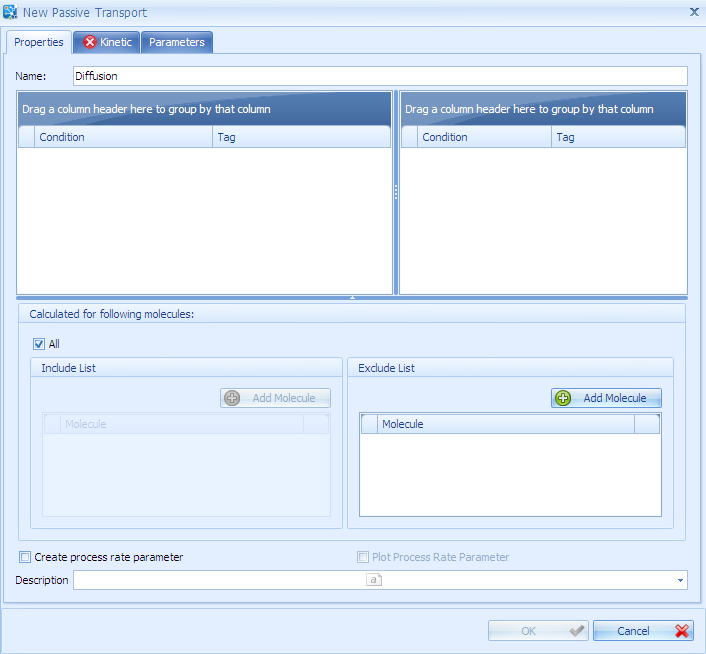
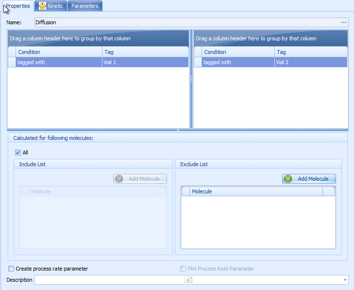
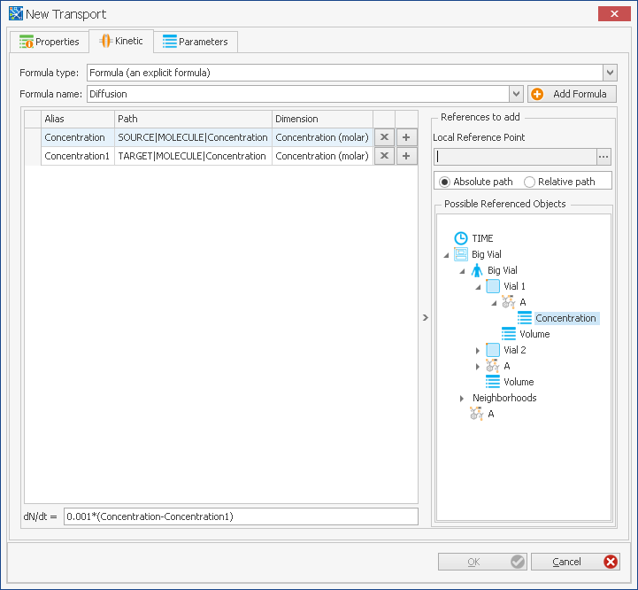

# Passive Transports Building Block

The **Passive Transports (PT)** building block (BB) contains all passive transport processes that are generic for all non-stationary molecules. These processes are defined by source and target containers, and a kinetic formula defining the transport rate. Examples are passive diffusion, the flow of body fluids like blood, or perfusion processes.

In contrast to active transporter processes defined in the molecules building block, passive transports do not require a transporter protein.

The following section describes the functionalities of the Passive Transports building block based on a PBPK model exported from PK-Sim. Later on, a simple [example](#example---creating-a-passive-transport) is given to create a passive transport from scratch.

## Passive Transports - Functionalities Overview

After loading a PBPK model from PK-Sim®, a set of PTs are available in the imported PK-Sim® module. Double-clicking on the Passive Transports BB  or using the **Edit** command of the context menu that appears after right-clicking on it opens an edit window.

A passive transport is defined by its **source** (origin) and **target** (sink), the molecules it should be applied for, and transport rate equation defined in the **Kinetic** tab.

Often, it is desired to define transport processes by a generic type of equation, e.g., _in all organs from blood to interstitial space_. This is done by selecting the corresponding container tag conditions which previously should be defined to contain such container type information (see [Creating a Spatial Structure](spatial-structures-bb.md)). The usage of criteria based on tags is described in [How Tags are used](parameters-formulas-tags.md#how-tags-are-used---container-criteria-for-formulas-observers-transports-and-events)).

 Further, passive processes that should transport all present and non-stationary molecules require a kinetic equation with generic references to molecule concentration or amount. By default, MoBi® uses relative reference paths with such generic names. This will be shown in the following example process.

## Example - Creating a Passive Transport

For **creating a new transport** or loading one from a previously saved file:

1. Select the corresponding ribbon button  **New** or  **Load**. Alternatively, you may right-click into the empty white space in the left part of the edit window and select **Create Passive Transport** or **Load Passive Transport** from the context menu. If you choose **New** or **Create**, a window named "New Passive Transport" opens.

1. Enter a name for this transport process, for example "Diffusion".
2. Define conditions for target and source containers:
   * Right-click into the corresponding empty space below "Condition" and "Tag", then select a container criterion (See [How Tags are used](parameters-formulas-tags.md#how-tags-are-used---container-criteria-for-formulas-observers-transports-and-events) for more information).
   * A window where you will be asked for the tag name will open.
   * A tag can simply be the name of a container of a spatial structure; you can select from the available names by clicking the drop-down arrow. In our example project, select "Vial1" as "New match tag condition" for "Source", and select "Vial2" as "New match tag condition" for "Target".
   * The arrangement of neighborhood connections set up in the spatial structure (see [Creating Neighborhoods](spatial-structures-bb.md#creating-neighborhoods)) will restrict the pattern of transport streams.
3. Define which molecules are transported. Per default, the checkbox  **All** is selected, which means that all non-stationary molecules which are present in the corresponding compartments are transported. Exceptions can be defined in the **Exclude** List. In order to add a molecule to the Exclude List, click the  **Add Molecule** button within the section Exclude List. Molecules listed in the Exclude List will not be transported. If the checkbox **All** is un-checked, you can add molecules to the **Include** List. Then, only molecules listed in the Include List are transported.
4. If the box  **Create process rate parameter** is checked, a parameter which equals the transport rate equation is automatically generated when a simulation is build. You can use this parameter to refer to the transport rate in any equation. It can also be used to plot the transport rate (additionally check the box **Plot Process Rate Parameter**).
5. In order to define a transport rate, go to the Tab **Kinetic**. Select **Formula - an explicit formula** in the Formula Type combobox.
6. Click the  **Add Formula** button. You will be asked for a reaction formula name. Name the formula "Diffusion". Press **Enter** or click **OK**.
7. Next you need to compile the referenced values for the diffusion formula. To have more space for easier navigation, you may either click **OK** and edit the formula in the larger space of the edit window.

A **diffusion equation** typically requires you to use concentration differences between two connected containers. Also, a diffusion constant is required which may be molecule-dependent.

* To have such values as molecule parameters available, you need to add them in the **Molecules** building block.
* If transport rates depend primarily on the processes rather than on the molecular properties (e.g., blood vessel flow rates), it might be better to create such parameters as the properties of the neighborhood (see [Creating Neighborhoods](spatial-structures-bb.md#creating-neighborhoods)).
* If only one global diffusion coefficient is needed (e.g., if all molecules diffuse rather similarly), you may define it as a parameter to the transport process. Use the "Parameters" tab in the edit window of the newly created passive transport, and create a diffusion constant in the way described for the other building blocks, using the "New Parameter" button.
* Another alternative is to just enter a diffusion constant as a numerical value into the formula input box, as it is done below.

In any of the above cases, the tree view within the field "Possible Referenced Objects" allows you to pick parameters from a variety of building blocks.


If you notice later that a parameter would rather be placed at another location, you can move a parameter by clicking to the left of it, pressing **Ctrl+X** and inserting it with **Ctrl+V** at the proper position. However, all "Possible Referenced Objects" list entries pointing to this parameter need to be entered again manually.


Continuing with our example, let us enter a simple diffusion equation based on a constant multiplied by the concentration difference between the source and the target containers.

1. Make sure that the molecules created above all have a "Concentration" parameter. If not, see [Molecule Parameters](molecules-bb.md#example---creating-new-molecules) how to proceed.
2. To make the concentrations available for the diffusion formula, work with the "Possible Referenced Objects" tree view, as described in [Reaction Kinetics](reactions-bb.md#reaction-kinetics). Select "Relative path", and choose `Neighborhoods|V1V2Connection` as reference point. The relative path will result in source and target molecule paths that are generic for all molecules, whereas selecting an absolute path will be molecule-specific.
3. Successively expand the "Possible Referenced Objects" tree view by clicking on the + signs to the left of "BigVial", there on "Vial1", then on "MoleculeProperties", then on "A" (or any other molecule name). The "Concentration" parameter should now appear, if present.
4. Drag and drop exactly this "Concentration" parameter to the white references area to the left of the tree. The alias name "Concentration" and the path "SOURCE|MOLECULE|Concentration" should appear in the list.
5. Then open the tree below "Vial2" -> "MoleculeProperties" -> "A" and drag exactly this "Concentration" parameter into the references as well. This time, the alias should be named "Concentration1" and the path should read "TARGET|MOLECULE|Concentration".
6. Compare your screen to to the images below. If you want to change the aliases manually, you can do so by clicking on any name input box and replace the corresponding name with another.
7. Now enter the formula `0.001 * (Concentration - Concentration1)` into the formula input box below the references. The error symbol  that was displayed to the left of this input box should now disappear, if everything is typed correctly. Compare your result again with the images below.


The resulting formula is a generic formula. The example model has 3 different molecules, "A", "B", and "C". Each of them will be transported by the above passive transport, as long as they are all present in the compartments "Vial1" and "Vial2" and the checkbox "All" is selected, which is the case in our example.


