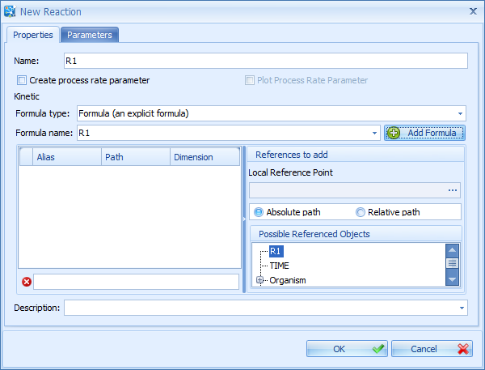
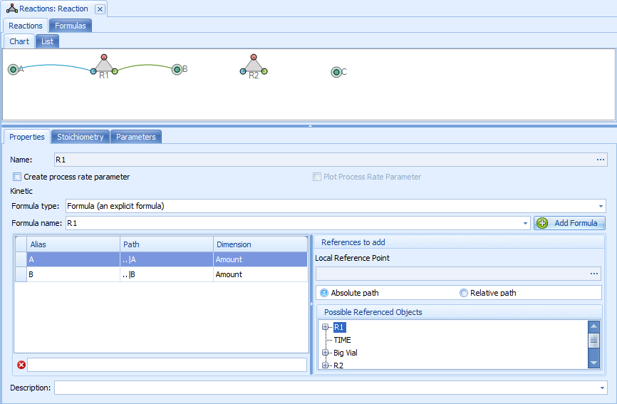
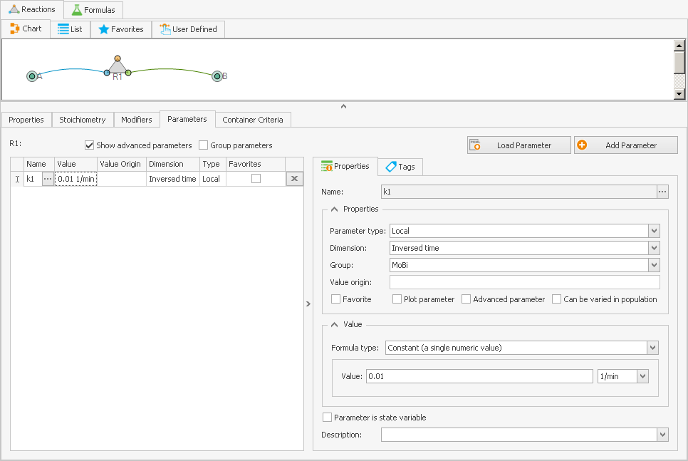

# Reactions‌ Building Block‌

In a **Reactions** building block (BB), all (bio-)chemical reactions which are of interest for the current project are defined. A reaction has a unique **name**, a reaction **kinetics equation**, may have **parameters**, and requires **reaction partners**.

1. In our newly created project, open the **Reactions** folder and edit the Reaction building block by either right-clicking it and selecting **Edit**, or by double- clicking on it.
2. A new tab with an empty diagram area will open. This is the work space where you can add new reactions and molecules or load reactions from other projects. Again, the ribbon of the MoBi® window changes to a reaction-related view, named "Edit Reaction".

Working with reactions is done mostly using the Reaction Diagram. We describe the most important features in this section, for more details see [Diagrams Overview](diagrams-overview.md)

## Reactions and Molecules‌

When creating a simulation (see [Setting up a Simulation](setting-up-simulation.md)) the reactions defined in this building block are combined with the molecules from the Molecules building block. When we use the term **Molecule** in this section we refer to Molecule names only, which define the relationship between the Reactions to the Molecules from the Molecules building block.


If you insert a molecule that has not yet been defined in the Molecules building block, this may cause an error later when setting up a simulation. Remember to define that molecule later.


To have access to molecules as reaction partners for the reactions you want to create, it is advisable to first insert the molecules that you need into the Diagram Area, our work space. Alternatively, you may insert the molecules after reactions are created. To insert molecules:

1. Right-click into the Diagram Area and choose **Insert Molecule** from the context menu that appears. A box listing all molecules available in this project will appear.
2. You can either enter a name manually into the "Molecule Name" input box, or select as many as you wish from the list below this input box. Multi-select is done in the standard Windows® way by keeping the **Shift** key (for a contiguous part of the list) or the **Ctrl** key pressed (for individual selection) followed by clicking with the mouse on the desired molecule range or molecule names.
3. Click **OK** to execute the operation. For each molecule, a green circular symbol appears in the diagram area.

The added **molecules can be moved** by the mouse within the diagram area.

To **create a new reaction**:

1. Click the ribbon button  **New**, or right-click into the diagram area at the position where you want to have the new reaction, then choose **Create Reaction** from the context menu that appears. A new window titled "New Reaction" will open with the "Properties" tab selected.
2. Enter a reaction name into the "Name" input box, e.g., "R1".
3. Below the name, you can check the box  **Create process rate parameter**. If this box is checked, a parameter which equals the reaction rate equation is automatically generated when a simulation is build. You can use this parameter to refer to the reaction rate in any equation. It can also be used to plot the reaction rate (additionally check the box **Plot Process Rate Parameter**) .
4. Next, you can choose the Formula Type from a combobox - by default, **Explicit Formula** is selected.
5. If you want to use a formula that has already been defined, you may select it from the "Formula Name" combobox. To create a new formula, click the  **Add Formula** button. You will be asked for a formula name. It is a good idea to use a related name for the reaction and for the reaction's formula - you may even use the same names here. Then press **Enter** or click **OK** to return to the "New Reaction" window.
6. You may then continue to create reaction parameters (like rate constants) and the reaction formula, but that can be done later as well.
7. Finally, press **Enter** or click **OK**.


For completing our example and to get more practice, repeat steps 1 to 6 to enter a second reaction that you name "R2".


A **reaction triangle** symbol showing the reaction name "R1" underneath will be created in the Diagram area. This triangle  has differently colored circles on its corners:

* The blue circle, by default on the left, is where the educts are to be connected (see where already two reactions are present).
* The green circle, by default on the right, is where the products are connected.
* The red circle on the top is where reaction modifiers, like catalysts or inhibitors, are connected - i.e., the molecules that are not changed by the reaction, but influence the reaction kinetics.

Like molecules, reaction triangles can be dragged with the mouse to a desired position within the diagram area.

## Connecting Molecules and Reactions‌

Now you may want to connect molecules to the reaction and verify or change the stoichiometry. There are two ways to connect a molecule to a reaction as educt, product, or modifier:

* You can either click on the corresponding circle of the reaction triangle (i.e., blue for educt) and drag it towards the desired molecule, holding the left mouse button pressed and releasing it when the connection line that is protruding from the triangle connects to the proper molecule.
* Alternatively, you can drag the light-green rim of a molecule symbol towards the desired position of a reaction triangle until the connection line connects to the correct target circle.

In both cases, the correct position of the mouse pointer to start the action is indicated by a change of the mouse pointer from an arrow symbol  to a hand symbol . As long as you keep the left mouse button pressed, the connection is not yet finalized. So, if the connection line appears to connect to the wrong target, continue moving the mouse towards the desired target symbol and only release the mouse button when the correct points are connected. You should get an arrangement like shown for reaction R1 in below.


In case a wrong connection is established, you can click on a connection, after which it is highlighted by light green squares, and then press the **Delete** key on the keyboard.


Now, continue and check the **reaction's stoichiometry**. If you have connected one or more molecules to the reaction, you should see them appearing in the properties tab of this reaction.

1. Click the reaction triangle. Below the Diagram area, the **Properties Editor**, a three-tabbed window, is shown.
2. Click the **Properties** tab, and you see the Alias names (how they will be used in the formula, see next section), the path, and the dimension of the amount of molecules .
3. Clicking on the **Stoichiometry** tab will list the educt and product stoichiometric coefficients. By default, these coefficients are set to 1, and you need to change that manually if your reaction has a different stoichiometry, e.g., if two molecules form a dimer.

## Reaction Kinetics‌

You are now ready to define **Reaction Parameters**, like kinetic rate constants, Michaelis-Menten parameters ($$kcat$$ or $$K_M$$), or binding constants. These parameters will then be used for the equation that defines the reaction kinetics. A new reaction parameter is defined by the following procedure:

1. Click the Parameters tab in the edit reactions window.
2. Click the  **Add Parameter** button. A "New Parameter" window opens.
3. Enter a parameter name, like "k1" as a first order rate constant in our example.
4. Select the parameter type (**Local** or **Global**). 
    - **Global** parameters are considered a property of a reaction that does not depend on the location of the reaction (e.g., $$kcat$$). These parameters are listed under the reaction node in the root of the simulation tree, and are accessed by the path `<REACTION>|<parameter name>`, e.g., `Midazolam-CYP3A4-Optimized|Km`.
    - **Local** parameters are parameters whose values depend on the location of the reaction, e.g., "Km interaction factor" which is the parameter describing the change of $$Km$$ by a perpetrator, e.g., an inhibitor (see section [Defining Inhibition/Induction Processes](../part-3/pk-sim-compounds-defining-inhibition-induction-processes.md)). Therefore, the value of this parameter may be different in different containers depending on the local concentration of the perpetrator. These parameters are listed under the reaction node in each container of the simulation tree, and are accessed by the path `<ContainerPath>|<REACTION>|<parameter name>`, e.g., `Organism|Kidney|Intracellular|Midazolam-CYP3A4-Optimized|Km interaction factor`.

5. Select the proper dimension in the **Dimension** combobox, which is Inversed Time for the first order rate constant in our example.
6. Enter a value for your parameter, 0.01 as an example. If needed, select a different dimension unit in the combobox to the right of the value input box. The parameter may also be defined by a formula or data table, or you may make the parameter state variable (compare [Parameters, Formulas, Tags, and Keywords](parameters-formulas-tags.md)).
7. Optionally you may enter a description.
8. Finally, press **Enter** or click **OK**.

Alternatively to entering it manually, you may also load it from a file or copy and paste it from another reaction in the same way as described above, see [Parameters, Formulas, Tags, and Keywords](parameters-formulas-tags.md). Any setting of a parameter can be edited later, and as many parameters as you need can be added to a reaction. The figure below shows what the screen would look like after one parameter has been added.

The following steps describe how to enter a **kinetic equation** to the reaction:

1. Click the **Properties** tab again, and notice the red error sign  left of the empty input box (see lower left). Hovering with the mouse over this warning symbol will show you a tool tip with information on the validity of the equation - currently the problem is that it is still empty. Examples for kinetic equations are an irreversible term, like `k1 * A`, an equilibrium like `k1 * A - k2 * B`, or a Michaelis-Menten type of equation.
2. If you want to use relative paths, select the corresponding radio button on the right hand side, and then the corresponding reference point in the tree window that pops up.
3. All variables you use in the kinetic equation will have to be present in the reference list. The molecules that were previously drawn to the reaction (educts, products, or modifiers) are already present with their corresponding amount parameters.
4. To add the reaction parameters that you defined before to the reference list, click on the + sign next to the reaction name in the tree display in the "Possible Referenced Objects" part of the window. Drag and drop all reaction parameters that you want to use in your formula into the references area left of the tree, where product and educt molecule references are listed.
5. If you need molecular concentration parameters in the formula, select Relative path and choose one container. Open this container in the possible referenced objects tree by clicking on the + sign next to it, then open MoleculeProperties underneath it, open the needed molecule and drag the concentration parameter (which needs to be created beforehand in the Molecules building block, see [Molecule Parameters](molecules-bb.md#molecule-parameters)) into the references area left of the tree. Finally, you may want to edit the automatically generated alias names to have molecule names as part of the aliases. Just click into the alias name field and edit the name.
6. Besides reaction and molecule parameters, parameters of other building blocks, like the volume of a spatial structure, might be needed. They have to be defined first, so look up the corresponding sections in this chapter to see how to do that.
7. Finally, enter your kinetic equation into the empty input box below the references; for our example, enter `k1 * A`. This will let the error symbol  disappear, if everything is properly defined and if all parameters are defined in the references.


To complete reaction R2 (created above, see [Reactions and Molecules](#reactions-and-molecules)) which you will need for continuing with the model building, connect molecule "B" as educt to R2, then "C" as product, as done for R1 in the previous section. Then define another k1 parameter for R2, this time set it to 0.005. Note that the name k1 appears twice, but is assigned to different reactions - thus they can both be separated. Next drag k1 to the references list, then enter `k1 * B` as reaction kinetics formula. We will need a working reaction system if we move on to setting up a simulation later on.

If using the same rate constant name for two different reactions is too confusing, use different names for the rate constants in different reactions.


## Additional Features for Editing Reactions‌

There are more features available to handle reaction building. Some of which are briefly described here:

* you can delete an object using the **Delete** key or the context menu,
* you can zoom, for instance by pressing the **Shift** key and selecting a rectangle by dragging the mouse,
* different layout features like usage of templates and auto layout mechanisms are available.

To get more details on which techniques are available in all diagrams, see [Diagrams Overview](diagrams-overview.md).

Instead of the diagram area, the graphical display of all reactions, you can switch to a list view by clicking the **List** tab in the upper part of the edit window. Reactions are listed by name with their stoichiometry and kinetic equations. Right-clicking the lines allows you to edit, rename, save, and remove any reaction by selecting the corresponding entry in the context menu.