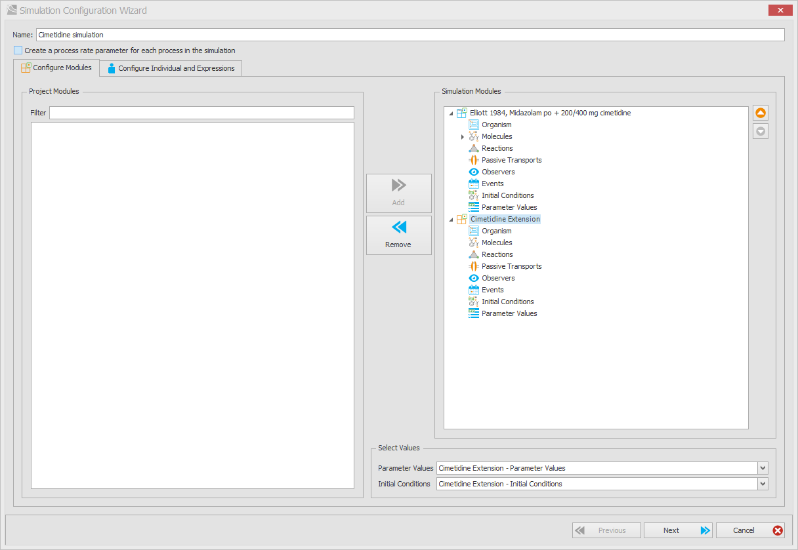
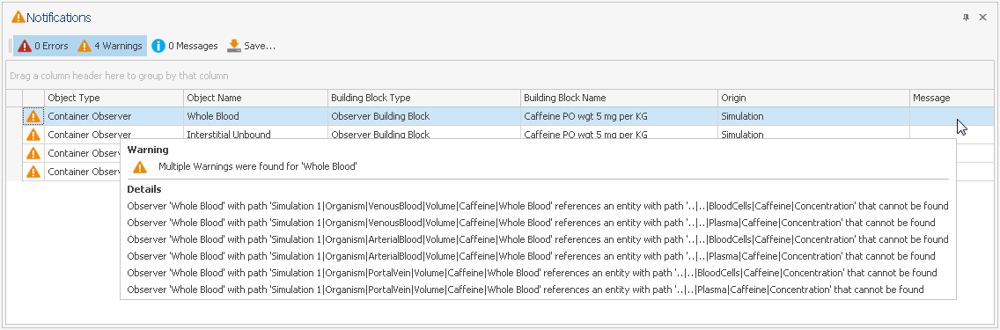
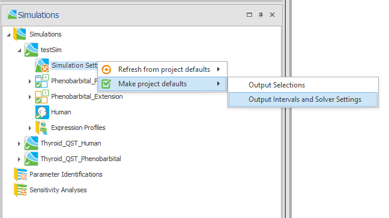
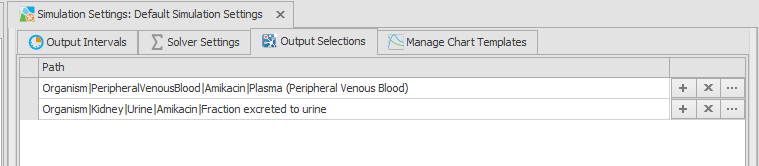
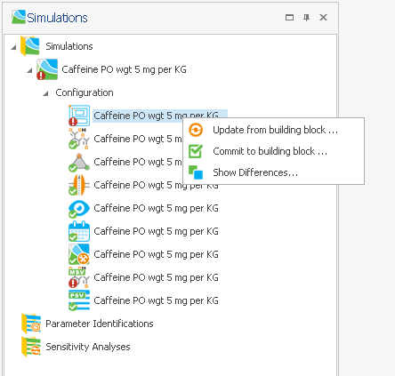

# Simulations

This section describes the workflows of setting up and running a simulation. There are three ways to set up a simulation in MoBi:

* Export a simulation from [PK-Sim to MoBi](../part-3/importing-exporting-project-data-models.md#export-to-mobi)..
* Load a simulation from a pkml file into the MoBi® project.
* Create a new simulation from existing modules.

## Load a Simulation‌

A simulation created in PK-Sim or MoBi can be saved as a `*.pkml` file and later loaded into a MoBi® project.

* Clicking on the  **Load Simulation into Project** button in the Import Ribbon Group.
* Right-click on the "Simulations" entry in the Simulations Explorer and select "Load Simulation..." in the context menu.

The behavior will be slightly different based on the loaded simulation type.

- When sending a simulation from PK-Sim, a new MoBi project will be created. The simulation will be transfered with the obsreved data sets linked in the simulation. A PK-Sim module (see [PK-Sim modules](../part-4/modularization-concept.md#pk-sim-modules)) will be created alongisde with one individual and the expression profiles used in the simulation.
- When loading a simulation from a pkml file that was saved from PK-Sim, a new PK-Sim module will be created alongisde with one individual and the expression profiles used in the simulation. If a module, an individual, or an expression profile with the same name already exists in the project, the new modules/individuals/expression profiles will be added as copies with a counter suffix.
- When loading a simulation created with OSPS versions prior to 12.0, one module will be created containing all building blocks used in the simulation.
- When loading a simulation consiting of several modules, all modules will be created in the project. If a module with the same name already exists in the project, the new module will be added as a copy with a counter suffix.

## Create a Simulation‌

A simulation can be created from at least one module or a combination of modules, indviduals, and expression profiles. A specific combination of modules is called **model configuration**. To create a simulation:

* Click on the  **Simulation** button in the **Create** group of the **Modelling** ribbon.
* Right-clicking on the "Simulations" entry in the Simulations Explorer and select  "Create Simulation..." in the context menu.

A **Simulation Creation Wizard** opens that allows to select the modules, individual, expression profiles, initial conditions, and parameter values building blocks to create the simulation from as depicted below.

In the first step, select the modules that should be combined to the simulation. The selection of the modules results in a *hierarchy* of the modules, where the order of module selection determines the order of overwrite/extend actions. I.e., module 2 overwrites/extends module 1, module 3 overwrites/extends the combination of modules 1 and 2, and so on.

For each selected module that contains at least one Initial Conditions or Parameter Values building block, you can select one (or none) Initial Conditions and/or Parameter Values building block.

In the next step, select the individual that should be used in the simulation and the expression profiles. Parameters from the individual BB will be added to the simulation structure.


Selected expression profiles will **not** add a protein that is not present in the model structure!


During simulation creation, you can enable the checkbox "Create a process rate parameter for each process in the simulation. This will create a parameter called `ProcessRate` for each instance of a reaction or a (passive and active) transport in the simulation. The `ProcessRate` parameter can be used as output and help to analyze and debug the model.


Create of process rate parameter for all processes negatively impacts the performance of the simulation and should only be used for debugging purposes.


Finish the simulation creation by clicking on **OK** . MoBi® now generates the new simulation, the progress of which is visualized by a progress bar. During this process the simulation is also checked for consistency, and possible issues will be reported.

### Warnings and Errors‌

If the simulation creation process detects inconsistencies in the creation process, they will be displayed either as  a **Warnings** or   **Errors** depending on their severity.

Errors and warning messages are shown in a notification viewer at the bottom of the page similar to the history viewer. Warnings and error notifications are described in more detail in the viewer as such describing

* the origin of the message
* the warning text
* the warning type

The list of warnings and errors is constantly updated, i.e. if a warning is resolved, the entry is removed from the list. Likewise the viewer can be hidden or shown by pressing the **Notification** button in the _Views_ section of the _Building block_ section of the page.

#### Warning: Non-fatal inconsistency.

Warnings are generated, for example, in these cases:

* References in formulas for non-essential objects like observers are faulty. In this case, the affected observer is simply omitted in the created simulation.
* An error in the dimension of a formula, if the option Validate Dimension is selected in Options/User Settings/General (which is the MoBi® default).
* An empty condition is present in an event.

#### Error: Fatal inconsistency.

In this case, the simulation cannot be created. Errors are generated, for example, in case of:

* Missing or wrong references in formulas for essential objects like Molecule Start Values.
* General syntax errors in formulas.

You can choose if only errors, only warnings or both are displayed by clicking (activating/deactivating) the  Errors and  Warnings buttons in the top row of the Notifications window. Warnings are grouped according to their category.

The  Warnings and  Errors displayed in the Notifications View can also be saved in a Log file (csv format) using the  **Save Log...** button. You may apply changes and selections to the Notifications table as for any table, see Shared Tools - Features of _Tables_, which can be helpful for longer lists. A double-click on the error message or the warning directly opens the editor in the corresponding building block.

## Defining simulation time - Output Intervals‌

The simulation time is specified in the **Simulation Settings -> Output Intervals** entry of the simulations "Parameters" tree view.

Output Intervals specify the simulation times at which simulation results are stored. In MoBi® you can specify a variable number of Output Intervals (as depicted below).

Each Output Interval is defined by the following options:

|                 |                                                                                                                                                   |
| --------------- | ------------------------------------------------------------------------------------------------------------------------------------------------- |
| **Start Time**: | Starting time of the Output Interval.                                                                                                             |
| **End Time**:   | End time of the Output Interval.                                                                                                                  |
| **Resolution**: | Defines the resolution with which simulation results are displayed and stored. A higher resolution increases the smoothness of the plotted curve. |

Each set of options defines a _separate_ simulation Output Interval

$$[t\_{start}, t\_{end}]$$

with the corresponding number of output time points

$$N\_{t} = \frac{t\_{end} - t\_{start}}{resolution} + 1$$

Additional output intervals can be defined and added to the list by clicking on the  **Add** button to the right of the list.


* Output Intervals can be overlapping.
* The _total_ time of simulation is from t = 0 to the highest specified **End Time**.


When creating a simulation, the output intervals defined in the [**Default Simulation Settings**](#default-simulation-settings) are automatically applied. To set the output intervals of a simulation as the project defaults, right-click on the "Simulation Settings" entry of the expanded simulation, select "Make project defaults" and then "Output Intervals and Solver Settings".

## Output selections

To select the outputs that will be available for plots after a successful simulation run, click on **Define Settings and Run** button in the **Simulation** group of the **Run & Analyze** ribbon. By default, the outputs defined in the [**Default Simulation Settings**](#default-simulation-settings) are automatically applied.

To make the current selection of outputs the project defaults, click on "Make defaults" in the output selection dialog, or right-click on the "Simulation Settings" entry of the expanded simulation, select "Make project defaults" and then "Output Selections".

In the output selection dialog, only *Observers* and *molecule amounts* can be selected. If you want to plot any of the parameters of the simulation, navigate to the respective parameter in the "Parameters" view if the simulation and enable the "Plot parameter" checkbox.

## Running simulations

To run a simulation, open a simulation by clicking on it in the Simulation Explorer.

Now you can run the simulation by one of the following options:

* Click the  **Run** button in the **Simulation** group of the **Run & Analyze** ribbon.
* Press the function key **F5**

Alternatively, select the  **Run** option within the simulation context menu (opens when right-clicking on the simulation in the **Simulation Explorer** ).

The progress of a simulation run is shown by the progress bar in the lower right corner of the MoBi® window. A running simulation can be stopped by clicking the  **Stop** button in the Simulation Ribbon Group which will become active during a run.

The results of all simulation runs are accessible through the Simulation Explorer and the edit window. After a successful simulation run, the most recent results can be displayed in the **Results** tab in the simulation edit mode as described in MoBi® _- Simulation Results_.

## ODE Solver Properties

MoBi® uses the CVODE differential equation solver. The solver settings can be accessed and edited in the simulation edit mode in the "Simulation Settings -> Solver Settings" node.


For more information on the solver, please refer to the documentation of the CVODE solver: [https://computing.llnl.gov/projects/sundials](https://computing.llnl.gov/projects/sundials).


The following options can be changed by the user:

|        |                                                                                                    |
| ------ | -------------------------------------------------------------------------------------------------- |
| MxStep | Maximum number of internal steps to be taken by the solver in the attempt calculate one time step. |


For some "difficult" problems, the predefined value of MxStep might be too small. In case of such difficulties, try to increase the value of MxStep.


|        |                                                                                                                                        |
| ------ | -------------------------------------------------------------------------------------------------------------------------------------- |
| H0     | Initial step size.                                                                                                                     |
| Hmin   | Minimum absolute value of step size allowed. Increasing Hmin may speed up the simulation but also reduces the accuracy of the solver.  |
| Hmax   | Maximum absolute value of step size allowed. Reducing Hmax may slow down the simulation but also increases the accuracy of the solver. |
| AbsTol | Absolute tolerance of solver accuracy.                                                                                                 |
| RelTol | Relative tolerance of solver accuracy.                                                                                                 |

The parameters RelTol and AbsTol define a vector of error weights, ewt, defined as:

$$\text{ewt}[i] = \frac{1}{\text{RelTol} \times | y[i] + \text{AbsTol}|}$$

where $$y$$ is a variable vector $$y = f(t)$$.

This vector is used in all error and convergence tests, which use a weighted root mean square (RMS) norm on all error-like vectors $$v$$:

$$\text{WRMSNorm}(v) = \sqrt{\frac{1}{N} \sum_{i=1}^{N} (v[i] \times \text{ewt}[i])^2}$$

where N is the length of vector $$v$$.

|             |                                                                                                                                                                                         |
| ----------- | --------------------------------------------------------------------------------------------------------------------------------------------------------------------------------------- |
| UseJacobian | If the Jacobian matrix of the ODE system should be supplied to the solver, use the value 'True'. Using the Jacobian speeds up the simulation. |


Setting tolerances higher than the default values (absolute tolerance: 1.0E-10; relative tolerance: 1.0E-5) may reduce simulation time but cause convergence errors.

However, when scale divisors are calculated and applied to a simulation, solver tolerances can often be safely increased without compromising accuracy. See [Calculate Scale Divisors](#calculate-scale-divisors) for more information on scale divisors.


## Default Simulation settings

The project defaults for simulation output intervals, output selections, and solver settings can be defined in the **Default Simulation Settings** accessilbe through the **Edit** button of the **Simulation Settings** group in the **Modelling** ribbon. When a new simulation is created, these default settings are automatically applied.

The default simulation settings can be exchanged between projects by saving them to and loading from a pkml file.

The following defaults can be defined:

- **Output Intervals**: start and end time point of a simulation and resolution of a simulation.

- **Solver Settings**: solver parameters such as the tolerances.

- **Output Selection**: outputs that will be available for plots. The outputs are represented as the paths to the observers that can be selected in the simulations.

The user can manually change the path, or select an observer from a any simulation in the project by clicking on "...". New outputs can be added by clicking on the "+" sign.


The outputs defined in this view will be automatically applied to new simulations created in the project. If a simulation does not contain an observer defined in the default output selection, the output will be ignored for that simulation.


- Chart Templates: a set of chart templates can be managed in the **Chart Editor**.

## Editing Simulations‌

Once a simulation is created, the basic structure of the simulation model is fixed.

In a simulation, you can only change the values of parameters and initial conditions of molecules. Also, if the value of a parameter is defined by an explicit formula you can only edit the numeric value of the formula, but not the formula definition. This means, that for example the kinetic formula of a reaction or the formula used for a certain observer are no longer editable. They may only be changed by changing a parameter the used formula depends on.

All changes made to the parameter or initial condition values are listed in the tab **Changes** of the simulation edit mode.


It is recommended to select all parameters under consideration as **Favorites** and to document the source of all parameter values changed from the default in the column **Value Description**. Then you have a comprehensive overview about the essential input of your simulation, which you can document by copying just the Favorites table.



If you change the value of a parameter defined by an explicit formula, the Formula Type will switch to _Constant_ and the parameter is no longer dependent on the specified formula, but stays on the newly specified numeric value.



After changing a parameter value, the parameter can be reset to its original value by clicking on the icon **Reset Parameter to default** , which appears after changing a value. (If a formula dependency of a parameter is overwritten by changing the parameter value, a yellow warning sign  appears.



If you need to change formulas, edit the corresponding building block and create a new simulation instead of editing the simulation.

In the following sections, a brief overview is given on where you can find the parameters that are specified in the building blocks from which the simulation was created. The examples given in some cases refer to a standard PK-Sim® simulation which was exported to MoBi®.


### Container and Neighborhood Properties‌

The container parameters are located at the same level where they were originally defined in the Spatial Structures building block, e.g., accessible by double- clicking the "Plasma" container at the "Organism|Liver" level.

Parameters associated with Neighborhoods, e.g., "Surface Permeability Area", are also located at the same level on which they were originally defined in the Spatial Structures building block. For the kidney, for example, "Surface (Permeability) area" can be found under `Neighborhoods|Kidney\_int\_Kidney\_cell`.

### Molecular Properties‌

Molecules can have either **global** or **local** parameters.

|          |                                                                                                                                                                                                                                        |
| -------- | -------------------------------------------------------------------------------------------------------------------------------------------------------------------------------------------------------------------------------------- |
| Global   | The parameter is attached to the respective molecule at the first level of your Simulation Hierarchy tree.                                                                                                                             |
| Local    | The parameter is attached to the respective molecule where it is located in a physical container, e.g., accessible by double- clicking on a molecule located at the `Organism\|Liver\|Plasma` level of your Simulation Hierarchy tree. |

Parameters of active transports are defined as a sub-node of the molecule that is transported. Parameters of protein interactions are defined as a sub-node of the molecule that is interacting with the protein.

### Reaction Kinetics‌

Parameters associated with reactions can also be local or global. Thus, the same rules as for molecule parameters apply also to reaction parameters as specified above.

### Passive transports

Parameters of Passive Transports are located in the neighborhoods where the respective passive transport is created.

### Event and Application Properties‌

Parameters associated with Event and Application Properties can be accessed at the root level of the simulation hierarchy tree within the **Events** node. They are located at the same relative location as the Events building block from which the simulation was created.

## Update and Commit Changes Between Simulations and modules.

Within the **Simulation Explorer**, each building block item of the **Configuration** tree is displayed with a green or red traffic light. The traffic lights indicate if the building block item of the simulation is consistent with the corresponding general **Building Block**. If a **Building Block** or parameter settings within a **Simulation** are changed, the red traffic lights in the **Simulation** window indicate that the local settings in the simulation are different from the settings in the general **Building Block**.

A right click on the red traffic lights in the **Simulation** window allows for two actions:

### Update from building blocks

If the information in the building blocks differs from that in the simulation, the simulation can be recreated using the same model configuration by right-clicking on the simulation and selecting **Update from Buildgin Blocks**. This action is identicall to creating a new simulation from the same model configuration. All local changes in the simulation will be lost.

### Commit to building blocks

Changes in parameter or initial condition values can be propagated to the modules.


Structural changes cannot be propagated to the modules. For example, if a reaction is added in the building block of a module, commiting from the simulation to the module will not remove the reaction.


Right-click on the simulation and select **Commit to Building Block**. A dialog opens that allows to select which changes should be committed to the building block. The values are always commited to the **selected** parameter values or initial conditions buildgin blocks of the **last module** used in simulation configuration.

If no Parameter Values or Initial Conditions building block is selected for the last module, a new building block is created.

## Further Options for Simulations‌

Once a simulation is created, a number of options besides simply running the simulation are available.

### Calculate Scale Divisors

Internally, very small numerical values are divided by the scale divisors to get to an order of magnitude which is reasonable for the solver. The purpose is to reduce numerical noise and to enhance computation performance. This is also important when working with a broad variety of magnitudes of values. The scale divisors specify a typical scale for each species. Per default, all scale divisors are set to 1. If you work with very small amounts and/or a broad variety of magnitudes of values and your simulation yields implausible results (numerical noise, negative values, etc.), use the **Calculate Scale Divisor** function located in the **Simulation** group of the **Run & Analyze** ribbon to adjust the scale divisor for computational purposes.

### Context menu

The context menu that opens when right-clicking on the **Simulations** node in the Simulation Explorer offers the following options:

*  **Create Simulation** - opens the Simulation Creation Wizard (see [Create a Simulation](setting-up-simulation.md#create-a-simulation)).
*  **Load Simulation** - loads a new simulation into the project (see [Load a Simulation](setting-up-simulation.md#load-a-simulation)).
- **Create Subfolder** - creates a new subfolder in the Simulations Explorer to organize simulations.
- **Delete all subfolders and keep data** - deletes all subfolders in the Simulations Explorer, but keeps the simulations contained in the subfolders in the main Simulations Explorer.
- **Delete all subfolders and data** - deletes all subfolders in the Simulations Explorer, including all simulations contained in the subfolders.
- **Delete all results** - deletes all simulation results of all simulations in the project.

The context menu that opens when right-clicking on a simulation offers the following options:

*  **Edit** - opens the simulation in the edit window (same as double-clicking).
*  **Rename** - renames the simulation.
- **Configure** - opens the Simulation Creation Wizard to change the model configuration of the simulation. All local changes in the simulation will be lost.
- **Update from Building Blocks** - updates the simulation from the building blocks used in the model configuration. All local changes in the simulation will be lost.
*  **Run** - runs the simulation.
- **Stop** - stops a running simulation.
* **Start Parameter Identification** - calls Parameter Identification tool (see [Parameter Identification](../part-5/parameter-identification.md) for description).
- **Start sensitivity analysis** - calls Sensitivity Analysis tool (see [Sensitivity Analysis](../part-5/sensitivity-analysis.md) for description).
- **Send to PK-Sim for Population Simulation** - sends the simulation to PK-Sim® and opens PK-Sim®. The simulation can then be used as basis for a population simulation in PK-Sim® (see [Running and analyzing a population simulation](../part-3/pk-sim-creating-populations.md#running-and-analyzing-a-population-simulation) for description).
*  **Save Simulation to MoBi pkml format** - saves the simulation as pkml file.
- **Add to Journal** - adds a snapshot of the simulation to the Working Journal (see [Working Journal](../part-5/working-journal.md) for description).
*  **Export results to Excel®** - generates an MS Excel® output file containing all result data (see [Simulation Results](simulation-results.md)).
* **Export Simulation as Matlab® Differential Equations**  ... - exports the system of ordinary differential equations (ODE) of the simulation to m-files for MATLAB®. Into the output directory defined, several m-files defining the ODE system are written. The most important files are:
  * _ODEMain.m_. This is the main function. Calling this function from the MATLAB® command window by typing _tout, yout = ODEMain_ will provide the numerical solution to the ODE system, whereby _tout_ is the time- point vector and _yout_ the solution matrix, containing the time-dependent changes of the modeled species. The matrix entry ordering is as specified and explained in the file _ODEInitialValues.m_.
  * _ODERHSFunction.m_. This file contains both the parameters and the differential equation definitions. Parameters are transformed from a hierarchical structure used in MoBi® to a flat structure used in MATLAB®. Therefore a renaming is necessary to P\_number using a consecutive numbering. The hierarchical MoBi® correspondence is provided as a commentary.
  * _ODEInitialValues.m_. This file specifies the initial conditions. The hierarchical species names of MoBi® are transformed into vectors in MATLAB®. The MATLAB® commentary provides information on the MoBi® species - vector relationship.
  * _ODEoptions.m_. This file contains numerical settings as chosen in MoBi®. The ode15s solver is used within MATLAB® (cf. _ODEMain.m_) . Please consult the MATLAB® help for additional information.

*  **Create simulation report** - generates a plain text (txt) file containing all simulation information.

* **Export Model as Tables** - exports Reactions, Parameters Values and Initial Conditions into separate worksheets of an Excel® file.

- **Import Simulation Parameters** - Import parameter values from an Excel®. See [Parameter Values Building Block](parameter-values-bb.md) for details on the required structure.

- **Clone** - Create a copy of the simulation in the project.

*  **Delete** - deletes the simulation from the project.

- **Delete all results** - deletes all simulation results of the selected simulation.