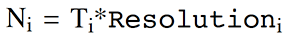

# MoBi®‌ - Setting up a Simulation

After having made yourself familiar with the processes of building model components in MoBi® \- Model building and model components, this section describes the workflows of setting up a simulation using these components. There are two ways to set up a simulation:

- Load an existing simulation (pkml file) into the MoBi® project.

- Create a new simulation from existing model components (building blocks). These two workflows of setting up simulations will be described in the following.

## Load a Simulation‌

Existing simulations can be loaded by either:

- Clicking on the  **Load Simulation into Project** button in the Import Ribbon Group.

- Right-click on an existing simulation in the Simulations Explorer and select 

Load Simulation in the context menu.

In both cases a new window is opened from where the existing simulation can be selected. After loading the pkml file, the simulation and the corresponding building blocks are automatically added to the Building Block Explorer and the Simulations Explorer.


When working with PK-Sim®, simulations can be directly exported to MoBi® as described in [Export To MoBi®](../part-3/importing-exporting-project-data-models.md#export-to-mobi).


## Create a Simulation‌

To create a simulation, a full set of building blocks is needed. All building blocks and the workflows to create them are described in MoBi® \- Model building and model components.

A simulation can be created by:

- Clicking on the  **Create** button in the Simulation Ribbon Group.

- Right-clicking on an existing simulation in the Simulations Explorer and select  Create Simulation in the context menu.

Creating a simulation opens the **Simulation Creation Wizard** in a new window as shown below

In the first step of the simulation creation you can choose the building blocks from which the simulation will be created. Using the combobox you can browse through the existing building blocks and select the desired item. You also need to specify a unique name for the new simulation. which you may also do later in the simulation creation process.

In the first step of the Simulation Creation Wizard, you can also create new Molecule and Parameter Start Values building blocks by clicking on the  button. This follows the same workflow as for the creation of the Molecule and Parameter Start Values as described in [Molecule Start Values](building-block-concepts.md#molecule-start-values) and [Parameter Start Values](building-block-concepts.md#parameter-start-values).

Clicking on **Next**  will bring you to the second step of the simulation creation as depicted. Here you can edit the selected (or newly created) Molecule Start Values building block (for details see [Molecule Start Values](building-block-concepts.md#molecule-start-values)). You can also Save the displayed Start Values as a new Molecule Start Value building block using the  **Save Changes as new building block** button.

Clicking on **Next**  will bring you to the third step of the Simulation Creation as shown. Here you can edit the selected (or newly created) Parameter Start Values building block (for details see [Parameter Start Values](building-block-concepts.md#parameter-start-values)). You can also save the displayed start values as a new parameter start value building block using the **Save Changes as new building block** button.


Changes of start values will affect newly created simulations. Adding them to the project, will leave the original start values building blocks unaffected. **Save Changes as new building block** will create a new building block under a different name.



Newly created Molecule and Parameter Start Value building blocks in step one, or Start Values building blocks saved in steps two and three during the simulation creation process will only be added to the project when the simulation creation is completed by clicking **Finish**  and not cancelled prematurely.


The third and fourth steps after clicking **Next**  allow you to edit the Output Intervals and Simulation Settings which is described in more detail in “Simulation Settings”.

In the last step, you can choose to immediately run the simulation upon completion of the simulation creation process by selecting the checkbox  **Run Simulation** as depicted.

Finish the simulation creation by clicking on **OK** . MoBi® now generates the new simulation, the progress of which is visualized by a progress bar. During this process the simulation is also checked for consistency, and possible issues will be reported.

### Warnings and Errors‌

If the simulation creation process detects inconsistencies in the creation process, they will be displayed either as  Warning or  Error depending on their severity.

Errors and warning messages are shown in a notification viewer at the bottom of the page similar to the history viewer. Warnings and error notifications are described in more detail in the viewer as such describing

- the origin of the message

- the warning text

- the warning type

The list of warnings and errors is constantly updated, i.e. if a warning is resolved, the entry is removed from the list. Likewise the viewer can be hidden or shown by pressing the **Notification** button in the _Views_ section of the _Building block_ section of the page.

#### Warning: Non-fatal inconsistency. 
Warnings are generated, for example, in these cases:

- References in formulas for non-essential objects like observers are faulty. In this case, the affected observer is simply omitted in the created simulation.

- An error in the dimension of a formula, if the option Validate Dimension is selected in Options/User Settings/General (which is the MoBi® default).

- An empty condition is present in an event.

#### Error: Fatal inconsistency. 
In this case, the simulation cannot be created. Errors are generated, for example, in case of:

- Missing or wrong references in formulas for essential objects like Molecule Start Values.

- General syntax errors in formulas.

You can choose if only errors, only warnings or both are displayed by clicking (activating/deactivating) the  Errors and  Warnings buttons in the top row of the Notifications window. Warnings are grouped according to their category.

The  Warnings and  Errors displayed in the Notifications View can also be saved in a Log file (csv format) using the  **Save Log...** button. You may apply changes and selections to the Notifications table as for any table, see Shared Tools - Features of _Tables_, which can be helpful for longer lists. A double-click on the error message or the warning directly opens the editor in the corresponding building block.

## Simulation Settings‌

Simulation Settings allow you to specify the resolution of the results as well as the _output time intervals_ for which results should be generated. Furthermore, you can edit the _properties of the solver_ used for solving the differential equations which the MoBi® simulation model is based on.

## Output Intervals‌

Output Intervals specify the simulation times at which simulation results are stored. In MoBi® you can specify a variable number of Output Intervals (as depicted below).

Each Output Interval is defined by the following options:

|                 |                                                                                                                                                   |
| --------------- | ------------------------------------------------------------------------------------------------------------------------------------------------- |
| **Start Time**: | Starting time of the Output Interval.                                                                                                             |
| **End Time**:   | End time of the Output Interval.                                                                                                                  |
| **Resolution**: | Defines the resolution with which simulation results are displayed and stored. A higher resolution increases the smoothness of the plotted curve. |

Each set of options defines a _separate_ simulation Output Interval

with the corresponding number of output time points

Additional output intervals can be defined and added to the list by clicking on the  **Add** button to the right of the list.



- Output Intervals can be overlapping.

- The _total_ time of simulation is from t = 0 to the highest specified End Time.

- The changes made to the Output Intervals during simulation creation will become the default settings for the next simulation created.



The solution will be produced at the following time points for a number of _k_ Output Intervals:

## ODE Solver Properties

Special points (e.g. times of Events such as Applications) will be added automatically.

MoBi® uses the CVODE differential equation solver. The solver settings can be accessed and edited either in the Simulation Wizard when creating a simulation (as depicted below) or in the simulation edit mode in the Settings tab.


For more information on the solver, please refer to the documentation of the CVODE solver: [CVODE] https://computation.llnl.gov/projects/sundials/sundials-software.


The following options can be changed by the user:

|        |                                                                                                    |
| ------ | -------------------------------------------------------------------------------------------------- |
| MxStep | Maximum number of internal steps to be taken by the solver in the attempt calculate one time step. |


For some "difficult" problems, the predefined value of MxStep might be too small. In case of such difficulties, try to increase the value of MxStep.


|        |                                                                                                                                        |
| ------ | -------------------------------------------------------------------------------------------------------------------------------------- |
| H0     | Initial step size.                                                                                                                     |
| Hmin   | Minimum absolute value of step size allowed. Increasing Hmin may speed up the simulation but also reduces the accuracy of the solver.  |
| Hmax   | Maximum absolute value of step size allowed. Reducing Hmax may slow down the simulation but also increases the accuracy of the solver. |
| AbsTol | Absolute tolerance of solver accuracy.                                                                                                 |
| RelTol | Relative tolerance of solver accuracy.                                                                                                 |

The parameters RelTol and AbsTol define a vector of error weights, ewt, defined as:

where _y_ is a variable vector _y_ = _f_(t).

This vector is used in all error and convergence tests, which use a weighted root mean square (RMS) norm on all error-like vectors _v_:

|             |                                                                                                                                                                                                                                                                                                                                 |
| ----------- | ------------------------------------------------------------------------------------------------------------------------------------------------------------------------------------------------------------------------------------------------------------------------------------------------------------------------------- |
| UseJacobian | If the Jacobian matrix of the ODE system should be supplied to the solver, use the value '1', otherwise use '0'. The default value is '1'. Using the Jacobian speeds up the simulation. |

## Editing Simulations‌

Once a simulation is created from existing building blocks as described in “Create a Simulation”, the basic structure of the simulation model is fixed.

In a simulation, you can only change the values of parameters. Also, if the value of a parameter is defined by an explicit formula you can only edit the numeric value of the formula, but not the formula definition. This means, that for example the kinetic formula of a reaction or the formula used for a certain observer are no longer editable. They may only be changed by changing a parameter the used formula depends on.


It is recommended to select all parameters under consideration as **Favorites** and to document the source of all parameter values changed from the default in the column **Value Description**. Then you have a comprehensive overview about the essential input of your simulation, which you can document by copying just the Favorites table.



If you change the value of a parameter defined by an explicit formula, the Formula Type will switch to _Constant_ and the parameter is no longer dependent on the specified formula, but stays on the newly specified numeric value.



After changing a parameter value, the parameter can be reset to its original value by clicking on the icon **Reset Parameter to default** , which appears after changing a value. (If a formula dependency of a parameter is overwritten by changing the parameter value, a yellow warning sign  appears.



If you need to change formulas, edit the corresponding building block and create a new simulation instead of editing the simulation.

In the following sections, a brief overview is given on where you can find the parameters that are specified in the building blocks from which the simulation was created. The examples given in some cases refer to a standard PK-Sim® simulation which was exported to MoBi®.


### Molecular Properties‌

If you define parameters for molecules of the Molecules building block used, it depends on the Parameter Type where you can find them in your simulation.

|          |                                                                                                                                                                                                                                        |
| -------- | -------------------------------------------------------------------------------------------------------------------------------------------------------------------------------------------------------------------------------------- |
| Global   | The parameter is attached to the respective molecule at the first level of your Simulation Hierarchy tree.                                                                                                                             |
| Local    | The parameter is attached to the respective molecule where it is located in a physical container, e.g., accessible by double- clicking on a molecule located at the "Organism\|Liver\|Plasma" level of your Simulation Hierarchy tree. |
| Property | The same as _Global_.                                                                                                                                                                                                                  |

Transporter properties defined for transporting molecules can be found below "Neighborhoods" in the Simulation Hierarchy tree, but are no longer editable, as mentioned before.

### Container and Neighborhood Properties‌

The container parameters are located at the same level where they were originally defined in the Spatial Structures building block, e.g., accessible by double- clicking the "Plasma" container at the "Organism\|Liver" level.

Parameters associated with Neighborhoods, e.g., "Surface Permeability Area", are also located at the same level on which they were originally defined in the Spatial Structures building block. For the kidney, for example, "Surface (Permeability) area" can be found under "Neighborhoods\|Kidney_int_Kidney_cell".

Properties of Passive Transports, which are also associated to Neighborhoods are not directly editable in a simulation; as mentioned, they are only editable at the building block level.

### Reaction Kinetics‌

Parameters associated with reactions are also specified by the property Parameter Type. Thus, the same rules as for molecule parameters apply also to reaction parameters as specified above.

Properties of reactions can be viewed directly at the hierarchy level where the reaction is located. However, they are not directly editable in a simulation, they are only editable at the building block level.

### Event and Application Properties‌

Parameters associated with Event and Application Properties can be accessed at the root level of the simulation hierarchy tree through the "Events" and "Applications" subtree. They are located at the same relative location as the Events building block from which the simulation was created.

### Container Layout‌

The Container layout of a simulation is based on the layout of the Spatial Structure building block from which the simulation was created. A detailed description of how the layout of the container structure can be edited is given in “Spatial Structures” and “Spatial Structure Diagram”.

## Update and Commit Changes Between Simulations and Building Blocks‌

Within the **Simulation Explorer**, each building block item of the **Configuration** tree is displayed with a green or red traffic light. The traffic lights indicate if the building block item of the simulation is consistent with the corresponding general **Building Block**. If a **Building Block** or parameter settings within a **Simulation** are changed, the red traffic lights in the **Simulation** window indicate that the local settings in the simulation are different from the settings in the general **Building Block**.

A right click on the red traffic lights in the **Simulation** window allows for two actions:

- Update: The simulation settings (local) will be updated with the (general) settings of the building block. This is useful if you want to discard the settings of your simulation and get back to the original settings defined in the building block. Updating from a Spatial Structure or Molecule Building Block will open a dialogue that allows you to check your configuration. You may check here automatically applied changes in the Molecule Start Values and Parameter Start Values and adjust them manually.

- Commit: The (local) changes of the simulation will be committed to the general building block. This is useful if you want to make these changes available in other simulations.


The Update and Commit logic in MoBi is slightly different from the one used in PK-Sim.


## Running a Simulation‌

To run a simulation, use the simulation edit mode by either double clicking  on the simulation in the Simulation Explorer or by right-clicking  on the simulation and select  **Edit** from the context menu.

Now you can run the simulation by one of the following options:

- Click the  **Run** button in the Simulation Ribbon Group

- Press the function key **F5**

Alternatively, select the  **Run** option within the simulation context menu (opens when right-clicking on the simulation in the **Simulation Explorer** ). Selecting the  **Undo** option from the menu bar discards all changes made in the simulation and resets settings to those of the original Building Blocks.

The progress of a simulation run is shown by the progress bar in the lower right corner of the MoBi® window. A running simulation can be stopped by clicking the  **Stop** button in the Simulation Ribbon Group which will become active during a run.

The results of all simulation runs are accessible through the Simulation Explorer and the edit window. After a successful simulation run, the most recent results can be displayed in the **Results** tab in the simulation edit mode as described in MoBi® _- Simulation Results_.

## Further Options for Simulations‌

Once a simulation is created, a number of options besides simply running the simulation, are available. Clicking on the + sign of the simulation will expand the entry and show a **Configuration** entry. This again is expandable by a click on the + sign in front of it and yields a **list of all building blocks** used in the corresponding simulation.

The context menu that opens when right-clicking on the simulation in the Simulation Explorer offers the following options:

-  Create Simulation \- opens the Simulation Creation Wizard (see [Create a Simulation](#create-a-simulation)).

-  Load Simulation \- loads a new simulation into the project (see [Load a Simulation](#load-a-simulation)).

-  Run \- runs the simulation.

-  Refresh \- discard all changes made in the simulation.

-  Edit \- opens the simulation in the edit window (same as double-clicking).

-  Rename \- renames the simulation.

-  Remove \- deletes the simulation from the project.

-  Save As \- saves the simulation as pkml file.

-  Start Population Simulation \- calls the Population Simulation Analysis in PK-Sim®, loads the simulation and runs the population simulation (see “Running and analyzing a population simulation” for description).

- Start Parameter Identification \- calls Parameter Identification tool (see [Parameter Identification](tools.md#parameter-identification) for description).

-  Export results to Excel® \- generates an MS Excel® output file containing all result data (see [Simulation Results](simulation-results.md)).

-  Export to PDF \- generates a PDF report of the model (see [Reporting](../part-5/reporting.md)).

-  Create Simulation Report \- generates a plain text (txt) file containing all simulation information.

- Export Simulation as Matlab® Differential Equations   ... \- exports the system of ordinary differential equations (ODE) of the simulation to m-files for MATLAB®. Into the output directory defined, several m-files defining the ODE system are written. The most important files are:

  - _ODEMain.m_. This is the main function. Calling this function from the MATLAB® command window by typing _tout, yout = ODEMain_ will provide the numerical solution to the ODE system, whereby _tout_ is the time- point vector and _yout_ the solution matrix, containing the time-dependent changes of the modeled species. The matrix entry ordering is as specified and explained in the file _ODEInitialValues.m_.

  - _ODERHSFunction.m_. This file contains both the parameters and the differential equation definitions. Parameters are transformed from a hierarchical structure used in MoBi® to a flat structure used in MATLAB®. Therefore a renaming is necessary to P_number using a consecutive numbering. The hierarchical MoBi® correspondence is provided as a commentary.

  - _ODEInitialValues.m_. This file specifies the initial conditions. The hierarchical species names of MoBi® are transformed into vectors in MATLAB®. The MATLAB® commentary provides information on the MoBi® species - vector relationship.

  - _ODEoptions.m_. This file contains numerical settings as chosen in MoBi®. The ode15s solver is used within MATLAB® (cf. _ODEMain.m_) . Please consult the MATLAB® help for additional information.

- Export Model as Tables \- exports Reactions, Parameters and Molecule Start Values into separate worksheets of an Excel® file.

### Workflow - Merging simulations into a project‌

In addition, simulations from one project can be merged into another project.

If two building blocks of the same name are merged together, a conflict management offers the following resolution options:

- Leave \- Keep the existing and disregard the new

- Replace \- Overwrite the existing with the new

- Clone \- Keep the existing and assign a new name to the merged

- In some cases, combine the two

The following specific conflict resolution logic exists for each building block:

|                                               |                                                                |
| --------------------------------------------- | -------------------------------------------------------------- |
| Reaction                                      | Leave, Replace, Clone                                          |
| Observer                                      | Leave, Replace, Combine molecule list when formula is the same |
| Passive Diffusion                             | Leave, Replace, Combine molecule list when formula is the same |
| Molecule Start Values/ Parameter Start Values | Leave, Replace                                                 |
| Spatial Structure                             | None                                                           |
| Molecules                                     | Leave, Replace, Clone                                          |
| Events                                        | Leave, Replace, Clone                                          |

The merge conflict resolution function approximates the Windows Explorer® method of resolving copy/paste conflicts. A dialog will present the user with the appropriate options and the number of remaining conflicts. The user can also specify whether or not to apply the option he picked to all remaining conflicts.
