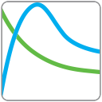
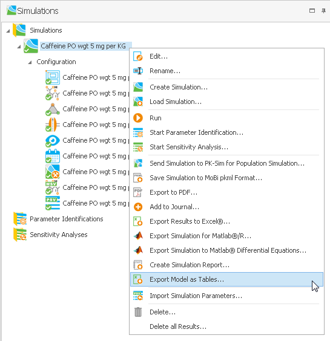

# Simulation Results

Simulation results are stored during a simulation when observers are defined as described in “Observers”. The results are available for display once an existing simulation has been run. The simulation results of a simulation are listed in the simulation explorer tree below the corresponding simulation. To display the simulation results, either double-click on the results or right-click on them and select  **Show Data** in the context menu. The results can then be accessed in a new tab in the main window. The most recent results are also shown in the "Results" tab  which can be accessed in the simulation edit mode.

To display the simulation results in a chart window use the Chart Editor as described in detail in [Shared Tools - Chart Component](../part-5/chart-component.md).


Results of different simulations can be displayed in the same chart. Simply drag\&drop a simulation result node from the Simulation Explorer into an existing chart. The corresponding repository is displayed in the data browser. For better overview you can select the column Repository in the data browser table using the **Column Chooser**. Then you can select data from both result repositories for display.


## Observed Data‌

To compare the simulation results with observed (i.e., experimental) data, e.g., measurements of blood plasma concentrations, the Open Systems Pharmacology Suite comes with a powerful tool for importing observed data which is described in [Import and Edit of Observed Data](../part-5/import-edit-observed-data.md), which is also available in MoBi®.

### Importing Observed Data‌

To import observed data either use the  **Observed Data** button in the "Modeling\&Simulation" ribbon group "Import" or right-click on the **Observed Data** building block in the Building Block Explorer and select  **Import Observed Data from Excel** in the context menu. MoBi® supports the import of MS Excel® worksheets in a defined format which is also described in detail in [Shared Tools: Import and Edit of Observed Data](../part-5/import-edit-observed-data.md).

Once the import has been completed, the imported data are added to the "Observed Data" building block in the Building Block Explorer. The building block that contains the observed data may be renamed by right-clicking  on it and selecting Rename in the context menu.

### Display Observed Data‌

The imported datasets can be displayed either in a new chart or within an existing chart.

To display the data in a new chart right-click on the data and select  **Show Data** in the context menu.

To display the dataset in an existing chart window, simply drag\&drop the dataset into the chart. The observed dataset is then also listed in the data browser of the chart editor.

### Deleting imported Observed Data‌

To delete imported observed data from the project right-click on the data and select  **Remove** in the context menu (or simply press the **Delete** key on your keyboard to delete the selected data). This also removes the data from the chart and the data browser of the chart editor.

## Exporting Simulation Results and Parts of a Simulation Model‌

MoBi® supports the export of simulation results to MS Excel® as xls or xlsx spreadsheets as well as the export of an image of the chart.

### Export Data‌

To export simulation results, right-click on the simulation in the simulation explorer and select  **Export results to Excel** in the context menu.


All existing results of the selected simulation are exported! In case the simulation produces a large number of results (high number of compartments, molecules, or observers), you may reach the limit of MS Excel® file size.


MS Excel® is automatically started and new worksheets, one for each simulation, are created.

### Export an Image of a Chart‌

Charts can be exported by copying an image of the chart to the clipboard:

* Right-click on the chart and select **Copy as Image**
* Press **Ctrl+C** when viewing the chart

Then change to an image processing program and insert the image of the chart using the paste function. MS Windows® standard for this operation is **Ctrl+V**.

### Export Parts of a Simulation Model‌

Specific parts of a model can be exported as editable list into xls format. The export is done per simulation and initiated by context menu in the simulation explorer. Upon initiation of the export, the user has to specify the path for import and either use the suggested file name or else override it. The exported parts comprise reactions, molecules and parameters that will be exported into one sheet each in the export file.

