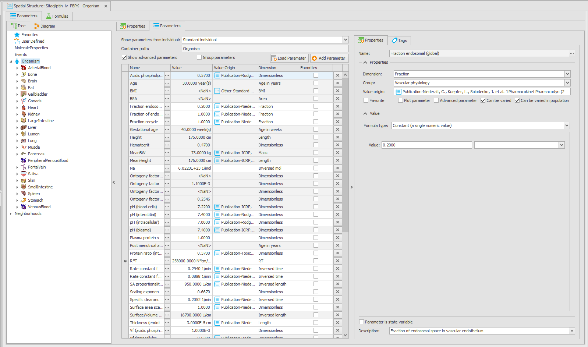
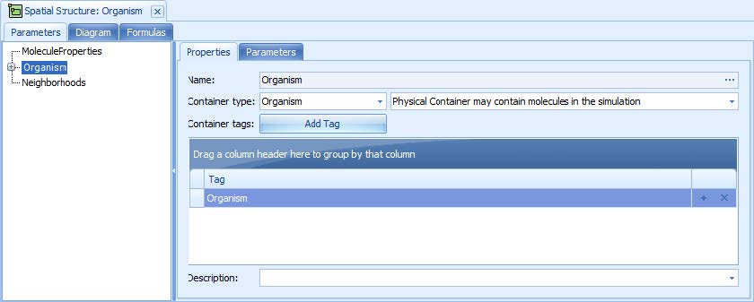
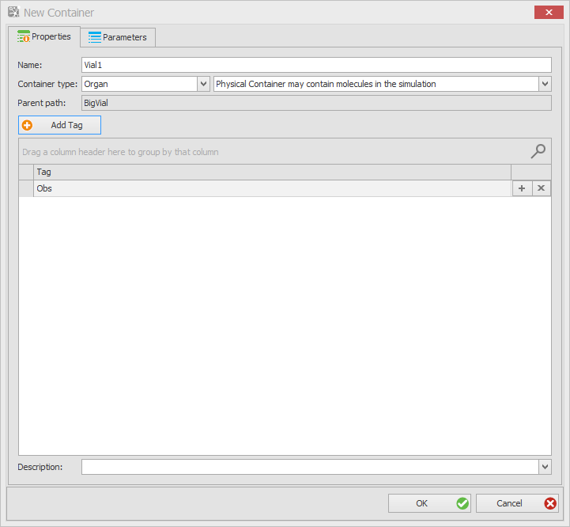
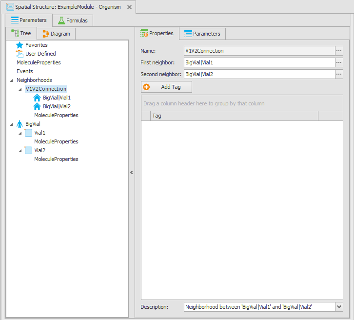
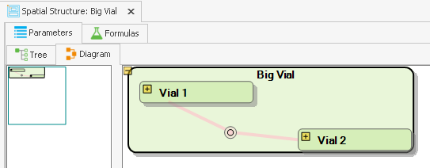

# Spatial Structures Building Block

A Spatial Structure is a hierarchical arrangement of containers (compartments) that can represent an organism consisting of organs, cells, and other substructures. Alternatively, it can be a laboratory setup, like a test tube or a flow chamber with interconnected compartments. Typically, each structure is described by physical parameters, in particular by volume.

Two types of containers are available - **logical** and **physical** containers. Logical containers do not represent a real container with molecules, but serve to group multiple sub-containers. An example is an **organ**, that groups physical containers like blood, interstitial space, and cells. A logical container may also be used to group multiple organs into a system, like the gastrointestinal tract or the whole organism. Logical containers may contain other logical containers or physical containers.

Physical containers represent a real physical space that can contain molecules. Examples are blood, interstitial space, or cells within an organ, or a test tube in a laboratory setup.

Physical containers must be connected by neighborhoods to allow exchange processes like active or passive transports between them. A neighborhood is a logical connection between two physical containers that allows the definition of transport processes between them. Neighborhoods are always bidirectional, meaning that transport processes can be defined in both directions. Neighborhoods may also carry parameters, for example to describe the physical properties like surface area or permeabilities across the barrier between the two connected compartments.

The following section describes the functionalities of the Spatial Structure building block based on a PBPK model exported from PK-Sim. Later on, a simple [example](#example---creating-a-spatial-structure) is given to create a spatial structure from scratch.

The complex structure of a complete organism can be inspected, used, and modified after loading a simulation that was generated in PK-Sim® (see [Load a Simulation](setting-up-simulation.md#load-a-simulation)). Alternatively, a spatial structure can be loaded on its own by using the  **Load Spatial Structure** command in the Building Block Explorer and selecting the pkml file generated in PK-Sim® or MoBi®.

## Spatial Structures - Functionality Overview

After loading a PBPK model from PK-Sim®, the spatial structure representing the whole organism is located in the imported PK-Sim® module. Double-clicking on the spatial structure () or using the **Edit** command of the context menu that appears after right-clicking on it opens an edit window.

The right side of the window shows the structure either in a **Tree** or the **Diagram** view. The tree view shows the hierarchical arrangement of containers and neighborhoods in a tree structure. The diagram view shows the spatial structure in a graphical way. The diagram view is particularly useful for visualizing the physical and logical arrangement of containers and their neighborhoods.

The tab **Formulas** shows all formulas used in the parameters of the spatial structure.

### Parent Path of Top Level Containers

The spatial structures of the models are organized in a hierarchy of containers, where each container can be a child of a parent container. `Container A` can be a child of maximal one parent container `Container B`, and the parent of multiple containers. Each container has a property `Parent path` which specifies the full path to its parent container.

In a module, the user can change the parent container property for the top level containers. When combining modules, the containers (and all their children) of the module will be placed under the container specified in the `Parent path` property. If the parent path of `Container A` is empty OR the container with the specified parent path is not found in the simulation, `Container A` will be created as the top-level container in the simulation.

Be cautious, as changing the parent path of a container will result in different absolute path to the respective container and might break the formulas that use absolute paths for variables definition. You might have to adjust the absolute paths accordingly, by manually appending the parent path to the aliases.

### MoleculeProperties‌

Containers and neighborhoods of a spatial structure can have a child container named `MoleculeProperties`. In this container *molecule-dependent* parameters can be defined. Each parameter will be created **for each floating molecule** when a simulation is created.

`MoleculeProperties` can appear at three locations, with a slightly different meaning each:

- **In a container.** The parameters are created for every molecule present in that container, below the molecule node: `<ContainerPath>|<MOLECULE>|<parameter name>`. In a PBPK model imported from PK-Sim®, `Organism|Kidney|Intracellular|MoleculeProperties` holds, among others, the parameter `Partition coefficient (water/container)`, which for the molecule "Midazolam" becomes `Organism|Kidney|Intracellular|Midazolam|Partition coefficient (water/container)`. Every molecule gets its own instance and can have its own value.
- **In a neighborhood.** The parameters are created for every non-stationary molecule present in both neighbors, below `Neighborhoods|<neighborhood name>|<MOLECULE>|<parameter name>`. This is where molecule-specific transport properties such as `P (interstitial->intracellular)` or `Partition coefficient (intracellular/plasma)` are located, while properties of the barrier itself that do not depend on the molecule (e.g., `Surface area (plasma/interstitial)`) are parameters of the neighborhood.
- **At the top level of the spatial structure**, next to the `Neighborhoods` node. These parameters do *not* depend on the location: they are created once per molecule directly below the molecule node in the root of the simulation, i.e., `<MOLECULE>|<parameter name>`. PK-Sim® uses this node for compound properties that are calculated from the individual, e.g., `Fraction unbound (plasma)` or `Blood/Plasma concentration ratio`.


As a `MoleculeProperties` parameter is created for many molecules, its formula must be generic. Use the [`MOLECULE` keyword](parameters-formulas-tags.md#keywords) in the paths of the referenced objects - it is replaced by the concrete molecule name in each created instance.


A `MoleculeProperties` parameter and a *local* molecule parameter defined in the [Molecules building block](molecules-bb.md#molecule-parameters) end up at the same location in the simulation. The difference is the direction in which they are generic: a local molecule parameter is created for *one molecule in all containers* in which it is present, a `MoleculeProperties` parameter is created for *all molecules in one container*. Select the one that matches what the parameter describes.

Parameters located in `MoleculeProperties` are also the place where the distribution models of PK-Sim® are plugged in: a parameter with the **Formula Type: Calculation Method** is filled by the calculation method selected for the molecule in the [Molecules building block](molecules-bb.md#molecule-properties).


Not every parameter is created for every molecule. In a container, only `Ontogeny factor`, `t1/2`, and `Degradation coefficient` are created for endogenous stationary molecules (e.g., enzymes and transporters), whereas all other `MoleculeProperties` parameters are created for xenobiotic floating molecules (e.g., drugs).
TODO https://github.com/Open-Systems-Pharmacology/MoBi/issues/2437


When combining modules, `MoleculeProperties` are always **extended**, in both the "Extend" and the "Overwrite" merge behavior (see [Modularization concept](modularization-concept.md#spatial-structure)).

### Neighborhoods‌

New neighborhoods can be created by dragging a line from one physical container to another in the **Diagram** view, or by right-clicking on the **Neighborhoods** node in the tree view and selecting **Create Neighborhood** from the context menu. The user must specify the neighbor containers and a name for the neighborhood.

If a neighborhood is defined with a neighbor that is not present in the final model structure, the neighborhood is ignored.

 When renaming a container, the software suggests changing the neighbor of all neighborhoods associated with the container to the new name.

### Exporting containers as pkml files

As described in ["Modularization concept"](modularization-concept.md), individual-specific parameters in PK-Sim modules are not stored directly in the spatial structure but in the Individual BB. When saving a container from a PK-Sim module to pkml, the user must select an Individual and, if applicable, the proteins for which the expression in this container should be allocated. This ensures that the exported container can be used without an individual.

When loading a container from *.pkml, the exported Expression Profiles are added as PV and IC.

Exporting a container to PKML also exports all of its sub-containers and all neighborhoods that have this container or its sub-containers as a neighbor.

## Example - Creating a Spatial Structure


In the process of this and the next sections of this chapter, you will create an example project. An already completed project file named "ManualModel\_Sim.mbp3" is automatically installed together with MoBi® in the default program data directory. The entry "Examples" in the program start menu in the "MoBi" group will lead you to the proper path.


Start by creating a new project by executing the **New Project** command in the File menu or by clicking the corresponding icon  in the Quick Access Toolbar. Create a new module by selecting the **Module** button in the **Create** group of the **Modeling** tab in the ribbon. Name the new module "ExampleModule" and select a "Spatial Structure" building block to be created within the new module. Click **OK** to create the new module.

The screen should now look as shown in the following figure:

In this example, you will construct a simple spatial structure which consists of a top level logical container having two interconnected physical containers. A common tag will be added to both physical containers which will be used later for restricting some computations (e.g., observers) to be only done for the two sub-containers. Tags are also used for restricting events or selecting source and target for transport processes. Check the corresponding sections for their use.

### Creating Containers and Parameters

1. Create a **top level container** by selecting **New** in the **Add** group of the **Edit Spatial Structure** tab in the ribbon, or by right-clicking on the free area of the tree view and selecting  **Create Top Container** from the context menu. Enter "BigVial" as the name. Make sure that the type of the container is set to **Logical** and **OK**.

2. Now create two sub-containers. Right-click on the `BigVial` container and select  **Create Container** from the context menu. A new window named "New Container" opens. Enter "Vial1" as name, and leave the Container Type on Organ. Select Physical Container in the right combobox below the name input box.
3. Click the **Add Tag** button below the Container Type. You are asked for a tag name. Enter "Obs" as a tag name. Click **OK**.

4. Repeat steps 2 and 3 to create a second sub-container named "Vial2" with the same tag "Obs". Make sure to create the second sub-container as a child of "BigVial" by right-clicking on "BigVial" and not on "Vial1"!

Any container or sub-container may have parameters associated with it. They can describe physical or biological properties of the container that are required for processes like transports or reactions. What is needed in our model is the volume parameter which is used to calculate concentrations required for kinetic equations or for plotting concentrations after a simulation has been performed.

To create the required parameters:

1. Expand the `BigVial` container and select the `Vial1` entry (we will refer to this container by the path `BigVial|Vial1`)
2. Click the "Parameters" tab.
3. Click the button  **Add Parameter**, upon which a window named "New Parameter" opens.
4. Enter **Volume** into the Name input box, select **Volume** in the Dimension input box, then enter "0.1" into the Value input box. The Formula Type remains "Constant".
5. Finally, click **OK**, and the new parameter "Volume" will appear in the parameter list.
6. Repeat this procedure for the container `BigVial|Vial2` and set the value of the volume to 0.2 liters.

### Creating Neighborhoods

Within a spatial structure, transport processes may occur (see [Active transports](molecules-bb.md#active-transports) or [Passive Transports](passive-transports-bb.md)) only between physical containers that are connected by a neighborhood.

To create a neighborhood between the two containers `BigVial|Vial1` and `BigVial|Vial2`, proceed as follows:

1. Right-click on the **Neighborhoods** node in the tree view and select **Create Neighborhood** from the context menu. Alternatively, you can also use the **Neighborhood** button in the **Add** group of the **Edit Spatial Structure** tab in the ribbon.
2. Enter "V1V2Connection" as the name of the new neighborhood. Select `BigVial|Vial1` as the first neighbor and `BigVial|Vial2` as the second neighbor from the corresponding tree views. Click **OK** to create the neighborhood.


It is possible to type in the paths to the containers instead of selecting them from the tree view. This is especially useful when the final structure with the full paths to the neighbors is a result of combining multiple modules. In this case, the containers may not yet be present in the the modules, but they will be available in the final model.


The created spatial structure should now look like this:

By switching to the diagram view, you can see the graphical representation of the spatial structure.

Like the containers, the neighborhood may contain parameters and may carry tags. If you look at simulations imported from PK-Sim®, you will see examples for such parameters. The spatial structure of such a PBPK model is much more complex, but editing it works in the same way as described for our simple example.

We will continue building our example model in the next sections by adding molecules and processes to it.