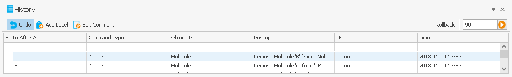
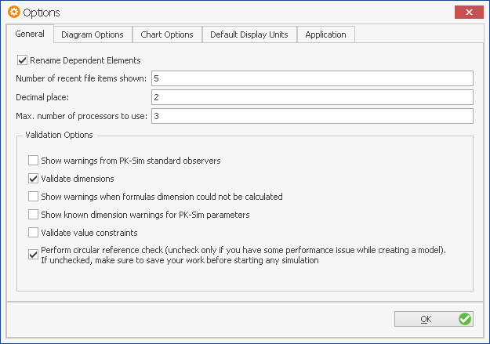

# MoBi®‌ Tools

## Search Function‌

MoBi® contains a powerful search function to find parameters, molecules, reactions, or other elements in a project or simulation. This function is useful to locate parameters or elements of building blocks or simulations (e.g., molecules, parameters, container) within the current project.

To perform a search, make sure that the search window at the right side of the MoBi®window is expanded; like the Chart Editor or History window, the Search window can be collapsed by clicking **auto hide**  (see [MoBi® - Window Overview](first-steps.md#mobi---window-overview)) and made again visible by clicking the **Search** bar. If in collapsible mode, the search window can be switched to the permanently visible mode by clicking **dock** .

A search text can then be entered into the **Search** input box. This may be the name of an element of a building block or simulation or a part of a description.

The scope of the search can be selected in the **Scope** combobox:

- Selecting Project will search through the entire project, meaning all contained building blocks and simulations.

- Selecting Local will search only within the currently edited building block.

- Selecting AllOfSameType will search within the currently edited building block and all other building blocks of the same type. If, for example, you are currently editing a Molecules building block and have several of them in your project, the search will show results from _all_ molecules building blocks.

Several search options can be selected by checkboxes:

- Checking **Match whole word** will only return results where the whole word is matching what is entered in the **Search** input box.

- Checking **Use regular expression** will treat the text in the **Search** input box as a Regular Expression in the search. See other references (e.g., http://en.wikipedia.org/wiki/Regular_expression) for the explanation of a Regular Expression if you are not familiar with them.

- Checking **Match Case** will only return results where the upper and lower case of the characters entered into the **Search** input box matches. This checkbox cannot be used in combination with **Use regular expression** and will thus become inactivated once you select the previous checkbox.

To start the search, click on the magnifier glass icon at the right side of the **Search** input box. The results will then be displayed in the Search Results table; if nothing is found, this list will remain empty. Initially, only the building block names with search hits are listed in the results window, but you can expand the lists by clicking the symbol in front of the name.


Double-clicking a listed item will show it in the edit window where you can view it in detail or enter changes.


## Parameter Identification‌

To perform a parameter identification, proceed analogously to the Population Simulation described above. Select **Start Parameter Identification** in the context menu of a simulation and specify a directory.

The Parameter Identification Toolbox is started then.

## Project History‌

The history manager allows you to document all steps that lead to a specific project status and particular results in MoBi®. With this manager you will be able to easily step back to previous states of your project work in the current session (i.e. a session endures from start of MoBi® to closing the program). The different lines in the manager represent different steps in modeling in the current project.

Here we only give a brief description; for more details see [History Manager and History Reporting‌](../part-5/history-manager-history-reporting‌.md).


If you want to test different possible directions in modeling of a specific problem, you can use this functionality to step back to the "decision point" (within the current session).


You will be able to reproduce every step that you have made during the project. In the window you will see the number of steps in the column **State After Action**. You can add labels in the history to mark important steps in your project modeling history and comment them by using the **Add Label...** button in the bottom. You can also change these comments by selecting a status in history and click on **Edit Comments...**. The **Rollback...** allows the user to step back to any numbered status in the current session.

## MoBi® Options‌

The program options window can be opened by clicking the  **Options** in the **Utilities** ribbon tab. This opens the options window. MoBi® here allows the user to define some basic settings, e.g., concerning the number of recently opened projects or settings for the diagrams or (de-)activating the dimensions validation in the **General** tab.

The tabs **Diagram Options**, **Diagram Auto Layout**, and **Chart Options** enable the control of the diagrams and charts. Most of these options are either self-explanatory (like colors or sizes of diagram elements), are explained in MoBi® _\- Diagrams overview_, or may be used to empirically optimize the outcome of the auto layout function.


Since no rollback or cancel of the user settings is possible, keep track of whatever changes you have done in the user settings.

