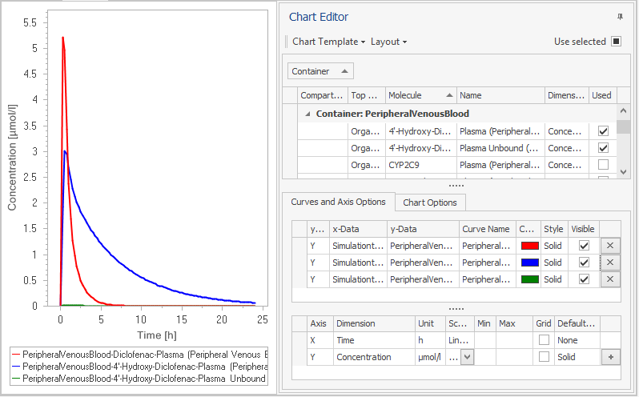

# Shared Tools - Chart Component

## Chart Display and Chart Editor‌

The chart component is used in PK-Sim® as well as in MoBi® . It consists of two views, the chart display and the chart editor. The chart display displays a chart, the chart editor is used to create and edit charts.

By default, the chart editor is auto hidden; when you hover over the vertical chart editor button on the right, the chart editor opens and you can edit the chart settings. To dock the chart editor click the auto hide button . The button icon then changes to , and the chart editor is docked. Afterwards, you are able to move the chart editor to other edges as well. To auto hide the chart editor, click the auto hide button  again.

The chart editor consists of several subviews that depend on the number of tabs specified in the chart layout and that comprise:

*   the data browser table for browsing and selecting data to be displayed in a chart,

*   the curves table and the axis table in the tab **Curves and Axis Options** for editing curve and axis properties,

*   the tab **Chart Options** for editing chart properties like title, legend position or back color.

*   the tab **Chart Export Options** for editing chart and font sizes used when exporting a chart.


The most frequently edited chart elements, axes and curves, can be edited directly from the chart display without using the chart editor. Just double click the axis or curve you want to edit or right click and select **Edit** from context menu.


## General Chart Basics‌

For a better understanding of the workflows and features of the chart component, we briefly introduce some chart basics. Charts are used to visualize data. In the Open Systems Pharmacology Suite, data consists of time series from simulation and measurements. Charts consist of axes and curves. Typically, the x-axis has the dimension time and the y-axis to dimension concentration.

Curves are based on time series, mostly one curve corresponds to a single time series, in this case the x-values represent the time axis and the y-values are the corresponding functional values of the time series. However, curves can also correspond to two time series with the same time scale, in this case the x-values are the values of the first time series and the y-values are the values of the second time series. Thus, for example, concentrations can be plotted against other concentrations.

Creating a chart consists of selecting the data and editing the curve / axis / chart settings. The chart settings and chart export settings can be reused to create uniform charts for a sequence of simulation projects.

In the next sections, we describe the basic workflow and the subviews in detail.

## Creating a Chart‌

Creating a chart consists of two steps:

1.  Select the data for the curves in the data browser.
    
2.  Edit the chart settings
    
    *   Edit curve options,
        
    *   Edit axis options,
        
    *   Edit chart options.
        
We describe these steps in the following subsections.

## Selecting Data‌

The data browser contains one row for each available time series. Depending on the complexity of your model, there can be thousands of rows. (For convenience, trivial time series with the constant value 0 are automatically excluded.)

Properties of the time series are displayed in the columns of the data browser, e.g., Organ/Container, Compartment, Molecule, Name, Dimension, Used.

To organize these data there are three concepts, which we describe here only briefly.

*   Grouping \- you can group by a column by dragging it from the column headers to the so called grouping area and vice versa.

*   Sorting \- you can sort by a column by just clicking on the column header.

*   Filtering \- you can filter a column by moving the mouse to the right side of the column header and clicking on the filter symbol, which appears.

Right-click on the column header to get a context menu with more options.

In the figure below, data are grouped hierarchically by organ and compartment, they are sorted by molecule and filtered by the condition **Dimension = 'Concentration'**.

To select data:

1.  organize your data according to your needs,

2.  do one of the following:

*   Check the checkbox  of a row in the used column,
    
*   Drag a row from the data browser to the curves table,
    
*   Select multiple rows by holding the CTRL or the SHIFT key when clicking them and drag them together to the curves table or check the checkbox **Use selected** in the right upper corner of the Chart Editor.
    
3.  Repeat step 2 until your data selection is complete.


The creation of charts with alternative x-values, e.g., other concentrations, is explained in “Using Alternative X-Values”.


After selection, the corresponding curves are automatically shown and listed in the curves table.

To deselect data, do one of the following:

*   Uncheck the checkbox  of the row in the used column of the data browser,

*   Click the **Delete** button  on the right side of the curve row in the curves table.

*   Click the row header on the left side of the row to select the curve row and press **Delete**.


When having a Parameter Identification or Simulation chart open the data are initially grouped according to their category and the checkbox **Link Data to Simulations** will be present. By selecting this checkbox the observed data to the simulation outputs they are mapped to. When the checkbox is selected (un)selecting a simulation output will result in the corresponding observed data getting (un)selected 

## Editing Curve Options‌

The properties of the curves can be edited in the curves table. Each curve is displayed in one row, and the properties of the curves are displayed in different columns.

The most important columns are:

|   |   |
|--- |--- |
|y-Axis | The first curve is assigned to the first y-axis Y and the dimension of the axis Y is set from the corresponding time series. The next curves are assigned to the same y-axis as long as their time series have a compatible dimension.  For the first curve based on a time series with a different dimension, a second y-axis Y2 is created with that dimension and the curve is assigned to that y-axis.  If there are curves based on time series with further dimensions, they cannot be displayed, because they do not match one of the two possible y-axis dimensions. Then this row is marked with an error symbol and you have to adjust the axes dimensions and the y-axis property of the curve manually.|
| Curve Name | The curve name is created automatically when inserting a new curve. For simulation data it consists by default of organ, compartment, molecule and name of the time series. You can overwrite this name manually.  You can select additional discriminating curve properties for curve name generation at chart options of user settings: simulation name, top container/organism name, dimension name.|
| Color | Colors are automatically selected for the first 16 curves; however, you can adjust them by clicking on the color editor in the cell. See also paragraph below for coloring curves with the same color. |
| Style | You can select between the following styles: Solid, Dash, Dot, DashDot and None (for measured data points). |
| Symbol | You can select from the following symbols: None (default for simulation data), Circle, Diamond, Triangle, and Square. |
| Thickness | You can select line thicknesses as 1, 2, and 3. (Hidden by default) |
|Visible | To hide a curve from the chart, uncheck this checkbox. |
|In Legend | To hide an entry in the legend for a curve, uncheck this checkbox. For different observed data curves, you can use for example only one legend entry. |

If a row header or cell content cannot be fully displayed, the full content is shown in a tooltip when you hover with the mouse over that field, as shown below:

### Coloring curves with the same color‌

Often you may want to use the same color for different curves, e.g. for curves of the same molecule or organ or for observed data.

You can easily copy the color from one curve to another by just dragging the color symbol from one curve to the color field of another curve. During the dragging process, a **\+** symbol is shown.

If you want to color different curves - for instance of observed data - with the same color, you can also use the **Default Color** of the y-Axis.

1.  In the axes table, select the column **Default Color** in the column chooser (right click on column header).
    
2.  Change the **Default Color** for the corresponding y-Axis to the intended color.
    
3.  Select the curves from the data browser.
    
4.  Reset the **Default Color** for the y-Axis to White which deactivates default color.

### Creating clear legends‌

To make you legends clear and readable - especially when exporting them - you can do the following

*   Edit the curve name.

Curve names are automatically composed (in MoBi you can control the curve name composition via some settings in the Chart Options). Mostly, not all information contained by default is relevant in a certain situation and therefore the names should manually be reduced or renamed to contain the relevant information.

(If, after renaming you, are in doubt about the data of your curve you can always identify it by selecting the column y-Data from the column chooser of the curves table.)

*   Hide needless legend entries in particular for multiple observed data sets.

If you do not intend to refer to single individuals, uncheck the checkbox **In Legend** for all but one observed data set.

*   Reorder your legend entries to show the most important entries on top.

You can reorder them directly in the legend by dragging the line symbol to another symbol which moves the legend entry of the dragged curve just above the entry where it is dropped.

You can reorder them also by dragging the row headers (the small gray area on the left of a row) in the curves table.

## Editing Axis Options‌

You can edit properties of axes in the axes table. There is always one unique x- axis and one y-axis. You can add up to 2 additional y-axes by clicking the button on the right end of the y-axis row. Each axis is displayed in one row, and the properties of the axes are displayed in different columns.

You can select columns which are hidden by default using the **Column Chooser** and right click on the column header. The most important columns are:

| | |
|--- |--- |
| Axis | Type of the axis. |
| Dimension | The dimension of an axis is automatically determined by the selected data, see “Editing Curve Options” for details. You can change the dimension here manually in more complex situations. |
| Caption | This field is empty by default. Then dimension and unit are displayed as axis caption in the chart. You can enter an alternative caption here, which is displayed instead of the dimension name. (Hidden by default) |
| Unit | You can select a unit for the dimension of the axis from a list. |
| Scaling | You can switch between Linear and Log scaling. In case of Log scaling, values less than or equal to 0 are not displayed. By default, the scaling for y axes is **Log**, but in MoBi® you can change this in the Chart Options. |
| Numbers | You can select the numbers representation from Normal, Scientific and Relative. If you select Relative for a y- axis, each curve is displayed relative to its own maximum value, which then corresponds to 100% . (Hidden by default) |
| Min, Max | Empty for automatic range to show all values. You can override the values to restrict the displayed range. To return to automatic range, delete Min or Max value. |
| Default | Curves added to a y-axis get this linestyle by default. This way, Linestyle in the chart, curves can be easily correlated with their y-axes. You can change the default linestyles here, which are by default solid for y, dashed for y2 and dotted for y3. |
| Default Color | If a color different from White is selected, curves added to a y-axis get this color by default. (Hidden by default) |
| Grid | You can check this to display grid lines at the major ticks of the axis. |


The Min and Max values are overridden by zooming the chart.


## Editing Chart Options‌

You can edit the properties of the chart in the chart options tab.

| | |
|--- |--- |
| Name | Name of the chart, which is used as tab header. |
| Title | Title is displayed above the chart. |
| Description | A description is displayed below the chart. To insert line breaks press the **Enter** key. |
| Legend Position | You can select whether the legend is displayed at the right or at the bottom of the chart, inside or outside of the diagram area. |
| Chart Color | The color of the chart. |
| Diagram Background | The color of the diagram background. You can change these colors in the Chart Options. |
| Side Margins Enabled | You can check to leave about 5% margins at each side of the chart or uncheck to fit the diagram area exactly to the Min and Max values of the curves. |

## Editing Chart Export Options‌

You can export charts to the Working Journal or other applications by copy & paste. To copy the chart, just right click into the chart area and select Copy to clipboard.

You can define the size of the exported chart in the **Chart Export Options**. Then, the exported chart is independent of the current size of the application window. You can also define the font sizes of the exported chart to get readable legend entries in your slides for example.

In the **Chart Export Options** tab, you can select **Preview these settings in Chart Display** to preview any changes you have made in the settings of the **Chart Export Options**. You can select **Include origin data** and show the title of the PK-Sim® or MoBi®file, the name of simulation and the date of creation beneath the Chart®, as illustrated in the image below. This can be useful for example, if you want to refer to the simulation state used in a chart in a presentation.

You can edit the following properties of the exported chart in the tab **Chart Export Options**.

| | |
|--- |--- | 
| Width \[px\] | The width of the chart in pixel units. |
| Height \[px\] | The height of the chart in pixel units. |
| Font | Here you can select the text font. The standard font is Microsoft Sans Serif. |
| Font size axis | You can adjust the font size of the axis via a drop down menu. |
| Font size legend | You can adjust the font size of the legend via a drop down menu. |
| Font size title | You can adjust the font size of the chart title in case you have defined one in **Chart Options**. |
| Font size description | You can adjust the font size of the description of the chart in case you have defined one in **Chart Options**. |
| Font size origin | You can adjust the font size of the origin data in case you have selected the **Include origin data** option. |

## Zooming the Chart‌

To zoom into the chart, do one of the following:

*   Hover the mouse over the chart. A zoom symbol appears. Press the left mouse button and drag the mouse to select a rectangle. Release the mouse button to zoom into the selected rectangle.

	

*   Explicitly define the range to be displayed in the Min and Max columns in the Axis Options.

*   Use the mouse wheel while the mouse pointer is located in the chart area.

To reset the zoom right click on the chart area and select **Reset Zoom (Ctrl+0)** or use the shortcut **Ctrl+0** (Do not use the 0-key from the numeric block, but from the typewriter keys.).

## Further Actions‌

### Saving and managing chart settings‌
    
You can save the chart settings (Chart Options and Chart Export Options, Curve and Axes Options) in different Chart Templates and reuse them in a simulation. This is useful for example, if you want to switch between different settings. You can also save and load these Chart Templates to files and reuse them in other simulations.
    
Moreover:

*   in PK-Sim®, the Chart Templates are reusable in any clone of a simulation,

*   in MoBi®, the Chart Templates and Curves Selection are part of the Building Block Simulation Settings and can be reused like any other Building Blocks.

The chart manager can be accessed directly from the chart editor after running a simulation. The following options are available:

*   Apply Template: choose from a list of saved templates,

*   Create New: create a new template based on current settings for data, curves, axis and chart options,

*   Update Existing: changes the settings for the template to the current settings for data, curves, axis and chart options,

*   Manage Templates: brings you directly to the chart template manager that displays an overview of all settings in a template which can all be edited.

In the chart manager, templates can be managed in the left hand side window and settings for an individual template can be edited in the two right hand side windows.

The following options are available for managing templates:

*   Clone: useful when changing specific settings based on an existing template.

*   Save template to file: allows you to reuse this template in another simulation settings building block, simulation or project.

*   Delete template

In addition, a template can be loaded as .xml file using the  button.

In the right panel, the user can specify which curve will be selected as output and how it will be displayed.

An automated algorithm is implemented that decides which curves are selected when a certain template is chosen. Decision criteria are based on the output path (Y-Path) and the output type (Y-Type). The following decision scenarios are feasible:

*   If a selected output matches both, Y-Path and Y-Type, it will be selected and the curve name will be used as is.

*   A selected output matches the Y-type, but not the Y-Path of a template. The Y- Path of the output is for example **Organism|Venous|Blood|Plasma|Diclofenac**. The algorithm will then try to find all output located in the container **Organism| Venous|Blood|Plasma**. If only one output is found, the curve name will be used as is. If two or more outputs are found, the curve name will be ignored and a new unique name will be generated based on the actual path of the output. Sometimes, this heuristic approach might result in many selected curves at once. If more than ten curves will be selected, the user will be asked whether be wants to proceed or choose a different template for display of the selected output curves.


All changes to a template or selection of output are made at the level of an individual simulation. The simulation settings for the project remain unchanged, until the user explicitly updates the changes to the project simulation settings building block using the context menu as shown below.


### Selecting Editor Layouts‌

You can select one of the following predefined editor layouts:

| | |
|--- |--- |
| Standard View | The chart editor is auto hidden. The data browser is displayed in the upper area of the editor, the curves and axis options are displayed in the lower area. The chart options are displayed on a different tab since they are used less often.|
| Tabbed View | The chart editor is auto hidden. Data browser, curves options, axis options, chart options are displayed on four different tabs. Use this view, when you need maximal space for data browser or curve options display. |
| Two Tabs View | The chart editor is auto hidden. The data browser and curves options are displayed on the first tab, axis options and chart options are displayed on the second tab. Use this view, if the automatic axis settings fulfill your needs. |
| Variable X-Axis View | This layout is similar to standard view, but display all columns necessary for selection of an alternative x-axis (see [Using Alternative X-Values](#using-alternative-x-values)). The chart editor is docked. Use this view, if you want to use an alternative x-Axis. (Available in MoBi® only.) |


Save your preferred Editor Layout to your user settings. Just select Save to User Settings from the Layout menu at the top of the Chart Editor.

In this layout are stored the selected view and column settings in the subviews like visibility, order, column width and grouping.


### Using Alternative X-Values‌

As mentioned in the introduction of this section, typically one curve corresponds to a single time series in which the x-values represent the time axis and the y- values are the corresponding functional values, such as concentration.

However, curves can also correspond to two time series with the same time scale. In this case, the x-values are the values of the first time series and the y-values are the values of the second time series. Thus, concentrations can be plotted against another concentration or a fraction of the dose, for example.

To select other x-values than the default ones, do the following (you can skip steps 1 and 2 when using the editor layout Variable x-Axis View):

1.  Show the x-Data column in the curves table. In detail:
    
    1.  Right-click on the columns header row of the curves table.
        
    2.  Select **Column Chooser**.
        
    3.  Drag the x-Data (and y-Data, if you like) to a position between two other column headers in the header row.
        
    4.  Close the **Column Chooser**.
        
2.  Show the dimension column in the axis table (like in step 1) and in the data browser.
    
3.  Drag the time series with same the time scale and the intended values from the data browser to the x-Data field of the desired curve in the curves table.
    
    An error symbol appears at the x-Data field, because now the x-Data and the x-axis have different dimensions, which cannot be resolved automatically.

    
    
4.  Change the Dimension of the x-axis in the Axis Table to the dimension of the x-values manually.
    
5.  Change curve or x-axis caption according to your needs. Now the concentration is plotted against the selected x-values.
    

### Chart Options in User Settings‌‌

In MoBi®, you can change the default editor layout and the default curve name generation in the **Chart Options** tab within the **User Settings** dialog (click  **Options** in the Utilities ribbon tab).

All options here are stored in the user settings and apply for newly opened charts and curves.

