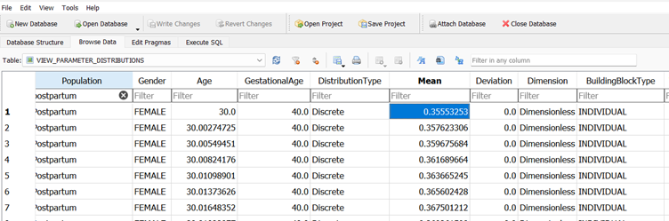

# Extraction of physiological parameters from a PKSim Db population

## Use case description

[TO BE COMPLETED]

In this use case we describe how to **access** and **extract** the **physiological parameters** from the postpartum population in the **PKSim Database (Db)** and how to use that output to **create growth tables** in **Mobi in order to describe** time-varying physiological parameters.

## Process

### Download Database and explore content

The latest version of the PKSim Db can always be downloaded via this link: [PKSim Db](https://github.com/Open-Systems-Pharmacology/PK-Sim/raw/develop/src/Db/PKSimDB.sqlite).

For reproducibility of the use case described here below, the following version may be used: [PKsimDB_v11.sqlite](https://github.com/open-systems-pharmacology/pk-sim/blob/6dc119cfa8884fe14f5c7c98d54c47970bb1e219/src/db/pksimdb.SQLite)

For a graphical interface and data visualization, applications such as [Db Browser for SQLite](https://sqlitebrowser.org/) are available.



### Access and extract population data to spreadsheet

``` r
library()
```

### Extract time-varying parameters

``` r
library(magrittr)
library(RSQLite)
library(DBI)
library(openxlsx)

conn <- dbConnect(RSQLite::SQLite(), "PKSimDB_v11.sqlite")

# Execute a SQL query
query <- "SELECT * FROM VIEW_PARAMETER_DISTRIBUTIONS"
result <- dbGetQuery(conn, query)


# Filtering population with 'Postpartum' and selecting 'ContainerName', 'ParameterName', 'Age', and 'Mean' columns

result_filtered <- result %>% 
  dplyr::select(Population, ContainerName, ParameterName, Age, Mean) 

result_postpartum <- result %>% 
  dplyr::select(Population, ContainerName, ParameterName, Age, Mean) %>%
  dplyr::filter(Population %in% "Postpartum")

# Write data in workbook
wb <- createWorkbook()
addWorksheet(wb, "Postpartum")

writeData(wb, sheet = "Postpartum", 
          result_filtered %>%
            dplyr::filter(Population %in% "Postpartum"))

saveWorkbook(wb, "data/param_distributions.xlsx", overwrite = TRUE)
```

### Import in Mobi as Table & create time-varying parameters

1.  Create Age parameter

    1.  Constant (single numeric value) Age, dimension 'Age in years', Value àstart value (e.g. 30yo)

    2.  Postpartum Age

        1.  Dimension is Time (default unit is minute)

        2.  = Age \*year2min + TIME

        3.  

2.  Open organ compartment that will contain parameter (e.g. Breats)

3.  Create a Table parameter (E.g. Volume_breast_Table)

    -   chose the formula type "Table (multiple time discrete and piecewise constant numerical values)

    -   Define a formula name (e.g. TABLE_volume_Breast_parameter)

    -   Chose column 'Age' and column 'Mean')

    -   Enter unit (by default values are in the base unit in the Db see file [OSPSuite.Dimensions.xml](https://esqlabs.sharepoint.com/:u:/s/S-BASF-P23-195A/EZSeZvDmQFRLvKNCJRqyxyUBkv8jR2po28wDa-caVE1LMg?e=BagOhT)

4.  Create Volume Table Formula with X-Argument (e.g. Param Volume_breast_PP)

    -   Defined formula and chose path to previously created table parameter (Volume_breast_Table )

    -   X-argument point to 'Postpartum_age'
