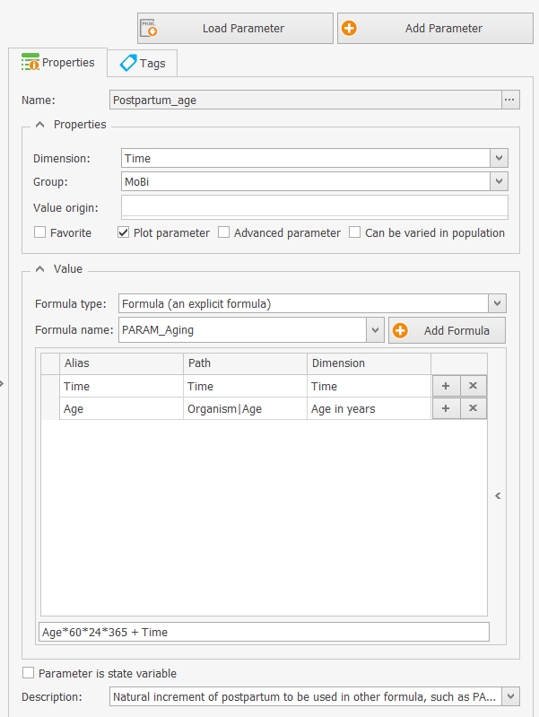
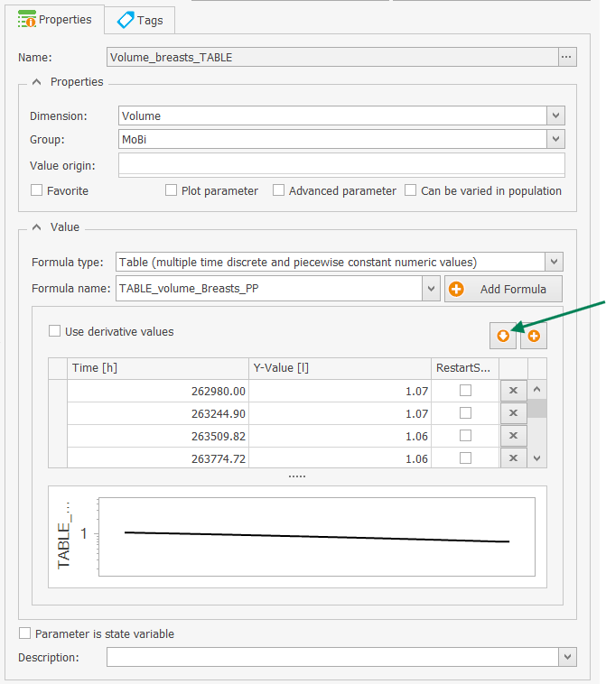
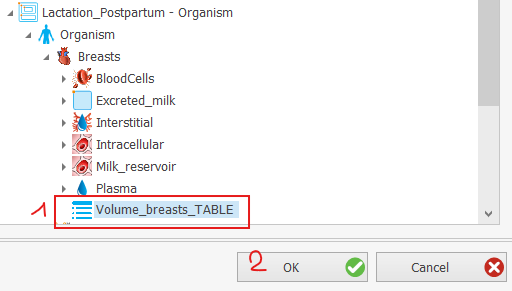
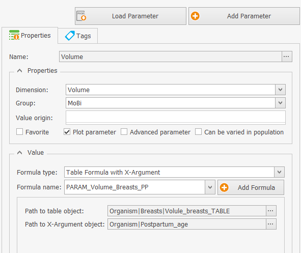
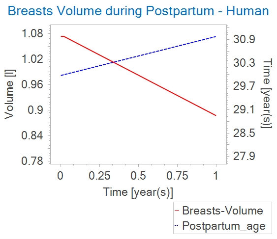

# Extraction of physiological parameters from a PKSim Db population

## Use case description

In this use case, we describe how to **access** and **extract** the **physiological parameters** from the postpartum population in the **PKSim Database (Db)** and how to use that output to **create growth tables** in **Mobi to describe** time-varying physiological parameters.

## Process

### Download Database and explore content

The latest version of the PKSim Db can always be downloaded via this link: [PKSim Db](https://github.com/Open-Systems-Pharmacology/PK-Sim/raw/develop/src/Db/PKSimDB.sqlite).

For reproducibility of the use case described here below, the following version may be used: [PKsimDB_v11.sqlite](https://github.com/open-systems-pharmacology/pk-sim/blob/6dc119cfa8884fe14f5c7c98d54c47970bb1e219/src/db/pksimdb.SQLite)

For a graphical interface and data visualization, applications such as [Db Browser for SQLite](https://sqlitebrowser.org/) are available.


### Access and extract population data to a spreadsheet

``` r
library(magrittr)
library(RSQLite)
library(DBI)
library(openxlsx)

conn <- dbConnect(RSQLite::SQLite(), "PKSimDB_v11.sqlite")

# Execute a SQL query
query <- "SELECT * FROM VIEW_PARAMETER_DISTRIBUTIONS"
result <- dbGetQuery(conn, query)


# Filtering population with 'Postpartum' and selecting 'ContainerName', 'ParameterName', 'Age', and 'Mean' columns

result_filtered <- result %>% 
  dplyr::select(Population, ContainerName, ParameterName, Age, Mean) 

result_postpartum <- result %>% 
  dplyr::select(Population, ContainerName, ParameterName, Age, Mean) %>%
  dplyr::filter(Population %in% "Postpartum")

# Write data in workbook
wb <- createWorkbook()
addWorksheet(wb, "Postpartum")

writeData(wb, sheet = "Postpartum", 
          result_filtered %>%
            dplyr::filter(Population %in% "Postpartum"))

saveWorkbook(wb, "data/param_distributions.xlsx", overwrite = TRUE)
```

### Extract time-varying parameters of interest programmatically

A parameter is classified as 'time-varying' within the database if its value changes corresponding to different entries in the 'Age' column.

In the context of this exemplary case study (focused in the postpartum population), a parameter is classified as 'time-varying' when the following condition is met:

-   There is more than one record of the parameter in the database for the attribute 'Age' in the interval [30,31]

This type of condition can vary according to the case study, and the code should be adapted accordingly.

``` r
library(dplyr, quietly = TRUE)
library(openxlsx)

# Load distributed parameters from extracted Db file
file.path <- "data/param_distributions_postpartum.csv"
db <- readWorkbook(file.path)
df <- tibble::as_tibble(db)

# Transform parameter names to fit OSPS parameter paths
df <- df %>% mutate(concatenated_path = paste(ContainerName, ParameterName, sep = "|"))

# Find distributed parameters
distributed_parameters <- df %>%
  dplyr::filter(Age >= 30, Age <= 31) %>%
  dplyr::group_by(concatenated_path) %>%
  dplyr::filter(n() > 1) %>%
  dplyr::pull(concatenated_path) %>%
  unique()

# Isolate distributed parameters & save to worksheet
distributed_parameters_df <- df %>%
  dplyr::filter(concatenated_path  %in% distributed_parameters) %>%
  dplyr::select(Age, concatenated_path, Mean)
  
# Write data in workbook
wb <- createWorkbook()
addWorksheet(wb, "Postpartum_distributedParam")

writeData(wb, sheet = "Postpartum_distributedParam", 
          distributed_parameters_df)

saveWorkbook(wb, "data/Postpartum_distributed_parameters.xlsx", overwrite = TRUE) 
```

The user interface of the database viewer tool (e.g. Db Browser for SQLite) may also be used to extract the parameters of interest (i.e. distributed parameters).

### Import in Mobi as Table & create time-varying parameters

In Mobi:

1.  Create a Postpartum_Age parameter increasing over simulation time (NB: the parameter 'Age' remains constant):

    -   Define the value for the age parameter at the beginning of the simulation 'Age':

        -   Formula type is "constant (single numeric value)", dimension is 'Age in years', Value is 30 (i.e. start age of the postpartum population in database)

    -   Add parameter 'Organism\|Postpartum Age'

        -   Dimension is Time (default unit is minutes, in OSPS)

        -   Formula type is 'Formula (an explicit formula)'

        -   Formula is "Age \*year2min + TIME" (the start Age in years must be converted into the OSPS default unit for 'TIME', which is minute)

        {width="300"}

2.  Open organ compartment that will contain the time-varying parameter (e.g. Breasts)

3.  Add an intermediary Table parameter (E.g. Volume_breasts_TABLE)

    -   Chose the formula type "Table (multiple time discrete and piecewise constant numerical values)

    -   Define a formula name (e.g. TABLE_volume_Breasts_PP)

    -   Click on the 'import from worksheet' button (green arrow on Figure below)

    -   Select a parameter from the data file import menu. E.g for the Postpartum case:

        -   Chose "data/Postpartum_distributed_parameters.xlsx" as exported in previous section

        -   Filter 'concatenated_path' \> "Breasts\|Volume"

        -   Enter units (by default values are in the base unit of the Db, see file: [OSPSuite.Dimensions.xml](https://esqlabs.sharepoint.com/:u:/s/S-BASF-P23-195A/EZSeZvDmQFRLvKNCJRqyxyUBkv8jR2po28wDa-caVE1LMg?e=BagOhT)). Column 'Age' in years and column 'Mean' in litter (OSPS base unit for volumes)

{width="345"}

4.  Add a time-varying Volume parameter in the 'Breasts' compartment:

    -   Click 'Add parameter'

    -   Name: "Volume", Dimension= Volume

    -   Formula type: 'Table Formula with X-Argument' (e.g. formula name "PARAM_Volume_Breasts_PP")

    -   Path to table object: chose path to the previously created table parameter 'Volume_breasts_TABLE' (see point 3)

        {width="300"}

    -   Path to X-Argument object should point to 'Organism\|Postpartum_age'

        {width="400"}

By ticking the box 'Plot parameter' for the parameters "Organism\|Postpartum_Age" and "Organism\|Breasts\|Volume", one can visualize the newly implemented time-varying parameters:\
{width="345"}

## References

The pospartum population as implemented in the built-in PK-Sim database and that serves as input for the current workflow, was first described by Dallmann et al. (2020).

Source: Dallmann, André, Anneke Himstedt, Juri Solodenko, Ibrahim Ince, Georg Hempel, and Thomas Eissing. 2020. "Integration of Physiological Changes during the Postpartum Period into a PBPK Framework and Prediction of Amoxicillin Disposition before and Shortly after Delivery." *Journal of Pharmacokinetics and Pharmacodynamics* 47 (4): 341--59. <https://doi.org/10.1007/s10928-020-09706-z>.