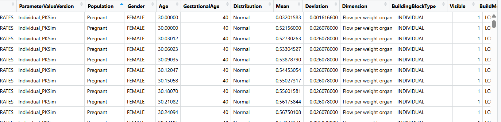
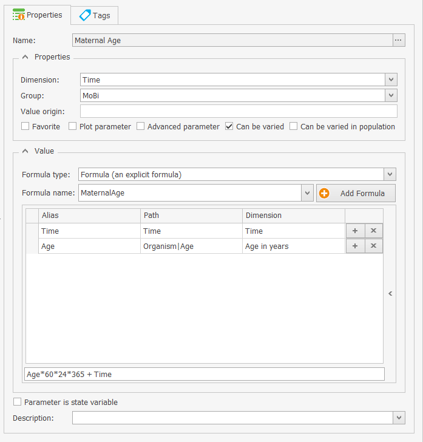
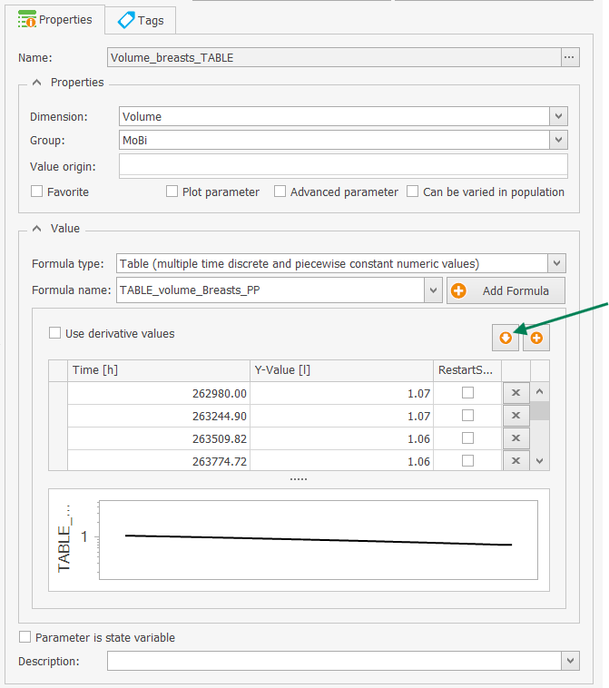
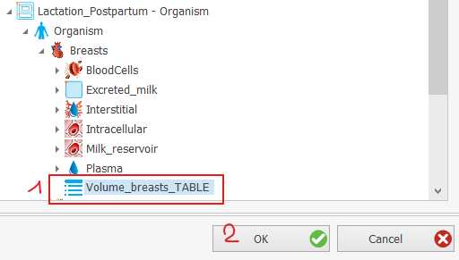
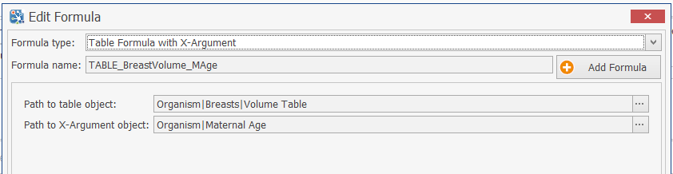
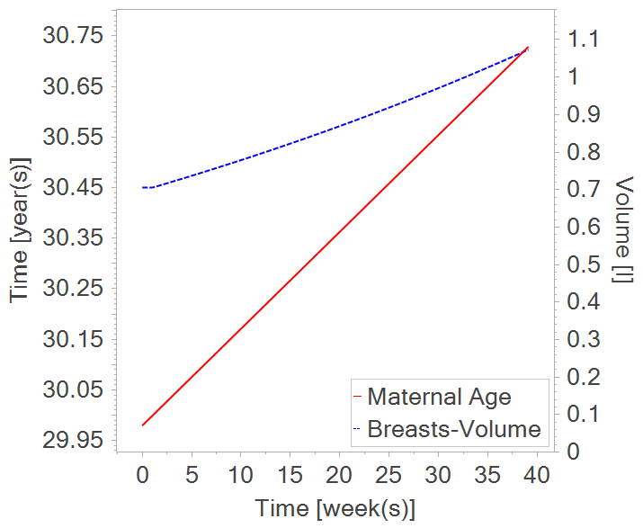

# Extraction of physiological parameters from a PK-Sim population database

## Use case description

In this use case, we describe how to **access** and **extract** the **physiological parameters** from the postpartum population in the **PK-Sim Database (Db)** and how to use that output to **create growth tables** in **MoBi to describe** age-dependent (or time-varying) physiological parameters.

## Process

### Download Database and explore content

The latest version of the PK-Sim database can always be downloaded via this link: [PK-Sim database](https://github.com/Open-Systems-Pharmacology/PK-Sim/raw/develop/src/Db/PKSimDB.sqlite).

For a graphical interface and data visualization, applications such as [Db Browser for SQLite](https://sqlitebrowser.org/) are available.



For detailed documentation, please visit: [PK-Sim database documentation](https://dev.open-systems-pharmacology.org/pk-sim-database/db).

### Access and extract population data to a spreadsheet

``` r
library(magrittr)
library(RSQLite)
library(DBI)
library(openxlsx)

conn <- dbConnect(RSQLite::SQLite(), "PKSimDB.sqlite")

# Execute a SQL query
query <- "SELECT * FROM VIEW_PARAMETER_DISTRIBUTIONS"
result <- dbGetQuery(conn, query)


# Filtering population with 'Postpartum' and selecting 'ContainerName', 'ParameterName', 'Age', and 'Mean' columns

result_filtered <- result %>% 
  dplyr::select(Population, ContainerName, ParameterName, Age, Mean, Dimension) 

result_postpartum <- result %>% 
  dplyr::select(Population, ContainerName, ParameterName, Age, Mean) %>%
  dplyr::filter(Population %in% "Pregnant")

# Write data in workbook
wb <- createWorkbook()
addWorksheet(wb, "Pregnant")

writeData(wb, sheet = "Pregnant", 
          result_filtered %>%
            dplyr::filter(Population %in% "Pregnant"))

saveWorkbook(wb, "data/param_distributions_pregnant.xlsx", overwrite = TRUE)
```

### Extract age-dependent parameters of interest programmatically

A parameter is classified as 'age-dependent' within the database if its value changes corresponding to different entries in the 'Age' column.

In the context of this example (focused on the pregnant population), a parameter is classified as age-dependent when the following condition is met:

-   There is more than one record of the parameter in the database for the attribute 'Age' in the interval [30.0,30.76]

This type of condition can vary according to the population definition, and the code should be adapted accordingly.

``` r
library(dplyr, quietly = TRUE)
library(openxlsx)

# Load distributed parameters from extracted Db file
file.path <- "data/param_distributions_pregnant.xlsx"
db <- readWorkbook(file.path)
df <- tibble::as_tibble(db)

# Transform parameter names to fit OSPS parameter paths
df <- df %>% mutate(concatenated_path = paste(ContainerName, ParameterName, sep = "|"))

# Find distributed parameters
distributed_parameters <- df %>%
  dplyr::filter(Age >= 30, Age <= 30.8) %>%
  dplyr::group_by(concatenated_path) %>%
  dplyr::filter(n() > 1) %>%
  dplyr::pull(concatenated_path) %>%
  unique()

# Isolate distributed parameters & save to worksheet
distributed_parameters_df <- df %>%
  dplyr::filter(concatenated_path  %in% distributed_parameters) %>%
  dplyr::select(Age, concatenated_path, Mean)
  
# Write data in workbook
wb <- createWorkbook()
addWorksheet(wb, "Pregnant_distributedParam")

writeData(wb, sheet = "Pregnant_distributedParam", 
          distributed_parameters_df)

saveWorkbook(wb, "data/Pregnant_distributed_parameters.xlsx", overwrite = TRUE) 
```

The user interface of the database viewer tool (e.g. Db Browser for SQLite) may also be used to extract the parameters of interest (i.e. distributed parameters).

### Import in MoBi as Table & create age-dependent parameters

In MoBi:

1.  Create a Pregnancy_Age parameter in minutes that increases over simulation time (NB: the parameter 'Age' of the individual remains unchanged):

    -   Define the value for the age parameter of the individual 'Age' at the beginning of the simulation 

    -   Add parameter 'Organism|Maternal Age'

        -   Dimension is Time (default unit is minutes, in OSPS)

        -   Formula type is 'Formula (an explicit formula)'

        -   Formula is "Age \*year2min + TIME" (the start Age in years must be converted into the OSPS default unit for 'TIME', which is minute)

        {width="300"}

2.  Open organ compartment that will contain the age-dependent parameter (e.g. Breasts)

3.  Add an intermediary Table parameter (E.g. Volume_breasts_TABLE)

    -   Chose the formula type "Table (multiple time discrete and piecewise constant numerical values)

    -   Define a formula name (e.g. TABLE_volume_Breasts_PP)

    -   Click on the 'import from worksheet' button (green arrow on Figure below)

    -   Select a parameter from the data file import menu. E.g for the Pregnancy case:

        -   Chose "data/Pregnant_distributed_parameters.xlsx" as exported in previous section

        -   Filter 'concatenated_path' \> "Breasts\|Volume"

        -   Enter units (by default values are in the base unit of the Db, see file: [OSPSuite.Dimensions.xml](https://github.com/Open-Systems-Pharmacology/OSPSuite.Dimensions/blob/master/OSPSuite.Dimensions.xml)). Column 'Age' in years and column 'Mean' in liter (OSPS base unit for volumes)

{width="345"}

4.  Add a age-dependent Volume parameter in the 'Breasts' compartment:

    -   Click 'Add parameter'

    -   Name: "Volume", Dimension= Volume

    -   Formula type: 'Table Formula with X-Argument' (e.g. formula name "PARAM_Volume_Breasts_PP")

    -   Path to table object: chose path to the previously created table parameter 'Volume_breasts_TABLE' (see point 3)

        {width="300"}

    -   Path to X-Argument object should point to 'Organism\|Maternal Age'

        {width="400"}

By ticking the box 'Plot parameter' for the parameters "Organism\|Maternal Age" and "Organism\|Breasts\|Volume", one can visualize the newly implemented age-dependent parameters:\
{width="345"}

## References

-   Detailed PK-Sim database documentation is available at: [PK-Sim database documentation](https://dev.open-systems-pharmacology.org/pk-sim-database/db)

-   The pregnancy population as implemented in the PK-Sim database was first described by Dallmann et al. (2020).

    -   Source: Dallmann A, Ince I, Solodenko J, Meyer M, Willmann S, Eissing T, Hempel G. Gestation-specific changes in the anatomy and physiology of healthy pregnant women: an extended repository of model parameters for physiologically based pharmacokinetic modeling in pregnancy. Clinical Pharmacokinetics. 2017;56(11):1303–1330. DOI: 10.1007/s40262-017-0539-z. PMID: 28401479.
