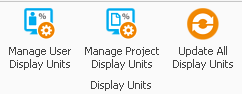
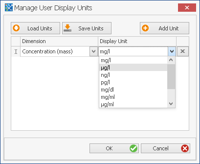
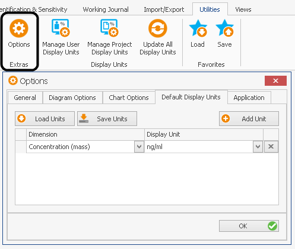

# Shared Tools - Default, Display and Base Units

The modeling tools PK-Sim® and MoBi® deal with a variety of physical quantities. Each quantity is related to a physical dimension. This dimension is displayed in a display unit, the preferred diplay unit is called default unit.

Display units can be chosen for a dimension in a project and for a user. In addition, a default display unit for each dimension can be defined.

The settings are applied in the following order:

*   Project Display Units

*   User Display Units

*   Default Display Units

The upcoming view is similar for both, display units in a project and for a user.

Units can be saved and loaded to and from a xml file. New display units can be added using the **Add Unit** button and filling up the new entry in the unit table. In addition, default display units for each dimension can be defined in the **User Settings** in the **Options** toolbar. When a new entity (parameter, molecule, ...) is created, the default display unit is used automatically.

If you want to update all display units to the default units, use the **Update all Display Units** button. This action will not change the value of a dimension.


If a view is open while reverting all units to the default settings, it might be required to close the view and open it again to verify that display units are set back to default settings.


Internally, the values for all quantities of a certain dimension are stored and calculated in the same unit, the so called **base unit** of that dimension. You find an overview of all dimensions with their base units in the appendix.

The base units are consistent since version 3.2.1; when you want to work with projects stored with previous versions, where you have used manual conversion factors in formulas, please refer to “Conversion of MoBi® 3.1 projects in MoBi® 3.2”