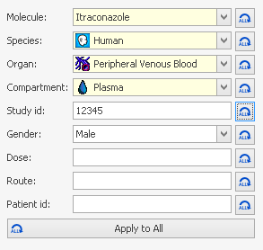

# Shared Tools - Import and Edit of Observed Data

A generic tool for handling of observed data within the Open Systems Pharmacology Suite is the formerly known PKExcelImporter. It is used in both applications (PK-Sim® and MoBi®) for importing observed data from e.g. Microsoft Excel® files with following prerequisites:

1.  A file contains one or several sheets with data tables.

2.  Column headers are in the first non-empty row.

3.  Units are given in the second header row or as part of the column header (at the end) enclosed in brackets (For example **Time \[h\]** would be interpreted as column name **Time \[h\]** and unit **h**).

4.  LLOQ values (= values below Lower Limit Of Quantification) must be preceded by a "<", e.g. "<0.2", where 0.2 is the LLOQ value. In case of different LLOQ values in one Observed Data vector the largest of those LLOQ values is used as LLOQ value.

The LLOQ value is stored at the data column and is not editable. All LLOQ values are stored as LLOQ/2 (= 0.1 in the example) to display them in the middle of the unknown range 0, LLOQ. In charts for such data a dotted line y=LLOQ is shown.

**File Selection Dialog**

In the Parameter Identification those LLOQ values can be handled differently (see [Handling of LLOQ values](parameter-identification.md#handling-of-lloq-values)).

To import data you should do the following:

1.  Select the input file (see [File Selection](#file-selection)).

2.  Specify the column mapping (see [Column Mapping in Import of Observed Data](#column-mapping-in-import-of-observed-data)).

3.  You can continue importing data sheets/data files by adding or changing the column mapping or selecting another input file.

4.  Enter all required meta data and set unit information.

5.  Complete the transfer of the imported data sheets to the calling application by confirming your settings.

## File Selection‌

Click on the **Observed Data** button to start the import component and specify the the excel file to be imported.


Both excel file formats (xls and xlsx) are supported and it is **not** required to have Microsoft Excel® installed on your computer.



By switching the file type combo box value it is possible to import a comma separated values file (csv) or a NonMem file (NMdat). For csv files, the used separator is determined automatically. Supported separators are semicolon, comma, tabulator, period or colon. Values can be enclosed in quotes.


## Preview of imported and original data‌

After selection of the file to be imported, a split window appears (see screenshot below). The left hand side shows a preview of the imported data file using the current mapping, each data table can be found in a separate tab. The right hand side window displays the mapping of imported column identifiers with the predefined data types. This mapping is performed automatically upon import but can be overridden by adjusting the controls. The preview of the imported data displays the first one hundred lines of each imported sheet.

An estimate of the number of data tables upon import using the current mapping is given in brackets in the **Import** button. This helps the user to judge whether the specified mapping produces the desired number of data tables. The **Import All** button is used to import multiple sheets at the same time.

Clicking on the **Preview Original Data** button allows the user to quickly review the original data. This might be useful in case explanatory data that is needed to perform mapping gets trimmed out during the import process. Also, in the preview of the original data, specific subsets of data can be selected for import.


**Deselecting Sheets**
You can deselect a complete source sheet from being imported by closing the tab page (clicking the  button). This can increase clarity and has a direct influence on the **Import All** button (see Import All).



**Sheet Navigation**
If you have a large number of sheets you may need to scroll through your preview pages. This can be done by using the mouse wheel or by using the navigator buttons on the right side. To select a specific page from a list you can use the page select button.


## Column Mapping in Import of Observed Data‌

The mapping table on the right in the **Import Observed Data** window shows the automatically generated mapping of the columns of the source sheet to the targets columns. Automatic mapping of source columns onto the target columns takes the following criteria into account:

1.  Equality of names.

    The target column has the same name as the source column.

2.  The target column supports the unit of the source column.

3.  If several target columns match the above criteria, the ones that have not been used in mapping are preferred to avoid multiple mapping.

4.  If no matching target column can be found, proceed as for meta data information on table level.

The mapping of source and target columns can be changed manually by using the buttons on the right hand side of each target column cell.

The predefined data types are time, concentration and error of concentrations and are available from a drop down menu. Similarly, imported data can be classified as meta data. Meta data is additional information on the imported data that applies to one or more data repository. The following meta data categories are available from the dropdown menu: molecule, species, organ, compartment, study ID, gender, dose, route and patient ID. For further information on handling and entering meta data see, “Entering Meta Data”. Units can be specified after clicking on .


A source column can only be mapped to a target column if the data types are compatible. This means, for example, that you cannot map a source column of data type 'date' to a target column of data type 'number'. Source columns of data type text can be mapped to all target column data types.



**Clinical Data Import**
You may have a large number of columns in your sheet when importing clinically observed data. In this case it might be a good idea to clear the default mapping and map manually only those columns you are interested in. Alternatively, use the Preview of the Original Data to select the data range that you wish to import. Use the Group By Mapping (see Using Group By in the mapping) to split the data into several parts (for example: Group By treatment to get a table for each treatment).


The icons to the left of each target entry in the mapping dialog have the following meaning:

- The  icon indicates that meta data are requested.

- The  icon indicates that meta data are requested which are not entered right now.

- The  icon indicates that unit information are requested.

- The  icon indicates that unit information are requested which are not explicitly entered right now.

- The  icon indicates that meta data and unit information are requested.

- The  icon indicates that the data will be split into several tables by distinct values of source column (see Using Group By in the mapping).


**Multiple Mapping**
It is possible to map multiple source columns onto the same target column. All possible combinations of those multiple mappings will result in multiple import tables.


It might be more effective to enter meta data information for a column during the mapping process, especially if you are using the multiple mapping feature.

The meta data will then be used for all columns which will be created out of this mapping.


**Using Group By in the mapping**
By mapping a source column on a target column using, the data sheet will be split into every distinct value of that source column. This results in multiple import tables. The label of each resulting import table contains the source column name and the respective value of the source column in that group. If used for grouping, a target column will appear as meta data in the following.



**Meta Data Mapping**
If meta data are requested for importing tables you can also map source columns onto such meta data fields. Then the source data gets split in the same way as for a group by mapping and the meta data fields are filled out with the distinct values of the source column.


In both, PK-Sim® and MoBi®, observed data can be organized in folders in the **Building Block** explorer. Observed data can be grouped into subfolders and shifted among folders by drag/drop or by using meta data to automatically group observed data during the import into a specific subfolder.

## Importing a file with several data sheets‌

To import a single data sheet you have to click on the **Import** button. If you want to import several data sheets in one file, click on the **Import All** button (see Import All) button. The number of currently imported tables is shown in brackets in the imports tab page caption.

You can go through each source sheet, map the columns and import the sheet as new import table. That way you would collect several import tables which can be transferred to the calling application later on.


Each required target column must be mapped onto at least one source column to enable the import buttons.



**Remapping And Table Replacement**
If you click the import button for a sheet that you have already imported you will be asked whether the already imported tables should be replaced by the newly imported ones, (see below).

By overwriting existing tables it does not matter how many tables have been imported by the previous mapping. If you confirm the replacement all previously imported tables which are based on the current sheet are replaced. If you dis-confirm the replacement the new tables are appended. The tables get serially numbered to get unique names.



**Import All**
If your source sheets are well mapped, you can use the **Import All** button to import all sheets by one mouse click.


## Entering Meta Data‌

Meta data are additional information that the calling application might request of the user. There can be meta data requested for an imported table or for each imported column (see below for an example).


All required meta data are indicated by a yellow background color and missing or invalid values are indicated by a preceding icon. In the tool tips you can get more information on the value which is requested. Optional meta data have a white background color.



**OK To All and Apply to All**
Meta data and unit information can be copied to other columns or tables either during the mapping or upon import in the preview. Depending on the context, this is done by pressing the **OK To All** or **Apply To All** button. Individual meta data can be applied to other imported sheets by using the button next to the combo box, the whole set of metadata is applied to all other tables using the Apply to All.


## Setting Units‌

A column unit can be set in the mapping dialog or by selecting  Set Unit from the context menu of a column in the imported table tab page (see Imported Table Tab Page Screenshot).

For a column there can be multiple dimensions defined. Each dimension can have multiple units.


If no unit information is found in the source column, the default unit is automatically set but must be explicitly confirmed.


## Completing the Import of Observed Data‌

A new tab page is created for each imported data file and you can enter meta data for tables or columns, set unit information or just view the imported data (see Imported Table Tab Page Screenshot). Changes to the error type or to units can be made in this view and are directly reflected in the chart.

On the left hand side you can see all meta data of the currently selected table and their columns. You can enter the requested information directly into this area or select  **Edit Meta Data** from the context menu of a column header.

To set a unit for a column of an imported table you can select  **Set Unit** from the context menu of a column header.

To complete the import of data tables to the calling application press the **OK** button.


Missing User Input
All required meta data and units need to be defined before finalizing the import. Each table in which meta data and/or unit information is missing, is labelled by a  icon preceeding the table name. Use the page select button  to get a list of all tables and identify those with missing information.



Deselecting Tables
You can deselect an imported table from being transferred by closing its tab (clicking the  button).



Collect From Different Sources
Before you transfer the imported tables to the calling application (and complete the import), you are free to go back to the source page and continue selecting more tables for import even from different source files.



The PKExcelImporter component determines the data type of a column by the first data rows. If there are values in the following rows that cannot be converted into the determined data type, those rows are skipped. If this results in an empty imported table, this table is deleted straight away and cannot be transferred.


## Editing Observed Data‌

Once a repository of observed data is imported, it can be manipulated by adding new data points, numerically changing data points or changing meta data. Changes are reversible through  and will be tracked in the project history. Numerically changing a value is reflected in real time in the preview graph below and will result in moving the data point in the data grid to the new settings

The new editing window can be accessed through double clicking the observed data in the building block view or through the context menu.


All values in the time column must be unique in a data repository.



**Editing All Meta Data**
Using the context menu of the **Observed Data** folders, the meta data values can be accessed and changed. This is very useful to supplement meta data or in reorganizing data. Changes will be applied to all data tables in that folder.

