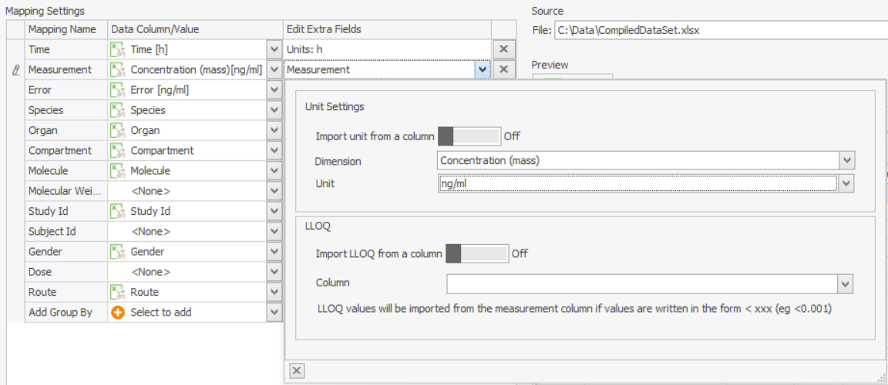
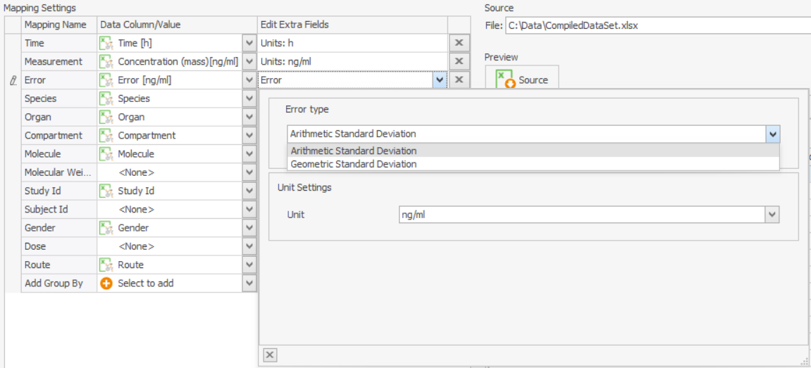

# Shared Tools - Import and Edit of Observed Data

A generic tool for handling of observed data within the Open Systems Pharmacology Suite is the formerly known PKExcelImporter. It is used in both applications (PK-Sim® and MoBi®) for importing observed data from e.g. Microsoft Excel® or .csv files with following prerequisites:

1.  A file contains one or several sheets with data tables.

2.  Column headers are in the first non-empty row.

The file selected to be imported should conform to at least one of th supported formats

## Supported Formats

1. Nonmem like format: here we have a dependent variable (DV), and the accordingly named columns (DVID, DVNAME, DVUNIT), where the information concerning this variable are stored.   

2. The units of measurement, error and so on exist on a separate column, ideally with the columns named according to the information they contain (e.g. Measurement, Error, Error_Unit, Measurement_Unit etc.). This also means that the unit can be different for each row of the data. If there are information missing the user can input them manually. 

**File Selection Dialog**

To import data you should do the following:

1.  Select the input file (see [File Selection](#file-selection)).

2.  Specify the column mapping (see [Mapping panel](#mapping-panel)) and enter all required meta data and set unit information.

3. You can then load one or more sheets. The sheets that you close through the "x" or the context menu on the sheets tab are no longer available for import.

3.  You can continue loading data sheets/data files by changing the column mapping or selecting another data sheet. Upon editing the column mapping the data are re-interpreted und updated automatically. The configured mapping remains the same for a whole import process, meaning that all the imported sheets will be using the same mapping. If you want to import data with different mappings, you have to do this in separate imports.

4.  Complete the transfer of the imported data sheets to the calling application by clicking the import button.

## File Selection‌

To import a new set of data from an excel file, click on the **Add observed Data** button, in the context menu of the observed data, to start the import component and specify the the excel file to be imported.

The input file must comply with the allowed formats. If even one sheet does not comply to any of the allowed formats, then the file is considered invalid and cannot be imported. The import process is stopped. 


The first step of importing is to select the file from which to import. Both excel file formats (xls and xlsx) as well as csv files are supported and it is **not** required to have Microsoft Excel® installed on your computer.



By switching the file type combo box value it is possible to import a comma separated values file (csv or nmdat). For those file the user is prompted to select the separator used for their parsing. Supported separators are semicolon, comma, tabulator, period or colon. Values can be enclosed in quotes.


## Preview of imported and original data‌

After selection of the file to be imported, a split window appears (see screenshot below). The right hand side shows a preview of the imported data file, each tab representing one sheet. 

Every tab is closeable. Additionally, using the right click on the tab names, a context menu appears where the user can close a specified group of tabs. Data coming from closed sheets is not imported or taken into account in the configuration in any way. If the user closes an already loaded tab, the tab will be removed from the loaded sheets.
Additionally through the context menu option "Reopen all sheets" the user can retrieve all the closed sheets of the document.

The data preview table offers various possibilities of filtering and sorting of the data. One can use the filter symbol on a column of the data to open the filter menu (see screenshot underneath). Also by right clicking the column name the user can sort the data according to a specific column or also open the filter editor to create more complicated filters.

The defined filters changes the viewing of the data. The user can choose to restrict the filters only to the viewing of the data or import only the filtered data by checking the checkbox "Use the filters for importing the data" under the data preview table.  

There are two buttons for loading - one for loading the current sheet that the user is viewing and the other to load all currently open sheets of the file. 

On the top-right part of the window one can see the path of the selected excel source file and also use the "..." button to select a new file. Selecting a new file though will cause the mapping and loaded sheets to be reset and the work you have done on the current input file will be lost.

## Mapping panel

The left hand side window displays the mapping of imported column identifiers with the predefined data types. The initial mapping is performed automatically upon selection of file and identification of the format, but can be overridden by adjusting the controls. 

The mapping panel is available throughout the import process. If the user changes the mapping, the changes are automatically applied and the result of the modified mapping is automatically updated. Likewise, if the updated mapping would lead to an error because it would not pass validation, the result of modifying the mapping is a validation error.

As shown in the screenshot underneath, the user gets a view of all the available mappings and can map a an excel/csv column to them. A column can be selected to a mapping only once, so when an excel column is selected for a specific mapping it automatically becomes no longer available on the drop down menus for other mappings. There is only one exception to this rule: the unit column for the measurement can also be mapped as the unit column for the corresponding error. 

Additionally for some mappings (like fe Organ, Speciees and others) the user can select one option from the predefined ones that come form PK-Sim/MoBi.

There are some mappings that are mandatory. The minimum set of them is that a Time and a Measurement mapping are defined. 

For the molecule mapping an excel column can be selected. Alternatively the user can select from a a dropdown menu of the available molecules from the project or even specify a not yet existing molecule manually, by clicking "Edit manually" under "Edit extra fields". 

A column can be selected to a mapping only once, so when an excel column is selected for a specific mapping it automatically becomes no longer available on the drop down menus for other mappings. There is only one exception to this rule: the unit column for the measurement can also be mapped as the unit column for the corresponding error. 

## Selection of units

The units for the mapped columns can either be a specified value or come from a column. When the units come from a column each data point can have a distinct unit. In the unit dialog, there is a toggle to select which mode of unit definition the user wants. When being set to a specified value, if this value is also specified as part of the header name  (e.g. Time[h]) is automatically recognized by the importer. The user can edit the unit (when a unit is available) by opening the dialog in the column "Edit extra fields" of the corresponding mapping row.

## LLOQ

The Lloq can either come from the column of the measurement excel column or from a seperate column. In the first case the Lloq values in the measurement column must be preceded by a "<", e.g. "<0.2", where 0.2 is the LLOQ value. In case the LLOQ comes from a column, there should be a single LLOQ value for every dataset. In case there are more than one defined, then the user will get a warning about this and in case the user wants to proceed with th import the highest of these LLOQs will be assumed for the whole dataset. 

## Configuring the error

The error can be set to Standard arithmetic Deviation or Geometric Deviation. In the case of geometric deviation, the error is dimensionless, thus there is no possibility to select a unit. Otherwise, the user can select the unit either manually or from a column.
The units of the error have to be consistent with the units of the corresponding measurement. So if the unit of the measurement come from a column, then the units of the error also have to come from a column. 
When the unit is configured as a manual input, the user must first select the desired "Dimension" from the dropdown, and then the corresponding units to this dimension will become available in the "units" dropdown.

When trying to load a sheet and the error and measurement unit come from a column, they are checked for consistency. If the data in the excel columns are of different dimensions, the data cannot be imported.

## The NaN indicator

There exists the possibility that a specific number (e.g. 99999) is being used in the data as an equivalent of NaN. In this case the menu on the left bottom of the window gives the user the possibility to configure the importer's response to such values. On the input field "NaN indicator" the user can specify the value that should be identified as NaN. This value has to be a **numeric** value - it cannot be ab alphanumeric string. Next the dropdown menu underneath specifies if the user wants to ignore the whole row where the NaN value is situated ("Ignore the row"), or if upon finding a NaN value in the data that is to be imported the user wants to prevent the import with an error. In the second case ("Prevent the import") , if a NaN value is found, when clicking "Load sheet" there will be a pop -up that will inform the user of the existence of a NaN value, prompting him to clean up his data and preventing him from importing. 

## Saving the configuration

By clicking this button the user can save the settings that he has configured to an xml file. This configuration includes the mapping, the NaN indicator and its preferences, the selected sheets, the path to the selected file and all the other information that can be configured in the importer. 
The saved configuration can then be used to either save and later resume the configuring and importing of a file or to import a different file that should be imported with exactly the same configuration.
If some sheets have already been loaded, this state is also part of the configuration. 

## Loading from configuration (WIP)

When you have a configuration saved in an xml file you can use it to load observed data with this configuration. Right click on the Observed Data folder and select **Add observed data from configuration...**. A file dialog will open where you can select the xml file where the configuration has been saved. Afterwards the usual importer view opens with all the data from the configuration loaded. Currently the data file to be loaded is hard-coded to the configuration and the user can only use the configured settings to load this specific file. A possible use case would be e.g. having started a load process for a specific file and then having to interrupt it. The user can then save what he has already configured and resume the import later.

## Confirmation Tab

When at least one dataset has been imported, the confirmation tab gets activated. 

There the user can see what datasets have already been loaded. On selecting a data set the data are being previewed to the right, both as values and in a chart form. The naming with which the data will be imported can be specified in the left side of the panel. This can either be done by manually typing in the "Naming Pattern" input field: The user can type keys that represent the name of a mapping inside of curly brackets {}, that will be then replaced by the value of each mapping for very individual data set. The user is also free to write text that will then be the same for all the data sets names. Additionally a drop down with presets for the naming is also available. 

Alternatively the "Create naming pattern" collapsible panel can be used. One or more Naming elements can be selected from the list and also a separator that will be used between them in the naming pattern. By clicking "Add keys" they are added to the naming pattern. 

The import can be finalized by clicking on the **Import** button.

## Editing Observed Data‌

Once a repository of observed data is imported, it can be manipulated by adding new data points, numerically changing data points or changing meta data. Changes are reversible through  and will be tracked in the project history. Numerically changing a value is reflected in real time in the preview graph below and will result in moving the data point in the data grid to the new settings

The new editing window can be accessed through double clicking the observed data in the building block view or through the context menu.


All values in the time column must be unique in a data repository.



**Editing All Meta Data**
Using the context menu of the **Observed Data** folders, the meta data values can be accessed and changed. This is very useful to supplement meta data or in reorganizing data. Changes will be applied to all data tables in that folder.


## Reload observed data

Using the context menu on a single dataset, the user can update all the data coming from that file. Upon selecting this option, the user is then prompted to select the new file from where the data will be reimported. This offcourse can be the same file used for the original import, just with edited data. Then the user is presented with a window showing her the changes this action will have to the state of observed data: which datasets will be deleted, which will be overwritten and which will be newly imported. The user can then decide to proceed with the reload, or abort it.  

