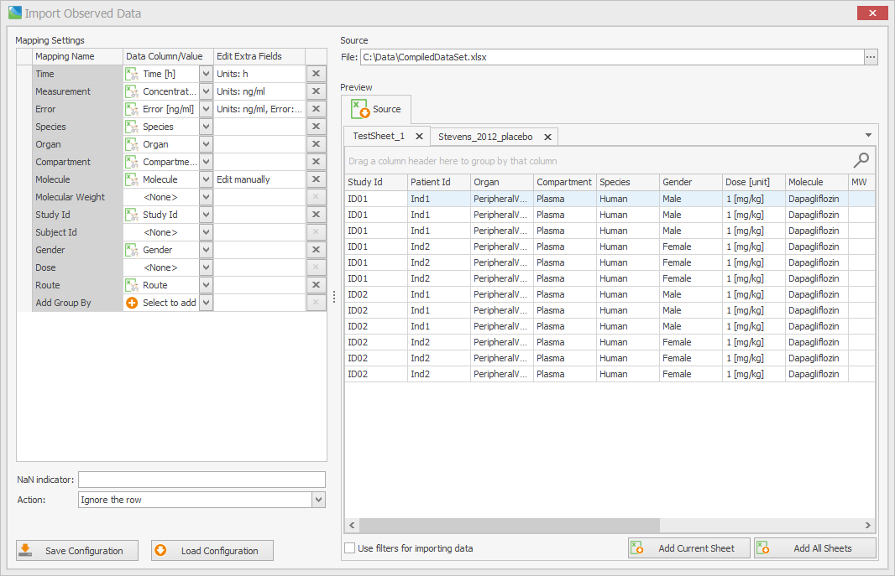
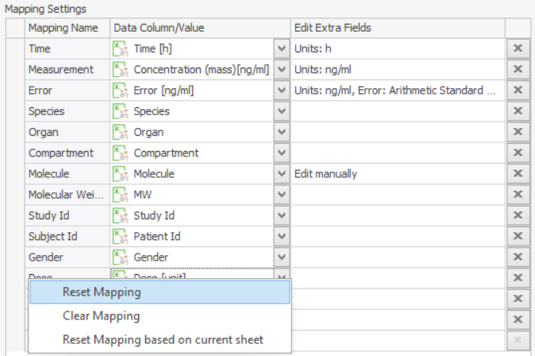
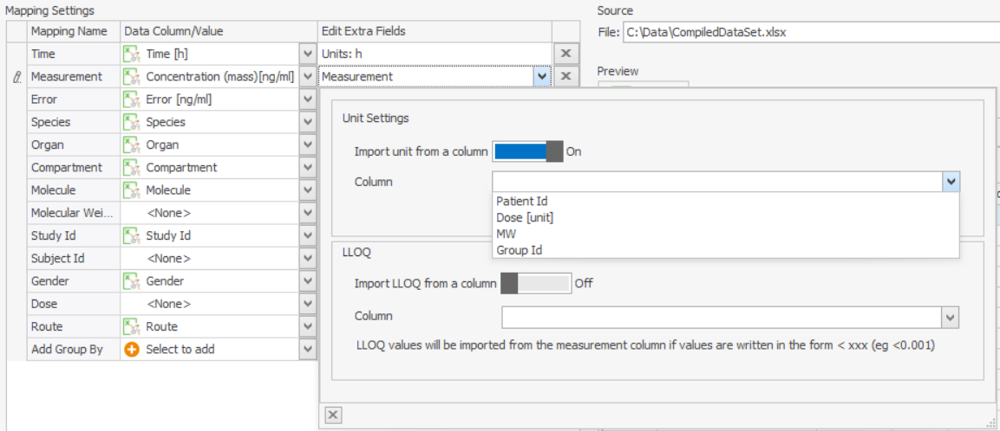
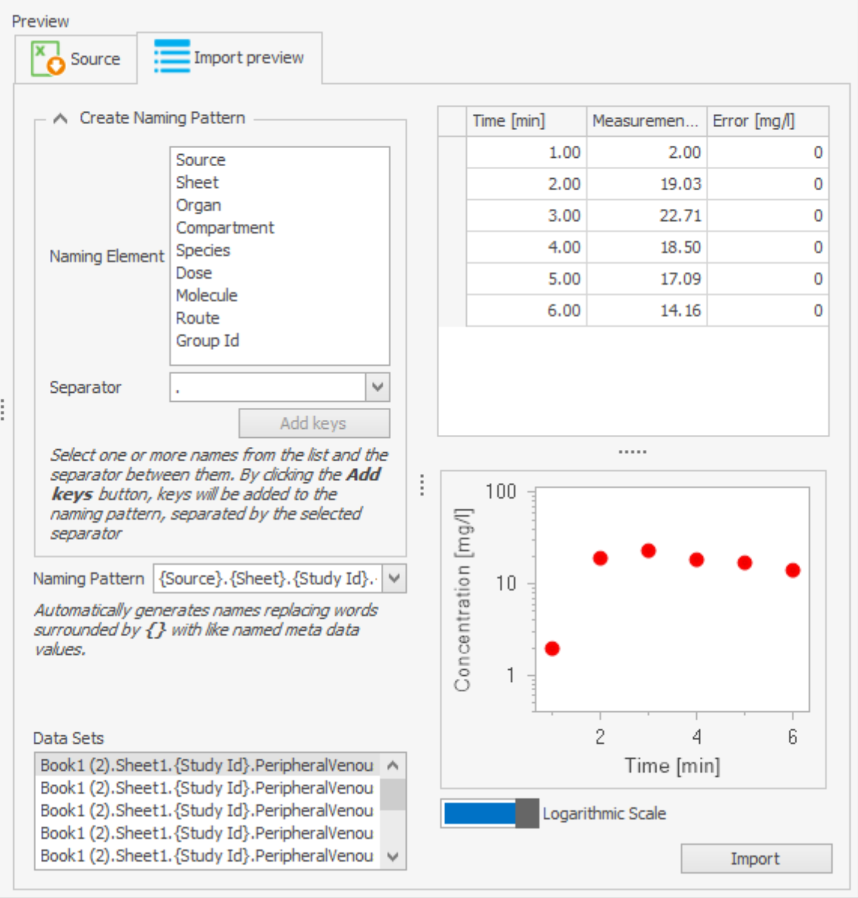
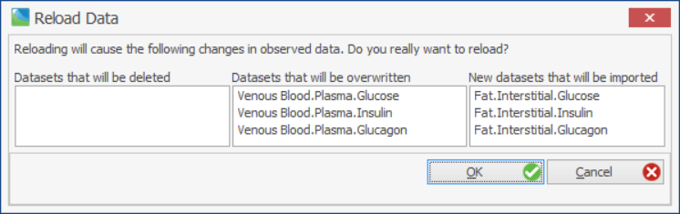

# Shared Tools - Import and Edit of Observed Data

A generic tool for handling observed data within the Open Systems Pharmacology Suite is used in both applications (PK-Sim® and MoBi®) for importing observed data from Microsoft Excel® or CSV files.

## Supported Formats

All files need to fulfil the following pre-requisites:

* A file contains one or several sheets with data tables.
* Column headers are in the first non-empty row.

Each data table:

* **must** have at least 2 data columns with numeric values: one column with **time** values and one column with  **measurement** values. 
* **can** have additional data column with numeric values for measurement **error** values 
* **can** have additional data column with numeric values for the *lower limit of quantification* (**LLOQ**)
  * It is also possible to provide LLOQ values directly in the measurement column (s. [LLOQ](#lloq) for details)
* **can** have arbitrary number of further numeric or non-numeric data columns, which can be interpreted as **meta data** which describes a data set (e.g. "Study Id", "Subject Id", "Organ", "Compartment",  ...)

The order and the naming of data columns is not important: the proper assignment of data columns to *Time*/*Measurement*/*Error*/*MetaData* will be performed during the [*column mapping*](#mapping-panel) process. However to speed up the mapping process it is advisable to name the columns according to their information (e.g. "Time" for the time column etc.)

**Units** of numeric columns (Time/Measurement/Error) can be defined in 2 ways (s. [units](#selection-of-units) for details):

* Either as part of the header caption in the square brackets (e.g. "*Time [h]*"). In this case all values of the data column will have the same unit.
* Or in a separate column. 

If no unit is specified (or the specified unit is not valid or not supported by OSP: it can be set manually during the [*column mapping*](#mapping-panel) process).

Some examples:

* Minimal possible example: time and measurement columns; units in the same column

  | Time [min] | Concentration [mg/ml] |
  | ---------- | --------------------- |
  | 1          | 0,1                   |
  | 2          | 12                    |
  | 3          | 2                     |
  | 10         | 1                     |
  | 20         | 0,01                  |

* Time, measurement and error; units in the column header

  | Time [min] | Concentration [mg/ml] | Error [mg/ml] |
  | ---------- | --------------------- | ------------- |
  | 1          | 0,1                   |               |
  | 2          | 12                    | 3             |
  | 3          | 2                     | 1,9           |
  | 10         | 1                     | 0,8           |
  | 20         | 0,01                  |               |

* Time, measurement, error, LLOQ, additional meta data; units in the column header

  | Time [min] | Organ | Compartment | Dose | Route | Concentration [mg/ml] | Error | LLOQ |
  | ---------- | ----- | ----------- | ---- | ----- | --------------------- | ----- | ---- |
  | 1          | Brain | Plasma      | 1 mg | Oral  | 0,1                   |       |      |
  | 2          | Brain | Plasma      | 1 mg | Oral  | 12                    | 2     |      |
  | 3          | Brain | Plasma      | 1 mg | Oral  | 2                     | 0,5   |      |
  | 10         | Brain | Plasma      | 1 mg | Oral  | 1                     |       |      |
  | 20         | Brain | Plasma      | 1 mg | Oral  | 0,01                  |       | 0,1  |
  | 1          | Liver | Plasma      | 2 mg | IV    | 0,2                   |       |      |
  | 2          | Liver | Plasma      | 2 mg | IV    | 8                     |       |      |
  | 3          | Liver | Plasma      | 2 mg | IV    | 2                     |       |      |
  | 10         | Liver | Plasma      | 2 mg | IV    | 0,5                   |       |      |
  | 20         | Liver | Plasma      | 2 mg | IV    | 0,05                  |       | 0,2  |

* Time/Measurement/Metadata; units in separate columns; LLOQ in the measurement column

  | Time | Time_Unit | Organ | Compartment | Concentration | Concentration_Unit |
  | ---- | --------- | ----- | ----------- | ------------- | ------------------ |
  | 1    | min       | Brain | Plasma      | <0,1          | mg/ml              |
  | 2    | min       | Brain | Plasma      | 12            | mg/ml              |
  | 3    | min       | Brain | Plasma      | 2             | mg/ml              |
  | 10   | min       | Brain | Plasma      | 1             | mg/ml              |
  | 20   | min       | Brain | Plasma      | <0,1          | mg/ml              |
  | 0    | h         | Liver | Plasma      | 0,2           | µmol/l             |
  | 1    | h         | Liver | Plasma      | 8             | µmol/l             |
  | 2    | h         | Liver | Plasma      | 2             | µmol/l             |
  | 5    | h         | Liver | Plasma      | 0,5           | µmol/l             |
  | 10   | h         | Liver | Plasma      | 0,05          | µmol/l             |

* Time/Measurement/MetaData; units partly in column headers and partly in separate columns; error unit assumed to be the same as measurement unit

  | Time [min] | Organ | Compartment   | Measurement | Type          | Measurement_Unit | Error |
  | ---------- | ----- | ------------- | ----------- | ------------- | ---------------- | ----- |
  | 1          | Brain | Plasma        | 0,1         | Concentration | mg/ml            |       |
  | 2          | Brain | Plasma        | 12          | Concentration | mg/ml            | 2     |
  | 3          | Brain | Plasma        | 2           | Concentration | mg/ml            | 0,5   |
  | 10         | Brain | Plasma        | 1           | Concentration | mg/ml            |       |
  | 20         | Brain | Plasma        | 0,01        | Concentration | mg/ml            |       |
  | 1          | Liver | Intracellular | 10          | F_metabolized | %                |       |
  | 2          | Liver | Intracellular | 20          | F_metabolized | %                |       |
  | 3          | Liver | Intracellular | 25          | F_metabolized | %                |       |
  | 10         | Liver | Intracellular | 30          | F_metabolized | %                |       |
  | 20         | Liver | Intracellular | 39          | F_metabolized | %                |       |

## Import Workflow

The general process of importing observed data is outlined here. A detailed description is provided in the following subsections.

To import data, you should do the following:

1.  Click on "**Add Observed Data...**" in the context menu of "**Observed Data**" in the Building Blocks explorer of PK-Sim® or MoBi®:

    * In  PK-Sim® you can also preselect for which molecule observed data should be imported. For this, click on "Add Observed Data for" and select a molecule from the dropdown list:

2.  Select the input file (see [File Selection](#file-selection)).
3.  Specify the **column mapping** (see [Mapping panel](#mapping-panel)), enter all required metadata and set the unit and LLOQ information.
4.  [Optionally] Apply **data filters** to exclude some data sets/values from import (see [Data preview](#preview-of-imported-and-original-data)).
5.  Add one or more sheets to the import preview. Sheets that should not be imported can be closed by clicking the "x" or the context menu.
6.  [Optionally] Adjust column mapping and/or data filtering. Upon editing of the column mapping, the data preview is re-interpreted and updated automatically. The configured mapping remains the same for the whole import process, and all the imported sheets will be using the same mapping. If you want to import data with different mappings, you have to do this in separate imports.
7.  [Optionally] Adjust the **naming pattern** of the data sets to be imported.
8.  Complete the transfer of the imported data sheets by clicking the import button.

### File Selection
To import a new set of data from a file, click on the **Add Observed Data** button in the context menu of the observed data and specify the file to be imported.


The input file must comply with one of the supported formats. If only one sheet does not comply to any of the supported formats, the file is considered invalid and cannot be imported. The import process is stopped. 



Both excel file formats (.xls and .xlsx), as well as CSV files (.csv, .nmdat), are supported, and it is **not** required to have Microsoft Excel® installed on your computer.



By switching the file type combo box value, it is possible to import a comma-separated values file (.csv or .nmdat). For such files, the user is prompted to select the column separator used for parsing. Supported separators are ';', ',', '.', and tabulator. Values can be enclosed in double quotes.


### Preview of imported and original data

After selecting the file, a split window appears (see the screenshot below). 

The left panel ("*Mapping settings*") is described in detail in the next section ([Mapping Panel](#mapping-panel)).

The right panel shows a preview of the imported data file, each tab representing one sheet. 

Sheets can be closed by clicking the 'x' or by right-clicking on a tab and selecting one of the options displayed. Closed sheets will not be imported and need not comply with the current data mapping. The user can retrieve all closed sheets of a document by the context menu option "Reopen all sheets".


If the user closes an already loaded sheet, it will be removed from the loaded sheets!


The data preview table offers various possibilities for filtering and sorting the data. One can use the filter symbol in the column header of the data to open the filter menu (see screenshot below). By right-clicking the column name, the user can sort the data according to a specific column or open the 'Filter Editor' to create more sophisticated filters (s. [this tutorial](https://devexpress.github.io/dotnet-eud/interface-elements-for-desktop/articles/filter-editor/examples-of-using-the-filter-editor.html) and [this video tutorial (up to minute 2:55)](https://www.youtube.com/watch?v=A6OgNirrPaE#t=27s) for examples).


By default, the defined filter changes only the **preview** of the data. The user can choose to restrict **importing** to the filtered data by checking the checkbox "Use the filters for importing the data" under the data preview table.  


There are two buttons for adding data to the import preview - one for adding the current sheet that the user is viewing and the other to add all currently open sheets of the file. In the latter case, **all** opened sheets need to comply to the current data mapping.

On the top-right part of the window, one can see the path of the selected source file and also use the "..."-button to select a new file. Selecting a new file, though, will cause the mapping and loaded sheets to be reset, and the work you have done on the current input file will be lost.

### Mapping panel

The left panel of the window displays the mapping of the imported column identifiers with the predefined data types. The initial mapping is performed automatically upon selection of the file and identification of the format, but it can be overwritten by adjusting the entries. 


The mapping can be reset by right-clicking on the mapping panel and selecting one of the displayed options.


//TODO: nächsten Absatz verschieben zu PReview/Naming pattern.

The mapping panel is available throughout the whole import process. If the user changes the mapping, the changes are automatically applied to all data sheets, and the result of the modified mapping is automatically updated. 

As shown in the screenshot below, the user gets a view of all the available mappings and can map a column to them. A column can be selected to a mapping only once and will no longer be available on the drop-down menus for other mappings, with one exception: the unit column for the measurement can also be mapped as the unit column for the corresponding error. 

Additionally, for some mappings (e.g., Organ, Species and others), the user can select one option from the predefined ones that come from PK-Sim/MoBi.


The minimum set of a valid data mapping includes a 'Time' and a 'Measurement' mapping. 


For the molecule mapping, a column from the sheet can be selected. Alternatively, the user can select from a drop-down menu of the available molecules from the project or specify a new molecule manually by clicking "Edit manually" under "Edit extra fields". 

The user can also select one or more 'Group by'-mappings. Those mappings are used to break down a single data sheet into multiple datasets according to the distinct values of the column mapped to the 'Group by'.

### Selection of units

The units for the mapped columns can either be manually entered or specified by a column. In the latter case, each data point can have a distinct unit but from the same dimension. In the unit dialog, the mode of unit definition can be selected. If the unit is specified as part of the header name (e.g. Time[h]) it is automatically recognized by the importer. The user can edit the unit by opening the dialog in the column "Edit extra fields" of the corresponding mapping.

When setting the unit manually, the user needs to select the dimension first, upon which the unit drop-down menu will be filled corresponding units.

### LLOQ

The LLOQ can either be specified from the column of the measurement or from a separate column. In the first case, the LLOQ values in the measurement column must be preceded by a "<", e.g. "<0.2", where 0.2 is the LLOQ value. In the second case, there can only be one single LLOQ value for every dataset. In case there are several LLOQ values defined, the user is warned, and in case the user wants to proceed with the import, the highest of these LLOQs will be assumed for the whole dataset. 

### Configuring the error

The error can be set to 'Arithmetic Standard Deviation' or 'Geometric Deviation'. Since the geometric deviation is dimensionless, it is not possible to specify a unit for it. Otherwise, the user can specify the unit either manually or by a column.
The dimension of the measurement and the error unit, as well as their source (manually entered or specified by a column), have to be consistent. This is checked when loading the sheet, and data with inconsistent dimensions cannot be imported.

When the unit is configured as manual input, the user must first select the "Dimension" from the drop-down, and then the corresponding units to this dimension will become available in the "Unit" drop-down menu.

### The NaN indicator

It is possible to define a specific number (e.g. 99999) as an equivalent of NaN. The value and the importer's action on the occurrence of this value can be defined on the bottom of the left panel. On the input field "NaN indicator" the user can specify the value that should be identified as NaN. This value has to be a **numeric** value - it cannot be alphanumeric. In the drop-down menu below, the user can specify to either ignore the whole row containing the NaN value ("Ignore the row"), or to prevent the import ("Prevent the import"). In this case, a pop-up message appears to inform the user of the existence of a NaN value, prompting him to clean up his data and preventing him from importing. 

### Confirmation Tab

When at least one dataset has been imported, the confirmation tab gets activated. 

Here, the user can see which datasets have already been loaded. On selecting a data set, the data are being previewed to the right, both as values and in a chart form. The naming with which the data will be imported can be specified on the left side of the panel. This can be done by manually typing in the "Naming Pattern" input field: The user can type keys that represent the name of a mapping inside of curly brackets {}. This will be replaced by the corresponding value for every individual data set. The user is also free to write text that will then be the same for all the data sets names. Additionally, a drop-down with presets for naming patterns is also available. 

Alternatively, the "Create naming pattern" collapsible panel can be used. One or more 'Naming Elements' can be selected from the list, along with a separator that will be used between these elements. By clicking "Add keys", they are added to the naming pattern. 

The import can be finalized by clicking on the **Import** button.

## Saving the configuration

By clicking the "Save configuration"-button, the user can save the settings that he has configured to an .xml file. This configuration includes the mapping, the NaN preferences, the selected sheets, the path to the selected file and all the other information that can be configured in the importer. 
[//]: # what is everything else? 
The saved configuration can be used to resume the configuring at a later time point or to import a different file that should be imported with exactly the same configuration.


If some sheets have already been loaded, this state is also part of the configuration. 


## Loading the configuration

The user can also load a saved configuration. Clicking the "Load configuration" button will open a "File Selection" menu where the user can select a previously saved configuration .xml file. The settings of that configuration are then applied to the current import process. If something is missing, for example, a column was mapped in the configuration but does not exist in the file the user is trying to load now, the user will receive a warning that this mapping could not be found and will be ignored. 
 
Missing columns will be ignored.


## Editing Observed Data

Once a repository of observed data is imported, it can be manipulated by adding new data points, numerically changing data points or changing metadata. Changes are reversible through  and will be tracked in the project history. Numerically changing a value is reflected in real-time in the preview graph below and will result in moving the data point in the data grid to the new settings.

The editing window can be accessed by double-clicking the observed data in the building block view or through the context menu.


All values in the time column must be unique in an observed data repository.



**Editing All Meta Data**
Using the context menu of the **Observed Data** folders, the metadata values can be accessed and changed. This is very useful to supplement metadata or to re-organize data. Changes will be applied to all data tables in that folder.


## Reload Observed data

Using the context menu on a single dataset, the user can update all the data coming from that file. Upon selecting this option, the user is prompted to select the file from where the data will be re-imported (This can also be the same file used for the original import, just with edited data.) A window appears, showing the changes this re-import will make to the observed data: which datasets will be deleted, which will be overwritten and which will be newly imported. The user can then decide to proceed with the reload or abort it.

