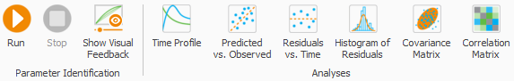
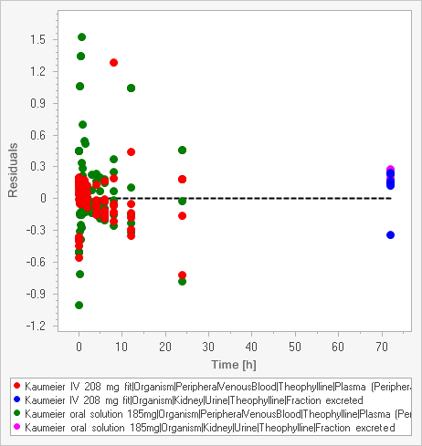
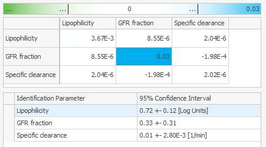
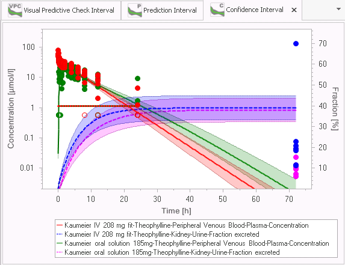

# Shared Tools - Parameter Identification

The first three chapters provide a basic understanding of the Parameter Identification tool: background and basic workflow and illustration in a simple example.

In the following chapters you find more detailed descriptions of the features and configuration of the tool and a more complex second example of a parameter identification.

## Background‌

The models built by PK-Sim® or MoBi® depend on a lot of input parameters which are based on literature values, measurements, databases, assumptions. For a given set of input parameters a number of output curves is computed in a **simulation**.

Often, experimental data for the outputs are given and the reverse question is asked: Which input parameters lead to a simulation with output curves corresponding to the given experimental data?

This reverse problem is called **Parameter Identification**: which values of certain input parameters yield simulation outputs that fit the observed data?

A **Parameter Identification** problem is a kind of optimization problem: Minimize the residuals between observed data and corresponding simulation output by varying selected input parameters in a given range. (For a definition of residuals see the table “Scaling”)

A variety of algorithms exist to solve optimization problems. The required effort and the quality of the solution depend on several factors, e.g. number and bounds of the input parameters of interest, complexity of the model, quality of start values for the input parameters.

Because not all possible combinations of input parameter values can be evaluated, sometimes not the global optimum is found, but a so called local optimum.

The user should be aware that a **Parameter Identification** as an optimization problem can become challenging, in particular for complex situations with many input parameters of interest or missing knowledge about their range.

In a lot of situations the available **Parameter Identification** features of the Open Systems Pharmacology Suite allow you to identify unknown parameter values much easier than by manual trial and error.

## Overview of the workflow‌

Within a Parameter Identification you have to perform the following steps:

### Prepare simulations‌
    
In order to use the Parameter Identification tool, you should add all observed data you want to use to one or more simulations.

Ensure that meta data for **Organ**, **Compartment**, **Molecule** is up to date, because this meta data is used for automatic mapping to outputs.

In the simulations which will be used for Parameter Identification, select all outputs to be mapped to observed data.


Selecting the input parameters of interest as **Favorites** makes it much easier to select those parameters later in Parameter Identification.

    
### Create a Parameter Identification‌
    
A Parameter Identification can be based on one simulation or several simulations which correspond to different experiments. To create a Parameter Identification, multiselect those simulations and select  **Start Parameter Identification ...** from the context menu.

### Map outputs to observed data‌
    
A mapping of observed data to corresponding simulation outputs is done automatically according to Organ, Compartment and Molecule meta data. Additionally, you can edit the mapping manually.
    
### Define Identification Parameters‌
    
You have to select those input parameters which should be varied and identified. Each of these Identification parameters can be linked to corresponding input parameters in different simulations.
    
## Configure Optimization‌
    
You can select between three optimization algorithms, edit their standard settings or change the usage of **Lower Limit Of Quantification** (LLOQ) values.
    
### Run Optimization‌
    
After finishing the previous steps, you can run a Parameter Identification which does not block the application. So you can proceed with manual work in your project. However the changes made in referenced simulations are not reflected in the _running_ Parameter Identification.
    
### View results‌
    
After the Parameter Identification is finished, you will find the parameter values and corresponding output curves. Other views can help to assess the quality of the result, e.g. Predicted vs. Observed values for drug concentration or the correlation between Identification Parameters at the identified parameter values.

During the Parameter Identification Run you can get visual feedback about the current state. If you like, you can stop the Parameter Identification manually.

## Simple Example‌

For a hands on exercise, open the example project Theophylline.pksim5. You can open the folder with the example projects from the Start menu by selecting All Programs/Open Systems Pharmacology/PK-Sim/Examples.

1.  In the Simulation Explorer mark the two simulations "_Kaumeier IV 208 mg fit_" and "_Kaumeier oral solution 185mg_" and select **Start Parameter Identification ...** from the context menu.
    
2.  A new view for _Parameter Identification 1_ is displayed and the tab **Data** is opened. On the left, the simulations with the assigned observed data are displayed. On the right, a list of mappings from outputs to observed data is displayed. For each observed data set for concentrations and fractions the corresponding output is mapped automatically (based on the Organ, Compartment, Molecule meta data).

    
3.  Switch to the next tab **Parameters**. Here, you have to define the parameters for identification. On the left, a list of all parameters grouped by **Simulation** and **Organ** is displayed. You can reorder the list for a more convenient view:
    
    1.  In the column **Favorite**, filter for checked to display just the Favorites.
        
    2.  Ungroup the columns **Simulation** and **Organ** (by right click on the column names you find that entry in the context menu).
        
    3.  Group by column name.
        
    Select both Lipophilicity parameters and click the upper **Add** button, then select both GFR fraction parameters and click the upper **Add** button again. Now, you have selected two identification parameters each linked to both corresponding simulation parameters.
    
    Switch to the next tab **Parameters**. Here, you have to define the parameters for identification. On the left, a list of all parameters grouped by **Organ** and **Name** is displayed. (If you are interested only in the Favorite parameters you can filter the column **Favorite**.)
    
    By default, all **Favorite parameters** are already selected as **Identification Parameters** in the right list of Identification Parameters.
    
    In this example project _Lipophilicity_ and _Specific Clearance_ were selected as Favorites. Here we want to identify the _GFR Fraction_ instead of _Specific Clearance_.
    
    Remove _Specific Clearance_ from the list of Identification Parameters and keep the _Lipophilicity_ parameter. Then select both _GFR fraction_ parameters (Expand Kidney/GFR fraction) and click the upper **Add** button. Now you have selected one new identification parameter linked to both corresponding simulation parameters.
    
    Enter Minimum Value 0 for both **Identification Parameters** and Maximum Value 2 Log Units for Lipophilicity and 1 for GFR fraction.
    
    
        
4.  In the tab **Configuration** keep the default settings.
    
5.  In the Ribbon Bar **Run & Analyze** click **Show Visual Feedback** and then Run to start the optimization.
    
    
    
6.  Now the **Visual Feedback Window** shows the intermediate state during the Parameter Identification Run.
    
    
    
7.  After some iterations, the run is finished and you can switch to the tab **Results**.
    
	

You can transfer the optimized values for the parameters to the simulations by clicking **Transfer to Simulation**. Or you can select one of the **Analyses** views from the Parameter Identification ribbon. If you are not satisfied, you can change mapping of outputs or definition of Identification Parameters and run the Parameter Identification again.

## Creating a Parameter Identification‌

To create a new Parameter Identification, do one of the following

*   Mark one ore more simulations for the Parameter Identification in the Simulation Explorer and select **Start Parameter Identification ...** from the context menu.

*   In the ribbon bar **Parameter Identification** click  **Create** .

*   In the Simulation Explorer right click the Parameter Identification root node and select  **Add Parameter Identification** from the context menu.

The Parameter Identification view is displayed and the tab **Data** is opened.

To add an additional simulation, drag & drop the corresponding node from the Simulation explorer to the Simulations list in the Parameter Identification view or use the button Add simulation.

In the Simulation Explorer, the Parameter Identifications are also displayed in a tree. Using the context menu, you can

*   rename a Parameter Identification,

*   clone it in order to reuse the Identification Parameter Definition or the mapping of outputs to observed data,

*   add a Parameter Identification to a Journal page,

*   export the Parameter Identification definition to Matlab,

*   delete a Parameter Identification.

## Mapping Simulation Outputs to Observed Data‌

A mapping of observed data to corresponding simulation outputs is done automatically according to **Organ**, **Compartment** and **Molecule** meta data of observed data and path elements of the outputs.

One observed data item can be mapped to one output only, but the same output can be mapped to several observed data items.


Because meta data of observed data can be incomplete or wrong, you should check whether the right output is mapped to each observed data item. In case of different outputs with the same meta data (this can happen at least in MoBi), you should also check whether the automatically chosen output is correct.


You can also edit the mapping manually by selecting Output and Observed Data from the comboboxes.


In case of incomplete or missing meta data, it is recommended to correct the meta data first to enable automatic mapping.


For each mapping, the scaling can be defined as Lin or Log which determines the residual calculation.

**Scaling**

|   |   |
|--- |--- |
|Lin | Residuals are calculated as: Simulation value - Observed value. This means that the residuals are defined by absolute differences. If the magnitudes of values are different for different parameters, the different magnitudes of residuals should be harmonized by corresponding weights (reciprocal values). |
| Log | Residuals are calculated as: log(Simulation value) - log(Observed value) = log (Simulation Value / Observed Value). This means that the ratio of values is considered which is independent of the magnitude of the value. But for very small observed values, in particular close to 0 values, this can lead to problems, because log(10E-N) = -N can becomes large. Then, the weights should be manually adjusted or LLOQ handling should be adjusted in the **Configuration**. (See “Configuration of Optimization”) |

To reflect the quality or importance of the Observed Data item or to balance different magnitudes of values in case of Lin scaling, you can edit the weights of each mapping.

If you select a mapping, the corresponding Observed Data is displayed as table and chart in the bottom area. There you can edit pointwise weights, e.g. to reduce or remove influence of outliers.


In MoBi®, you can freely define observers to match any kind of observed data. In order to enable the automatic mapping ensure that the meta data for Organ, Compartment and Molecule is the same for corresponding observed data and observers. Therefore, you can define the observers for specific Containers and Molecules and/or edit the meta data of the observed data.


## Defining Identification Parameters‌

In the tab **Parameters** you can select the parameters which should be identified. If you have different simulations in one Parameter Identification, you have to decide, if one **Identification Parameter** is linked to _multiple_ **Simulation Parameters** or _one_ **Simulation Parameter** only. (If necessary you can even link different simulation parameters from the _same_ simulation to _one_ Identification Parameter.)

If you have, for example, two simulations for two individuals with the same compound you may have one identification parameter lipophilicity which is linked to both lipophilicity parameters in the two simulations. At the same time, you define two identification parameters for the individual reference concentrations of a certain enzyme.

In general, you should select **Identification Parameters** which are informed by the available observed data. You should be aware that the more Identification Parameters you define, the higher the complexity of the optimization problem.


For the efficient selection of **Simulation Parameters** it is helpful to mark those input parameters as **Favorites** in a Simulation. For convenience by default all **Favorite parameters** are automatically selected as **Identification Parameters**. In the Parameters list of the Parameter Identification you can filter then by _checked_ Favorites (here you cannot edit the Favorites).


If you like, you can ungroup the column Organ (via the context menu). So you get a list of Favorite Parameters with corresponding Simulation Parameters.

*   To define one Identification Parameter for all corresponding Simulation Parameters, simply select them all and click the upper Add button.

*   To define one Identification Parameter for each Simulation Parameter per Simulation, select them subsequently and click the upper Add button each time.

*   To add Simulation Parameters to an existing Identification Parameter (e.g. after adding another simulation to the Parameter Identification), select the Identification Parameter and the Simulation Parameter(s) and click the lower Add button.

*   To unlink a Simulation Parameter from an existing Identification Parameter, click the Unlink button  in the Identification Parameters Simulation Parameters list (bottom right area); the Simulation Parameter is then unlinked from that Identification Parameter and a new Identification Parameter is generated for it.

Of course, you can use other ways to filter, sort and group the list of Simulation Parameters. And you can use the Text Filter to filter by a text element in any column. Use enclosing quotation marks to search for composite strings, otherwise a search is conducted for both strings.

After selection of the Identification Parameters you should define their **Minimum and Maximum Values**. With these ranges you define the solution space of the optimization problem.

Per default, the value of the first corresponding Simulation Parameter is used as a **Start Value**. You can edit this value manually or reset it to the Simulation Parameter value, e.g. after change of value in simulation (see column Value in the list of Simulation Parameters).

By **Scaling** you define how the Identification Parameter is modified during optimization; if the magnitude of the parameter is not known, Log scale should be selected.

Per default, the value of the first corresponding Simulation Parameter is used as a **Start Value**. You can edit this value manually or reset it to the Simulation Parameter value, e.g. after change of value in simulation (see column Value in the list of Simulation Parameters).

By **Scaling** you define how the Identification Parameter is modified during optimization; if the magnitude of the parameter is not known, Log scale should be selected, which requires a **Minimum Value** \> 0.

In special cases you may want to couple two simulation parameters but not by the same value, e.g. you know that the specific clearance of metabolite is half of compound's specific clearance. In this case you can add both Simulation Parameters for specific clearance to one Identification Parameter, check **Use as Factor** and use e.g. a Minimum Value of 0.5 and Maximum Value of 2. Then both specific clearances are varied in parallel by multiplication of the respective simulation value with the same factor between 0.5 and 2.

## Configuration of Optimization‌

You can configure the handling of LLOQ values, select among three optimization algorithms and edit the settings of the selected optimization algorithms.

When checking **Calculate Sensitivity** at the end of the optimization, the partial derivatives are calculated locally for the optimized parameter values. From those, a **Covariance Matrix** and **Correlation Matrix** are calculated which give some information about _local sensitivity_ of **Identification Parameters**.

Additionally, you have special options to vary calculation methods (PK-Sim only) or to start multiple optimizations with randomized start values.

### Handling of LLOQ values‌
    
You can decide if data values below LLOQ should be used or removed and how they should be handled in the residual calculation.
    
**Remove data below LLOQ**
    
|   |   |
|--- |--- |
| Never (default) | All LLOQ values are used. In particular, for sparse data, the information that for a certain time point the value was measured and is between 0 and LLOQ can be relevant. |
| Always | No LLOQ values are used. And in case of Log Scaling of outputs, no 0 values are used. |
| Reduce trailing | Sometimes observed concentrations end with several trailing .L.L.O.Q values.  In particular when only the Observed data below LLOQ is transformed, those trailing values should be reduced because the ratio between untransformed simulation values and transformed observed values can become large and cause trouble for Log scale outputs. |
    

If in Observed Data LLOQ values are contained as 0 values, for **Remove data below LLOQ** the option Always should be used. Otherwise, those values can distort the optimization results, because log(0) resp. log(eps=10E-20) is evaluated in the residual calculation and these single residuals may dominate the whole optimization.

      
**Transform data below LLOQ**
    
|   |   |
|--- |--- |    
| Observed data and simulated data below LLOQ set to LLOQ (default) | Observed data and simulation data are transformed consistently to avoid artificial residuals, especially for log scaled outputs.  Values below LLOQ are set to LLOQ to avoid discontinuity for values little above and little below LLOQ. |
| Observed data below LLOQ set to LLOQ/2 | This option is left for backward compatibility. Here, simulation data below LLOQ is not transformed in residual calculation in contrast to observed data. |

### Optimization Algorithms‌
    
The three available optimization algorithms have specific advantages and disadvantages. While for simple optimization problems (e.g. 1 - 3 Identification parameters which are well informed by sufficient and not contradicting observed data) each of the algorithms works stably and fast, there can be big differences in applicability, robustness and performance in more complex situations. In such cases, some optimization experience is often required. The descriptions and hints given here can only give some basic support, for more detailed information follow the references.
    

We recommend the following general approach:

    
1.  You should start with the Levenberg-Marquardt algorithm and the option Standard (= single optimization run) which are the default settings.
    
2.  If the result of a Parameter Identification is not satisfying, choose one of the following options:
    
    *   In case you do not have enough time and/or hardware resources available, switch to Monte-Carlo algorithm and the option Standard;
        
        Afterwards, you may perform an additional Levenberg- Marquardt run using optimal parameter values produced by Monte-Carlo as the new start values.
        
    *   Otherwise (enough time and hardware resources): perform parameter identification using Levenberg-Marquardt algorithm with option Multiple optimization.


#### General hints

*   Levenberg-Marquardt algorithm is faster than Monte-Carlo algorithm. However, it is susceptible to being trapped by local minima.

*   Using Levenberg-Marquardt algorithm: sometimes increasing the value of **Finite derivative step size** parameter (e.g. setting it to 1e-4 or 1e-3) might improve the result of parameter identification.

*   Using multiple optimization (along with any algorithm): if some single optimization runs fail with **Out of memory** exception: reduce the value of **Max. number of processors to use** program option. You can find it under Utilities/ Options (both PK-Sim and MoBi

#### Monte - Carlo

In each iteration, every free parameter value is separately varied one step upwards and one step downwards from its current value and the objective function is calculated.

If the objective function improves (residual sum of squares becomes smaller), the variation is accepted.

Here, the variation order is a random permutation. The variation steps are taken at random within in the given parameter intervals and the probability for a step near to the current parameter value is higher than for a step far from the current value, corresponding to the projection grade parameter (alpha).

When a parameters variation shows improvement, its projection grade is decreased, otherwise it is increased.

This iteration is performed until the break condition holds.

**Algorithm parameters**

|   |   |
|--- |--- |
| Break condition for relative error improvement | Termination occurs when the relative improvement of the error evaluation is less than the break condition. |
| Scale of projection degree (alpha) | Start value for projection degree. Termination occurs when the minimal alpha is larger than 10 times alpha. |
| Maximum number of iterations | The maximum number of iterations performed. |

#### Levenberg - Marquardt

For a description of this algorithm see

Henri P. Gavin: "The Levenberg-Marquardt method for nonlinear least squares curve-fitting problems" (May 2016) http://www.people.duke.edu/~hpgavin/(http://www.people.duke.edu/%7Ehpgavin/ce281/lm.pdf) ce281/lm.pdf

K. Madsen, H.B. Nielsen, O. Tingleff: „METHODS FOR NON-LINEAR LEAST SQUARES PROBLEMS” (2nd Edition, April 2004) http://(http://www2.imm.dtu.dk/pubdb/views/edoc_download.php/3215/pdf/imm3215.pdf) www2.imm.dtu.dk/pubdb/views/edoc_download.php/3215/pdf/imm3215.pdf

**Algorithm parameters**

|   |   |
|--- |--- |
| Relative chi- square convergence criterium (ftol) | Termination occurs when both the actual and predicted relative reductions in the sum of squares are at most ftol. Therefore, ftol measures the relative error desired in the sum of squares. |
| Relative parameter convergence criterium (xtol) | Termination occurs when the relative error between two consecutive iterates is at most xtol. Therefore, xtol measures the relative error desired in the approximate solution. |
| Orthogonality convergence criterium (gtol) | Termination occurs when the cosine of the angle between fvec and any column of the jacobian is at most gtol in absolute value. Therefore, gtol measures the orthogonality desired between the function vector and the columns of the jacobian. |
| Initial step bound factor | Used in determining the initial step bound. This bound is set to the product of factor and the euclidean norm of diag*x if nonzero, or else to factor itself. In most cases, factor should lie in the interval 0.1, 100. 100 is a generally recommended value. |
| Maximum number of iterations | The maximum number of iterations to perform. If the number of calculation iterations exceeds MAXITER, then the algorithm returns. If MAXITER = 0, then the algorithm does not iterate to adjust parameter values; however, the user function is evaluated and parameter errors/covariance/ Jacobian are estimated before returning. |
| Maximum number of function evaluations | Termination occurs when the number of calls to objective function is greater or equal this value by the end of an iteration. |
| Finite derivative step size (epsfcn) | Used in determining a suitable step length for the forward- difference approximation. This approximation assumes that the relative errors in the functions are of the order of epsfcn. If epsfcn is less than the machine precision, it is assumed that the relative errors in the functions are of the order of the machine precision. |

#### Nelder - Mead

This algorithm does not use the defined bounds defined for the Identification Parameters.

For a description of this algorithm see

Nelder, John A.; R. Mead (1965). "A simplex method for function minimization". Computer Journal 7: 308–313

**Algorithm parameters**

|   |   |
|--- |--- |
| Convergence tolerance | Relative convergence tolerance |
| Maximum evalutions | Termination occurs when the number of calls to objective function is greater or equal this value |

### Variation of calculation methods and multiple optimizations‌

#### Multiple optimization
    
As explained above, optimization results can depend on the start values, if different local optima exist. This can happen for instance, if more identification parameters are selected and the observed data is heterogeneous. In such situations performing multiple optimization with randomized start values (randomly chosen from the range defined for the Identification Parameters) can lead to different results. Results can compared manually by the global error.
    
If multiple optimizations all return the same result, this is more likely a global optimum.
    
Depending on the number of processors in your computer and the corresponding setting in the General Options (Menu Utilities), optimizations are performed in parallel.
    
#### Calculation Methods Variation
    
In PK-Sim® often it is not clear, which Calculation Method is most appropriate to fit given observed data. Using the **Calculation Methods Variation** you can optimize simulations for different calculation methods e.g. for the Partition Coefficients, and compare the results.

If you have more than one molecule, you can decide whether the calculation methods should be **All the same** for all molecules or if different combinations of molecules and calculation methods should be tested.

Also, here optimization are done in parallel as long as processors are available to the Open Systems Pharmacology Suite.

### Display of intermediate and final results‌

#### Visual Feedback‌
    
During the optimization run, you can view intermediate results. Click **Show Visual Feedback** in the Ribbon bar **Run & Analyze**. A new window is displayed.
    

    
In this window the status of the optimization run is displayed and a table with the best and currently tested Identification Parameter values and the resulting total error.
    
The error history is displayed in a chart. You can use this information to stop the optimization run manually in certain situations and to assess if the optimization run had decreased the error substantially.
    
In the lower area you can select an output mapping and the current comparison between simulation and observed data values is displayed.

You can click the button **Parameters History** to export a table with all parameter value vectors tested during the optimization . And you can export the error history to Excel by right click into the chart. You can use this information for evaluation of the solution path, e.g. to assess the sensitivity of parameters.

In case of **Multiple optimization** or **Calculation Methods Variation** the Visual Feedback window gives an overview about the status of the different optimizations. You cannot switch to the detailed Visual Feedback view here.

### Results of Parameter Identification‌
    
After the optimization run is finished, you can view the results in the tab Results.

Status, elapsed time, number of evaluations and the resulting total error are displayed in the upper table.

Below, you find a table with the optimal values, start values and ranges for all Identification Parameters.

You can copy and paste both tables for documentation of the results e.g. to the Working Journal.
    

In case of **Multiple optimization** or **Calculation Methods Variation** you can compare the identified parameter value vectors and total errors for different Calculation Methods or Start Values in the tab Results.
    

### Analyses‌
    
From the ribbon Run & Analyze you can select different charts to analyze the optimization result and assess its quality.

#### Time Profile
    
For the different outputs, simulation and observed data values are displayed in different colors.

#### Predicted vs. Observed

For each observed concentration value a point is plotted with observed value as x-Value and corresponding simulation value as y-Value.

In case of different dimensions of the outputs you have to switch the x-Axis dimension to see the respective outputs.

#### Residuals vs. Time

This chart is similar to the Time Profile chart, but on the y-axis the (absolute) residuals used in the optimization are plotted. The chart includes scaling, weights and LLOQ usage and the values are dimensionless, so you can assess the actual influence of the observed data.

#### Histogram of Residuals

Using this chart, you can check if the residuals are distributed normally - the normal distribution is indicated by the black curve. Strong deviations from normal distribution indicate that the scaling of the parameters may not be appropriate or the model does not reflect the observed data.

#### Correlation Matrix

Based on the partial derivatives calculated locally at the found optimal parameter values, the **Correlation Matrix** and **Covariance Matrix** give some information about _local sensitivity_ of **Identification Parameters**.

The correlation between two identification parameters based on the observed data is high (positive or negative), if the entry in the correlation matrix is near to 1 or -1\. Entries between -0.5 and 0.5 indicate a low correlation.

You can use the correlation information to select the parameters to identify. In general, you will often observe correlations, if you have selected many identification parameters, see for example the results if you add the Specific clearance as an identification parameter.


Keep in mind that all information in this analysis is calculated only at the optimal values and is not necessarily valid in general.


#### Covariance Matrix

The Covariance matrix gives additional statistical information and can be used to estimate confidence intervals for the identification parameters.


Keep in mind that all information in this analysis is calculated only at the optimal values and is not necessarily valid in general.

  

### Confidence Interval‌
    
From the ribbon Run & Analyze in the ribbon bar **Confidence Intervals** you can select different confidence interval charts to assess the quality of the Parameter Identification results.

Keep in mind, that **Visual Predictive Check interval** and **Prediction** interval are only available for measured quantities.


Even if the curves itself are positive, the lower ranges can become negative. Because negative values cannot be displayed in a log scale chart the curves are not visible then. In that case just switch the scaling for the corresponding y-Axis to linear, which is anyway recommended for fractions.


For more detailed background information about the _confidence intervals_, _model error_ and data error see \[[23](../references.md#23)\], \[[20](../references.md#20)\], \[[2](../references.md#2)\].

#### Confidence Interval

This chart displays the 95% confidence interval of the _model error_, which is based on the uncertainty of estimated parameters. This uncertainty is based on an estimation of the error between the mean value of used observed data compared with the mean value of the (unknown) total data.

#### Visual Predictive Check Interval

This chart displays the 95% Visual Predictive Check interval, which corresponds to the uncertainty based on the _data error_. The _data error_ is the standard deviation of the distribution of the used observed data.


You should check, if the distribution of observed data corresponds to the calculated interval, e.g. about 95% of the data points should lie in the calculated interval and the shape of the interval fits to the observed data.


If major deviations exist, the reliability of the Parameter Identification result is in question.

In that case you should consider to

*   improve the optimization, e.g. by different settings in the tab **Configuration**,

*   improve the _error model_, e.g. changing weights or scaling of outputs in tab **Data**,

*   improve the model itself.

#### Prediction Interval

This chart displays the 95% Prediction interval, which corresponds to the combination of the _model error_ and the _data error_. It shows, how much future measured data are expected to differ from the model predictions.

## More Features‌

### Reuse of a Parameter Identification‌

Parameter Identifications are saved in the project files and can be attached to the **Working Journal**. So you can rerun Parameter Identifications after modification of the original simulations as long as used outputs and simulation parameters are kept in the simulation.

You can also clone a Parameter Identification by selecting **Clone** in the context menu of a **Parameter Identification** in the **Simulation Explorer**. In the cloned Parameter Identification you may define different Identification Parameters or a different configuration.

Sometimes you may have different simulations for the same observed data to compare model alternatives. In this case you can also reuse a Parameter Identification by cloning it. Afterwards, you can replace a used simulation with another simulation (with same or similar observed data, outputs and simulation parameters) by selecting **Replace Simulation ...** in the context menu of the simulation in the Data tab.

The mapping definition with weights, the definition of Identification Parameters and the Configuration remain the same as long as the corresponding parameters are available.
    
### Export of Parameter Identification to Matlab®‌

If you want to use the Matlab® optimization capabilities for optimization, you can export the Parameter Identification to Matlab® by selecting the corresponding entry from the context menu of a **Parameter Identification** in the **Simulation Explorer**.

Into the selected folder then are exported:

*   the simulations as .xml-Files,

*   the configuration of the Parameter Identification as .xml-File,

*   a example script for optimization and display of results as .m-File.

Before calling that script ensure in Matlab® that the path contains the directory "Open Systems Pharmacology\\MoBi Toolbox for Matlab".