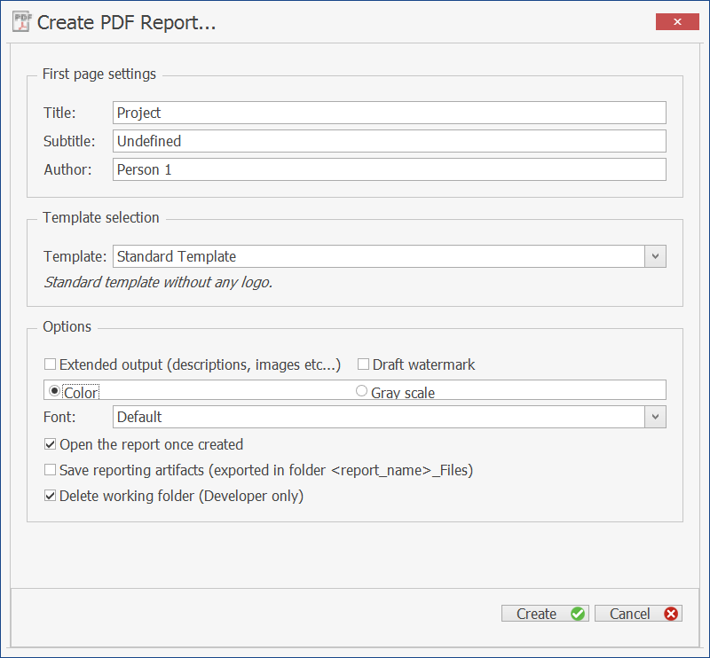

# Shared Tools - Reporting

## Introduction‌

The reporting engine generates reports in form of PDF documents for both applications.

The content of the document is mainly specified by the place from where the actions was called. That means, if you call the reporting generation from a context menu of a simulation the created document describes the simulation and if you call it from a building block the building block is described.

For any report you want to create the following dialog opens for specifying the output:

In the first part you can specify some information for the title page of the report like title, subtitle and author.

With the template selection you can take influence on the general report layout. A short description is given about the provided layout.

Independently from the selected template several options are supported:

**Report Options**

| Option | Description |
|--- |--- |
| Extended output (descriptions, images etc...) | Check this to extent the report by descriptions and images. |
| Draft watermark | Check this to get a watermark indicating that this report is in a draft mode. |
| Color or Gray scale | Select whether result plots should use the same color as in the application or whether all colors should be transformed to gray scales. |
| Font | Select a font. All text and all captions in plots are adjusted. |
| Open the report once created | Check this to open the pdf file directly after creation. |
| Save reporting artifacts (exported in folder <report\_name>\_Files) | Check this to get an extra folder with single files for each created plot. |

After clicking on **Create** a file selection dialog will ask you for the name and location of the pdf file to be created.

## Technical Background‌

Internally the report processing is done via LateX and the MikTex distribution for windows (version 2.9) is used.

Following LateX packages are used:

*   xcolor

*   adjustbox

*   float

*   pdflscape

*   grffile

*   tabu

*   longtable

*   needspace

*   caption

*   threeparttablex

*   textcomp

*   hyperref

*   fancyhdr

*   lastpage

*   draftwatermark

*   geometry

*   tikz

*   sectsty

*   placeins

*   tcolorbox

*   pgfplots

*   siunitx