# (Re-)Qualification framework: Introduction

A technical framework to assess the confidence of specific intended use of the OSP platform allows for an automatic (re)-qualification workflow of the OSP suite, comprising the following steps:
-	PBPK model development and verification with observed data
-	Qualification plan generation
-	Qualification report generation

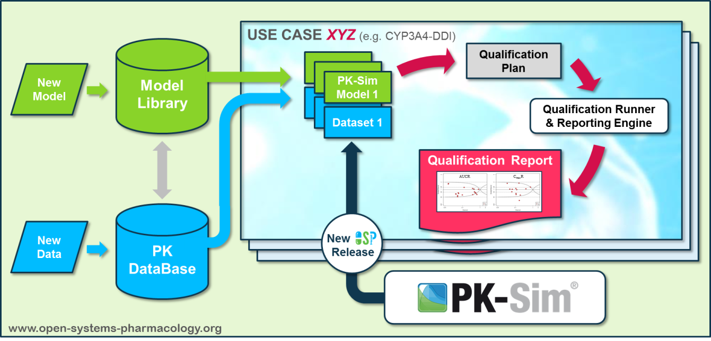

In a first step, the respective qualification scenario is saved in a special qualification repository on GitHub. This qualification scenario repository contains a detailed qualification plan that links and combines respective models and data to address the use case that shall be qualified. Therefore, the qualification plan consists of: 
-	PK-Sim project files (more precisely: PK-Sim project file [**snapshots**](https://docs.open-systems-pharmacology.org/working-with-pk-sim/pk-sim-documentation/importing-exporting-project-data-models#exporting-project-to-snapshot-loading-project-from-snapshot))
-	Description of potential cross-dependencies between PK-Sim project files (if adequate) (e.g. it is possible to inherit building blocks or simulation parameters)
-	Observed data sets (needed for model development and verification)
-	Qualification scenario description text modules
-	Detailed report settings to describe the generation of charts and qualification measures. 

PK-Sim projects, observed data sets, and qualification scenario text modules can, but not necessarily have to, be saved in their own/different repositories and then conveniently be referenced by the qualification plan.

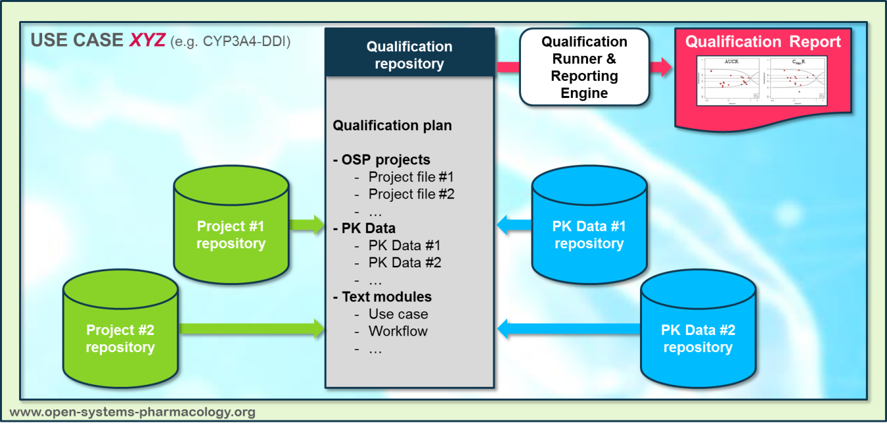

In the next step, the **Qualification Runner** (stand-alone tool) processes the qualification plan, i.e. all project parts are exported and prepared for the **Reporting Engine**. The Reporting Engine provides a validated environment (currently implemented in MATLAB®, a transfer to R is in development) for model execution and generates tables and figures for the final qualification report. This report contains the evaluation of the individual PBPK models with observed data (i.e. standard goodness of fit plots, visual predictive checks) and a comprehensive qualification of the specific use case assessing the predictive performance of the OSP suite by means of a predefined set of qualification measures and charts. 
The automated execution of the described workflow can be triggered to assess re-qualification in case new data, changes in model structure or parameterization, or new OSP suite releases arise.

# Creating a (re-)qualification plan part I

Creating a qualification report is similar to writing a scientific article: you write some text, structure it in chapters, insert some figures and tables.

Qualification plan orchestrates this process and defines how all the *static* and *dynamic* content will be combined into the final report document.

* “*Static content*”: Will be taken AS IS and inserted into the report without any further
  modifications.

* “*Dynamic content*”: Software must actively do something to produce expected results (e.g.
  create plots)

Technically, qualification plans are text files in [JSON format](https://en.wikipedia.org/wiki/JSON) (file extension: **.json**). You can use any plain text editor for creating and modification of such a file. However it's much faster and easier to use dedicated tools (e.g. *Visual Studio Code* (*VSCode*); s. the section [**Creating a (re-)qualification plan part II: Tools**](#creating-a-re-qualification-plan-part-ii-tools) for details).

Besides that, many scripting environments (Matlab, R, etc.) allow comfortable modification of JSON files.

## Components of a (re-)qualification plan 

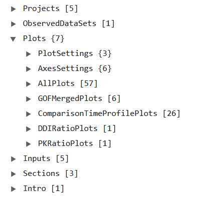

### Projects

Describes all projects used in a qualification scenario. Currently, only PK-Sim projects are supported. MoBi projects will be supported in the mid-term future.

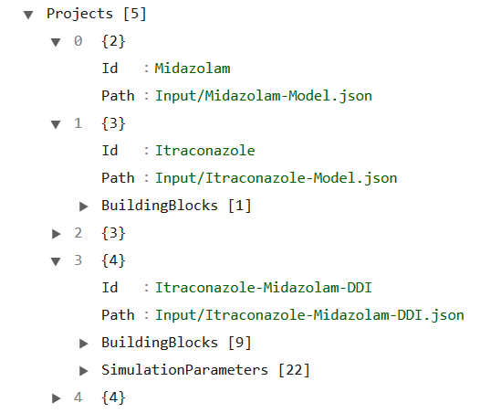

* "**Id**":  Whenever a project is referenced within a qualification plan: it happens via its project id. Any non-empty string can be defined by the author of a qualification plan as a project id (the only restriction: a project id must be *unique* within one qualification plan). 

* "**Path**":  path to a project **snapshot** . Can be defined:

  * Either in form of an URL of remote file (e.g.                                                                                                      "*https://github.com/Open-Systems-Pharmacology/Sufentanil-Model/releases/download/v1.1/Sufentanil.json*"
  * or in form of a path to a LOCAL file (given **relative to the location of current qualification plan**), e.g. "*Input/Itraconazole-Model.json*")

* "**BuildingBlocks**": OPTIONAL, may be empty. List of inherited building blocks.

  The idea behind is: if a building block (compound, individual, ...) must be **the same in different projects** and must be modified, there is no need to modify it in every project. Instead, the building block can be modified in only one project, and the qualification plan will ensure that the changes will be propagated in all other projects.

  * "**Type**": type of a building block (one of: "*Compound*", "*Event*", "*Formulation*", "*Individual*", "*ObserverSet*", "*Population*", "*Protocol*")
  * "**Name**": name of a building block (must be the same in both parent and child project)
  * "**Project**": Id of the parent project

  E.g. in the example below:

  * Individual building block  "*European (P-gp modified, CYP3A4 36 h)*" in the project "*Itraconazole-Midazolam-DDI*" will be overwritten by the Individual building block **with the same name** from the project "*Midazolam*" (if there is no individual with the same name in the "*Midazolam*" project: execution of the qualification plan will stop with an error)

  * Compound building block  "*Midazolam*" in the project "*Itraconazole-Midazolam-DDI*" will be overwritten by the Compound building block **with the same name** from the project "*Midazolam*" (if there is no Compound with the same name in the "*Midazolam*" project: execution of the qualification plan will stop with an error)

  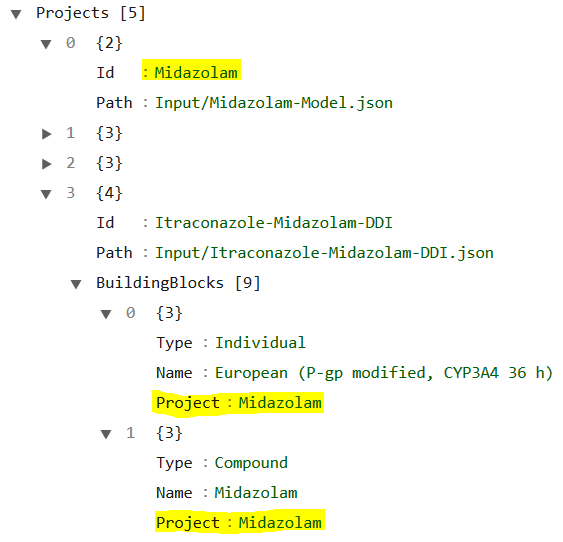

* "**SimulationParameters**": OPTIONAL: List of inherited simulation parameters. Same principle as in case of inherited building blocks: simulation parameters can be inherited between projects. Each
  inherited simulation parameter description consists of:

  * "**Project**": Id of the parent project

  * "**Simulation**": Simulation name within the parent project

  * "**Path**": Path to the simulation parameter

  * "**TargetSimulations**": Simulation name(s) within child project

  Then *<ChildProject>.<ChildSimulation_i>.<ParameterPath>.Value* will be replaced with    *<ParentProject>.<ParentSimulation>.<ParameterPath>.Value*
  
  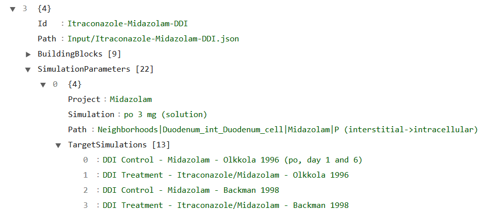

### Observed data sets

Like projects, all observed data sets are identified by their Id, which must be unique within a qualification plan.

There are 2 kinds of observed data sets:

1. Observed data sets which are included into one of the projects used by the qualification plan. 

   These data sets can be used in the qualification plan without any further specification. Observed data set id is in this case the name of the observed data set as defined in PK-Sim project. 

2. Observed data sets which are not included into one of the projects. These data sets must be described in the "*ObservedDataSets*" section of a qualification plan.

   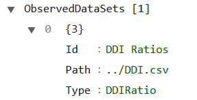

    * "**Id**": (Unique) id of an observed data set
    * "**Path**": path to an observed data set file. Can be given as remote URL or local file path (s. the [Projects](#projects) section for details).
    * "**Type**": type of an observed data set. Can be one of:
       * "*TimeProfile*". Corresponding observed data set must have the columns with time values, measurement values and (optionally) error values with units (s. also [here](https://docs.open-systems-pharmacology.org/shared-tools-and-example-workflows/import-edit-observed-data)). [Example](https://raw.githubusercontent.com/Open-Systems-Pharmacology/QualificationPlan/7ab7c59dfce9201845ebcd8247b2a5cad344bc03/examples/minimal/reporting%20engine%20input/ObservedData/Itraconazole%20600mg%20MD.csv)
       * "*PKRatio*". [Example](https://github.com/Open-Systems-Pharmacology/Pediatric_Qualification_Package_GFR_Ontogeny/blob/4e905c62f348a107e3cb96b7fe44c5f8e201da75/input/PK-Parameters.csv) Mandatory columns are: TODO
       * "*DDIRatio*". Example: TODO Mandatory columns are: TODO

### Sections

Defines the chapter structure of the report. Every chapter (section) has:

* "**Id**": Unique section-Id. This id is referenced in other parts of the qualification plan to define which dynamic content must be added to the chapter (dynamic content will be added at the end of the chapter)

* "**Title**": Chapter title

* "**Content**": Path to the **static** content file which will be inserted at the beginning of the chapter. Can be given as remote URL or local file path (s. the [Projects](#projects) section for details). Static content files must be written in [Markdown](#Markdown) format (s. below).

* "**Sections**": OPTIONAL list of subchapters. Every subchapter is build the same way (thus report
  structure can be defined with an arbitrary chapter depth level).

  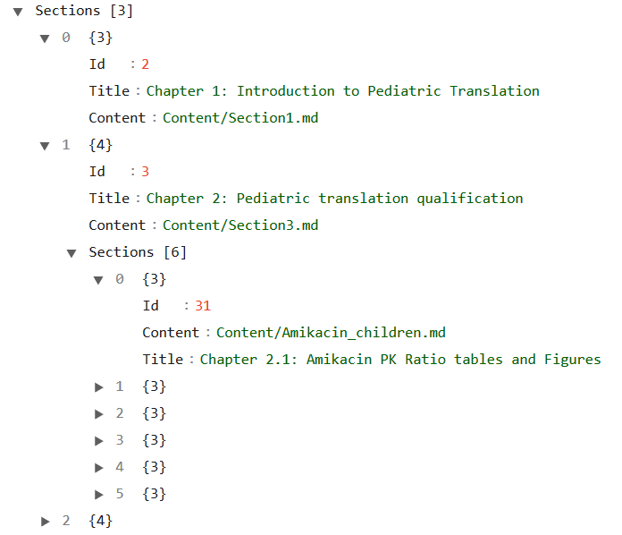


#### Markdown

Markdown files are text files in Markdown format (file extension: **.md**).

Markdown is a way to style text on the web. You control the display of the document; formatting words as bold or italic, adding images, and creating lists are just a few of the things we can do with Markdown. Mostly, Markdown is just regular text with a few non-alphabetic characters thrown in, like `#` or `*`.

Good introductions into the markdown format can be found here:

Ø  https://guides.github.com/features/mastering-markdown/ 

Ø  https://help.github.com/en/articles/basic-writing-and-formatting-syntax 

You can use any plain text editor for creating and modification of markdown files. However it's much faster and easier to use dedicated markdown editors, e.g. *Typora* (https://www.typora.io/)


### Intro

An (optional) introduction can be added to the report. The differences between introduction and sections are:

1. In the generated report Introduction will be inserted at the very beginning, before TOC (table of content) and is not part of TOC.

2. Introduction does not have any Id and it is not possible to assign any dynamic content to it.

Introduction is given by:

* "**Path**": Path to the **static** content file. Can be given as remote URL or local file path (s. the [Projects](#projects) section for details). Static content files must be written in [Markdown](#Markdown) format.

  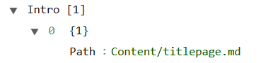

### Inputs

Here is defined, where description of **Inputs** for the Building Blocks and/or Simulations will be
placed in the report. Each input entry definition consists of:

* "**Project**": Id of the project

* "**Name**": name of the building block or simulation

* "**Type**": type of the building block/simulation (one of: "*Compound*", "*Event*", "*Formulation*", "*Individual*", "*ObserverSet*", "*Population*", "*Protocol*", "*Simulation*")

* "**SectionId**": Id of the section where the input description will be inserted.

Input description contains all input settings (model- type, calculation methods etc.) and all input parameters that deviate from the default incl. their value origins.

### Plots

In this section is define what kind of plots (and some additional related information like tables and qualification measures) will be generated for the report.

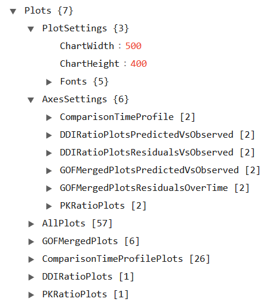

* "**PlotSettings**": OPTIONAL *Global* plot settings (pictures size, font properties). In addition every plot can define its *local* plot settings. 

  * If both (global and local) plot settings are defined for some plot: local settings will be used.
  * If neither global nor local plot settings are defined for some plot: program defaults will be used.

* "**AxesSettings**": OPTIONAL *Global* axes settings **per plot type**. In addition every plot can define its *local* axes settings. 

  - If both (global and local) axes settings are defined for some plot: local settings will be used.
  - If neither global nor local axes settings are defined for some plot: program defaults will be used.
  - Global axes settings can not be defined for "*AllPlots*"

  ```json
  "AxesSettings": {
    "ComparisonTimeProfile": [
      {
        "Unit": "h",
        "Dimension": "Time",
        "Type": "X",
        "GridLines": false,
        "Scaling": "Linear"
      },
      {
        "Unit": "ng/ml",
        "Dimension": "Concentration (mass)",
        "Type": "Y",
        "GridLines": false,
        "Scaling": "Log"
      }
    ],
  ```

* "AllPlots" / "GOFMergedPlots" / ... different kinds of plots, explained in detail below.

#### AllPlots

All plots defined in the PK-Sim project *Project* under simulation *Simulation* will be placed into the report **using their settings defined in the PK-Sim project**. Thus one node from the "AllPlots"-section in the qualification plan will be expanded into N (N>=0) plots in the final report

```json
"AllPlots": [
  {
    "SectionId": 13,
    "Project": "Midazolam",
    "Simulation": "iv 0.001 mg (5 min)"
  },
  {
    "SectionId": 13,
    "Project": "Midazolam",
    "Simulation": "iv 0.05 mg/kg (2 min)"
  },
  ...
```
NOTE: at the moment, only Time Profile Plots (Individual and Population) will be exported.

#### GOFMergedPlots

    "GOFMergedPlots": [
      {
        "SectionId": 14,
        "Title": "Midazolam concentration in plasma/blood",
        "PlotType": "predictedVsObserved|residualsOverTime",
        "Artifacts": ["Plot", "Measure", "GMFE"],
        "Groups": [
          {
            "Caption": "Midazolam iv",
            "Symbol": "Circle",
            "OutputMappings": [
              {
                "Project": "Midazolam",
                "Simulation": "iv 0.001 mg (5 min)",
                "Output": "Organism|PeripheralVenousBlood|Midazolam|Plasma (Peripheral Venous Blood)",
                "ObservedData": "Hohmann 2015 - iv 0.001 mg - Plasma - agg. (n=16)",
                "Color": "#FF0000"
              },
              ...
2 types of plots are supported here:

* Predicted vs. Observed

  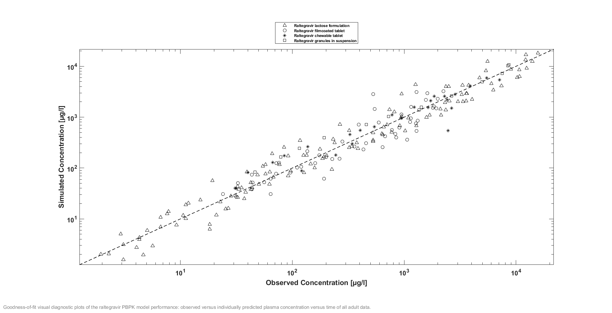

* Residuals over time

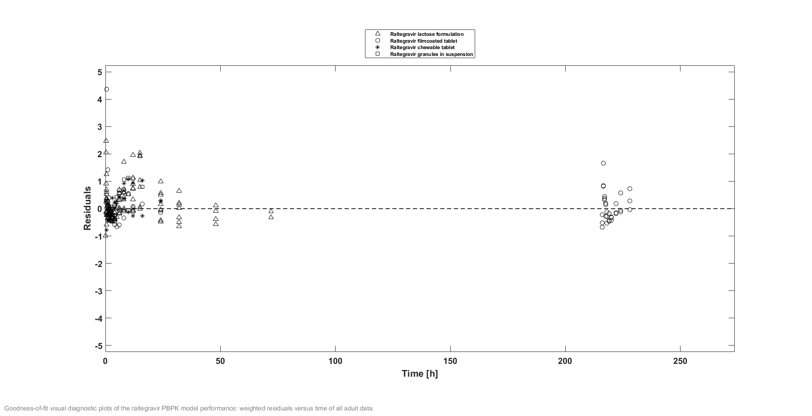

Combines data from several simulations; every simulation data can be displayed in different color/symbol.

* "**Title**": title of the plot

* "**SectionId**": Id of the section where the plot (and related artifacts; s. below) will be inserted.

* "**PlotType**": One of "*predictedVsObserved*", "*residualsOverTime*", "*predictedVsObserved|residualsOverTime*" 

  * if "*predictedVsObserved|residualsOverTime*" was selected: **both** plots will be generated

* "**Artifacts**":  OPTIONAL must contain a subset of {"*Plot*", "*Measure*", "*GMFE*"}. Defines which artifacts will be generated in the report. If omitted: all artifacts will be generated

  * "*Plot*": Plot(s) as described above

  * "*Measure*": Table with the percentage of data points within X-Error fold
    
    || Number | Ratio [%]|
    |------------ | ------------- | -------------|
    |Points total | 456 | - |
    |Points within 1.5-fold | 400 | 87,7 |
    |Points within 2-fold | 440 | 96,5 |

  * "*GMFE*": geometric mean fold error

    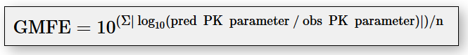

* "**Groups**":  several simulations can be grouped All simulations from the same group have the same symbol in the plot

  * "**Caption**":  group caption for the plot legend

  * "**Symbol**":  one of "*Asterisk*", "*Circle*", "*Cross*", "*Diamond*", "*Point*", "*Square*", "*Triangle*"

  * "**OutputMappings**":  definition of pairs {`Simulated output <=> Observed data set`}

    * "**Project**":  Id of the project

    * "**Simulation**":  name of the simulation

    * "**Output**": path of the simulated output curve of interest. This must be the path **internally used by PK-Sim** (without the leading simulation name)

      
      If you are not sure how such a path is defined:

      1. Open project in PK-Sim

      2. From the context menu of the simulation of interest: select "*Export simulation structure to file...*"

      3. Open exported file with a text editor and look for "*OBSERVER*"

      4. In the OBSERVER section: look for your output of interest and copy its path **without the leading simulation name**.

        E.g. in the example below correct output path for the qualification plan would be

        *Organism|PeripheralVenousBlood|Theophylline|Blood Cells*
        ```
        --------------- OBSERVER (Non zero only) ----------
        Observer: Blood Cells
        	Path: S1_diss|Organism|PeripheralVenousBlood|Theophylline|Blood Cells
        ```
      
      
    * "**ObservedData**": Id of an observed data set (s. [Observed data sets](#observed-data-sets) for details)
    
    * "**Color**": Color in "*#RRGGBB*" format. There are numerous free tools for color generation, e.g. [https://](https://www.w3schools.com/colors/colors_picker.asp)[www.w3schools.com/colors/colors_picker.asp](https://www.w3schools.com/colors/colors_picker.asp)

#### ComparisonTimeProfilePlots

Creates comparison time profile plots similar to [Comparison Charts in PK-Sim](https://docs.open-systems-pharmacology.org/working-with-pk-sim/pk-sim-documentation/pk-sim-simulations#comparison-chart-for-individual-or-population-simulations-in-one-plot). In addition, original results may be shifted in time.

    "ComparisonTimeProfilePlots": [
      {
        "SectionId": 26,
        "Title": "Ahonen 1995",
        "SimulationDuration": 20,
        "TimeUnit": "h",
        "OutputMappings": [
          {
            "Project": "Itraconazole-Midazolam-DDI",
            "Simulation": "DDI Control - Midazolam - Ahonen 1995",
            "Output": "Organism|PeripheralVenousBlood|Midazolam|Plasma (Peripheral Venous Blood)",
            "ObservedData": "Ahonen 1995 - Midazolam - PO - 7.5 mg - Plasma - agg. (n=12)",
            "StartTime": 0,
            "TimeUnit": "h",
            "Color": "#2166ac",
            "Caption": "Control (without Itraconazole)",
            "Symbol": "Circle"
          },
- "**Title**": title of the plot
- "**SectionId**": Id of the section where the plot (and related artifacts; s. below) will be inserted.
- "**SimulationDuration**" and "**TimeUnit**": s. below
- "**OutputMappings**":  definition of pairs {`Simulated output <=> Observed data set`}
  - "**Project**":  Id of the project
  - "**Simulation**":  name of the simulation
  - "**Output**": path of the simulated output curve of interest. This must be the path **internally used by PK-Sim** (without the leading simulation name) (s. [GOFMergedPlots](#gofmergedplots) for details!)
  - "**StartTime**" and "**TimeUnit**": Simulated and observed data will be shifted in the plot:
    - curves will be shifted along the time axis so that original "*StartTime*" corresponds to `Time=0` in the plot
    -  only the time range [`StartTime .. StartTime + SimulationDuration`] of the original data will be plotted; 
  - "**ObservedData**": Id of an observed data set (s. [Observed data sets](#observed-data-sets) for details)
  - "**Color**": Color in "*#RRGGBB*" format. (s. [GOFMergedPlots](#gofmergedplots) for details). Will be used for both simulated output and observed data
  - "**Symbol**":  Symbol (s. [GOFMergedPlots](#gofmergedplots) for details) - will be used for observed data only

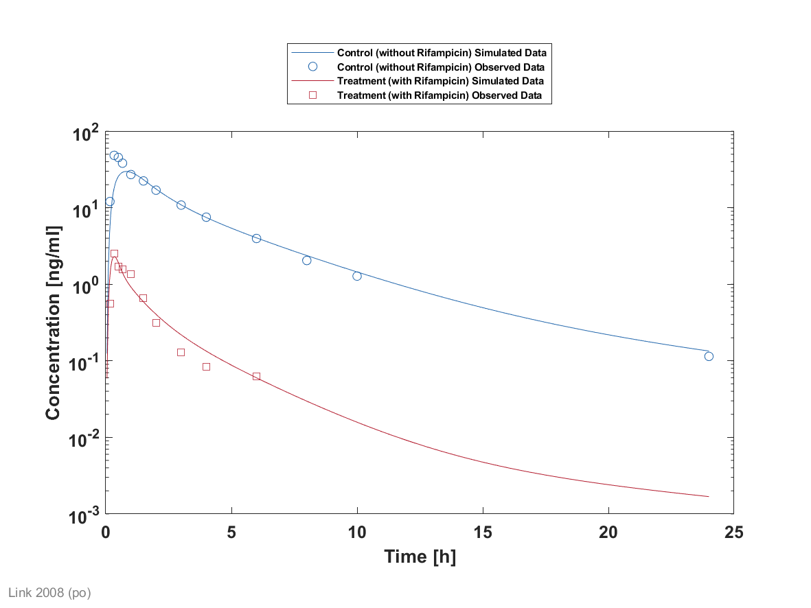

#### DDIRatioPlots

Creates DDI Ratio plots as described e.g. in Hanke et. al ([[106](../references.md#106)])

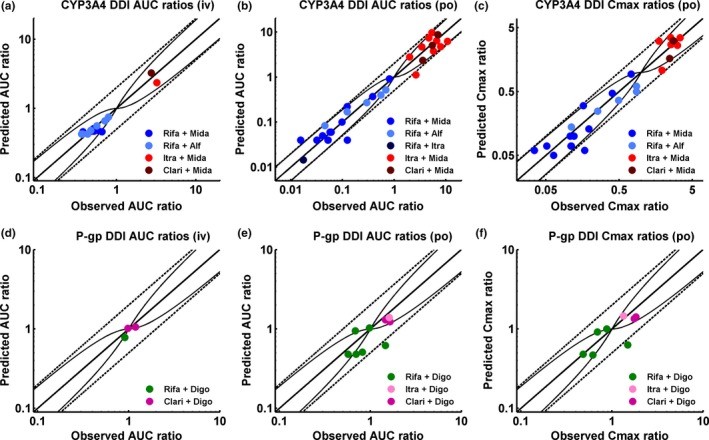

2 types of plots are supported here:

- Predicted vs. Observed (generates plots like in the example above)

- Residuals vs. Observed (generates plots `Predicted/Observed vs. Observed`)

    ```json
    "DDIRatioPlots": [
      {
        "SectionId": 5,
        "Title": "CYP3A4 DDI",
        "PKParameter": "AUC|CMAX",
        "PlotType": "predictedVsObserved|residualsVsObserved",
        "Artifacts": ["GMFE","Measure","Plot","Table"],
        "Groups": [
          {
            "Caption": "Itra+Mida (Mida iv)",
            "Color": "#FF0000",
            "Symbol": "Square",
            "DDIRatios": [
              {
                "Output": "Organism|PeripheralVenousBlood|Midazolam|Plasma (Peripheral Venous Blood)",
                "ObservedData": "DDI Ratios",
                "ObservedDataRecordId": 378,
                "SimulationControl": {
                  "Project": "Itraconazole-Midazolam-DDI",
                  "Simulation": "DDI Control - Midazolam - Olkkola 1996 (iv, day 4)",
                  "StartTime": 0,
                  "EndTime": 9999,
                  "TimeUnit": "h"
                },
                "SimulationDDI": {
                  "Project": "Itraconazole-Midazolam-DDI",
                  "Simulation": "DDI Treatment - Itraconazole/Midazolam - Olkkola 1996",
                  "StartTime": 74,
                  "EndTime": 122,
                  "TimeUnit": "h"
                }
              }
            ]
          },
    ```
* "**Title**": title of the plot

* "**SectionId**": Id of the section where the plot (and related artifacts; s. below) will be inserted.

* "**PKParameter**":  PK Parameter for which DDI Ratios will be calculated. One of "*AUC*", "*CMAX*", "*AUC|CMAX*"

  * if "*AUC|CMAX*" was selected: **2** plots will be generated (one for AUC Ratio and one for CMAX Ratio)

* "**PlotType**": One of one of "*predictedVsObserved*", "*residualsVsObserved*", "*predictedVsObserved|residualsVsObserved*"

  * if "*predictedVsObserved|residualsVsObserved*" was selected: **both** plots will be generated for each selected PK-Parameter. Thus selecting this option in combination with "*AUC|CMAX*" will result in generation of 4 plots in the report:
    * AUC Ratio predicted vs. observed
    * AUC Ratio residuals vs. observed
    * CMAX Ratio predicted vs. observed
    * CMAX Ratio residuals vs. observed

* "**Artifacts**":  OPTIONAL must contain a subset of {"*Plot*", "*Measure*", "*GMFE*", "*Table*"}. Defines which artifacts will be generated in the report. If omitted: all artifacts will be generated

  - "*Plot*": Plot(s) as described above

  - "*Measure*": Table with the percentage of data points within X-Error fold

    | -| Number | Ratio [%]|
    |------------ | ------------- | -------------|
    |Points total | 456 | -|
    |Points within [Guest et. al](http://dmd.aspetjournals.org/content/39/2/170) | 400 | 87,7|
    |Points within 2-fold | 440 | 96,5|

  - "*GMFE*": geometric mean fold error (s. [GOFMergedPlots](#gofmergedplots) for details)
  
  - "*Table*": creates a table containing quantitative values of all predicted and observed AUC,CMAX and corresponding DDI-Ratios and additional information about Control and DDI simulation (similar to the [table described in Hanke et. al](https://www.ncbi.nlm.nih.gov/pmc/articles/PMC6202474/table/psp412343-tbl-0001/))
  
* "**Groups**":  plotted DDI ratios can be grouped. Each group has its own caption, color and symbol

  - "**Caption**": plot caption
  - "**Color**": color in "*#RRGGBB*" format. (s. [GOFMergedPlots](#gofmergedplots) for details).
  - "**Symbol**":  group symbol (s. [GOFMergedPlots](#gofmergedplots) for details)
  * "**DDIRatios**":  list of DDI ratios belonging to the group. Each DDI Ratio is defined by:
    - "**Output**":  path of the simulated output curve for which DDI ratio of interest will be calculated. This must be the path **internally used by PK-Sim** (without the leading simulation name) (s. [GOFMergedPlots](#gofmergedplots) for details!). 
    - "**ObservedData**": Id of an observed data set (s. [Observed data sets](#observed-data-sets) for details)
    - "**ObservedDataRecordId**":  Id of the data record (line) within the given observed data set. (corresponds to the the **Id**-column of the data set)
    * "**SimulationControl**": description of the Control/Placebo simulation, given by:
      - "**Project**":  Id of the project
      * "**Simulation**":  name of the simulation
      * "**StartTime**", "**EndTime**" and "**TimeUnit**": PK-Parameter(s) of interest will be calculated in the time range [`StartTime .. EndTime`]
    * "**SimulationDDI**": description of the DDI simulation, given in the same way as Control simulation

#### PKRatioPlots

Creates plots of predicted/observed ratios for PK parameters of interest

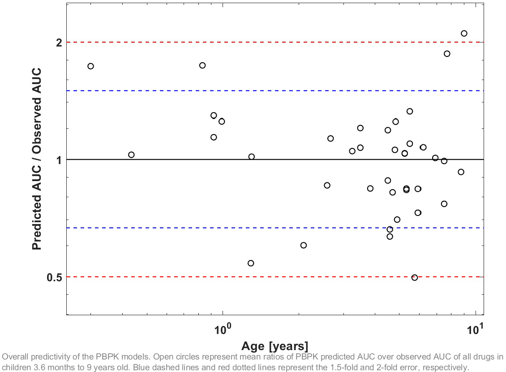

    "PKRatioPlots": [
      {
        "Title": "Overall predictivity of the PBPK models. Open circles represent...",
        "SectionId": 2,
        "PKParameter": "AUC|CL",
        "Artifacts": ["GMFE", "Measure", "Plot", "Table"],
        "Groups": [
          {
            "Caption": "Caption",
            "Color": "#000000",
            "Symbol": "Circle",
            "PKRatios": [
              {
                "Project": "Sufentanil",
                "Simulation": "Davis 1987 15.5months",
                "Output": "Organism|ArterialBlood|Plasma|Sufentanil|Concentration in container",
                "ObservedData": "PK-Parameter",
                "ObservedDataRecordId": 5130
              }
- "**Title**": title of the plot

- "**SectionId**": Id of the section where the plot (and related artifacts; s. below) will be inserted.

- "**PKParameter**":  PK Parameter for which DDI Ratios will be calculated. One of "*AUC*", "*CL*", "*AUC|CL*"

  - if "*AUC|CL*" was selected: **2** plots will be generated (one for AUC and one for Clearance)

- "**Artifacts**":  OPTIONAL must contain a subset of {"*Plot*", "*Measure*", "*GMFE*", "*Table*"}. Defines which artifacts will be generated in the report. If omitted: all artifacts will be generated

  - "*Plot*": Plot(s) as described above

  - "*Measure*": Table with the percentage of data points within X-Error fold (s. [GOFMergedPlots](#gofmergedplots) for details)

  - "*GMFE*": geometric mean fold error (s. [GOFMergedPlots](#gofmergedplots) for details)

  - "*Table*": creates a table containing quantitative values of all predicted and observed AUC and/or CL and corresponding PK-Ratios, e.g.

    |      Study ID | Age [y] | BodyWeight [kg] | Predicted AUC [µmol*h/l] | Observed AUC [µmol*h/l] | Pred/Obs AUC Ratio |
    | ------------: | ------: | --------------: | -----------------------: | ----------------------: | -----------------: |
    |   Larson 2013 |      15 |              56 |                   1.4103 |                    15.7 |             1.4103 |
    |   Larson 2013 |       9 |            29.4 |                  0.85609 |                      18 |            0.85609 |
    | Nachmann 2013 |    15.2 | 56.2267 |                1.0989 |                    10.2 |             1.0989 |
    | Nachmann 2013 |      10 |            31.5 |                    1.063 |              13.4 |              1.063 |
    |     Rizk 2015 |    1.25 |             8.5 |                   1.7188 |                    19.8 |             1.7188 |

- "**Groups**":  plotted PK ratios can be grouped. Each group has its own caption, color and symbol

  - "**Caption**": plot caption
  - "**Color**": color in "*#RRGGBB*" format. (s. [GOFMergedPlots](#gofmergedplots) for details).
  - "**Symbol**":  group symbol (s. [GOFMergedPlots](#gofmergedplots) for details)
  - "**PKRatios**":  list of PK ratios belonging to the group. Each PK Ratio is defined by:
    - "**Project**":  Id of the project
    - "**Simulation**":  name of the simulation
    - "**Output**":  path of the simulated output curve for which DDI ratio of interest will be calculated. This must be the path **internally used by PK-Sim** (without the leading simulation name) (s. [GOFMergedPlots](#gofmergedplots) for details!). 
    - "**ObservedData**": Id of an observed data set (s. [Observed data sets](#observed-data-sets) for details)
    - "**ObservedDataRecordId**":  Id of the data record (line) within the given observed data set. (corresponds to the the **Id**-column of the data set)

## How generated artifacts are combined into a report

All static and dynamic elements described in a qualification plan are compiled into a report in the following order:

1. Intro (if defined in the qualification plan)

2. Table of Contents (is generated automatically)

3. (Top level) sections **in order of their appearance in the qualification plan**. Per section:

   3.1 Static content of the section
   
   3.2 For all inputs **with SectionId = Id of the current section**: generated input descriptions **in order of appearance in the qualification plan**
   
   3.3 For all plots **with SectionId = Id of the current section**: generated plots (and related artifacts) **in order of appearance in the qualification plan**
   
   3.4 Subsections of the current section (if any)  **in order of appearance in the qualification plan**. Per subsection ... (s. 3.1..3.4)

# Creating a (re-)qualification plan part II: Tools

1. Install VSCode (Visual Studio Code). 
    * Download User-Installer or System-Installer from https://code.visualstudio.com/Download

    

2. If you are behind a firewall: configure firewall proxy
    * Start VSCode

    * Go to File►Preferences►Settings

    * Then go to User Settings►Application►Proxy

    * Enter your Firewall-Proxy

    

3. Install the snippets file
    * Download *Snippets for Visual Studio Code* (**qualification.code-snippets**) from https://github.com/Open-Systems-Pharmacology/QualificationPlan/releases/latest 

    * Copy this file to `C:\Users\<USERID>\AppData\Roaming\Code\User\snippets `
    
      * In case you are using _portable_ version of VSCode: copy the snippets file to `<VSCode_InstallDir>\data\user-data\User\snippets` (create the folder if it does not exist)
    
    * Restart VSCode

    

4. Create/Edit a qualification plan 
   
    * Create a new empty file and **save it as .json** (unless the file was saved as json, snippets will not work) 
    * For every element of a qualification plan (project, plot, section, input) there is a **predefined code snippet**, which will create a skeleton of this element. 
    * To use a snippet, type its **shortcut** and press ENTER 
    * The full list of qualification plan snippets is given in the table below. **Parent node** column describes at which places of a qualification plan a snippet can be used. 
    * The first snippet to be used is always `bs `(_bootstrap_) - this will create a skeleton of a qualification plan 
    * All other snippets are defined as abbreviations of "Add XYZ".  
    * Full snippets list 

Shortcut | Description | Parent node
-- | -- | -- 
bs |<sub>Creates the skeleton for a qualification plan</sub>|<sub>&bull;ROOT</sub>
ap |<sub>Add a project reference</sub>|<sub>&bull;Projects</sub>
abb |<sub>Adds a building block reference. Useful to replace a building block in a project</sub>|<sub>&bull;Projects{i}/BuildingBlocks</sub>
asp |<sub>Adds a simulation parameter reference. Useful to replace a parameter in a simulation with a parameter from another simulation</sub>|<sub>&bull;Projects{i}/SimulationParameters</sub>
aod |<sub>Adds an observed data reference. Only for external observed data sources</sub>|<sub>&bull;ObservedDataSets</sub>
ai |<sub>Adds an input (reference to a building block or simulation in a given project)</sub>|<sub>&bull;Inputs</sub>
aintro |<sub>Adds an introduction chapter</sub>|<sub>&bull;Intro</sub>
as |<sub>Adds a section</sub>|<sub>&bull;Sections<br>&bull;Sections{i}/Sections …</sub>
aps |<sub>Adds the default plot settings configuration (global or local)</sub>|<sub>==== GLOBAL ====<br>&bull;Plots<br>==== LOCAL ====<br>&bull;GOFMergedPlots{i}<br>&bull;ComparisonTimeProfilePlots{i}<br>&bull;DDIRatioPlots{i}<br>&bull;PKRatioPlots{i}<sub>
aas |<sub>Adds the global axes settings skeleton</sub>|<sub>&bull;Plots/AxesSettings</sub>
axy |<sub>Adds axes X and Y settings content (global or local)</sub>|<sub>==== GLOBAL ====<br>&bull;Plots/AxesSettings/GOFMergedPlotsPredictedVsObserved<br>&bull;Plots/AxesSettings/GOFMergedPlotsResidualsOverTime<br>&bull;Plots/AxesSettings/ComparisonTimeProfile<br>&bull;Plots/AxesSettings/DDIRatioPlotsPredictedVsObserved<br>&bull;Plots/AxesSettings/DDIRatioPlotsResidualsVsObserved<br>&bull;Plots/AxesSettings/PKRatioPlots<br>==== LOCAL ====<br>&bull;Plots/GOFMergedPlots{i}/AxesPredictedVsObserved<br>&bull;Plots/GOFMergedPlots{i}/AxesResidualsOverTime<br>&bull;Plots/ComparisonTimeProfilePlots{i}/Axes<br>&bull;Plots/DDIRatioPlots{i}/AxesPredictedVsObserved<br>&bull;Plots/DDIRatioPlots{i}/AxesResidualsVsObserved<br>&bull;Plots/PKRatioPlots{i}/Axes</sub>
aap |<sub>Adds an all plot entry for a simulation</sub>|<sub>&bull;Plots/AllPlots</sub>
agof |<sub>Adds a GOFMergedPlot entry</sub>|<sub>&bull;Plots/GOFMergedPlots</sub>
agofg |<sub>Adds a GOFMergedPlot group entry</sub>|<sub>&bull;Plots/GOFMergedPlots{i}/Groups</sub>
agofo |<sub>Adds a GOFMergedPlot OutputMapping entry (to be used within a group)</sub>|<sub>&bull;Plots/GOFMergedPlots{i}/Groups{j}/OutputMappings</sub>
actp |<sub>Adds a ComparisonTimeProfile entry</sub>|<sub>&bull;Plots/ComparisonTimeProfilePlots</sub>
actpo |<sub>Adds a ComparisonTimeProfile OutputMapping entry</sub>|<sub>&bull;Plots/ComparisonTimeProfilePlots{i}/OutputMappings</sub>
addir |<sub>Adds a DDIRatioPlot entry</sub>|<sub>&bull;Plots/DDIRatioPlots</sub>
addirg |<sub>Adds a DDIRatioPlot group entry</sub>|<sub>&bull;Plots/DDIRatioPlots{i}/Groups</sub>
addirr |<sub>Adds a DDIRatioPlot ratio entry (to be used within a group)</sub>|<sub>&bull;Plots/DDIRatioPlots{i}/Groups{j}/DDIRatios</sub>
apkr |<sub>Adds a PKRatioPlot entry</sub>|<sub>&bull;Plots/PKRatioPlots</sub>
apkrg |<sub>Adds a PKRatioPlot group entry</sub>|<sub>&bull;Plots/PKRatioPlots{i}/Groups</sub>
apkrr |<sub>Adds a PKRatioPlot ratio entry (to be used within a PKRatioPlot)</sub>|<sub>&bull;Plots/PKRatioPlots{i}/Groups{j}/PKRatios</sub>

  * If you don't remember the shortcut of a snippet:
    * either start typing: the list of all snippets starting with this shortcut will be shown via Intellisense
    * or press CTRL+SPACE: the list of ALL snippets will be shown. Then just navigate to the right snippet and select it
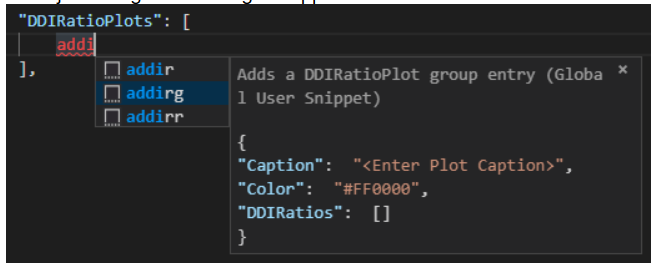
    
  * After you inserted a skeleton via snippet: fill all the placeholders with correct information. Just start typing (don't click with the mouse!) into the first entry; once finished - press TAB to switch to the next input 
    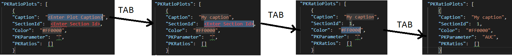

  * If a value to be entered is an enumeration: click between double quotes and press CTRL+SPACE, then select from the list 
    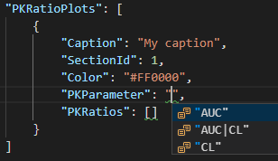

  * If a Dimension/Unit pair has to be defined: select the dimension first (CTRL+SPACE), AFTER that select the unit 
    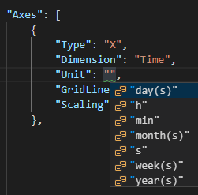

  * Every time when a new elment of a qualification plan was entered via snippet (or manually) and filled out: immediately check errors and warnings and correct them asap. 
    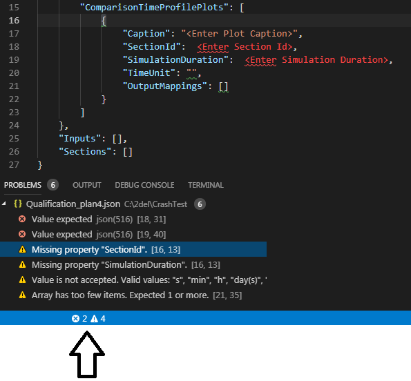

  * When adding a new element of NON-EMPTY array, don't forget a comma before or after inserted element. (Before when inserted as last element, after otherwise). 

    

5. Some helpful links for editing json files with VSCode:
    * Getting started with VSCode: https://code.visualstudio.com/docs/getstarted/introvideos 
    * Editing JSON with VSCode: https://code.visualstudio.com/docs/languages/json 
    * Extending/Modifying Snippets: https://code.visualstudio.com/docs/editor/userdefinedsnippets


# Processing a (re-)qualification plan

## Tools

Creation of a qualification report from qualification plan requires installation of additional tools, which are not part of the OSP Suite setup. All the tools can be downloaded from 

https://github.com/Open-Systems-Pharmacology/QualificationPlan/releases/latest

* **QualificationRunner**: download `qualificationrunner-portable-setup_X.Y.Z.zip` and unzip it into any folder on your hard disc.
* **Reporting Engine**. There are two installation options:
  
  1. In case you have a Matlab license: install as a source code. For this: download `Reporting.Engine.X.Y.Z.zip` and unzip it into any folder on your hard disc.
  
  2. In case you have no Matlab license. install as compiled library.
  
     1. Prerequisite: download and install free Matlab Compiler Runtime version 2017b
  
        http://ssd.mathworks.com/supportfiles/downloads/R2017b/deployment_files/R2017b/installers/win64/MCR_R2017b_win64_installer.exe
  
     2. Download `Reporting.Engine.Compiled.X.Y.Z.zip` and unzip it into any folder on your hard disc.
  
     3. Unzip folder contains the file `CreateQualificationReport.bat`. Adjust it (s. comments in the file)
  
* Markdown Joiner: Download **markdown-joiner.zip** and unzip it into any folder on your hard disc.

## Creating a report in Markdown format

Good starting point is https://github.com/Open-Systems-Pharmacology/Evaluation-plan-template.

Download this repository locally and adjust `Workflow.m` in the subfolder *Evaluation* (s. comments in the file).

Execute Workflow.m.

* If you have a Matlab license: start Matlab and execute Workflow.m

* If you have no Matlab license: 

  1. start command prompt (*cmd*). In the command prompt:

     1. switch to the folder where *Reporting.Engine.Compiled.X.Y.Z.zip* was unzipped.

     2. Execute *CreateQualificationReport.bat "<full-path-to-Workflow.m>"*. E.g.

        `CreateQualificationReport.bat "C:\Evaluation-plan-template\Evaluation\Workflow.m"`

        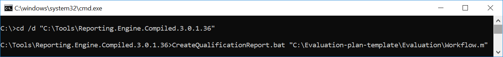

This will create a report in markdown format in the *Evaluation/report* subfolder.

For any new qualification report: just create a new copy of *Workflow.m* and adjust it for the new report.